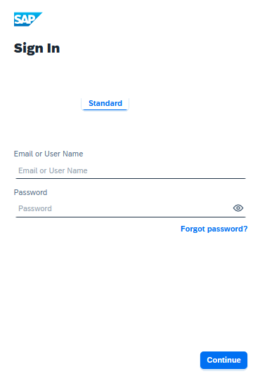
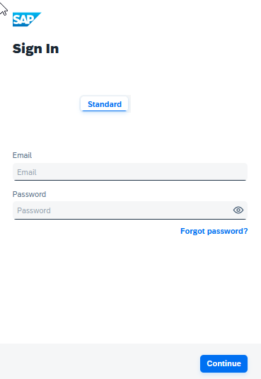

<!-- loio66ad80a6bbaf4fc3911232f7cc9a7de6 -->

# Change Tenant Texts REST API

The Change Tenant Texts REST API of Identity Authentication can be used to change the predefined texts and messages for end-user screens available per tenant in the Identity Authentication.


> ### Note:  
> We recommend you to change the tenant texts via the administration console of Identity Authentication. For more information, see [Change Tenant Texts Via Administration Console](../Operation-Guide/change-tenant-texts-via-administration-console-c24b1d0.md).


## Prerequisites

To call the methods of this Change Tenant Texts REST API you must have a system as administrator with an assigned *Manage Tenant Configuration* role. For more details about how to add a system as administrator and assign administrator roles, see [Add System as Administrator](../Operation-Guide/add-administrators-bbbdbdd.md#loiocefb742a36754b18bbe5c3503ac6d87c), and [Edit Administrator Authorizations](../Operation-Guide/edit-administrator-authorizations-86ee374.md).


<a name="loio66ad80a6bbaf4fc3911232f7cc9a7de6__section_r3d_lxy_bgb"/>

## Usage

The predefined tenant texts are stored in the [Tenant Texts](change-tenant-texts-rest-api-66ad80a.md#loio2e8cc1d45b844282a8eb19450b1e68ec) document. The document contains configurable parameters stored as key value pairs of strings. Each key stores the name of a parameter, and the corresponding value is the text that can be changed and updated. The keys are self-explanatory and show where the texts are used. For example, the `logon.ui.label.user=E-Mail or User Name` key value pair is for the type of information that the user must provide to log on to the application. On the *Logon* screen you see:



If you want to change the user identifier text you have to update the key value pair `logon.ui.label.user=E-Mail or User Name` to `logon.ui.label.user=E-mail` to receive:



> ### Note:  
> For some tenants some changed predefined changed texts may exist. If your tenant contains predefined changed texts, you can:
> 
> -   Use the **GET** method to obtain the texts that overwrote part of the predefined tenant texts when your custom tenant was created, change the texts that you want, add them to the **POST** request and upload them.
> -   Use the **GET** method to obtain the texts that overwrote part of the predefined tenant texts when your custom tenant was created, delete a key value pair, add the texts without this line to the **POST** request and upload them. This will replace the deleted key value pair with the predefined one.
> -   Open the [Tenant Texts](change-tenant-texts-rest-api-66ad80a.md#loio2e8cc1d45b844282a8eb19450b1e68ec) document, use the **GET** method to obtain the texts that overwrote part of the predefined tenant texts when your custom tenant was created, from the [Tenant Texts](change-tenant-texts-rest-api-66ad80a.md#loio2e8cc1d45b844282a8eb19450b1e68ec) document copy the key value pairs that were not included in the response, change the texts in the copied key value pairs, add these new key value pairs to the **POST** request, and execute it.
> -   Open the [Tenant Texts](change-tenant-texts-rest-api-66ad80a.md#loio2e8cc1d45b844282a8eb19450b1e68ec) document, copy the texts to the **POST** request, and execute it. This will replace all texts in the tenant with the predefined ones.

> ### Remember:  
> If there are no predefined changed texts for your tenant, the [GET Tenant Texts](change-tenant-texts-rest-api-66ad80a.md#loio1354b73465204a5d98e8eddba091e932) returns the *404 Not Found* code. In this case, proceed with the [POST Tenant Texts](change-tenant-texts-rest-api-66ad80a.md#loio748bde4796204486a6069488e9a63ef6) method.


## Methods


<table>
<tr>
<th valign="top">

HTTP Method


</th>
<th valign="top">

See


</th>
<th valign="top">

URI


</th>
</tr>
<tr>
<td valign="top">

*GET*


</td>
<td valign="top">

[GET Tenant Texts](change-tenant-texts-rest-api-66ad80a.md#loio1354b73465204a5d98e8eddba091e932)


</td>
<td valign="top">

**`https://<tenant ID>.accounts.ondemand.com/service/resource?resourceType=RESOURCE_I18N_BUNDLE&locale=<value>`** 


</td>
</tr>
<tr>
<td valign="top">

*POST*


</td>
<td valign="top">

[POST Tenant Texts](change-tenant-texts-rest-api-66ad80a.md#loio748bde4796204486a6069488e9a63ef6)


</td>
<td valign="top">

**`https://<tenant ID>.accounts.ondemand.com/service/resource/SAP_DEFAULT`** 


</td>
</tr>
</table>

> ### Note:  
> *Tenant ID* is an automatically generated ID by the system. The first administrator created for the tenant receives an activation e-mail with an URL in it. This URL contains the *tenant ID*.

 <a name="loio1354b73465204a5d98e8eddba091e932"/>

<!-- loio1354b73465204a5d98e8eddba091e932 -->

## GET Tenant Texts

For tenants that contain predefined changed texts, download the texts that overwrote part of the predefined tenant texts when your custom tenant was created.


## Request

**URI:**`https://<tenant ID>.accounts.ondemand.com/service/resource?resourceType=RESOURCE_I18N_BUNDLE&locale=<value>`

**HTTP Method:***GET*

**Content-Type: application/json**

**Permissions:**You must have a system as administrator with an assigned *Manage Tenant Configuration* role. For more details about how to add a system as administrator and assign administrator roles, see [Add System as Administrator](../Operation-Guide/add-administrators-bbbdbdd.md#loiocefb742a36754b18bbe5c3503ac6d87c), and [Edit Administrator Authorizations](../Operation-Guide/edit-administrator-authorizations-86ee374.md).


### URL Parameters


<table>
<tr>
<th valign="top">

Parameter


</th>
<th valign="top">

Required


</th>
<th valign="top">

Description


</th>
<th valign="top">

Notes


</th>
</tr>
<tr>
<td valign="top">

 `setId` 


</td>
<td valign="top">

No


</td>
<td valign="top">

The identifier of the scenario that the resource is related to.


</td>
<td valign="top">

The default value is`SAP_DEFAULT` 


</td>
</tr>
<tr>
<td valign="top">

 `resourceType` 


</td>
<td valign="top">

Yes


</td>
<td valign="top">

The type of the resource.


</td>
<td valign="top">

Use `RESOURCE_I18N_BUNDLE` 


</td>
</tr>
<tr>
<td valign="top">

 `locale` 


</td>
<td valign="top">

Yes


</td>
<td valign="top">

The locale of the resource.


</td>
<td valign="top">

The end user screens of the applications that use Identity Authentication for authentication, support the following languages: Arabic \(ar\), Bulgarian \(bg\), Catalan \(ca\), Chinese PRC \(zh-cn\), Chinese Taiwan \(zh-tw\), Croatian \(hr\), Czech \(cs\), Danish \(da\), Dutch \(nl\), English United Kingdom \(en-gb\), English United States \(en-us\), Estonian \(et\), Finnish \(fi\), French Standard \(fr\), French Canada \(fr-ca\), German Standard \(de\), Greek \(el\), Hebrew \(iw\), Hungarian \(hu\), Italian \(it\), Japanese \(ja\), Korean \(ko\), Latvian \(lv\), Lithuanian \(lt\), Norwegian \(no\), Polish \(pl\), Portuguese Portugal \(pt\), Romanian \(ro\), Russian \(ru\), Serbian \(sr\), Slovak \(sk\), Slovenian \(sl\), Spanish \(es\), Spanish Mexico \(es-mx\), Swedish \(sv\), Turkish \(tr\), Ukrainian \(uk\), Welsh \(cy\).


</td>
</tr>
</table>


### Request Example

```
GET /service/resource?resourceType=RESOURCE_I18N_BUNDLE&locale=en

```


## Response


### Response Status and Error Codes

**Success Codes**


<table>
<tr>
<th valign="top">

Code


</th>
<th valign="top">

Meaning


</th>
<th valign="top">

Description


</th>
</tr>
<tr>
<td valign="top">

200 OK


</td>
<td valign="top">

The request was successful.


</td>
<td valign="top">

OK


</td>
</tr>
</table>

**Error Codes**


<table>
<tr>
<th valign="top">

Response Code


</th>
<th valign="top">

Meaning


</th>
<th valign="top">

Description


</th>
</tr>
<tr>
<td valign="top">

*400*


</td>
<td valign="top">

Bad Request


</td>
<td valign="top">

Validate JSON data. Validate that the special characters are escaped properly and new lines are added.


</td>
</tr>
<tr>
<td valign="top">

*401*


</td>
<td valign="top">

Unauthorized


</td>
<td valign="top">

The client is not authenticated.


</td>
</tr>
<tr>
<td valign="top">

*403*


</td>
<td valign="top">

Forbidden


</td>
<td valign="top">

Access to the resource is denied.


</td>
</tr>
<tr>
<td valign="top">

*404*


</td>
<td valign="top">

Not Found


</td>
<td valign="top">

The requested resource cannot be found.


</td>
</tr>
<tr>
<td valign="top">

*405*


</td>
<td valign="top">

Method Not Allowed


</td>
<td valign="top">

The requested method is not supported for the given resource.


</td>
</tr>
<tr>
<td valign="top">

*415*


</td>
<td valign="top">

Unsupported Media Type


</td>
<td valign="top">

The REST service does not support the API version requested by the REST client.


</td>
</tr>
<tr>
<td valign="top">

*500*


</td>
<td valign="top">

Internal Server Error


</td>
<td valign="top">

The operation cannot be completed due to a service error.


</td>
</tr>
<tr>
<td valign="top">

*503*


</td>
<td valign="top">

Service Unavailable


</td>
<td valign="top">

The service is currently unavailable.


</td>
</tr>
</table>


### Response Example

```ini


registerSuccess.thankyou=Thank you for registering with {0}

registerForm.validation.accept.privacy.statement=To accept the privacy statement, click the box above

registerSuccess.activateAccount=To activate your account, click the link contained in the e-mail. Note that it might take a few minutes for the e-mail to reach your inbox.

accountActivation.ui.label.activationsuccesstext=Thank you for registering and activating your account

accountActivation.ui.label.activationtext=This account can also be used to access other applications

createForgottenPasswordMail.user=E-Mail

logon.ui.label.user=E-Mail

profileManagement.socialSignOn.unlinkWarning=Choose "Unlink" to remove your social logon information from your account. You can re-link your account the next time you log on with a social sign-on-enabled site.

accountActivation.ui.label.notlinkedtext=Your account does not currently use social sign-on. To link your account with a social sign-on account, click one of the social network buttons next time you log on.

profileManagement.socialSignOn.nolinktext=Your account does not currently use social sign-on. To link your account with a social sign-on provider, click one of the social network buttons next time you log on.

linkSocialSignOnAccount.headline=Link your account with {0}

linkSocialSignOnAccount.message.profile=Profile Page

linkSocialSignOnAccount.message=As a final step, you can either link an existing account to your {0} account, or create a new account that will be linked to your {0} account.

logon.ui.tooltip.SOCIAL_NOT_ALLOWED=The site you are attempting to access requires your password.  Enter your password and click Continue.

oauth.network=The selected social sign-on service is currently unavailable. Use a different social sign-on or your credentials to log on.

logon.ui.tooltip.MISSING_GOOGLE_PLUS_PROFILE=This Google account has not joined Google yet. Join Google and link your account, or log on with an existing account.

general.auth.request.error=Identity Provider could not process the authentication request received. Delete your browser cache and stored cookies, and restart your browser. If you still experience issues after doing this, please contact your administrator.


```

 <a name="loio748bde4796204486a6069488e9a63ef6"/>

<!-- loio748bde4796204486a6069488e9a63ef6 -->

## POST Tenant Texts

Update the tenant texts.


> ### Caution:  
> Make sure that you have applied the proper escaping in your **POST** request.
> 
> You should add *\\n* at the end of each line in the data property content.
> 
> **Escape Sequences**
> 
> 
> <table>
> <tr>
> <th valign="top">
> 
> Value
> 
> 
> 
> </th>
> <th valign="top">
> 
> Escape Sequences
> 
> 
> 
> </th>
> </tr>
> <tr>
> <td valign="top">
> 
> \\b
> 
> 
> 
> </td>
> <td valign="top">
> 
> Backspace \(ascii code 08\)
> 
> 
> 
> </td>
> </tr>
> <tr>
> <td valign="top">
> 
> \\f
> 
> 
> 
> </td>
> <td valign="top">
> 
> Form feed \(ascii code 0C\)
> 
> 
> 
> </td>
> </tr>
> <tr>
> <td valign="top">
> 
> \\n
> 
> 
> 
> </td>
> <td valign="top">
> 
> New line
> 
> 
> 
> </td>
> </tr>
> <tr>
> <td valign="top">
> 
> \\r
> 
> 
> 
> </td>
> <td valign="top">
> 
> Carriage return
> 
> 
> 
> </td>
> </tr>
> <tr>
> <td valign="top">
> 
> \\t
> 
> 
> 
> </td>
> <td valign="top">
> 
> Tab
> 
> 
> 
> </td>
> </tr>
> <tr>
> <td valign="top">
> 
> \\"
> 
> 
> 
> </td>
> <td valign="top">
> 
> Double quote
> 
> 
> 
> </td>
> </tr>
> <tr>
> <td valign="top">
> 
> \\\\
> 
> 
> 
> </td>
> <td valign="top">
> 
> Backslash character
> 
> 
> 
> </td>
> </tr>
> </table>

> ### Tip:  
> Instead of editing the request manually, you can use an on-line tool for converting a normal string into a quoted one.


## Request

**URI:**`https://<tenant ID>.accounts.ondemand.com/service/resource/SAP_DEFAULT`

**HTTP Method:****POST**

**Content-Type: application/json**

**Permissions:**You must have a system as administrator with an assigned *Manage Tenant Configuration* role. For more details about how to add a system as administrator and assign administrator roles, see [Add System as Administrator](../Operation-Guide/add-administrators-bbbdbdd.md#loiocefb742a36754b18bbe5c3503ac6d87c), and [Edit Administrator Authorizations](../Operation-Guide/edit-administrator-authorizations-86ee374.md).


### Request Example

```
[{

"resourceType": "RESOURCE_I18N_BUNDLE",

"locale": "en",

"contentType": "text/html;charset=UTF-8",

"data": "registerSuccess.thankyou=Thank you for registering with {0}\n

registerForm.validation.accept.privacy.statement=To accept the privacy statement, click the box above\n

registerSuccess.activateAccount=To activate your account, click the link contained in the e-mail. Note that it might take a few minutes for the e-mail to reach your inbox.\n

accountActivation.ui.label.activationsuccesstext=Thank you for registering and activating your account\n

accountActivation.ui.label.activationtext=\n

createForgottenPasswordMail.user=E-Mail\n

logon.ui.label.user=E-Mail\n

logon.ui.label.forgotpassword=Forgot/Reset Password\n

profileManagement.socialSignOn.unlinkWarning=Choose \"Unlink\" to remove your social logon information from your account. You can re-link your account the next time you log on with a social sign-on-enabled site.\n

accountActivation.ui.label.notlinkedtext=Your account does not currently use social sign-on. To link your account with a social sign-on account, click one of the social network buttons next time you log on.\n

profileManagement.socialSignOn.nolinktext=Your account does not currently use social sign-on. To link your account with a social sign-on provider, click one of the social network buttons next time you log on.\n

linkSocialSignOnAccount.headline=Link your account with {0}\n

linkSocialSignOnAccount.message.profile=Profile Page\n

linkSocialSignOnAccount.message=As a final step, you can either link an existing account to your {0} account, or create a new account that will be linked to your {0} account.\n

logon.ui.tooltip.SOCIAL_NOT_ALLOWED=The site you are attempting to access requires your password.  Enter your password and click Continue.\n

oauth.network=The selected social sign-on service is currently unavailable. Use a different social sign-on or your credentials to log on.\n

logon.ui.tooltip.MISSING_GOOGLE_PLUS_PROFILE=This Google account has not joined Google yet. Join Google and link your account, or log on with an existing account.\n

general.auth.request.error=Identity Provider could not process the authentication request received. Delete your browser cache and stored cookies, and restart your browser. If you still experience issues after doing this, please contact your administrator.\n"


}]
```


## Response


### Response Status and Error Codes

**Success Codes**


<table>
<tr>
<th valign="top">

Code


</th>
<th valign="top">

Meaning


</th>
<th valign="top">

Description


</th>
</tr>
<tr>
<td valign="top">

200 OK


</td>
<td valign="top">

The request was successful.


</td>
<td valign="top">

OK


</td>
</tr>
</table>

**Error Codes**


<table>
<tr>
<th valign="top">

Response Code


</th>
<th valign="top">

Meaning


</th>
<th valign="top">

Description


</th>
</tr>
<tr>
<td valign="top">

*400*


</td>
<td valign="top">

Bad Request


</td>
<td valign="top">

Validate JSON data. Validate that the special characters are escaped properly and new lines are added.


</td>
</tr>
<tr>
<td valign="top">

*401*


</td>
<td valign="top">

Unauthorized


</td>
<td valign="top">

The client is not authenticated.


</td>
</tr>
<tr>
<td valign="top">

*403*


</td>
<td valign="top">

Forbidden


</td>
<td valign="top">

Access to the resource is denied.


</td>
</tr>
<tr>
<td valign="top">

*404*


</td>
<td valign="top">

Not Found


</td>
<td valign="top">

The requested resource cannot be found.


</td>
</tr>
<tr>
<td valign="top">

*405*


</td>
<td valign="top">

Method Not Allowed


</td>
<td valign="top">

The requested method is not supported for the given resource.


</td>
</tr>
<tr>
<td valign="top">

*415*


</td>
<td valign="top">

Unsupported Media Type


</td>
<td valign="top">

The REST service does not support the API version requested by the REST client.


</td>
</tr>
<tr>
<td valign="top">

*500*


</td>
<td valign="top">

Internal Server Error


</td>
<td valign="top">

The operation cannot be completed due to a service error.


</td>
</tr>
<tr>
<td valign="top">

*503*


</td>
<td valign="top">

Service Unavailable


</td>
<td valign="top">

The service is currently unavailable.


</td>
</tr>
</table>

 <a name="loio2e8cc1d45b844282a8eb19450b1e68ec"/>

<!-- loio2e8cc1d45b844282a8eb19450b1e68ec -->

## Tenant Texts

Predefined tenant texts for Identity Authentication


<a name="loio2e8cc1d45b844282a8eb19450b1e68ec__section_iyr_knz_bgb"/>

## Tenant Texts Key Value Pairs

```

sap.id.service=Identity Authentication

logon.ui.label.register=Register

logon.ui.label.login=Log On

logon.ui.label.signin=Sign In

logon.ui.label.logout=Log Out

logon.ui.label.linkAccounts=Link Accounts

logon.ui.label.continue=Continue

logon.ui.label.user=E-Mail or User Name

logon.ui.label.userPhone=E-Mail or User Name or Phone

logon.ui.label.emailPhone=E-Mail or Phone

logon.ui.label.fioritheme.user=E-Mail or User Name

logon.ui.label.email=E-Mail

logon.ui.label.change.user=Change

logon.ui.label.password=Password

logon.ui.label.tooltip.hide=Hide Field

logon.ui.label.tooltip.show=Show Field

logon.ui.label.otpCode=Passcode

logon.ui.label.emailCode=E-Mail Code

logon.ui.label.returnToLogonTitle=Get access another way?

logon.ui.label.forgotpassword=Forgot password?

logon.ui.label.returnToLogonLink=Return to Sign In

logon.ui.label.forgotpasswordLink=Forgot Password

logon.ui.label.rememberme=Remember me

logon.ui.label.keepMeSignedIn=Keep me signed in

logon.ui.label.remembermeConsent=Your credentials will be stored on this device for a long period of time

logon.ui.label.trustbrowser=Trust this browser

logon.ui.label.notRegisteredYet=Not registered yet?

logon.ui.label.registerNow=Register Now

logon.ui.label.twoFactorAuthenticationTitle=Two-Factor Authentication

logon.ui.label.twoFactorChoiceTitle=Choose Two-Factor Authentication Method

logon.ui.label.twoFactorAuthenticationDescription=To proceed, please enter the time-based passcode generated by your mobile device.

logon.ui.label.twoFactorAuthenticationEnabledDescription=The {0} application requires a time-based one-time passcode as a second factor for authentication. You need to activate a mobile device to generate passcodes. No devices are currently activated.

logon.ui.label.rsaTwoFactorAuthenticationDescription=To proceed, please enter the code generated by your RADIUS Server token. Enter the code according to the token type requirements.

logon.ui.label.emailTwoFactorAuthenticationDescription=We have sent you a code by e-mail. Please enter this code and choose Continue.

logon.ui.label.smsTwoFactorAuthenticationDescription=The {0} application requires telephone verification. We will send a code to your telephone number. Please enter the code you have received and choose Continue.

logon.ui.label.smsTwoFactorAuthenticationVerifyPhoneDescription=The {0} application requires telephone verification. Please enter your telephone number and request a code.

logon.ui.label.twoFactorChoiceDescription=Please choose one of the enabled two-factor authentication methods or press the button to enable a new method.

logon.ui.label.twoFactorChoiceAllMethodsEnabledDescription=Please choose a method and follow the instructions.

logon.ui.label.twoFactorChoiceSelectMethodForVerification=To continue, one of your active two-factor authentication methods must be validated. Please choose a method and follow the instructions.

logon.ui.label.twoFactorChoiceSelectMethodForActivation=Please choose a two-factor authentication method to enable it.

logon.ui.label.twoFactorChoiceTOTP=TOTP Two-Factor Authentication

logon.ui.label.twoFactorChoiceRSA=RADIUS Server Two-Factor Authentication

logon.ui.label.twoFactorChoiceWEB=WEB Two-Factor Authentication

logon.ui.label.twoFactorChoiceSMS=SMS Two-Factor Authentication

logon.ui.label.twoFactorChoiceEMAIL=E-Mail Two-Factor Authentication

logon.ui.tfa.choice.button.activate.device=Enable Method

logon.ui.tfa.choice.skip.button=Skip

logon.ui.tfa.choice.skip.warningMessage=You can skip enabling the second factor for %{param0} days.

logon.ui.tfa.choice.skip.warningMessageSingular=You can skip enabling the second factor for 1 day.

logon.ui.tfa.back.button=Back

logon.ui.label.otpTwoFactorAuthenticationActivateDeviceRequired=An authenticator app is required in order to enable two-factor authentication.

logon.ui.label.otpTwoFactorAuthenticationActivateDeviceStepOne=Scan QR Code

logon.ui.label.otpTwoFactorAuthenticationActivateDeviceStepTwo=Enter passcode

logon.ui.label.otpTwoFactorAuthenticationActivateDeviceUseSecurityKey=No QR scanner? Use this security key instead.

logon.ui.label.otpTwoFactorAuthenticationActivateDeviceEnterCodeMessage=The Authenticator app will generate a passcode which you need to enter in the field below. Note that the passcode is valid for several seconds.

logon.ui.label.web.activateTwoFactorAuthenticationDescription=There are no web authentication devices registered for "{0}". Choose "Activate" to register a new one.

logon.ui.label.web.activateTwoFactorAuthenticationButton=Activate

logon.ui.label.web.verifyTwoFactorAuthenticationDescription=Use your device to continue logon as "{0}".

logon.ui.label.web.verifyTwoFactorAuthenticationButton=Verify

logon.ui.label.web.unsupported=Your browser does not support web authentication.

logon.ui.label.passcodeAccepted=Passcode accepted. Enter your logon password.

logon.ui.label.newUserRegisterWithSocialSignOn=Register Now

logon.ui.label.verifyTelephoneTitle=Verify Your Telephone Number

logon.ui.label.verifyTelephoneDescription=The {0} application requires telephone verification. We will send a code to your telephone number. Please enter the code you have received and choose Continue.

logon.ui.label.changeTelephoneMessage=You can change your telephone number. Please type: +(country code) followed by the area code without the leading zero, followed by the subscriber number. Example: +(XXX) XXX XXXXXXX

logon.ui.label.telephone=Telephone

logon.ui.label.code=Code

logon.ui.label.sendNewCode=Request New Code

logon.ui.label.callPhone=Request Phone Call

logon.ui.label.logonToLinkWithSocialSignOn=Enter your logon details and choose Link Accounts.  Alternatively, to create a new account that is linked to your {0} account, click the Register Now link below.

logon.ui.label.linkAccountWithTwitter=Log On with Twitter

logon.ui.label.linkAccountWithFacebook=Log On with Facebook

logon.ui.label.linkAccountWithGoogle=Log On with Google

logon.ui.label.linkAccountWithLinkedIn=Log On with LinkedIn

logon.ui.label.linkAccountWithApple=Log On with Apple

logon.ui.label.or=or

logon.ui.label.orSocialSignIn=or Sign In with

logon.ui.label.dontHaveAccount=Don't have an account?

logon.ui.label.notReceivingText=Not receiving texts?

logon.ui.loginSection.button.standard=Standard

logon.ui.loginSection.button.biometric=Biometric

logon.ui.loginSection.button.social=Social

logon.ui.loginSection.passwordlessAuth.title=To sign in with biometrics, choose Continue.

logon.ui.tooltip.SOCIAL_NOT_ALLOWED=The site you are attempting to access requires your password.  Enter your password and click Continue.

logon.ui.tooltip.MISSING_GOOGLE_PLUS_PROFILE=This Google account has not joined Google yet. Join Google and link your account, or log on with an existing account.

logon.ui.tooltip.otpTwoFactorAuthenticationActivateDeviceStepTwo=Once you have scanned or entered the key, enter the passcode generated by the authenticator app on your device below and click "Continue".

logon.ui.errormessage.EXPIRED_INITIAL_PASSWORD=Your initial password has expired. Please contact your system administrator.

logon.ui.errormessage.BAD_CREDENTIALS=Sorry, we could not authenticate you. Try again.

logon.ui.errormessage.ACCOUNT_LOCKED=Sorry, your account is currently locked and cannot be used to log on.

logon.ui.errormessage.NOT_AUTHORIZED=Sorry, but you are currently not authorized for access

logon.ui.errormessage.AUTHORIZATION_CONFLICT=You are trying to log on with an account other than the one you are currently logged on with. You can either stay logged on with your current account and re-authenticate to your application, or log off and authenticate with the other account. If you choose the second option, you have to log off manually and then log on to the application with the new account.

logon.ui.errormessage.GBB451_GEO_IP_POLICY_SUSPEND_USER_ERROR=Your login has been denied due to attempted access from a country or region where this product or service is not available. Any attempt to circumvent this restriction could result in your account being permanently disabled.

logon.ui.errormessage.GBC451_GEO_IP_POLICY_RESUSPEND_USER_ERROR=Your login has been denied due to attempted access from a country or region where this product or service is not available. Any attempt to circumvent this restriction could result in your account being permanently disabled.

logon.ui.errormessage.GBA503_GEO_IP_POLICY_UNAVAILABLE_ERROR=Service is unavailable. We apologize for the inconvenience. We are actively working to resolve this issue. Please try again later.

logon.ui.errormessage.TECHNICAL_ERROR=An error occurred, try again.

logon.ui.errormessage.INVALID_CERTIFICATE=Sorry, the certificate you have used to log on is not valid.

logon.ui.errormessage.INVALID_TICKET=Sorry, the link you have clicked is no longer valid.

logon.ui.errormessage.PASSWORD_LOCKED=Sorry, your account was temporarily locked because of too many failed attempts to log on. Your account will be automatically unlocked in {0} minutes.

logon.ui.errormessage.GENERIC=An error occurred. Try again.

logon.ui.errormessage.LOCKED_OTP_CODE=Sorry, two-factor authentication is temporarily locked because of too many failed logon attempts. It will be automatically unlocked in 60 minutes.

logon.ui.errormessage.INVALID_OTP_CODE=Wrong passcode; enter the passcode again

logon.ui.errormessage.INVALID_PASSWORD=Wrong password; enter the password again

logon.ui.errormessage.ALREADY_SEND_EMAIL_OTP_CODE=Please wait for three minutes from the last request before you request a new code.

logon.ui.errormessage.LOCKED_EMAIL_OTP_CODE=Sorry, e-mail two-factor authentication is temporarily locked because of too many failed logon attempts. It will be automatically unlocked in 60 minutes.

logon.ui.errormessage.INVALID_EMAIL_OTP_CODE=You have entered the wrong code or a code which is not valid any more. Please try again or request a new code.

logon.ui.errormessage.NO_EMAIL_OTP_CODE_TEMPLATE=Sorry, but sending a code via e-mail is not possible right now. Please contact your administrator before continuing.

logon.ui.errormessage.UNVERIFIED_EMAIL_FOR_OTP_CODE=We did not send you a code because your e-mail is not verified. Please contact your administrator for assistance.

logon.ui.errormessage.PASSCODE_LOCKED=Your account has been temporarily locked because of too many failed attempts. Your account will be automatically unlocked in 10 minutes.

logon.ui.errormessage.INVALID_CAPTCHA_PROTECTION=We are unable to validate your Captcha protection at the moment. Please try again later.

logon.ui.errormessage.RSA_CODE_NOT_PROVIDED=RADIUS Server code not provided. Please enter your code.

logon.ui.errormessage.RSA_CODE_REJECTED=Wrong RADIUS Server code. Please enter new code and try again.

logon.ui.errormessage.SECURE_ID_SERVER_TIMEOUT=A problem has occurred. Please try again later or contact your system administrator.

logon.ui.errormessage.SECURE_ID_SERVER_COMMUNICATION_ERROR=A problem has occurred. Please try again later or contact your system administrator.

logon.ui.errormessage.SECURE_ID_SERVER_NOT_CONFIGURED=The SecurID server is not configured. Please contact your system administrator.

logon.ui.errormessage.WRONG_USERNAME_PASSCODE=Wrong user name or passcode

logon.ui.errormessage.MAX_SENT_REACHED_SMS_CODE=We did not send you a code because you have reached the limit of 5 SMS codes. Please request a phone call or contact your system administrator.

logon.ui.errormessage.SMS_CODE_NOT_SENT_DUPLICATE=Your telephone number has already been verified by another user. Please change your telephone number or contact your system administrator.

logon.ui.errormessage.SMS_CODE_NOT_SENT_NOT_UNIQUE_PHONE=We could no\u0080\u0099t send you a code because this telephone number is already used as a user identifier by someone else. Please use another telephone number, or contact your administrator.

logon.ui.errormessage.INVALID_PHONE_NUMBER=Your telephone number is invalid. Please change and try again.

logon.ui.errormessage.FAILED_SEND_SMS_CODE=We couldn't send you a code. Please check your telephone number and try again.

logon.ui.errormessage.PHONE_CALL_NOT_ALLOWED=We did not send you a code because you are not allowed to request phone calls. Please contact your system administrator.

logon.ui.errormessage.MAX_SENT_PHONE_CALL_CODE=We did not send you a code because you have reached the limit of 5 SMS codes and 5 phone calls. Please contact your system administrator.

logon.ui.errormessage.FAILED_VALIDATE_SMS_CODE=We couldn't validate your code. Please try again.

logon.ui.errormessage.INVALID_SMS_CODE=You have entered the wrong code or a code which is not valid any more. Please try again or request a new code.

logon.ui.errormessage.INVALID_SMS_CODE_MAX_ATTEMPTS=You have entered a wrong code. You have no more attempts for this code. Please choose New Code to receive a new one.

logon.ui.infomessage.NEW_SMS_CODE_SENT=We have sent you a new code. The code will be valid for {0} minutes.

logon.ui.infomessage.NEW_EMAIL_OTP_CODE_SENT=We have sent you a new code. The code will be valid for 10 minutes.

logon.ui.infomessage.NEW_PHONE_CALL_CODE_SENT=We have triggered a call to your phone to provide you with a code. The code will be valid for {0} minutes.

logon.ui.errormessage.SMS_TFA_SEND_CODE_LIMIT_REACHED=The {0} application requires telephone verification. We did not send you a code because you have reached the limit of 5 codes. The SMS code request service has been locked for one hour. Please wait until the service is unlocked and try again.

logon.ui.errormessage.SMS_TFA_INVALID_PHONE_NUMBER=The {0} application requires telephone verification. Your telephone number is not valid. Please contact your administrator.

logon.ui.errormessage.SMS_TFA_NO_PHONE_AVAILABLE=The {0} application requires telephone verification. Your telephone number is not in our system. Please contact your administrator.

logon.ui.errormessage.SMS_TFA_PHONE_ASSIGNED_TO_MULTIPLE_USERS=The {0} application requires telephone verification. Your telephone number has already been verified by another user. Please contact your administrator.

logon.ui.infomessage.NEW_MAIL_CODE_SENT=We have sent you a new code by e-mail.

logon.ui.errormessage.FAILED_SEND_MAIL_CODE=We couldn't send you a code. Please check your e-mail and try again.

logon.ui.errormessage.USER_TIMESTAMP_INACTIVE_UNSTARTED=Your user will be valid from {0}. For assistance, please contact your administrator.

logon.ui.errormessage.USER_TIMESTAMP_INACTIVE_EXPIRED=Your user was valid until {0}. For assistance, please contact your administrator.

logon.ui.errormessage.CONFLICTING_USER_MAIL=You cannot log on. Your e-mail address is associated with another account. Please use the other account or contact your system administrator.

logon.ui.securityQuestion.title=Security Questions

logon.ui.securityQuestion.hint=Follow the link to

logon.ui.securityQuestion.link=Reset your password using security questions

logon.ui.securityQuestion.description=To reset your password provide the required information and answers below.

logon.ui.securityQuestion.select=Choose a question

logon.ui.securityQuestion.question=Question %{param0}

logon.ui.securityQuestion.error=You have provided a wrong combination of user, questions, and answers. Please try again.

logon.ui.passwordResetPin.title=PIN Code for Password Reset

logon.ui.passwordResetPin.link=PIN Code

login.ui.forgotPassword.create.or=or

logon.ui.passwordResetPin.error=You have provided a wrong combination of user and PIN. Please try again.

logon.ui.passwordResetPin.description=To reset your password provide the required information.

logon.ui.copyright.link=Default Copyright Link

logon.ui.privacy.link=Default Privacy Link

logon.ui.legal.disclosure.link=Default Legal Disclosure Link

logon.ui.legal.cookie.link=Default Cookie Notice link

logon.ui.login.instructions=Default Login Instructions

salutation.ui.welcome=Welcome

accountActivation.accountSuccessfullyActivated=Account Successfully Activated

accountActivation.accountSuccessfullyLinked=Account Successfully Linked

accountActivation.accountSuccessfullyLinkedWith=Account Linked to {0}

accountActivation.ui.label.activationsuccesstext=Thank you for registering and activating your account {0}

accountActivation.ui.label.activation.error.text.user.inactive=Your user account is inactive. For more information, please contact your administrator.

accountActivation.ui.label.linkingtext=Your accounts are now linked and {0} log on is enabled for supported sites.

accountActivation.ui.label.fioritheme.linkingtext=Your accounts are now linked and {0} sign-in is enabled for supported sites.

accountActivation.ui.label.continue=Continue

accountActivation.mail.subject=Identity Authentication Account Activation

invitation.mail.subject=You are invited to {0}

tou.termsAndConditions=Terms and Conditions

tou.termsOfUse=Terms of Use

tou.ui.label.version=Version {0}

tou.ui.label.confirmationtext=I have read and understood the Terms and Conditions of <a target\="_blank" id\="touLink" href\="{1}">{0}</a>.

tou.ui.label.accept=Accept

tou.ui.message.scrollToBottom=Scroll to the bottom of the terms of use and click the box to accept.

securityQuestions.ui.label.description=Set up security questions for your profile. Choose a security question and provide an answer to it.

passwordResetPin.ui.label.description=Set up PIN for password reset for your profile.

password.recovery.ui.label.setUpLater=Set Up Later

password.recovery.ui.label.dontAskAgain=Don't ask me again

onbehalfupdate.ui.label.headline=Activate Your Account

onbehalfupdate.ui.label.message1=An account has been created for you with Identity Authentication for use with {0}. The account information we already have for you is below.

onbehalfupdate.ui.label.message2=To begin using your account for {0}, set a password below.

onbehalfupdate.ui.label.firstname=First Name

onbehalfupdate.ui.label.lastname=Last Name

onbehalfupdate.ui.label.email=E-Mail

onbehalfupdate.ui.label.copyright=Copyright

onbehalfupdate.ui.label.privacy=Privacy

onbehalfupdate.ui.label.legaldisclosure=Legal Disclosure

onbehalfupdate.ui.errormessage.retypeDoesNotMatch=Entered passwords do not match; enter passwords again

onbehalfupdate.ui.errormessage.insufficientPasswordComplexity=Insufficient password complexity; check password requirements

onbehalfupdate.ui.errormessage.passwordCouldNotBeValidated=Could not update user

forgottenpassword.resetPassword=Reset Your Password

forgottenpassword.resetPassword.text=Reset the password for your account {0}:

forgottenpassword.typeRetypePassword=Enter and re-enter your new password.

changepassword.changePassword=Change Your Password

changepassword.typeRetypePassword=Enter and re-enter your new password.

changepassword.ui.infomessage.insufficientPasswordComplexity=Your password is not strong enough.

changepassword.ui.infomessage.passwordLocked=Your password has been locked.

changepassword.ui.infomessage.passwordTooNew=Your password can only be changed once every {0} hours and has already been changed during this period.

changepassword.ui.infomessage.passwordTooOld=Your password is more than {0} months old.

changepassword.ui.infomessage.passwordNotUsed=You have not logged on with your password during the last {0} months.

forgottenpassword.validation.passwordNotComplexEnough=Password must comply with the requirements

forgottenpassword.validation.passwordsDoNotMatch=Must match the password

forgottenpassword.validation.invalidInput=Invalid input

forgottenpassword.ui.errormessage.emailNotFound=No account found for this e-mail address.

forgottenpassword.ui.errormessage.accountNotFound=No account found for the data you entered.

forgottenpassword.ui.errormessage.forbidden=Passwords can only be changed once every {0} hours.

forgottenpassword.ui.errormessage.couldNotBeValidated=Could not validate password.

forgottenpassword.ui.errormessage.passwordInHistory=This password is already in your password history. Choose a different password.

forgottenPasswordMailConfirm.forgotPasswordConfirm=Confirm Forgotten Password

forgottenPasswordMailConfirm.forgotYourPassword=Forgot My Password

forgottenPasswordMailConfirm.emailSent=If an account exists, an e-mail with a link to reset your password has been sent.

forgottenPasswordMailConfirm.clickTheLink.days=Click the link contained in the e-mail. You will be forwarded to a page where you can reset your password. The link in the e-mail will expire in {0} days from now.

forgottenPasswordMailConfirm.clickTheLink.hours=Click the link contained in the e-mail. You will be forwarded to a page where you can reset your password. The link in the e-mail will expire in {0} hours from now.

forgottenPasswordMailConfirm.closeButton=Close

informAboutPasswordStatus.infoPasswordStatusPage=Password Status Page

informAboutPasswordStatus.passwordNeedsReset=Your Password Needs to Be Reset

informAboutPasswordStatus.emailSent=An e-mail with a link to reset your password has been sent to {0}.

informAboutPasswordStatus.text=Your password has not been used for more than {0} months. To help maintain your security, your password needs to be reset. We have sent an e-mail to your e-mail address containing a link to a page where you can reset your password. The link in the e-mail will expire {0}.

informAboutPasswordStatus.reason.passwordNotUsed=Your password has not been used for more than {0} months.

informAboutPasswordStatus.reason.insufficientComplexity=Your password does not meet the password complexity requirements.

informAboutPasswordStatus.maintainSecurity.days=To help maintain your security, your password needs to be reset. We have sent an e-mail to your e-mail address containing a link to a page where you can reset your password. The link in the e-mail will expire in {0} days from now.

informAboutPasswordStatus.maintainSecurity.hours=To help maintain your security, your password needs to be reset. We have sent an e-mail to your e-mail address containing a link to a page where you can reset your password. The link in the e-mail will expire in {0} hours from now.

passwordForm.invalidInput=Invalid input

passwordForm.required=Required

passwordForm.save=Save

policyaccept.acceptPolicy=Accept Policy

policyaccept.ui.label.headline=Privacy policy for {0}

policyaccept.ui.label.accessMessage=To access and use {0}, read and accept the privacy policy below.

policyaccept.ui.label.version=Version {0}

policyaccept.ui.label.required=Required

policyaccept.ui.label.accept=Accept

policyaccept.ui.label.decline=Decline

policyaccept.ui.errormessage.accepttoproceed=To proceed, accept the privacy policy.

policyaccept.ui.errormessage.markcheckbox=To accept the privacy policy, click the checkbox.

document.ui.label.headline=Legal Disclaimers for {0}

document.ui.label.accessUse=We have updated our legal documents. To access and use {0}, please read and accept the documents below:

privacy.link.text=Our privacy statement is available <a target\="_blank" href\="{0}">here</a>.

privacy.link.updatedText=Note: There is a new version of our privacy statement available <a target\="_blank" href\="{0}">here</a>.

upgraderegistration.upgradeAccount=Upgrade Your Account

upgraderegistration.ui.label.register=Save and Continue

upgraderegistration.ui.label.upgradeAccountFor=Upgrade Your Account for {0}

upgraderegistration.ui.label.upgraderegistrationtext=To use your account with {0}, provide the required information below.

upgradeRegistrationConfirmation.accountSuccessfullyActivated=Account Successfully Activated

upgradeRegistrationConfirmation.accountUpgraded=Thank you for registering and activating your account with SAP Store.

upgradeRegistrationConfirmation.accountUpgraded.text=This account can also be used to access other SAP platforms such as SAP.com, SAP Community Network, and SAP Cloud applications.

upgradeRegistrationConfirmation.continue=Continue

upgradeRegistrationInformMailStatus.mailNotVerifiedStatus=Verify Your E-Mail

upgradeRegistrationInformMailStatus.mailSentTo=A link to verify your e-mail has been sent to {0}.

upgradeRegistrationInformMailStatus.mailSentTo.text=To verify your e-mail, click the link sent to you. Note that it might take a few minutes for the e-mail with the link to reach your inbox.

salutation.mr=Mr.

salutation.mrs=Mrs.

salutation.ms=Ms.

relationshipToSAP.Customer=Customer

relationshipToSAP.prospectiveCustomer=Prospective Customer

relationshipToSAP.partner=Partner

relationshipToSAP.prospectivePartner=Prospective Partner

relationshipToSAP.consultant=Consultant

relationshipToSAP.pressAnalyst=Press/Analyst

relationshipToSAP.investorStakeholder=Investor/Stakeholder

relationshipToSAP.student=Student

relationshipToSAP.employee=SAP Employee

select.number_employees.UP_TO_50=1 - 49

select.number_employees.UP_TO_100=50 - 99

select.number_employees.UP_TO_250=100 - 249

select.number_employees.UP_TO_500=250 - 500

select.number_employees.UP_TO_1000=501 - 999

select.number_employees.MORE_THAN_1000=1000+

registerForm.registration=Registration

registerForm.createAccount=Create Account

registerForm.validation.max.size=The value must not have more than {max} characters.

registerForm.validation.required=Required field

registerForm.validation.invalidMail=Enter a valid e-mail address.

registerForm.validation.invalidTelephone=Enter a valid telephone number, using only brackets and hyphens to separate digits.

registerForm.validation.notUniqueTelephone=This telephone number is already used as a user identifier by someone else. Please use another one.

registerForm.validation.duplicateDisplayName=The display name you have chosen is already in use. Choose a different display name.

registerForm.validation.duplicateUserName=The user name you have chosen is already in use. Choose a different user name.

registerForm.please_select=Select

registerForm.please_select_special=Select...

registerForm.validation.accept.terms.of.use=To accept the terms of use, check the box

registerForm.validation.passwordsDoNotMatch=Must match the password

registerForm.validation.passwordNotComplexEnough=The password must comply with the requirements

registerForm.validation.passwordPolicyLoadError=The required password policy cannot be loaded. Please contact your system administrator.

registerForm.validation.contactPrefEmail=Do you want to be contacted by e-mail?

registerForm.validation.contactPrefPhone=Do you want to be contacted by phone?

registerForm.validation.invalidPostalCode=ZIP/postal code must match country

registerForm.validation.select_state=Select a state

registerForm.validation.userNameCharRestriction=Please do not use a user ID in the user name field. The user name must start with lower case characters a-z or numbers 0-9, and can also contain the following symbols: .-_

registerForm.validation.userNameUniqueRestriction=An account already exists with this user name

registerForm.validation.userNameConflictWithUsersUserId=Please do not use your user ID in the user name field

registerForm.ui.label.required=Required

registerForm.ui.label.submit=Register

registerForm.registerForSPinfo=To register for {0}, provide the required information below.

registerForm.register=Register

registerForm.tellUsAboutYourself=Tell Us About Yourself

registerForm.salutation=Salutation

registerForm.firstName=First Name

registerForm.middleName=Middle Name

registerForm.lastName=Last Name

registerForm.userName=User Name

registerForm.email=E-Mail

registerForm.phone=Phone

registerForm.chooseUsernamePassword=Set Password

registerForm.loginname=Login Name

registerForm.displayname=Display Name

registerForm.password=Password

registerForm.repeatpassword=Re-Enter Password

registerForm.confirmPassword=Confirm Password

registerForm.passwordHint.musstText=Your password must:

registerForm.passwordHint.length=Your password must be between {0} and 255 characters long

registerForm.passwordHint.includeText=and include {0} of the following:

registerForm.passwordHint.includeAllText=and include all of the following:

registerForm.passwordHint.uppercaseLetters=Uppercase letters

registerForm.passwordHint.lowercaseLetters=Lowercase letters

registerForm.passwordHint.numbers=Numbers

registerForm.passwordHint.symbols=Symbols

registerForm.tellUsAboutYourCompany=Tell Us About Your Company

registerForm.company=Company

registerForm.streetAddress=Street Address

registerForm.streetAddress2=Street Address 2

registerForm.city=City

registerForm.postalcode=ZIP/Postal Code

registerForm.country=Country/Region

registerForm.state=State/Province

registerForm.industry=Industry

registerForm.relationshipToSAP=Relationship to SAP

registerForm.jobFunction=Job Function

registerForm.futureContactPrefs=Contact Preferences

registerForm.futureContactPrefs.text=In addition to communications that will result from this registration, would you also like to receive news and event notifications from SAP that are specific to your interests?

registerForm.viaEmail=By e-mail

registerForm.viaTelephone=By telephone

registerForm.yes=Yes

registerForm.no=No

registerForm.privacy.text=I acknowledge that I have read <a id\="pdLink" href\="http://www.sap.com/about-sap/company/legal/privacy.epx" target\="_blank">SAP's Privacy Statement</a> and consent to the processing of my personal data in accordance with the terms of the Privacy Statement. This includes, without limitation, that SAP may collect, store and process any personal data voluntarily provided by me on this Web site and aggregate it with other personal data that I provided to SAP on earlier occasions by the <a href\="http://www.sap.com/about-sap/company/legal/privacy.epx\#purpose" target\="_blank">methods and for the purposes</a> described in the Privacy Statement and on this Web site. In accordance with the terms of the Privacy Statement and on this Web site, SAP may further track my use of SAP's Web sites and aggregate it with my personal data. I acknowledge that I can, at any time, request information on my personal data held by SAP and that I can have SAP update and correct such data and withdraw my consent given hereby by contacting SAP at <span class\="safermailto"></span>.

registerForm.privacy.text.enterprise=Our privacy statement is available <a id\="pdLink" href\="{0}" target\="_blank" style\="text-decoration:underline;">here</a>.

registerSuccess.thankyou=Thank you for registering with {0}

registerSuccess.thankyou.enterprise=Thank you for registering with {0}

registerSuccess.emailSent=An e-mail with a link to activate your account has been sent to {0}

registerSuccess.activateAccount=To activate your account, click the link contained in the e-mail. Note that it might take a few minutes for the e-mail to reach your inbox.

registerSuccess.activateAccount.enterprise=To activate your account, click the link contained in the e-mail. Note that it might take a few minutes for the e-mail to reach your inbox.

validation.passwordInExcludeList=You have chosen a password that is not allowed. Please choose a different password and try again.

validation.firstNameInExcludeList=You have chosen a first name that is not allowed. Please choose a different first name and try again.

validation.lastNameInExcludeList=You have chosen a last name that is not allowed. Please choose a different last name and try again.

validation.emailInExcludeList=You have chosen an e-mail address that is not allowed. Please choose a different e-mail address and try again.

general.ui.help.title=Help for

ResourceType.RESOURCE_TERMS_OF_USE=Terms Of Use

ResourceType.RESOURCE_TERMS_OF_USE.for=Terms of Use for {0}

ResourceType.RESOURCE_PRIVACYPOLICY=Privacy Policy

ResourceType.RESOURCE_PRIVACYPOLICY.for=Privacy Policy for {0}

createForgottenPasswordMail.forgotPassword=Forgot My Password

createForgottenPasswordMail.forgotPassword.text=Enter your credentials below and click Send. An e-mail with a link to a page where you can reset your password will be sent. Note that the e-mail might take a few minutes to reach your inbox.

createForgottenPasswordMail.forgotPassword.fioritheme.text=To reset your password, enter your e-mail address and choose Continue.

createForgottenPasswordMail.user=E-Mail or User Name

createForgottenPasswordMail.email=E-Mail

createForgottenPasswordMail.send=Send

createForgottenPasswordMail.continue=Continue

errorPage.errorPage=Error Page

errorPage.errorTitle=Error

errorPage.warningTitle=Warning

errorPage.error={0}

errorPage.errorId=Error ID: {0}

errorPage.errorMessage=An error occurred. If you need support, send an e-mail to <span class\="safermailto" data-safermailto-recipient\="sso" data-safermailto-subject\="Identity Authentication Error"></span>

oauth.network=The selected social sign-on service is currently unavailable. Use a different social sign-on or your credentials to log on.

error.oauth.social.sign-on.failed.error=Social sign-on failed. Please try again.

error.oauth.signing.process.failed.unapproved.callback.url.error=Social sign-on failed due to unapproved callback URL in the social provider application. Please contact your system administrator.

error.oauth.signing.process.failed.wrong.client.secret.error=Social sign-on failed due to wrong client secret. Please contact your system administrator.

error.oauth.access.denied.errorMessage=Access denied from social provider.

token.invalid=Your e-mail activation link is invalid or already used.

token.expired=Your e-mail activation link has expired. A new e-mail has automatically been sent. To activate your account, click the link in the new e-mail.

token.expired.resetPassword=Your reset password link has expired. A new e-mail has automatically been sent. To reset your password, click the link in the new e-mail.

general.auth.request.error=Identity Provider could not process the authentication request received. Delete your browser cache and stored cookies, and restart your browser. If you still experience issues after doing this, please contact your administrator.

no.saml2.message.in.auth.request.warn=You have followed an invalid link. If you have bookmarked this link, please replace it with your application URL.

idp.proxy.response.error=Identity provider cannot process the response due to wrong configuration. Please contact your system administrator.

idp.initiated.sso.disabled.error=IdP-initiated SSO has been disabled by your system administrator

provisioningInfo.accountProvisioning=Account Activation

provisioningInfo.enableAccount=Activating Your Account

provisioningInfo.enablingAccount=Activating your account for {0}...

provisioningInfo.enablingAccount.text=Your account is currently being enabled for {0}. This may take a few seconds, please wait.

provisioningTimeout.errorPage=Error Page

provisioningTimeout.errorOccurred=Account Activation Failure

provisioningTimeout.accountNotActivated=Your account could not be activated.

provisioningTimeout.loginIn15minutes=To activate your account, contact {0}.

profileManagement.title=Profile Management

profileManagement.authentication=Authentication

profileManagement.main.headline=Profile

profileManagement.main.description=Your global Identity Authentication profile information is displayed below

profileManagement.multipleaaccounts.message=There are multiple accounts using the e-mail address {0}:

profileManagement.multipleaaccounts.headline=Your Accounts

profileManagement.multipleaaccounts.table.heading.userId=User ID

profileManagement.multipleaaccounts.table.heading.activeFor=Active for

profileManagement.multipleaaccounts.table.heading.status=Status

profileManagement.multipleaaccounts.table.lineMarker.loggedOn=Logged On

profileManagement.multipleaaccounts.selectionMessage=When logging on with e-mail and password, log on to:

profileManagement.multipleaaccounts.active={0} Active

profileManagement.multipleaaccounts.notActive=Not yet active for {0}

profileManagement.global.label.yes=Yes

profileManagement.global.label.no=No

profileManagement.global.label.required=Required

profileManagement.global.label.verified=Verified

profileManagement.global.label.notVerified=Not Verified

profileManagement.global.label.verify=Verify

profileManagement.global.label.submit=Submit

profileManagement.global.label.change=Change

profileManagement.global.button.save=Save

profileManagement.global.button.close=Close

profileManagement.global.button.cancel=Cancel

profileManagement.global.button.unlink=Unlink

profileManagement.global.button.edit=Edit

profileManagement.global.button.downloadUserData=Download

profileManagement.global.button.view=View

profileManagement.global.button.delete=Delete

profileManagement.global.button.remove=Remove

profileManagement.global.button.apply=Apply

profileManagement.global.button.add=Add

profileManagement.global.button.enable=Enable

profileManagement.global.button.disable=Disable

profileManagement.global.button.signOut=Sign Out

profileManagement.mydata.headline=My Data

profileManagement.mydata.description=Click "View" to open a printable overview of all the data on file for you or click "Download" to save it in a machine-readable JSON format.

profileManagement.editPersonalInfo.headline=Personal Information

profileManagement.editPersonalInfo.label.firstName=First Name

profileManagement.editPersonalInfo.label.lastName=Last Name

profileManagement.editPersonalInfo.label.userId=User ID

profileManagement.editPersonalInfo.label.language=Language

profileManagement.editPersonalInfo.phone=Phone

profileManagement.editPersonalInfo.timezone=Time Zone

profileManagement.editPersonalInfo.label.validFrom=Valid From

profileManagement.editPersonalInfo.label.validTo=Valid to

profileManagement.editPersonalInfo.button.edit=Edit

profileManagement.editPersonalInfo.changeNameFailed=Could not change your personal information.

profileManagement.editPersonalInfo.phoneVerify=We have sent a code to your telephone number. Please enter the code here.

profileManagement.editPersonalInfo.phoneVerifyTitle=Verify Your Telephone Number

profileManagement.editPersonalInfo.phoneChangeTitle=Change Your Telephone Number

profileManagement.emailInfo.label.email=E-mail

profileManagement.companyInformation.headline=Company Information

profileManagement.companyInformation.companyCountry=Company Country/Region

profileManagement.companyInformation.companyCity=Company City

profileManagement.contactPreferences.headline=Contact Preferences

profileManagement.contactPreferences.message.explanatoryText=In addition to communications that will result from this registration, would you also like to receive news and event notifications from SAP that are specific to your interests?

profileManagement.socialSignOn.headline=Social Sign-On

profileManagement.socialSignOn.linktext.withHandle=Your account is currently linked to {1} user <strong>{0}</strong>.

profileManagement.socialSignOn.linktext=Your account is currently linked to {1}.

profileManagement.socialSignOn.unlinkWarning=Choose "Unlink" to remove your social logon information from your account. You can re-link your account the next time you log on with a social sign-on-enabled site.

profileManagement.socialSignOn.nolinktext=Your account does not currently use social sign-on. To link your account with a social sign-on provider, click one of the social network buttons next time you log on.

profileManagement.passwordChange.headline=Password

profileManagement.passwordChange.description.allowed=Your password grants you access to any platform connected to Identity Authentication. Note that your password can only be changed once every {0} hours.

profileManagement.passwordChange.description.standard=Your password grants you access to any platform connected to Identity Authentication.

profileManagement.passwordChange.button.changePassword=Change Password

profileManagement.passwordChange.label.currentPassword=Current Password

profileManagement.passwordChange.button.disablePassword=Disable Password

profileManagement.passwordChange.message.disablePassword=Your password is enabled. You can disable it if you are not using it for authentication. You can always enable it again from this page or using the Forgot Password link on the login page. 

profileManagement.passwordChange.label.passwordStatus=Password Status

profileManagement.passwordChange.label.enabled=Enabled

profileManagement.passwordChange.label.disabled=Disabled

profileManagement.passwordChange.button.enablePassword=Enable Password

profileManagement.passwordChange.label.newPassword=New Password

profileManagement.passwordChange.label.retypeNewPassword=Re-enter New Password

profileManagement.passwordChange.label.confirmNewPassword=Confirm New Password

profileManagement.passwordChange.userDisabledPasswordInfo=You can't change your password because it is managed by an external system. For more information, please contact your administrator.

profileManagement.passwordChange.passwordRequirements.mustContain=Your password must contain at least eight characters including three of:

profileManagement.passwordChange.passwordRequirements.upperCase=Uppercase letters

profileManagement.passwordChange.passwordRequirements.lowerCase=Lowercase letters

profileManagement.passwordChange.passwordRequirements.numbers=Numbers

profileManagement.passwordChange.passwordRequirements.symbols=Symbols

profileManagement.errormessage.changePasswordFailed=Could not change your password.

profileManagement.errormessage.changePasswordFailed.notAuthenticated=Could not be verified.

profileManagement.errormessage.changePasswordFailed.retypeDoesNotMatch=Does not match the new password.

profileManagement.errormessage.changePasswordFailed.passwordUnlimitedlyLocked=Your password is locked. Please contact your system administrator to unlock it.

profileManagement.errormessage.changePasswordFailed.insufficientPasswordComplexity=Insufficient password complexity.

profileManagement.errormessage.changePasswordFailed.passwordPolicyLoadError=The required password policy cannot be loaded. Please contact your system administrator.

profileManagement.errormessage.changePasswordFailed.passwordInHistory=The password must be different from the last {0} passwords.

profileManagement.errormessage.changePasswordFailed.passwordLocked=The account is locked. The password must be reset.

profileManagement.errormessage.changePasswordFailed.passwordDisabled=Password has been disabled. You need to reset it.

profileManagement.errormessage.changePasswordFailed.passwordNotUsed=The password has expired. It must be reset.

profileManagement.errormessage.changePasswordFailed.passwordTooNew=The password has already been changed in the last {0} hours.

profileManagement.errormessage.changePasswordFailed.passwordTooOld=The password has expired. It must be reset.

profileManagement.errormessage.changeCompanyInformationFailed=Could not change your company information.

profileManagement.errormessage.changeContactPreferenceFailed=Could not change your contact preferences

profileManagement.errormessage.userUpdateError=Could not update the user. Please try again.

profileManagement.errormessage.socialUnlinkError=Could not unlink the social account. Please try again.

profileManagement.errormessage.duplicateDisplayName=The display name you have chosen is already in use. Choose a different display name.

profileManagement.errormessage.displayNameRequired=A display name is required for the account. Please enter one.

profileManagement.errormessage.duplicateMail=The e-mail address you have chosen is already in use. Please choose a different one.

profileManagement.errormessage.duplicate.username=An account already exists with that user name; register a different user name or sign on with that user name

profileManagement.errormessage.duplicate.telephone=An account has already verified this telephone number. Choose a different one or contact an administrator.

profileManagement.errormessage.securityQuestionRequired=Please select a question.

profileManagement.errormessage.securityQuestionAnswerRequired=Please answer the question.

profileManagement.errormessage.securityQuestionAnswerLengthConstraint=Your answer should contain between {0} and {1} characters.

profileManagement.errormessage.duplicatedSecurityQuestions=You have one or more repeated questions. Please answer each question only once.

profileManagement.errormessage.authTokenExpired=The generated secret has expired. It was valid for five minutes. Please start the process again.

profileManagement.errormessage.webDeviceWithNameExists=A device already exists with this name.

profileManagement.errormessage.mailLimitExceeded=We did not send you an e-mail because you have reached the limit of three e-mails in any 24 hour period.

profileManagement.errormessage.passwordResetPinLengthInsufficient=PIN too short. It should contain between {0} and {1} digits.

profileManagement.errormessage.wrong.format=Password Reset PIN must contain digits only.

profileManagement.successmessage.changePassword=Your password was changed.

profileManagement.successmessage.disablePassword=Your password has been disabled.

profileManagement.passwordChange.infoMessage.disablePassword.terminateSessions=Once you have disabled the password, you will be logged off from all sessions that you opened with the old password

profileManagement.passwordChange.infoMessage.changePassword.terminateSessions=Once you have changed the password, you will be logged off from all sessions that you opened with the old password

profileManagement.platforms.headline=Your Platforms

profileManagement.platforms.name.scn=SAP Community Network

profileManagement.platforms.name.bc=SAP Business Center

profileManagement.platforms.name.store=SAP Store

profileManagement.platforms.name.sapcom=SAP.com

profileManagement.platforms.name.ecohub=SAP EcoHub

profileManagement.platforms.name.search=SAP Search

profileManagement.platforms.name.streamwork=SAP Streamwork

profileManagement.multiFactor.title.section=Multi-Factor Authentication

profileManagement.multiFactor.switch.enableMfaSwitch=To enable this option, please register a TOTP or web two-factor device.

profileManagement.multiFactor.description=Different types of multi-factor authentication require different capabilities and services to operate.

profileManagement.multiFactor.switch.description=Always provide second factor when authenticating.

profileManagement.multiFactor.deactivationChannels.title=Deactivation Channels

profileManagement.multiFactor.deactivationChannels.existingMfa=Existing Multi-Factor Authentication

profileManagement.multiFactor.editMfa.verifyIdentity=Verify your identity

profileManagement.multiFactor.editMfa.chooseMfaMethod=Choose verification method

profileManagement.multiFactor.editMfa.chooseMfa.web.totpActivate=To proceed with the activation of the TOTP device, please enter your security key.

profileManagement.multiFactor.editMfa.chooseMfa.web.totpDeactivate=To proceed with the deactivation of the TOTP device, please enter your security key.

profileManagement.multiFactor.editMfa.chooseMfa.web.addWebDevice=To add a new device, please enter your security key.

profileManagement.multiFactor.editMfa.chooseMfa.web.deleteWebDevice=To remove the selected device, please enter your security key.

profileManagement.multiFactor.editMfa.chooseMfa.web.toggleMfaSwitch=To enable multi-factor authentication across all applications, please enter your security key.

profileManagement.multiFactor.editMfa.chooseMfa.web.toggleMfaSwitchDisable=To disable multi-factor authentication across all applications, please enter your security key. You might still need to enter the second factor if the application requires it.

profileManagement.multiFactor.editMfa.chooseMfa.totp.totpDeactivate=To proceed with the deactivation of the TOTP device, please enter your TOTP passcode.

profileManagement.multiFactor.editMfa.chooseMfa.totp.addWebDevice=To add a new device, please enter your TOTP passcode.

profileManagement.multiFactor.editMfa.chooseMfa.totp.deleteWebDevice=To remove the selected device, please enter your TOTP passcode.

profileManagement.multiFactor.editMfa.chooseMfa.totp.toggleMfaSwitch=To enable multi-factor authentication across all applications, please enter your TOTP passcode.

profileManagement.multiFactor.editMfa.chooseMfa.totp.toggleMfaSwitchDisable=To disable multi-factor authentication across all applications, please enter your TOTP passcode. You might still need to enter the second factor if the application requires it.

profileManagement.multiFactor.editMfa.chooseMfa.rsa.totpActivate=To proceed with the activation of the TOTP device, please enter the code generated by your RADIUS Server token. Enter the code according to the token type requirements.

profileManagement.multiFactor.editMfa.chooseMfa.rsa.totpDeactivate=To proceed with the deactivation of the TOTP device, please enter the code generated by your RADIUS Server token. Enter the code according to the token type requirements.

profileManagement.multiFactor.editMfa.chooseMfa.rsa.addWebDevice=To add a new device, please enter the code generated by your RADIUS Server token. Enter the code according to the token type requirements.

profileManagement.multiFactor.editMfa.chooseMfa.rsa.deleteWebDevice=To remove the selected device, please enter the code generated by your RADIUS Server token. Enter the code according to the token type requirements.

profileManagement.multiFactor.editMfa.chooseMfa.rsa.toggleMfaSwitch=To enable multi-factor authentication across all applications, please enter the code generated by your RADIUS Server token. Enter the code according to the token type requirements.

profileManagement.multiFactor.editMfa.chooseMfa.rsa.toggleMfaSwitchDisable=To disable multi-factor authentication across all applications, please enter the code generated by your RADIUS Server token. Enter the code according to the token type requirements. You may still need to enter the second factor if the application requires it.

profileManagement.twoFactor.title.section=TOTP Two-Factor Authentication

profileManagement.twoFactor.noActiveDevices=To access applications that require TOTP two-factor authentication, you need to have a device activated. No devices are currently activated for TOTP two-factor authentication.

profileManagement.twoFactor.deactivateDevice=If you want to deactivate your device, choose a deactivation channel and follow the instructions. If you cannot enter your passcode or security key, contact your system administrator.

profileManagement.twoFactor.title.howto=How to activate Two-Factor Authentication for your device

profileManagement.twoFactor.active=You have a device configured for TOTP two-factor authentication

profileManagement.twoFactor.deactivateDevices=Deactivate

profileManagement.twoFactor.activateDevice=Activate

profileManagement.twoFactor.resetOtpSms=Passcode by SMS

profileManagement.twoFactor.resetOtpMail=Passcode by E-Mail

profileManagement.twoFactor.resetOtpSend=Send

profileManagement.twoFactor.resetOtpTelephone=Telephone {0} 

profileManagement.twoFactor.resetOtpUserMail=E-Mail {0}

profileManagement.twoFactor.passcode.totp=TOTP Passcode

profileManagement.twoFactor.message.sapAuthenticator=This requires a device with a time-based authentication application installed (such as Google Authenticator or Microsoft Authenticator).

profileManagement.twoFactor.message.appStoreDownload=Download on the App Store

profileManagement.twoFactor.message.googlePlayDownload=Download on Google Play

profileManagement.twoFactor.message.trademarks=Apple and iTunes are trademarks of Apple Inc. App Store is a service mark of Apple Inc. Android and Google Play are trademarks of Google Inc.

profileManagement.twoFactor.step.scanCode=Scan the QR code using the authenticator app on your device, or enter the key manually.

profileManagement.twoFactor.step.generateCode=Once you have scanned or entered the key, enter the passcode generated by the authenticator app on your device below and click "Activate".

profileManagement.twoFactor.message.deactivateDevices=Are you sure you want to deactivate all mobile devices configured for two-factor authentication? If you cannot provide a passcode for deactivation, contact your system administrator. Enter a passcode to proceed.

profileManagement.twoFactor.yourSecretKey=Your Secret Key

profileManagement.twoFactor.passcode=Passcode

profileManagement.twoFactor.web.title=Web Two-Factor Authentication

profileManagement.twoFactor.web.addDevice=Add Device

profileManagement.twoFactor.web.register.title=Register New Device

profileManagement.twoFactor.web.register.description=Choose "Activate" to register a new device.

profileManagement.twoFactor.web.noDevicesMessage=To access applications that require Web two-factor authentication, you need to have a device activated. No devices are currently activated for Web two-factor authentication.

profileManagement.twoFactor.web.activate.text=Your account does not use web authentication. Choose "Activate" to register a new device.

profileManagement.twoFactor.web.activate.popup=Name your device:

profileManagement.twoFactor.web.activate.noName=No device name provided.

profileManagement.twoFactor.web.devicesMessage=You have the following devices registered for web authentication:

profileManagement.twoFactor.web.deviceRegistered=Registered

profileManagement.twoFactor.web.deviceLastUsed=Last used

profileManagement.twoFactor.web.registrationDeviceNotSupported=The device you are trying to register is not supported. Please choose a new device or contact your system administrator for more information.

profileManagement.twoFactor.web.verificationDeviceNotSupported=Your device is not supported anymore. Please register a new device and try again.

profileManagement.twoFactor.web.removeDeviceNotSupported=Unfortunately, this device is not supported anymore. Please contact your system administrator to remove it.

profileManagement.twoFactor.web.verificationDeviceNotSupportedDuringAdditionalRegistration=The device you are trying to verify is not supported anymore. Please contact your system administrator.

profileManagement.sessionManager.headline=Sessions and Tokens

profileManagement.sessionManager.description=You are able to see and control your active sessions and tokens.

profileManagement.sessionManager.sessions=Active Sessions

profileManagement.sessionManager.authTokens=Authentication Tokens

profileManagement.sessionManager.refreshTokens=Application Access Tokens

profileManagement.sessionManager.expirationDate=Expires in {0}

profileManagement.sessionManager.expired=Expired

profileManagement.sessionManager.signWith=Sign with: {0}

profileManagement.sessionManager.type=Type: {0}

profileManagement.sessionManager.sessionDetails=IP: {0} | Sign with: {1}

profileManagement.sessionManager.authTokenDetails=IP: {0} | Type: {1}

profileManagement.sessionManager.current=Current

profileManagement.sessionManager.applicationName=Application: {0}

profileManagement.sessionManager.credentialType.OTP=One-time password

profileManagement.sessionManager.credentialType.RSA=RSA

profileManagement.sessionManager.credentialType.WEB=Web authentication

profileManagement.sessionManager.credentialType.SMS=SMS

profileManagement.sessionManager.credentialType.TFA=Two-factor authentication

profileManagement.sessionManager.credentialType.MOBILE_SSO_PASSCODE=Mobile single sign-on

profileManagement.sessionManager.credentialType.CERT=Certificate

profileManagement.sessionManager.credentialType.SPNEGO=SPNEGO

profileManagement.sessionManager.credentialType.UID_PW=User name and password

profileManagement.sessionManager.credentialType.EMAIL_PW=E-mail and password

profileManagement.sessionManager.credentialType.TOKEN=Token

profileManagement.sessionManager.credentialType.PREVIOUS_SESSION=Previous session

profileManagement.sessionManager.credentialType.REMEMBERME_COOKIE=Remember me cookie

profileManagement.sessionManager.credentialType.TRUSTED_IDP_SAML_ASSERTION=Trusted identity provider session assertion

profileManagement.sessionManager.credentialType.TRUSTED_IDP_SESSION=Trusted identity provider session

profileManagement.sessionManager.credentialType.SOCIAL_IDENTITY=Social identity provider

profileManagement.sessionManager.credentialType.PASSWORD_NO_XSRF=Password

profileManagement.sessionManager.mailingAction.REMEMBERME=Remember me

profileManagement.sessionManager.mailingAction.MFATrust=MFA Trust browser

profileManagement.sessionManager.mailingAction.TOTP=OTP code

profileManagement.sessionManager.mailingAction.SMS=SMS code

profileManagement.sessionManager.mailingAction.Mobile=Mobile SSO

profileManagement.sessionManager.mailingAction.RSA=RSA code

profileManagement.sessionManager.mailingAction.WEB=Web authentication

profileManagement.sessionManager.mailingAction.EMAIL=E-mail authentication

profileManagement.sessionManager.mailingAction.ONBEHALF_REGISTRATION=On-behalf registration

profileManagement.sessionManager.mailingAction.RESET_PASSWORD=Reset password

profileManagement.sessionManager.mailingAction.SELF_REGISTRATION=Self-registration

profileManagement.sessionManager.mailingAction.INVITATION=Invitation

profileManagement.sessionManager.mailingAction.FORGOTTEN_PASSWORD=Forgot password

profileManagement.sessionManager.mailingAction.LOCKED_PASSWORD=Locked password

profileManagement.generateCertificates.headline=Certificates

profileManagement.generateCertificates.description=Generate X.509 certificate.

profileManagement.generateCertificates.notBefore=Not Before

profileManagement.generateCertificates.notAfter=Not After

profileManagement.generateCertificates.addCertificate=Generate

profileManagement.generateCertificates.message=You can have up to two certificates.

profileManagement.generateCertificates.deleteMessage=To remove the selected certificate with serial number: %{param0}, please enter your password.

profileManagement.generateCertificates.yourPassword=Your Password

profileManagement.generateCertificates.certificatePassword=Certificate Password

profileManagement.generateCertificates.validity=Validity

profileManagement.generateCertificates.defaultValidity=12 Months (Default)

profileManagement.generateCertificates.threeMonthsValidity=3 Months

profileManagement.generateCertificates.oneMonthValidity=1 Month

profileManagement.generateCertificates.insufficientPasswordComplexity=Insufficient password complexity

profileManagement.securityQuestions.title=Security Questions

profileManagement.passwordResetPin.title=PIN Code

profileManagement.securityQuestions.noQuestionsConfigured=You can use security questions to reset your password. Choose Edit to configure your questions.

profileManagement.securityQuestions.questionsSuccessfullyConfigured=You have configured your security questions. You can use them to reset your password. Choose Edit to change your security questions configuration.

profileManagement.securityQuestions.question=Question {0}

profileManagement.securityQuestions.answer=Answer {0}

profileManagement.passwordResetPin.pin=PIN

profileManagement.passwordResetPin.noPinConfigured=You can use your PIN to reset your password. Choose Edit to configure your PIN.

profileManagement.passwordResetPin.pinSuccessfullyConfigured=You have configured your PIN. You can use it to reset your password. Choose Edit to change your PIN configuration.

ui.unique.checks.MESSAGE_TO_SHORT=Query too short

ui.unique.checks.MESSAGE_UNKNOWN_FIELD=Unknown field

ui.unique.checks.MESSAGE_NOT_IMPLEMENTED_QUERY_FOR_GIVEN_FIELD=Query not implemented for given field

ui.unique.checks.duplicate.mail=This e-mail address has already been registered. {0} or use {1} to access your account.

ui.unique.checks.duplicate.username=An account already exists with that user name; register a different user name or sign on with that user name

ui.unique.checks.duplicate.displayname=An account already exists with that display name; enter a different display name

mmc.titleTextKey=MMC Form

mmc.headlineTextKey=We Are Updating Our Records

mmc.mainMessageTextKey=So that we can continue to provide you with the most relevant content for your business needs, please update your information and accept our Privacy and Web Tracking Policy.

mmc.buttonMessageKey=Save

resendMailConfirm.emailSent=Your activation token has expired. A new e-mail has been sent to you.

resendMailConfirm.headline=Activate Your Account

multiaccount.alert.title=Multiple Accounts

multiaccount.alert.message=To log onto the SAP Store, click Continue. If you encounter a problem, it could be because there are multiple accounts registered to your e-mail address. Set or change your default SAP Store account from your <a href\="/" target\="_blank">Identity Authentication Profile</a>. <strong>If you change your default SAP Store account, you will need to log off and log on again.</strong>

multiaccount.alert.checkbox=Do not show this message again.

samlRedirect.authnRequest.title=SAML Authentication Request from Identity Authentication

samlRedirect.authnRequest.message.default=Your authentication request has been forwarded to the target system for processing.

samlRedirect.response.title=SAML Response from Identity Authentication

samlRedirect.response.message.default=You have now been authenticated. Your request has been forwarded to the target system for processing.

samlRedirect.logoutRequest.title=SAML Logout Request from Identity Authentication

samlRedirect.logoutRequest.message.default=Your logout request has been forwarded to the target system for processing.

samlRedirect.logoutResponse.title=SAML Logout Response from Identity Authentication

samlRedirect.logoutResponse.message.default=You have now been logged out. Your request has been forwarded to the target system for processing.

oidcLogout.frontchannel.title=OIDC Frontchannel Logout Request from Identity Authentication

userDataViewer.title=User Data Viewer

userDataViewer.searchbox.label.userid=User ID

userDataViewer.searchbox.label.email=E-Mail

userDataViewer.searchbox.button=Search

userDataViewer.resultlist.label.userid=User ID

userDataViewer.resultlist.label.email=E-Mail

userDataViewer.resultlist.label.firstName=First Name

userDataViewer.resultlist.label.lastName=Last Name

userDataViewer.resultlist.label.scenarios=Scenarios

userDataViewer.resultlist.label.status=Status

userDataViewer.resultlist.label.company=Company

userDataViewer.resultlist.label.SAPStoreRole=SAP Store Role

profileManagement.mobileapps.headline=Authorized Mobile Applications

profileManagement.mobileapps.button.revoke=Revoke

linkSocialSignOnAccount.headline=Link your account with {0}

linkSocialSignOnAccount.button.register=Create New Linked Account

linkSocialSignOnAccount.headline2=You were authenticated by {0}, {1}.

linkSocialSignOnAccount.headline3=You were authenticated by {0}.

linkSocialSignOnAccount.message=As a final step, you can either link an existing account to your {0} account, or create a new account that will be linked to your {0} account.

linkSocialSignOnAccount.button.cancel=Cancel

linkSocialSignOnAccount.label.or=or

linkSocialSignOnAccount.message.unlink=You can unlink your accounts again at any time on your

linkSocialSignOnAccount.message.profile=Profile Page

invitationConflict.page=Account Conflict

invitationConflict.headline=You are already logged in

invitationConflict.fioritheme.headline=You are already signed in

invitationConflict.question1=You are trying to activate an account other than the one you are currently logged in to. You can either stay logged in to your current account and abort the activation, or log out and continue activating the other account. If you choose the second option, you will have to log out manually and then log in to your application with the new account.

invitationConflict.fioritheme.question1=You are trying to activate an account other than the one you are currently signed in to. You can either stay signed in to your current account and abort the activation, or sign out and continue activating the other account. If you choose the second option, you will have to sign out manually and then sign in to your application with the new account.

invitationConflict.question2=You are trying to reset a password for an account other than the one you are currently logged in to. You can either stay logged in to your current account and abort the activation, or log out and continue resetting the password of the other account.

invitationConflict.continueInvitationProcess=Log Out & Continue

invitationConflict.fioritheme.continueInvitationProcess=Sign Out & Continue

invitationConflict.cancelInvitationProcess=Stay Logged In

invitationConflict.fioritheme.cancelInvitationProcess=Stay Signed In

invitationConflictCancel.page=Account Conflict

invitationConflictCancel.headline1=Activation Canceled

invitationConflictCancel.headline2=Password Reset Canceled

invitationConflictCancel.message1=You have chosen to stay logged in and to cancel activating an account. You can use the link provided in the e-mail later.

invitationConflictCancel.message2=You chose to stay logged in and to cancel resetting a password. You can use the link to reset your password provided in the e-mail later.

accessConflict.error=You have an active session on another device or browser. Please sign out from your current session before continuing with the new sign in.

accessConflict.page=Session Conflict

accessConflict.headline=You are already signed in

accessConflict.message=You have an active session. You can either stay signed in, or sign out and continue with the new sign-in.

accessConflict.continueLogin=Sign Out & Continue

accessConflict.cancelLogin=Stay Signed In

accessConflictCancel.page=Session Conflict

accessConflictCancel.headline=Sign-in canceled

accessConflictCancel.message=You have chosen to stay signed in to your other session.

userData.title=User Data

userData.main.headline=Your Profile Information

userData.label.uid=User ID

userData.label.userUuid=Global User ID

userData.label.mid=MID

userData.label.mail=E-Mail

userData.label.mailVerified=Mail Verified

userData.label.mailVerifiedTime=E-Mail Verified Time

userData.label.valid_from=User Profile Valid from

userData.label.valid_to=User Profile Valid to

userData.label.title=Salutation

userData.label.status=Status

userData.label.type=Type

userData.label.relationshipToSAP=Relationship

userData.label.firstName=First Name

userData.label.middleName=Middle Name

userData.label.lastName=Last Name

userData.label.loginName=Login Name

userData.label.displayName=Display Name

userData.label.userName=User Name

userData.label.hasPassword=Password Set

userData.label.hasOtpSecretKey=OTP Secret Set

userData.label.contactId=Contact ID

userData.label.city=City

userData.label.zip=ZIP/Postal Code

userData.label.country=Country/Region

userData.label.state=State/Province

userData.label.street=Street Address

userData.label.street2=Street Address 2

userData.label.telephone=Telephone

userData.label.telephoneVerified=Telephone Verified

userData.label.telephoneVerificationAttempts=Telephone Verification Attempts

userData.label.mobile=Mobile

userData.label.fax=Fax

userData.label.language=Preferred Language

userData.label.personnelNumber=Personal Number

userData.label.sapName=SAP Name

userData.label.timeZone=Time Zone

userData.label.industry=Industry

userData.label.industryCrm=Industry CRM

userData.label.company=Company

userData.label.department=Department

userData.label.companyEmployees=Company Number of Employees

userData.label.companyCity=Company City

userData.label.companyCountry=Company Country/Region

userData.label.companyRegion=Company State/Province

userData.label.companyStreet=Company Street Address

userData.label.companyStreet2=Company Street Address 2

userData.label.companyZip=Company ZIP/Postal Code

userData.label.companyurl=Company URL

userData.label.companyCode=Company Code

userData.label.costCenter=Cost Center

userData.label.managerUid=Manager ID

userData.label.division=Division

userData.label.addinfo=Add Information

userData.label.areasofexpertise=Areas of Expertise

userData.label.certifications=Certifications

userData.label.instantMessagingID=Instant Messaging ID

userData.label.instantmessagingtype=Instant Messaging Type

userData.label.otherinstantmessagingid=Other Instant Messaging ID

userData.label.otherinstantmessagingtype=Other Instant Messaging Type

userData.label.weblogurl=Weblog URL

userData.label.personalurl=Personal URL

userData.label.othermail=Other Mail

userData.label.discipline=Discipline

userData.label.jobFunction=Job Function

userData.label.photoUrl=Photo URL

userData.label.contactPreferenceEmail=Contact preference by e-mail

userData.label.contactPreferenceTelephone=Contact preference by telephone

userData.label.modifyTime=Modification Time

userData.label.createTime=Creation Time

userData.label.loginTime=Login Time

userData.label.updateTime=Update Time

userData.label.passwordPolicy=Password Policy

userData.label.passwordSetTime=Password Set At

userData.label.passwordLoginTime=Password Login at

userData.label.passwordLockedTime=Password Locked at

userData.label.passwordStatus=Password Status

userData.label.passwordFailedLoginAttempts=Password Failed Login Attempts

userData.label.otpFailedLoginAttempts=OTP Failed Login Attempts

userData.label.otpUsedPasscodeTime=OTP Used at

userData.label.otpLockedTime=OTP Locked at

userData.label.spUser.ServiceProviderName=SP User Service Provider Name

userData.label.spUser.NameID=SP User NameID

userData.label.spUser.Status=SP User Status

userData.label.spUser.Role=SP User Role

userData.label.spUser.valid_to=SP User Valid to

userData.label.spUser.valid_from=SP User Valid from

userData.label.spUser.ActivationTime=SP User Activation Time

userData.label.spUser.spCustomAttribute1=Application Custom Attribute 1

userData.label.spUser.spCustomAttribute2=Application Custom Attribute 2

userData.label.spUser.spCustomAttribute3=Application Custom Attribute 3

userData.label.spUser.spCustomAttribute4=Application Custom Attribute 4

userData.label.spUser.spCustomAttribute5=Application Custom Attribute 5

userData.label.companyGroups=Company Groups

userData.label.corporateGroups=Corporate Groups

userData.label.customAttribute1=User Custom Attribute 1

userData.label.customAttribute2=User Custom Attribute 2

userData.label.customAttribute3=User Custom Attribute 3

userData.label.customAttribute4=User Custom Attribute 4

userData.label.customAttribute5=User Custom Attribute 5

userData.label.customAttribute6=User Custom Attribute 6

userData.label.customAttribute7=User Custom Attribute 7

userData.label.customAttribute8=User Custom Attribute 8

userData.label.customAttribute9=User Custom Attribute 9

userData.label.customAttribute10=User Custom Attribute 10

userData.label.newsletters=Newsletter

userData.label.privacyPolicy=Privacy Policy

userData.label.termsOfUse=Terms of Use

userData.label.account=Account

userData.label.alternativeLoginId=Alternative Login ID

userData.label.publicAttributes=Public Attributes

userData.label.socialIdentities=Social Identities

userData.label.socialIdentitiesMap=Social Identities Map

userData.label.validFrom=Valid From

userData.label.validTo=Valid to

error.ui.errormessage.idpSsesionExpired=Your session has expired. Please log on again.

error.ui.errormessage.idpSessionExpiredUserActivation=Your session has expired. Open the e-mail for your account activation and follow the link in it to re-activate your account.

error.ui.errormessage.idpSessionExpiredPasswordReset=Your session has expired. Open the e-mail for your password reset and follow the link in it to reset your password.

error.ui.link.not.found.error=The requested URL could not be found on this server.

error.ui.clickjacking.error=Your domain is not trusted. Please contact your system administrator.

error.ui.unknown.application.error=An error has occurred. Please visit the application and log on again.

error.ui.unexistent.text.resource.error=The requested document does not exist. Please contact your system administrator.

sci_eu_data_protection.headline=European Union (EU) Access Mode

sci_eu_data_protection.message=This Identity Authentication landscape is operated and supported in European Union (EU) Access mode. Please confirm that you are either physically located in the EU or that you have positively verified that EU access restrictions do not apply in your situation. Your confirmation will be logged.

sci_eu_data_protection.confirm=Confirm

sci_eu_data_protection.leave=Quit

error.ui.errormessage.untrustedTargetUrl=Your request failed because the page you have to be redirected to is not trusted. Please contact your system administrator.

error.ui.errormessage.invalidTargetUrl=Your registration failed because the URL of the redirect page is invalid. Please contact your system administrator.

error.ui.errormessage.disabledUserRegistration=The application does not allow user self-registration. Please contact your system administrator.

error.ui.errormessage.invalidServiceProvider=Identity provider cannot process the request because the configuration is incorrect. Please contact your system administrator.

error.ui.errormessage.missingMail=An e-mail address is required in order to continue. Please contact your system administrator.

error.ui.errormessage.invalidOpenIDProvider=OpenID provider cannot process the request because the configuration is incorrect. Please contact your system administrator.

error.ui.errormessage.invalidOpenIDPostLogoutRedirectUri=OpenID provider cannot process the logout request because the post_logout_redirect_uri is invalid. Please contact your system administrator.

error.ui.errormessage.unknownOpenIDPostLogoutRedirectUri=OpenID provider cannot process the logout request because the post_logout_redirect_uri is unknown. Please contact your system administrator.

error.ui.errormessage.invalidOpenIDTokenHint=OpenID provider cannot process the logout request because the id_token_hint is invalid. Please contact your system administrator.

error.ui.errormessage.unknownClientId=OpenID provider cannot process the logout request because the client_id is unknown. Please contact your system administrator.

error.ui.errormessage.missingOpenIDTokenHintAndClientID=OpenID provider cannot process the logout request because neither client_id nor id_token_hint parameter has been provided with the post_logout_redirect_uri. Please contact your system administrator.

flashes.error_validating_captcha=We are unable to validate your Captcha protection at the moment. Please try again later.

security.alert.email.changed=Your e-mail address in Identity Authentication tenant {0} has been changed. The new e-mail address is {1}.

security.alert.telephone.number.changed=Your telephone number in Identity Authentication tenant {0} has been changed. The new number is {1}.

security.alert.mobile.number.changed=Your mobile number in Identity Authentication tenant {0} has been changed. The new number is {1}.

security.alert.fax.number.changed=Your fax number in Identity Authentication tenant {0} has been changed. The new number is {1}.

security.alert.telephone.number.deleted=Your telephone number in Identity Authentication tenant {0} has been deleted.

security.alert.mobile.number.deleted=Your mobile number in Identity Authentication tenant {0} has been deleted.

security.alert.fax.number.deleted=Your fax number in Identity Authentication tenant {0} has been deleted.

security.alert.login.name.changed=Your login name attribute in Identity Authentication tenant {0} has been changed. The new login name attribute is {1}.

security.alert.email.deleted=Your e-mail address in Identity Authentication tenant {0} has been deleted.

security.alert.login.name.deleted=Your login name attribute in Identity Authentication tenant {0} has been deleted.

security.alert.initial.password.set=The administrator has set an initial password for your account in Identity Authentication tenant {0}.

security.alert.new.password.set=A new password has been set for your account in Identity Authentication tenant {0}.

security.alert.password.change=Your password has been changed in Identity Authentication tenant {0}.

security.alert.password.reset=Your password has been reset in Identity Authentication tenant {0}.

security.alert.register.same.email=Someone has tried to register a new user with your e-mail address in Identity Authentication tenant {0}.

security.alert.remove.authorizations=Your authorizations {1} in Identity Authentication tenant {0} have been removed.

security.alert.secondFactor.skipped=The setup of Two-Factor Authentication for your user in Identity Authentication tenant {0} has been skipped. You can postpone the setup of Two-Factor Authentication for {1} more days.

security.alert.totpDevice.activated=A TOTP Two-Factor Authentication device has been activated for your user in Identity Authentication tenant {0}.

security.alert.totpDevice.deactivated=A TOTP Two-Factor Authentication device has been deactivated for your user in Identity Authentication tenant {0}.

security.alert.webAuthnDevice.activated=A Web Two-Factor Authentication device has been activated for your user in Identity Authentication tenant {0}.

secutity.alert.webAuthnDevice.deactivated=A Web Two-Factor Authentication device has been deactivated for your user in Identity Authentication tenant {0}.

security.alert.passwordlessAuthnDevice.activated=A Biometric Authentication device has been activated for your user in Identity Authentication tenant {0}.

security.alert.passwordlessAuthnDevice.deactivated=A Biometric Authentication device has been deactivated for your user in Identity Authentication tenant {0}.

security.alert.certificate.generation=A X.509 certificate has been generated for your user in Identity Authentication tenant {0}.

security.alert.certificate.deletion=A X.509 certificate has been deleted from your user in Identity Authentication tenant {0}.

logon.ui.label.passwordlessAuthn=Biometric Authentication

logon.ui.errormessage.NO_PASSWORDLESS_AUTHN_DEVICE=No device. There is no biometric authentication device configured for this user. To configure one, please sign in with your password.

profileManagement.passwordlessAuthn.title.section=Biometric Authentication

profileManagement.passwordlessAuthn.devicesMessage=You have the following devices registered for biometric authentication:

profileManagement.passwordlessAuthn.noDevicesMessage=To access applications that require biometric authentication, you need to have a device activated. No devices are currently activated for biometric authentication.

profileManagement.passwordlessAuthn.deviceRegistered=Registered

profileManagement.passwordlessAuthn.deviceLastUsed=Last used

profileManagement.passwordlessAuthn.addWebDevice=To add a device, please enter your password.

profileManagement.passwordlessAuthn.deleteWebDevice=To remove the selected device, please enter your password.

profileManagement.passwordlessAuthn.addDevice=Add Device

profileManagement.passwordlessAuthn.configure.title=Configure your biometric authentication device

profileManagement.passwordlessAuthn.configure.description=There are no biometric authentication devices registered for "%{param0}". Choose "Activate" to register a new one.

profileManagement.passwordlessAuthn.configure.skip=Skip

profileManagement.passwordlessAuthn.configure.activate=Activate

profileManagement.passwordlessAuthn.activate.popup=Name your device:

profileManagement.passwordlessAuthn.activate.noName=No device name provided.

security.question.1=What was the name of the city your parent was born in?

security.question.2=What was the name of your first pet?

security.question.3=What was the make and model of your first car?

security.question.4=What was the name of your favorite teacher?

security.question.5=What was the last name of your first friend?

security.question.6=What was the destination of your first airplane trip?

security.question.7=What is the middle name of your sibling?

security.question.8=What is the middle name of your oldest grandchild?

security.question.9=What was your first phone number?

security.question.10=What is your vehicle registration number?

```

**Related Information**  


[Change Tenant Texts REST API](change-tenant-texts-rest-api-66ad80a.md#loio66ad80a6bbaf4fc3911232f7cc9a7de6 "The Change Tenant Texts REST API of Identity Authentication can be used to change the predefined texts and messages for end-user screens available per tenant in the Identity Authentication.")

