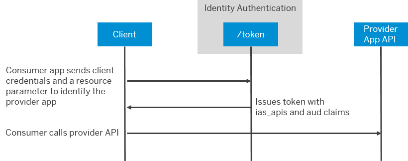

<!-- loio29e204da5b794c4683289ee0384ec781 -->

# Consume APIs from Other Applications

Applications sometimes need to propagate principals or have technical communication arrangements between applications. To enable one application to consume the APIs of another application, configure an application to include the audience of the other application in tokens issued by Identity Authentication.


<a name="loio29e204da5b794c4683289ee0384ec781__prereq_ygs_hc3_pwb"/>

## Prerequisites

-   The provider and consumer applications are configured as OpenID Connect \(OIDC\) applications.

-   You know the name of the API needed by the consumer application.

    The applications must define this name automatically during deployment, in the documentation of the applications, or from the developers directly for custom developments.


<a name="loio29e204da5b794c4683289ee0384ec781__context_hxg_cvn_rwb"/>

## Context

In this scenario, you've one application that provides an API and another application that consumes the API. At runtime, the consuming application gets a token according to the appropriate flow.

-   Use the client credential flow for technical communication.

-   Use JWT-bearer flow for principal propagation.


In either case, use the `resource` parameter to identify the provider. The `resource` parameter is a uniform resource name \(URN\).

**Options to Identify the Provider Application**


<table>
<tr>
<th valign="top">

URN


</th>
<th valign="top">

Provider Determined by


</th>
</tr>
<tr>
<td valign="top">

<code>urn:sap:identity:application:provider:name:<i class="varname">&lt;logical_name&gt;</i></code>


</td>
<td valign="top">

Logical name: Document the name in a scenario guide similar to how you do for destinations.


</td>
</tr>
<tr>
<td valign="top">

<code>urn:sap:identity:application:provider:clientid:<i class="varname">&lt;client_id&gt;</i></code>


</td>
<td valign="top">

Client ID: Identity Authentication can resolve the provider application with the `client_id` parameter.


</td>
</tr>
<tr>
<td valign="top">

<code>urn:sap:identity:application:provider:clientid:<i class="varname">&lt;client_id&gt;</i>:apptid:<i class="varname">&lt;app_tid&gt;</i></code>


</td>
<td valign="top">

Client ID and application tenant ID: Identity Authentication can resolve the provider application with the `client_id` and `app_tid` parameters.

Use this resource URN when there are multiple subscriptions of the same application with the same Identity Authentication tenant.


</td>
</tr>
</table>

The service returns a token, which includes the audience \(`aud`\) claim of the provider application and a string used by the consumer application for access control under the `ias_api` claim. The consumer application uses this token with to call the API endpoint of the provider application. The following figure illustrates this scenario for a technical communication between systems.

  
  
**Technical Communication Sequence Between Applications**



The administrator must ensure that the two applications can share the APIs between each other, if the applications weren't deployed with this configuration.


<a name="loio29e204da5b794c4683289ee0384ec781__steps_pmp_dvn_rwb"/>

## Procedure

1.  In the administration console for SAP Cloud Identity Services, choose *Applications and Resources* \> *Applications*

2.  Choose the provider application.

3.  Choose the *Trust* tab.

4.  Under *Application APIs*, choose *Provided APIs*.

5.  Check that the API is listed or enter the required data.

    For more information, see [Reference Information for the Identity Service of SAP BTP](../Integrating-the-Service/reference-information-for-the-identity-service-of-sap-btp-9379444.md).

    > ### Caution:  
    > The API name must match exactly what is expected by any consumer applications. The name must be unique within all APIs provided by the same provider application. Consumer applications use this name to determine if their application has the rights to access the provider application.
    > 
    > The name can be any URN-compliant string of 32 characters. You can define a maximum of 20 APIs.
    > 
    > For more information about URNs, see [RFC 8141](https://datatracker.ietf.org/doc/rfc8141/).

    The provider application can also specify the APIs with the Identity service of SAP BTP.

    For more information, see [Reference Information for the Identity Service of SAP BTP](../Integrating-the-Service/reference-information-for-the-identity-service-of-sap-btp-9379444.md).

6.  Choose the consumer application.

7.  Choose the *Trust* tab.

8.  Under *Application APIs*, choose *Dependencies*.

9.  Enter the required data.

    Choose the provider application and the API the consumer application consumes.


<a name="loio29e204da5b794c4683289ee0384ec781__result_g5m_ms3_pwb"/>

## Results

The consumer application can consume the specified API from the provider application. The following is an example of a token with the relevant claims.

```
{
    "ias_apis": [
        "myApi"
    ],   
    "sub": "P123456",
    "mail": "donna.moore@example.com",
    "iss": "https://mytenant.accounts.ondemand.com",
    "last_name": "Moore",
    "aud": "1ab2cd3e-c573-4ad5-9007-28aa4e587a19", 
    "scim_id": "1a2345bc-4f6b-456b-9bfb-5d58beb97fb7",
    "user_uuid": "1a2345bc-4f6b-456b-9bfb-5d58beb97fb7",
    "azp": "e7c7e327-86c0-48a6-af57-a1234b567869",
    "exp": 1676989626,
    "iat": 1676986026,
    "first_name": "Donna",
    "jti": "123a45b6-a99e-47e0-b03d-b8c1304e8b42"
}
```

