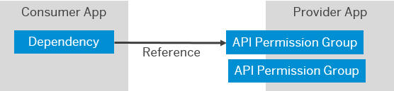
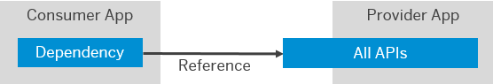
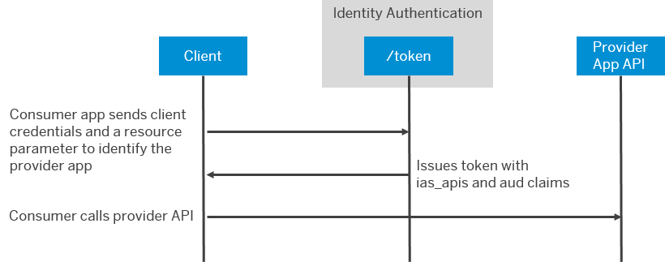

<!-- loio29e204da5b794c4683289ee0384ec781 -->

# Consuming APIs from Other Applications

Applications sometimes need to propagate principals or have technical communication arrangements between them. To enable OpenID Connect \(OIDC\) applications to consume the APIs of other applications, the developer defines API permission groups for a provider application, which a consumer application can consume through a defined dependency.

In this scenario, you have one application that provides an API and another application that consumes the API. Tenant administrators configure an application to include the audience of the other application in tokens issued by Identity Authentication. You can provide multiple permissions groups and consumer applications fetch specific tokens for the different API permission groups. You have a choice between client credential and token exchange flows.

The following figure shows the relationship between two applications in SAP Cloud Identity Services. The provider application offers two API permission groups. The dependency of the consumer application references one of these groups.

  
  
**App-to-App Integration**

Alternatively, if your provider application doesn't need to distinguish different API permission groups, make all APIs available. The provider application must check the principal propagated by the consumer application for the authorizations required by the APIs. This scenario is limited to principal propagation.

In the following figure, the provider application doesn't offer any API permission groups. The consumer application references all the available APIs. The provider application depends on the authorizations of the current user when these APIs are accessed.

  
  
**App-to-App Integration of All APIs**

At runtime, the consumer application fetches a token according to the appropriate flow:

-   Use the client credential flow for technical communication.

    For more information, see [Using Client Credentials Flow](../Operation-Guide/using-client-credentials-flow-7d84532.md).

-   Use token-exchange flow for principal propagation. The token-exchange flow includes switching to another token type, such as ID token to SAML 2 bearer token.

    For more information, see [Using Token Exchange](../Operation-Guide/using-token-exchange-25598b2.md).

In either case, use the `resource` parameter to identify the dependency consumed by the consumer application. The `resource` parameter is a uniform resource name \(URN\).

For example: <code>urn:sap:identity:application:provider:name:<i class="varname">&lt;Dependency_name&gt;</i></code>

The dependency name is the name that the tenant administrator configures for the dependency between the consumer application and the provider application. Document the name in a scenario guide so that administrators know which name to use when creating dependencies. You might be used to this approach when working with destinations.

In the unusual case that you need a token that reflects multiple dependencies to the same provider application, you can replace <code>name:<i class="varname">&lt;Dependency_name&gt;</i></code> with <code>clientid:<i class="varname">&lt;client_id&gt;</i></code>. Use the client ID of the provider application in Identity Authentication.

The service returns a token, which includes the following relevant claims:

-   The audience \(`aud`\) claim of the provider application.

-   The `ias_api` claim, which includes an array of API permission groups of the provider application.

The consumer application uses this token to call the API endpoint of the provider application. The provider application validates the token and its claims and processes the call. The following figure illustrates this scenario for a technical communication between systems.

  
  
**Technical Communication Sequence Between Applications**

**Related Information**  

[Provide APIs for Consumption by Other Applications](provide-apis-for-consumption-by-other-applications-9d2fe83.md "SAP Cloud Identity Services can help you expose APIs of your application to other applications. You can expose APIs with an API permission group or tie the access to the authorizations of the current user (principal propagation).")

[Consume an API from Another Application](consume-an-api-from-another-application-9675b64.md "Your consumer application can request an access token from Identity Authentication to consume the API of a provider application.")

