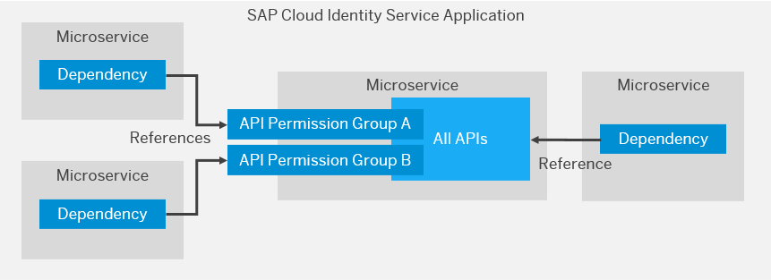

<!-- loioe00437987ac24a0b8e63c75e0b93e7f9 -->

# Restricting Access to Microservices Within Applications

To restrict individual OAuth tokens so that they can only be used for internal communication to microservices, you can define API permission groups. This option enables you to limit how a token can be used within and application as well as to reduce the impact if the token being stolen or leaked.

In this scenario, you have one application that includes a number of microservices. When developing your own applications, we recommend an architecture of tightly integrated microservices under one SAP Cloud Identity Services application over integrating separate SAP Cloud Identity Services where you can. One of these microservices provides APIs and other microservices consume these APIs. You can provide multiple permissions groups and consumer microservices fetch specific tokens for the different API permission groups. You have a choice between client credential and token exchange flows.

The following figure shows a microservice consumed by other microservices on an application in SAP Cloud Identity Services. The provider microservice offers two API permission groups. The dependencies of the other microservices reference these groups. A third microservice doesn't need to distinguish between different API permission groups and consumes all the available APIs. The application must check the principal consuming all APIs for the required authorizations. This scenario is limited to token exchange flows. The administrator creates credentials for each of these references.

  
  
**Consuming the APIs of a Microservice**

At runtime, the microservice gets a token according to the appropriate flow:

-   Use the client credential flow for technical communication.

-   Use token-exchange flow for principal propagation and exchanges of token type, such as ID token.

In either case, use the resource parameter to identify the dependency consumed by the microservice. The resource parameter is a uniform resource name \(URN\).

For example: <code>urn:sap:identity:api:name:<i class="varname">&lt;Dependency_name&gt;</i></code>

The dependency name is the name that the tenant administrator configures for the API. Document the name in a scenario guide similar to how you do for destinations.

The service returns a token, which includes the following relevant claims:

-   The audience \(aud\) claim of the application.

-   The `ias_api` claim, which includes the API permission group.

The microservice uses this token to call the API endpoint of the provider microservice. The provider microservice validates the token and its claims and processes the call.

