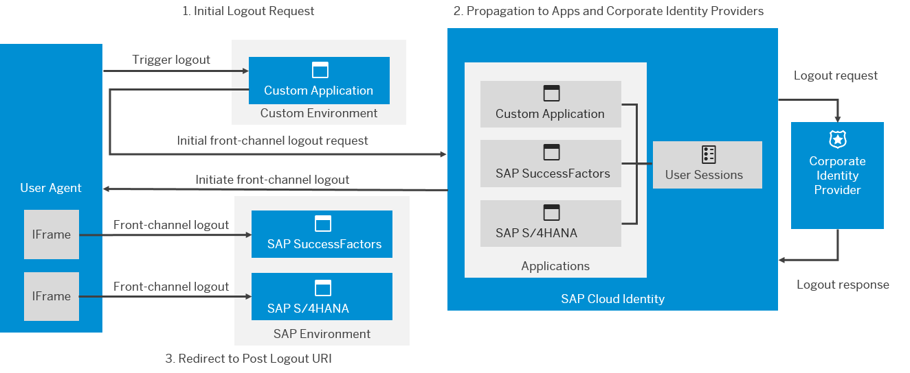
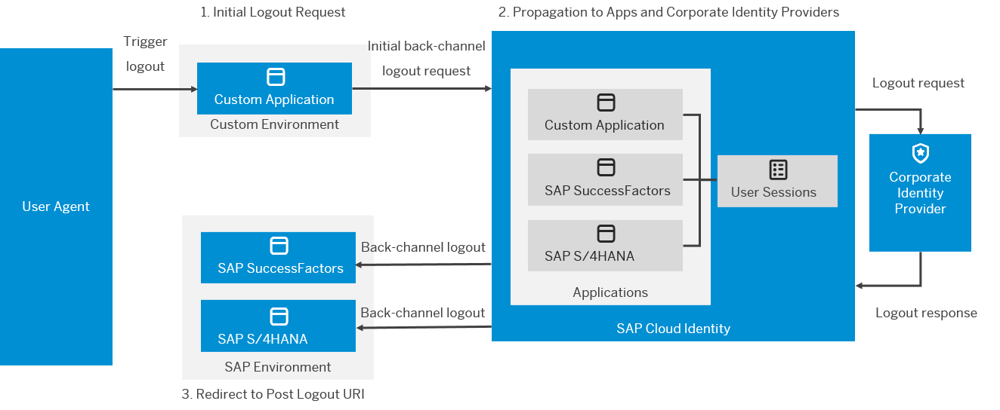

<!-- loio0584b5fe1ad442dc9e759932ccfc9197 -->

# Single Logout Flows

It's good practice to encourage users of your applications to log out at the end of their session. If malicious users can access user sessions, either by gaining access to artifacts such as cookies or by finding unattended clients, malicious users can impersonate the rightful owners of the sessions.

To counter this threat, ensure that your application takes part in single logout \(SLO\) flows. When users log out from your application, have your application notify Identity Authentication, which cleans up the user session and in turn, triggers logout on any identity providers and applications associated with the user session. Identity Authentication forwards users of your application to a URL.

The service supports SAML 2.0 and OIDC logout flows. No matter which protocol your applications and identity providers use, the service forwards the logout requests to any corporate identity providers and applications associated with the user session.

> ### Note:  
> SLO terminate the sessions of all applications under the same domain as Identity Authentication \(`ondemand.com` and `cloud.sap`\) as well as under a custom domain configured for Identity Authentication. To have applications participate in SLO, ensure that the applications operate under these domains \(recommended\) or allow 3rd-party cookies.

If both channels are defined, only the front-channel logout is executed, and the back-channel is skipped.

The following figures illustrates logout scenario with multiple applications and a corporate identity provider:

  
  
**Front-Channel Logout Flow**

  
  
**Back-Channel Logout Flow**

-   SAML applications: [Service Provider-Initiated Logout with Corporate Identity Providers](../Operation-Guide/service-provider-initiated-logout-with-corporate-identity-providers-3841580.md#loio3841580082cb4af6a13289e98a0cce12)

-   OIDC applications: [Call Identity Authentication End Session Endpoint](../Operation-Guide/call-identity-authentication-end-session-endpoint-ec674f4.md), [Handle Single Logout Request from Identity Authentication](../Operation-Guide/handle-single-logout-request-from-identity-authentication-2ae38a5.md)

-   Cloud Identity Services-initiated SLO: [Use IdP-Initiated Single Logout \(SLO\)](../Operation-Guide/use-idp-initiated-single-logout-slo-da2e4f9.md)

**Related Information**  

[Use Custom Domain in Identity Authentication](../Operation-Guide/use-custom-domain-in-identity-authentication-c4db840.md "Identity Authentication allows you to use a custom domain that is different from the default ones (<tenant ID>.accounts.ondemand.com or <tenant ID>.accounts.cloud.sap) - for example www.mytenant.com.")

