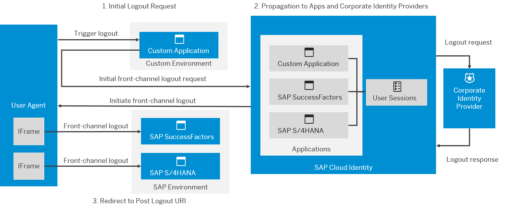
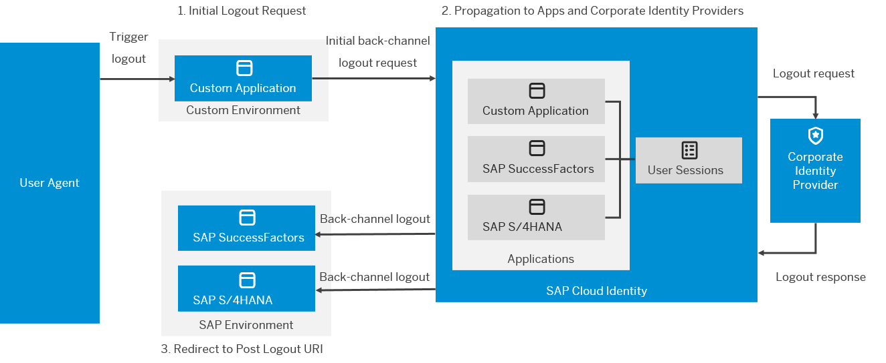

<!-- loio0584b5fe1ad442dc9e759932ccfc9197 -->

# Single Logout Flows

Encourage users of your applications to log out at the end of their session. Malicious users can impersonate session owners if they gain access to session data \(such as cookies\) or find unattended clients.

To counter this threat, ensure that your application participates in single logout \(SLO\) flows. When users log out from your application, your application notifies Identity Authentication. The service cleans up the user session and triggers logout on any identity providers and applications associated with the session. The service forwards users of your application to a URL.

The service supports SAML 2.0 and OIDC logout flows. Regardless of which protocol your applications and identity providers use, the service forwards the logout requests to any corporate identity providers and applications associated with the user session.

> ### Note:  
> SLO ends the sessions of all applications under the same domain as Identity Authentication \(`ondemand.com` and `cloud.sap`\) and under custom domains configured for the service. To have applications participate in SLO, ensure that the applications operate under these domains \(recommended\) or allow third-party cookies.

If you define both channels, the system executes both channels.

> ### Recommendation:  
> Enabling both channels sends unnecessary messages over the network, since applications only need one logout message. Applications could return unexpected results when they receive a second logout request unless they were designed to handle such requests.
> 
> We recommend back-channel logout flows where possible, but applications must be designed to support them.
> 
> If you have to manually configure logout flows, check the documentation of your application to determine which logout flows it supports.

The following figures illustrate a logout scenario with multiple applications and a corporate identity provider:

  
  
**Front-Channel Logout Flow**

  
  
**Back-Channel Logout Flow**

-   SAML applications: [Service Provider-Initiated Logout with Corporate Identity Providers](../Operation-Guide/service-provider-initiated-logout-with-corporate-identity-providers-3841580.md#loio3841580082cb4af6a13289e98a0cce12)

-   OIDC applications: [Call Identity Authentication End Session Endpoint](../Operation-Guide/call-identity-authentication-end-session-endpoint-ec674f4.md), [Handle Single Logout Request from Identity Authentication](../Operation-Guide/handle-single-logout-request-from-identity-authentication-2ae38a5.md)

-   Cloud Identity Services-initiated SLO: [Use IdP-Initiated Single Logout \(SLO\)](../Operation-Guide/use-idp-initiated-single-logout-slo-da2e4f9.md)

**Related Information**  

[Use Custom Domain in Identity Authentication](../Operation-Guide/use-custom-domain-in-identity-authentication-c4db840.md "Identity Authentication allows you to use a custom domain that is different from the default ones (<tenant ID>.accounts.ondemand.com or <tenant ID>.accounts.cloud.sap) - for example www.mytenant.com.")

