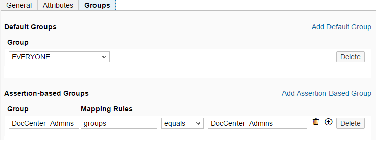

<!-- loio397683cff69d44c5bb2b38c76714c6ca -->

# Integrating the Service with SAP Document Center

You can use Identity Authentication as identity provider for SAP Document Center.

## Prerequisites

-   You have a subaccount for SAP BTP.

    For more information, see [Getting a Paid Enterprise Global Account](https://help.sap.com/viewer/65de2977205c403bbc107264b8eccf4b/Cloud/en-US/82f9ff522f754e26ae89e0cd7ec7aa11.html).

-   You have an Identity Authentication tenant. For more information about how to get Identity Authentication, see [SAP BTP Pricing and Packaging Options](http://hcp.sap.com/pricing.html), or contact your SAP sales representative.

-   You have registered the Identity Authentication as a trusted identity provider for your SAP BTP account. See [Identity Authentication Tenant as an Application Identity Provider](https://help.sap.com/viewer/65de2977205c403bbc107264b8eccf4b/Cloud/en-US/d3df5b457d0c43fca117da0dc14e2f0d.html).

-   You have set the trust with SAP BTP. For more details, see [Configure Trust](../Operation-Guide/configure-trust-f96e4c5.md).
-   You have added your SAP Document Center host to the list of the trusted domains in the administration console for SAP Cloud Identity Services. For more information, see [Configure Trusted Domains](../Operation-Guide/configure-trusted-domains-08fa1fe.md).

    You have checked the **User ID** of the users that can access SAP Document Center. The **User ID** is a six-digit number preceded by the letter **P**. For more information about how to check the **User ID**, see [List and Edit User Details](../Operation-Guide/list-and-edit-user-details-045cb01.md).

-   *Optional \(for the group assignment\):*You have created a user group in Identity Authentication and assigned that group to the users you want to give authorizations to access SAP Document Center.

## Context

> ### Note:  
> The content in this section is only relevant for SAP BTP, Neo environment.

> ### Note:  
> The content in this section is not relevant for China \(Shanghai\) region.

The integration between SAP Document Center and Identity Authentication enables users to access SAP Document Center with their Identity Authentication credentials. Identity Authentication users must be assigned to the specific *Web* roles for SAP Document Center. The specific roles contain the access authorizations for the user interfaces \(UIs\). For more information about the specific *Web* roles of SAP Document Center see, [Assigning Users to Roles](http://help.sap.com/saphelp_mdocs10/helpdata/en/d7/7b2802e4ee4311b184336455e2cdba/content.htm?frameset=/en/1a/45d66ded37499d9d04aa707baa1f37/frameset.htm&current_toc=/en/ca/a86252f0ef45908f2416807aeb05a3/plain.htm&node_id=18)

The configuration steps are done in the administration console for SAP Cloud Identity Services and in the cockpit of SAP BTP.

**Related Information**  

[Integrating the Service with SAP Business Technology Platform, Neo Environment](integrating-the-service-with-sap-business-technology-platform-neo-environment-fe84459.md#loiofe84459e688c43698591d3b9e1aac828 "SAP BTP acts as a service provider, and Identity Authentication acts as an identity provider in this setup.")

[Integrating the Service with the Identity Service of SAP BTP](integrating-the-service-with-the-identity-service-of-sap-btp-d5cd80c.md "The Identity service of SAP BTP enables you to delegate authentication to the Identity Authentication service. The Identity service automates the creation of OpenID Connect (OIDC) applications for the Identity Authentication service for each application the Identity service registers.")

[Integrating the Service with SAP Web IDE Full-Stack](integrating-the-service-with-sap-web-ide-full-stack-313f545.md#loio313f5456f3ab41ca925d555cda748f39 "You can use Identity Authentication as identity provider for SAP Web IDE Full-Stack.")

[Integrating the Service with SAP Identity Management 8.0](integrating-the-service-with-sap-identity-management-8-0-f44f931.md "")

[Integrating the Service with SAP S/4HANA Cloud, SAP Integrated Business Planning and SAP Analytics Cloud](integrating-the-service-with-sap-s-4hana-cloud-sap-integrated-business-planning-and-sap-a-dd61aea.md "This integration document aims to provide information about single sign-on (SSO) options for SAP S/4HANA Cloud or SAP Integrated Business Planning and SAP Analytics Cloud, that use Identity Authentication as an authenticating or proxy identity provider.")

[Integrating the Service with Microsoft Entra ID](integrating-the-service-with-microsoft-entra-id-626b173.md "")

[Integrating the Service with SAP Task Center](integrating-the-service-with-sap-task-center-ab5e90e.md)

[Hybrid Scenario: SAP Identity Management](hybrid-scenario-sap-identity-management-6fa419a.md "You can execute hybrid scenarios between provisioning systems from the Identity Provisioning UI and external systems that support SCIM 2.0 protocol.")

[Blogs](blogs-a89ca3e.md "Links to blogs and documents about integration scenarios with Identity Authentication.")

<a name="loiocdd3c3974741472d990cd76404903556"/>

<!-- loiocdd3c3974741472d990cd76404903556 -->

## Assign Identity Authentication Users to Roles

## Context

You can use Java EE roles to define access to SAP Document Center. You can assign the respective roles for SAP Document Center to users or to groups of users of Identity Authentication. For more information about the specific web roles for SAP Document Center, see [Assigning Users to Roles](http://help.sap.com/saphelp_mdocs10/helpdata/en/d7/7b2802e4ee4311b184336455e2cdba/content.htm?frameset=/en/96/719cd40cc548a5a6a77b2013e0a76c/frameset.htm&current_toc=/en/ca/a86252f0ef45908f2416807aeb05a3/plain.htm&node_id=32).

You have three options to define access:

-   Assign Users to Roles
-   Assign Groups to Roles
-   Assign Default Groups

<a name="task_ddy_zyw_ww"/>

<!-- task\_ddy\_zyw\_ww -->

### Assign Users to Roles

## Context

Assign the respective roles for SAP Document Center to individual users of Identity Authentication.

<a name="task_ddy_zyw_ww__steps_wl5_bzw_ww"/>

## Procedure

1.  Log on to SAP BTP cockpit with the cockpit administrator role. For more information, see [Subaccounts](https://help.sap.com/viewer/65de2977205c403bbc107264b8eccf4b/Cloud/en-US/8ed4a705efa0431b910056c0acdbf377.html#loio8d6e3a0fa4ab43e4a421d3ed08128afa).

2.  In the navigation area go to *Services* \> *SAP Document Center*.

    > ### Tip:  
    > Choose *Enable* if the service is not enabled for this account.

3.  Under *Service Configuration* choose *Assign Roles & Set Destinations*.

4.  Under *Roles* select the role you want to manage assignments for. For more information about the specific web roles for SAP Document Center, see [Assigning Users to Roles](http://help.sap.com/saphelp_mdocs10/helpdata/en/d7/7b2802e4ee4311b184336455e2cdba/content.htm?frameset=/en/96/719cd40cc548a5a6a77b2013e0a76c/frameset.htm&current_toc=/en/ca/a86252f0ef45908f2416807aeb05a3/plain.htm&node_id=32).

5.  Choose *Assign* for the *Individual Users* section.

6.  Enter the **User ID** \(the **P number\)** of the user in question and choose *Assign*.

    > ### Note:  
    > For more information how to check the *User ID*, see [List and Edit User Details](../Operation-Guide/list-and-edit-user-details-045cb01.md). The *User ID* is a six-digit number preceded by the letter **P**.

## Results

The assigned user can log on to SAP Document Center with their credentials for Identity Authentication.

<a name="task_frb_h1x_ww"/>

<!-- task\_frb\_h1x\_ww -->

### Assign Groups to Roles

## Context

Assign the respective roles for SAP Document Center to collections of users of Identity Authentication instead of individual users. Groups allow you to easily manage the role assignments.

Assertion-based groups are groups determined by values of attributes in the SAML 2.0 assertion.

<a name="task_frb_h1x_ww__steps_tmd_ldx_ww"/>

## Procedure

1.  Assign a group to users of Identity Authentication. For more information, see [Assign Groups to a User](../Operation-Guide/assign-groups-to-a-user-bfdeb9c.md).

    For example, you can have a group *EVERYONE* for all the users of Identity Authentication, and a group *DocCenter\_Admins* just for the administrators. In this case, you should assign the group EVERYONE to all the users of Identity Authentication, and just the administrators to the *DocCenter\_Admins* group.

2.  Configure the `groups` attribute that is sent to SAP Document Center in the SAML 2.0 assertion. For more information, see [Configuring User Attributes from the Identity Directory](../Operation-Guide/configuring-user-attributes-from-the-identity-directory-d361407.md)

3.  In the cockpit of SAP BTP define the assertion based groups for the group-to-role mapping in the cockpit. For more information, see 4. \(If Using an Identity Provider\) Define the Group-to-Role Mapping.

    

## Results

All users that are members of the group can access SAP Document Center.

<a name="copy3b728dee0f054637a5afc71870a20aff"/>

<!-- copy3b728dee0f054637a5afc71870a20aff -->

## Configure User Attributes Mapping

You have to specify how the user attributes are sent to SAP BTP in the assertion, and define their mapping.

<a name="task_kmc_rhg_cy"/>

<!-- task\_kmc\_rhg\_cy -->

### 1. Configure User Attributes in Identity Authentication

<a name="task_kmc_rhg_cy__steps_zdw_bnh_yv"/>

## Procedure

1.  Sign in to the administration console for SAP Cloud Identity Services.

2.  Under *Applications and Resources*, choose the *Applications* tile.

3.  Choose your SAP BTP application from the list.

4.  Choose the *Trust* tab.

5.  Under *SINGLE SIGN-ON*, choose *Attributes*.

6.  Configure the attributes.

7.  Save your configuration.

    If the operation is successful, you receive the message ***Attributes updated***.

**Related Information**  

[Configuring User Attributes from the Identity Directory](../Operation-Guide/configuring-user-attributes-from-the-identity-directory-d361407.md "Specify how the local user attributes, configured to be collected by the registration and upgrade forms, are sent to the application.")

<a name="task_ckj_rhg_cy"/>

<!-- task\_ckj\_rhg\_cy -->

### 2. Configure Mapping in SAP BTP

<a name="task_ckj_rhg_cy__steps_lfn_fyh_5v"/>

## Procedure

1.  Log on to SAP BTP cockpit with the cockpit administrator role. For more information, see [Subaccounts](https://help.sap.com/viewer/65de2977205c403bbc107264b8eccf4b/Cloud/en-US/8ed4a705efa0431b910056c0acdbf377.html#loio8d6e3a0fa4ab43e4a421d3ed08128afa).

2.  Select the subaccount and choose *Trust* in the navigation bar.

3.  Choose the *Application Identity Provider* \> *the identity provider that the platform uses for authentication*.

4.  Choose *Attributes* \> *Add Assertion-Based Attribute*.

5.  Enter the fields as follows:

    <table>
    <tr>
    <th valign="top">

    Assertion Attribute
    
    </th>
    <th valign="top">

    Principal Attribute
    
    </th>
    </tr>
    <tr>
    <td valign="top">
    
    \*
    
    </td>
    <td valign="top">
    
    \*
    
    </td>
    </tr>
    </table>
    
    > ### Note:  
    > This specifies that all assertion attributes will be mapped to the corresponding principal attributes without a change
    > 
    > The *Assertion Attribute* field is for the attribute that comes from the assertion.
    > 
    > The *Principal Attribute* field is the user attribute that the users will have at SAP BTP.

6.  Save your changes.

**Related Information**  

[Application Identity Provider](https://help.sap.com/viewer/65de2977205c403bbc107264b8eccf4b/Cloud/en-US/dc618538d97610148155d97dcd123c24.html)

