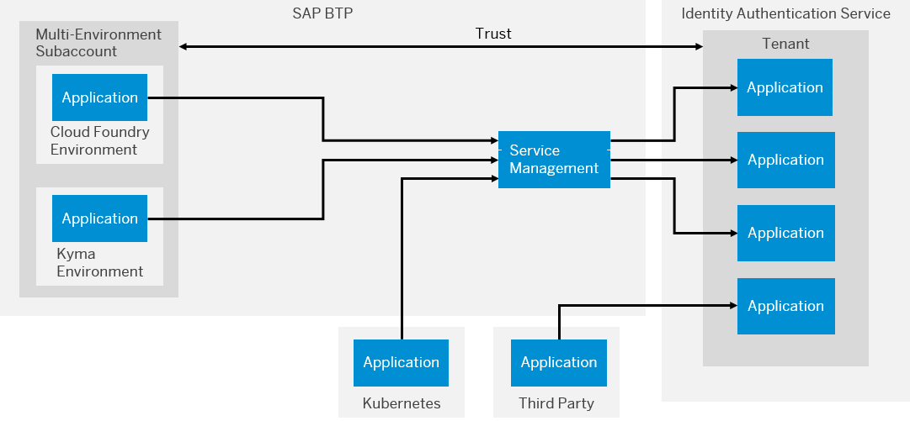

<!-- loiod5cd80c6928e4ac98586025170efdf08 -->

# Integrating the Service with the Identity Service of SAP BTP

The Identity service of SAP BTP enables you to delegate authentication and authorization to Cloud Identity Services. When you register and application, the Identity service automatically creates an OpenID Connect \(OIDC\) application in Cloud Identity Services.

The Identity service of SAP BTP enables you to realize authentication for applications built with SAP BTP regardless of whether your application resides in an environment of SAP BTP or not. While you can manually configure an application of Cloud Identity Services to serve the function of an OIDC provider, the Identity service automates this process. You can preconfigure aspects of the Cloud Identity Services application, such as the display name of the application and redirect URIs. The Identity service enables an application to exchange information such as URL and credentials with the application of the Cloud Identity Services tenant.

> ### Note:  
> This integration isn’t available for the SAP BTP, partner-managed edition account type.

This integration supports principal propagation to services consumed by your application.

The following figure shows each application integrating with the Cloud Identity Services tenant linked to your subaccount. The Identity service instance is represented by an application in the Cloud Identity Services tenant.

  
  
**Applications Using the Identity Service**

Each Identity instance has its own OAuth client for the Cloud Identity Services application serving as the OAuth and OIDC server. The OAuth client has its own credentials; either client ID and client secret or X.509 certificate. To use an existing X.509 client certificate from a trusted Certification Authority, provide the certificate when binding the instance to your application. Alternatively, you can request a new certificate as part of the binding. Access these credentials from the service binding. No matter which type of credentials you use, the Identity service supports code flows for users and technical users.

> ### Note:  
> The credentials only enable you to request a token and not use any other APIs of the Cloud Identity Services.

**Related Information**  

[Integrating the Service with SAP Business Technology Platform, Neo Environment](integrating-the-service-with-sap-business-technology-platform-neo-environment-fe84459.md#loiofe84459e688c43698591d3b9e1aac828 "SAP BTP acts as a service provider, and Identity Authentication acts as an identity provider in this setup.")

[Integrating the Service with SAP Web IDE Full-Stack](integrating-the-service-with-sap-web-ide-full-stack-313f545.md#loio313f5456f3ab41ca925d555cda748f39 "You can use Identity Authentication as identity provider for SAP Web IDE Full-Stack.")

[Integrating the Service with SAP Document Center](integrating-the-service-with-sap-document-center-397683c.md#loio397683cff69d44c5bb2b38c76714c6ca "You can use Identity Authentication as identity provider for SAP Document Center.")

[Integrating the Service with SAP Identity Management 8.0](integrating-the-service-with-sap-identity-management-8-0-f44f931.md "")

[Integrating the Service with SAP S/4HANA Cloud, SAP Integrated Business Planning and SAP Analytics Cloud](integrating-the-service-with-sap-s-4hana-cloud-sap-integrated-business-planning-and-sap-a-dd61aea.md "This integration document aims to provide information about single sign-on (SSO) options for SAP S/4HANA Cloud or SAP Integrated Business Planning and SAP Analytics Cloud, that use Identity Authentication as an authenticating or proxy identity provider.")

[Integrating the Service with Microsoft Entra ID](integrating-the-service-with-microsoft-entra-id-626b173.md "")

[Integrating the Service with SAP Task Center](integrating-the-service-with-sap-task-center-ab5e90e.md)

[Hybrid Scenario: SAP Identity Management](hybrid-scenario-sap-identity-management-6fa419a.md "You can execute hybrid scenarios between provisioning systems from the Identity Provisioning UI and external systems that support SCIM 2.0 protocol.")

[Blogs](blogs-a89ca3e.md "Links to blogs and documents about integration scenarios with Identity Authentication.")

[Getting Started with the Identity Service of SAP BTP](getting-started-with-the-identity-service-of-sap-btp-066bda8.md "To create OpenID Connect (OIDC) applications in the Cloud Identity Services service using SAP Cloud Service Management service, instantiate the Identity service and bind your service instance to an application. The Identity service automates the manual creation of Cloud Identity Services OIDC applications.")

[Reference Information for the Identity Service of SAP BTP](reference-information-for-the-identity-service-of-sap-btp-9379444.md "Properties enable you to customize the configuration of the Identity service.")

