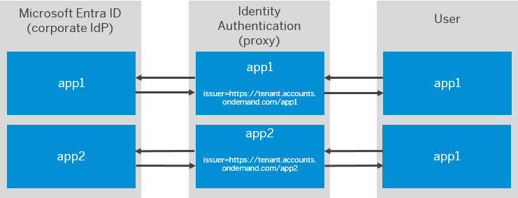

<!-- loiof661eecaad7147afa43a48b23fb4defe -->

# \(Optional\) Configure Different Trust Configurations for the Same Identity Authentication Tenant \(Microsoft Entra ID Apps\)

Configure issuer name on Identity Authentication and update the name and certificate on Microsoft Entra ID side.

<a name="loiof661eecaad7147afa43a48b23fb4defe__context_fln_5rr_f4b"/>

## Context

When Identity Authentication acts as a proxy identity provider you can have different trust configurations for the different applications at Microsoft Entra ID side, acting as a corporate identity provider. To do this you should configure Identity Authentication to use a different issuer name when communicating with Microsoft Entra ID, depending on the application for which the authentication is done.

When Identity Authentication issues a SAML2.0 authentication request, logout request or response to Microsoft Entra ID, then it uses the configured issuer name for the corresponding application.

When Identity Authentication verifies the SAML2.0 message coming from Microsoft Entra ID, then the verification is done against the configured issuer for the corresponding application.

The configuration is done both in Identity Authentication and Microsoft Entra ID.

> ### Example:  
> 
> 
> Identity Authentication acts as identity provider proxy and there are two configured applications app1 and app2. App1 is configured with `issuer=https://tenant.accounts.ondemand.com/app1`. App2 is configured with `issuer=https://tenant.accounts.ondemand.com/app2`. Both applications use one and the same corporate identity provider for authentication.
> 
> When App1 issues an authentication request to Identity Authentication, then Identity Authentication sends authentication request to Microsoft Entra ID, using `issuer=https://tenant.accounts.ondemand.com/app1`. Microsoft Entra ID authenticates the user and sends authentication response with `audience=https://tenant.accounts.ondemand.com/app1`. Then Identity Authentication sends authentication response to app1.
> 
> After that, the same user tries to authenticate to app2 from the same browser session. App2 issues an authentication request to Identity Authentication. Then Identity Authentication again sends authentication request to Microsoft Entra ID, but this time with `issuer=https://tenant.accounts.ondemand.com/app2`. Thus, Microsoft Entra ID can apply the specific authentication mechanisms, configured for `issuer=https://tenant.accounts.ondemand.com/app2` . After the authentication,Microsoft Entra ID issues an authentication response with `audience=https://tenant.accounts.ondemand.com/app2`. Then Identity Authentication sends authentication response to app2.

<a name="task_h2w_b5r_f4b"/>

<!-- task\_h2w\_b5r\_f4b -->

## 1. Configure Issuer Name at Identity Authentication

<a name="task_h2w_b5r_f4b__issuer_name_procedure"/>

## Procedure

1.  Sign in to the administration console for SAP Cloud Identity Services.

2.  Under *Applications and Resources*, choose the *Applications* tile.

3.  Choose the *Trust* tab.

4.  Choose the application that you want to edit.

5.  Under *Conditional Authentication*, choose *Configure Requests to Corporate Identity Providers*.

6.  Under *Configure Issuer Name*, type the issuer suffix, which you want to add to the Identity Authentication default issuer name.

    > ### Note:  
    > The issuer name can contain only Latin letters \(A-Z and a-z\) and numbers. It must be up to 32 characters.

    The issuer name, which will be used when sending SAML2.0 requests to the corporate identity provider appears under the input field. It is in the format `<Identity_Authentication_default_issuer_name>/<issuer_name_suffix_typed_in_the_input_field>` . For example, `https://my-tenant.accounts.ondemand.com/issuername/>`.

7.  Save your changes.

<a name="task_vbd_b5r_f4b"/>

<!-- task\_vbd\_b5r\_f4b -->

## 2. Configure Microsoft Entra ID

<a name="task_vbd_b5r_f4b__context_spb_1wr_f4b"/>

## Context

> ### Note:  
> If you want to register Identity Authentication tenant more than once in Microsoft Entra ID, you must configure issuer name per Identity Authentication application and change the name and certificate on Microsoft Entra ID side.
> 
> You have to change the certificates, because by default Microsoft Entra ID generates application specific certificates. On Identity Authentication side there is one corporate identity provider with one certificate which means that all applications on Microsoft Entra ID side for the same Identity Authentication tenant should use the same certificate for SAML 2.0.

<a name="task_vbd_b5r_f4b__steps_a5g_b5r_f4b"/>

## Procedure

1.  Create Microsoft Entra ID applications.

2.  Update the issuer names.

3.  Generate a certificate with a private key for the Microsoft Entra ID applications.

    You can generate a certificate with a private key using OpenSSL with the following command:

    `openssl req -x509 -days 365 -newkey rsa:2048 -keyout cert.pem -out cert.pem`

    The commands are executed in the MS Windows or Mac OS Terminal.

4.  Convert the `.pem` file to `.pfx` format.

    You can convert the `.pem` file to `.pfx` format, using the following command:

    `openssl pkcs12 -export -in cert.pem -inkey cert.pem -out cert.pfx`

    The commands are executed in the MS Windows or Mac OS Terminal.

5.  Import the generated certificate to your Microsoft Entra ID applications.

<a name="task_vbd_b5r_f4b__postreq_wzp_nfg_15b"/>

## Next Steps

Add the generated certificate for the configured corporate identity provider in your Identity Authentication tenant. For more information, see [Configure Trust with SAML 2.0 Corporate Identity Provider](../Operation-Guide/configure-trust-with-saml-2-0-corporate-identity-provider-33832e5.md).

