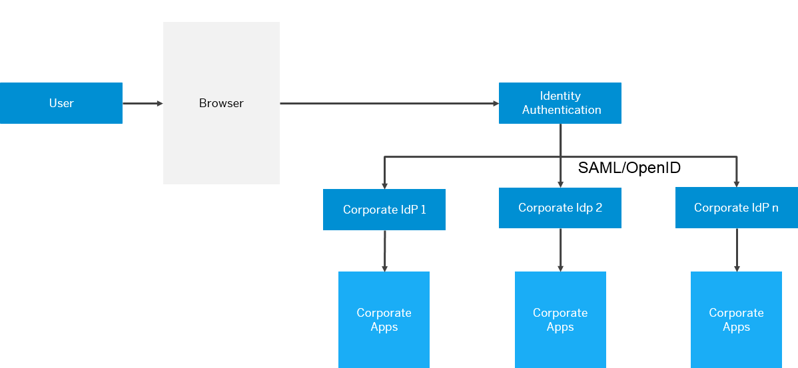

<!-- loio699edc9a2d2b48a8a242a8bd28e8d1c8 -->

# Use Your Own Corporate IdP for Authentication

This document is intended to help you configure trust with a corporate identity provider. In this scenario Identity Authentication acts as a proxy to delegate the authentication to the corporate identity provider.

## Context

In this scenario Identity Authentication acts as a proxy to delegate the authentication to the corporate identity provider. The requests for authentication sent by a service provider/relying party will be forwarded to the corporate identity provider.

Identity Authentication can use a SAML 2.0 or OpenID Connect identity provider as an external authenticating authority. The choice of one or the other protocol depends on your scenario and needs.

As an identity provider proxy, Identity Authentication will act as an identity provider to the service provider/relying party, and as a service provider/relying party to the corporate identity provider. Once a user is authenticated at the corporate identity provider, successive authentication requests from service providers/relying parties, which use the same corporate identity provider will not be forwarded to it as long as the session at Identity Authentication is active. Identity Authentication will issue assertions or JSON Web Tokens \(JWTs\) based on the user data received during the first authentication.

> ### Remember:  
> For the embeded version of SAP Analyics Cloud, the *Forward All SSO Requests to Corporate IdP* option must be disabled. Identity Authentication forwards the SSO request to the corporate identity provider only during the first sign in flow to SAP S/4HANA Cloud Public Edition, but not during the subsequent sign in flow to SAP Analytics Cloud.

To use Identity Authentication as a proxy to delegate authentication to an external corporate identity provider choose your scenario and follow the procedures below:

-   [Configure Trust with SAML 2.0 Corporate Identity Provider](configure-trust-with-saml-2-0-corporate-identity-provider-d43e484.md)
-   [Configure Trust with OpenID Connect Corporate Identity Provider](configure-trust-with-openid-connect-corporate-identity-provider-140f455.md)
-   [Configure Identity Federation](configure-identity-federation-749284f.md)

