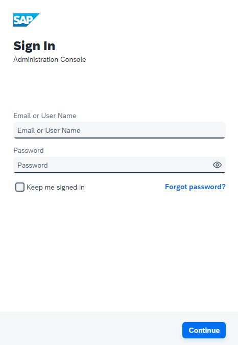
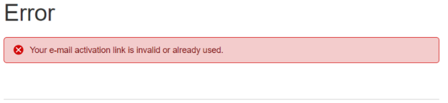
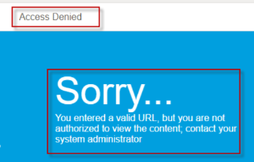
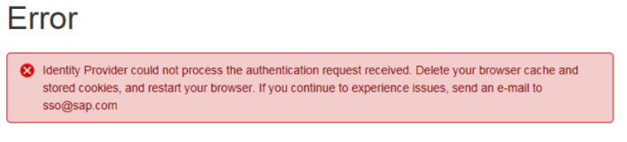

<!-- loio61879409f6024c5cad78d5e36ce3657c -->

# Accessing the Administration Console

Problems with the signing into the administration console for SAP Cloud Identity Services.

You can reach the tenant administration console via the URL `https://<tenant ID>.accounts.ondemand.com/admin` or `https://<tenant ID>.accounts.cloud.sap/admin` pattern. For more information, see [Application Types](../application-types-8f61880.md).

You must be an administrator user.

The Sign In screen appears correctly

but you face one of the following problems:

<a name="loio61879409f6024c5cad78d5e36ce3657c__section_xrm_yhl_ndc"/>

## I don't know who the tenant administrator is

**Symptom:**

You don't know who the tenant administrator is

**Solution:**

### Contact an existing administrator for the tenant.

Cloud Identity Services doesn't use for authentication the users registered in the SAP Service Marketplace, but maintains an own user store for administrators and users.

Once you purchase a customer or partner account in SAP BTP, a user account for Cloud Identity Services is created for the contact person specified in the *Order Form*. The contact person is the first tenant administrator in the administration console for Cloud Identity Services. That person receives an activation email for the administration console account. The subject of the email is: **Activate Your Account for Identity Authentication Service**. The first administrator activates the account and continues to the administration console for Identity Authentication via the console's URL.

The first administrator can add new tenant administrators.

**See also:**

-   [KBA 3035908 - How to Find the Identity Authentication / Identity Provisioning Tenant Administrator Information or Tenant URL?](https://me.sap.com/notes/3035908)
-   [Identity Authentication Service tenant specific request only possible for customer owning the tenant](https://launchpad.support.sap.com/#/notes/2774108)
-   [Access Admin Console](../access-admin-console-2609e81.md)
-   [Reset Your Forgotten Password](../User-Guide/reset-your-forgotten-password-c821f3f.md)
-   [Activate Your Account](../activate-your-account-cc03ecc.md)
-   [Access Admin Console](../access-admin-console-2609e81.md)
-   [Manage Administrators](../manage-administrators-3bddea4.md)

<a name="loio61879409f6024c5cad78d5e36ce3657c__section_m3j_43l_ndc"/>

## I can't sign in to admin console of custom tenant with S-user

**Symptom:**

Logging into the administration console of a Cloud Identity services tenant with an S-user is unsuccessful.

**Solution:**

See KBA **2424064**- [Cannot login to Administration Console of custom Identity Authentication tenant with S-user](https://launchpad.support.sap.com/#/notes/2424064).

<a name="loio61879409f6024c5cad78d5e36ce3657c__section_uxn_2ll_ndc"/>

## Administration Console isn't accessible due to network problem

**Symptom:**

The administration console can't be accessed, the browser returns `ERR_EMPTY_RESPONSE`, or similar error message `ERR_TIMED_OUT`, `took too long to respond`, and so on.

Timeout-related errors can also be seen on the browser.

**Solution:**

See KBA 2918278 - [Identity Authentication tenant is not accessible due to network problem](https://launchpad.support.sap.com/#/notes/2918278).

<a name="loio61879409f6024c5cad78d5e36ce3657c__section_q3m_tll_ndc"/>

## Email activation problem

As a tenant administrator you can reach the administration console via the URL https://<tenant ID\>.accounts.ondemand.com/admin or https://<tenant ID\>.accounts.cloud.sap/admin pattern.

`Tenant ID` is an automatically generated ID by the system. The URL is in the activation e-mail received by you.

Check your inbox for an e-mail from **ias@notifications.sap.com** or **notification@sapnetworkmail.com**.

See also: [Activate Your Account](../activate-your-account-cc03ecc.md).

### I have activated my account but I still face problems

You see the following error after you’ve chosen the activation email link:

This message means that the user or someone else clicked the activation link after it had already expired or the user account at the Identity Authentication tenant had already been activated.

Use the "Forgot Password" functionality to gain access to your tenant. For more information, see [Reset Your Forgotten Password](../User-Guide/reset-your-forgotten-password-c821f3f.md).

### I haven't activated my account or didn't receive any email

Open your inbox and search for an email from **ias@notifications.sap.com** or *notification@sapnetworkmail.com*. The email contains the URL to activate your account.

-   **If the URL is expired**
    -   The system sends you a new activation e-mail. Follow the procedure to activate your account.

-   **If the link is invalid or already used, or you haven't received an email**
    -   Check your spam folder
    -   Contact an existing administrator for the tenant to ask the following

        -   Whether an activation email was sent \(or if only an initial password was set, since in this case no email is sent\).
        -   To resend the activation email \(*Admin Console* \> *User Management* \> *select the user* \> *Authentication* \> *Password Details* \> *Password Details* \> *Send Email*. See also [Send Reset Password Email](../Operation-Guide/send-reset-password-email-da55abf.md).

See also: **KBA 2517844** - [How to get the activation e-mail of an Identity Authentication tenant](https://launchpad.support.sap.com/#/notes/2517844).

<a name="loio61879409f6024c5cad78d5e36ce3657c__section_vkp_zpl_ndc"/>

## Error "Sorry, we could not authenticate you. Try again."

This is a general error, and it can be a symptom of many different situations. You try to sign in...:

### ... after an LDAP user store is configured.

**Symptom:**

The user is locked when configuring the LDAP user store on SAP BTP.

**Solution:**

You have configured an LDAP scenario based on the [Configure SAP BTP When Connecting to an LDAP User Store documentation](https://help.sap.com/viewer/6d6d63354d1242d185ab4830fc04feb1/Cloud/en-US/461d71c148594608b9c8b6d016e0a0c5.html#loiof48d4ea4ec4747ac8425385ded5d1e25). However, when you attempt to sign in, you see **"Sorry, we could not authenticate you. Try again."**

There is an issue in the connection between the SAP Cloud Connector and the corporate user store due to an issue with the system user which is used to access the corporate user store.

See KBA: [2680867](https://i7p.wdf.sap.corp/sap/support/notes/2680867)- Check if the system user is locked when configuring and LDAP user store on SAP BTP

### … with S-user credentials

**Symptom:**

You're trying, without success, to sign in to the administration console as an S-user.

**Solution:**

There are no S-users used in custom tenants. S-users can only log on to `accounts.sap.com`, which belongs to SAP. In a custom tenant, you can sign in using your email address and password.

See KBA [2424064](https://i7p.wdf.sap.corp/sap/support/notes/2424064) - Cannot login to admin console of custom Identity Authentication tenant with S-user

### … but sign-in fails after successful activation with error: **Sorry, we could not authenticate you. Try again.**

**Symptom:**

The user sign-in fails after the activation link is called and the password update was successful.

The user receives the following message:

**Sorry, we could not authenticate you. Try again.**

In the [Troubleshooting log](https://launchpad.support.sap.com/#/notes/2942816), the following error is displayed:

**Identity Provider could not process the authentication request received due to error on its own side. The SP user \[<user\_uuid\>\] is with status inactive for Service Provider \[<service\_provider\_url\>\] Caused by: javax.security.auth.login.AccountException: The SP user \[<user\_uuid\>\] is with status inactive for Service Provider \[<service\_provider\_url\>\] Caused by: The SP user \[<user\_uuid\>\] is with status inactive for Service Provider \[<service\_provider\_url\>\]**

**Solution:**

See KBA 2770797 - [The IAS tenant user login fails after successful activation: Sorry, we could not authenticate you. Try again.](https://launchpad.support.sap.com/#/notes/2770797)

### but … you forgot your password

Use the "Forgot Password" functionality to gain access to your tenant. For more information, see [Reset Your Forgotten Password](../User-Guide/reset-your-forgotten-password-c821f3f.md).

If you have an account as administrator in Cloud Identity Services, an email with a link to a page where you can reset your password is sent. Note that the email might take a few minutes to reach your inbox. If you don't have an account as administrator, you won't receive an e-mail. In this case, contact an existing administrator for the tenant.

See also KBA 2517844 - [How to get the activation e-mail of an Identity Authentication tenant](https://launchpad.support.sap.com/#/notes/2517844).

### … but you aren't an administrator

Cloud Identity Services does not use for authentication the users registered in the SAP Service Marketplace, but maintains an own user store for administrators and users. Only administrators can access the administration console.

Ask an existing administrator to add new tenant administrators. See [Manage Administrators](../manage-administrators-3bddea4.md) and [2570572](https://i7p.wdf.sap.corp/sap/support/notes/2570572) - How to add Administrators to Identity Authentication tenants.

### … but you receive error **Used logon identifier is not allowed**

**Symptom**

Sign in to the administration console for Cloud Identity services is failing with error: **Sorry, we could not authenticate you. Try again.**. Using the forgot password link allows you to reset the password and log in. However, signing out and trying to sign in again the same error is shown as previously. Only a password reset allows login again for just one user session.

The [Troubleshooting log](https://launchpad.support.sap.com/#/notes/2942816) shows the following error:

**User authentication failed. Reason: Used logon identifier isn't allowed; Identifier: \[ <logon\_identifier\> \]**

**Solution:**

See KBA 2895349 - [Cannot logon to Identity Authentication Administration Console with valid logon identifier and password](https://launchpad.support.sap.com/#/notes/2895349).

<a name="loio61879409f6024c5cad78d5e36ce3657c__section_s31_fzl_ndc"/>

## Error "Access denied. Sorry... You entered a valid URL, but you are not authorized to view the content."

**Symptom**

Immediately after you've signed in to the administration console for Cloud Identity Services, you see the message:

**Access Denied. Sorry... You entered a valid URL, but you are not authorized to view the content, contact your system administrator**

Ask an administrator to configure the required authorization, as explained in the following KBA:

[2579343](https://i7p.wdf.sap.corp/sap/support/notes/2579343) - Accessing /admin of custom Identity Authentication tenant ends with "you are not authorized to view the content"

<a name="loio61879409f6024c5cad78d5e36ce3657c__section_mx1_dcm_ndc"/>

## Error "The identity provider could not process the authentication request received"

Cloud Identity Services using the Security Assertion Markup Language \(SAML\) 2.0 as identity provider \(IdP\) fails to process the authentication request.

Make sure the service provider's name is the same as configured in Cloud Identity Services, acting as IdP:

[2260000](https://i7p.wdf.sap.corp/sap/support/notes/2260000) - Identity provider could not process the authentication request received.

If this doesn't solve your problem please open a ticket on BC-IAM-IDS component, and provide the following information:

-   -   Your tenant ID from `https://tenant ID>.accounts.ondemand.com/admin`
-   Your email address
-   The error message that you see
-   Attachments of screenshot that show the reproduced error, including the exact timestamp
-   If you solved your issue, a description of the steps you took
-   List of KBAs and SAP Notes, you have used to solve the issue
-   Attachments of SAML traces as per KBA: [2461862](https://launchpad.support.sap.com/#/notes/2461862) - Collecting SAML traces with Chrome or Firefox

<a name="loio61879409f6024c5cad78d5e36ce3657c__section_qhr_hgm_ndc"/>

## Error "Access to this Identity Authentication tenant is blocked, please contact your administrator"

**Symptom:**

Accessing the SAP Cloud Platform Identity Authentication Service \(IAS\) tenant fails with the following error:

***"HTTP Status 403 – Access to this Identity Authentication tenant is blocked, please contact your administrator."***

**Solution:**

See**KBA** - [https://launchpad.support.sap.com/\#/notes/2909142](https://launchpad.support.sap.com/#/notes/2909142)

**Related Information**  

[User Import](user-import-6a46913.md "Problems with the user import in the administration console for SAP Cloud Identity Services.")

[Emails](emails-7bde0d5.md "Problems with emails sent for the different application processes.")

[Authentication](authentication-84f28fb.md "Problems with the authentication of the user and administrator.")

[Application Integration](application-integration-8acf508.md "Problems that different applications integrated with Cloud Identity Services may face.")

[Request, Create, and Delete Identity Authentication Tenant](request-create-and-delete-identity-authentication-tenant-b442658.md "Problems related to requesting, creating, or deleting a tenant.")

[End user screens](end-user-screens-a3864b5.md "Problems that you may face when working with the end user screens.")

[REST APIs](rest-apis-29ffc6b.md "Problems that you may face when using the REST APIs of Cloud Identity Services.")

[Corporate Identity Providers](corporate-identity-providers-16ab7db.md "Problems that you may face with corporate identity providers (IdPs) when using Cloud Identity services as a proxy.")

[Corporate User Store](corporate-user-store-3ade241.md "Problems with corporate user store scenarios.")

[Kerberos Authentication](kerberos-authentication-4bb4b24.md "Problems with Kerberos authentication scenarios.")

[Risk-Based Authentication](risk-based-authentication-bc7de4d.md "Problems that you may face when configuring or using with risk-based authentication.")

[Custom Domains](custom-domains-7cb2ea5.md "Problems that you may face when using custom domains in Identity Authentication.")

