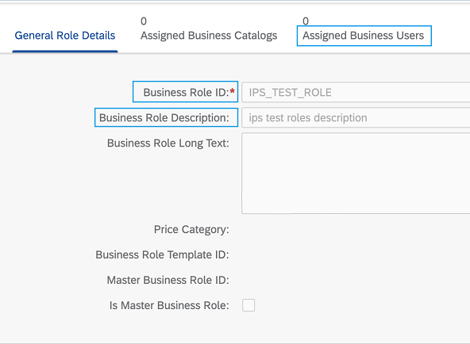

<!-- loio7463572fefe4401db00f47a5802129f0 -->

# Additional Information


<a name="loio7463572fefe4401db00f47a5802129f0__section_dfk_wsk_mbc"/>

## Extended Explanation of the \*.user.roles.overwrite Properties

**Job Logs**

You have a target or a proxy system of one of the following types:

-   SAP S/4HANA Cloud Public Edition

-   SAP Marketing Cloud

-   SAP Market Communication for Utilities

-   SAP BTP ABAP Environment

-   SAP SAP Integrated Business Planning Cloud


You want to know the correct way to preserve or overwrite user roles on your target or proxy system. Thus, you need to know how to use the relevant *\*.user.roles.overwrite* properties, and whether or not to make additional changes in your transformations.

**Scenarios**

1.  You want to keep existing user assignments \(roles\) on the target system

    **Meaning:**

    During the provisioning, you want to keep existing roles assigned to users on the target system, and add new assignments, if any . That means:

    -   Keeping user assignments \(roles\) that exist only on the target system

    -   Keeping user assignments \(roles\) that exist on both the source and the target system

    -   Assigning new roles, which are read from the source system \(if any\), to users on the target system


    > ### Example:  
    > Role A and B exist on the source system, and roles A, B, and C exist on the target system. Let’s say a user is assigned to role \(group\) A in the source system, and the same user is assigned to roles B and C in the target system. You want role A to be added, and roles B and C to be preserved as assignments for this user in the target system. That is, after the provisioning, this user has to have roles A, B and C assigned to it on the target/proxy system.

    **What do you need to do?**

    1.  Set the relevant *\*.user.roles.overwrite* property to false.
    2.  Make sure you have the following mapping in the `"user"` object of your target/proxy write transformation:

        > ### Sample Code:  
        > ```
        > {
        >     "sourcePath": "$.groups[*].value",
        >     "preserveArrayWithSingleElement": true,
        >     "targetPath": "$.user.role[?(@.roleName)]",
        >     "optional": true
        > },
        > ```

    3.  Remove the whole `"group"` object from your target transformation. That is:

        > ### Sample Code:  
        > ```
        > "group": {
        >   "mappings": [
        >     {
        >        "sourcePath": "$.displayName",
        >        "targetVariable": "entityIdTargetSystem",
        >        "scope": "createEntity"
        >    },
        >    {
        >        "sourcePath": "$.displayName",
        >        "targetPath": "$.displayName"
        >    },
        >    {
        >        "sourcePath": "$.displayName",
        >        "targetPath": "$.ID"
        >    },
        >    {
        >        "sourcePath": "$.members[*].value",
        >        "preserveArrayWithSingleElement": true,
        >        "optional": true,
        >        "targetPath": "$.members[?(@.value)]",
        >        "functions": [
        >           {
        >               "function": "resolveEntityIds"
        >           }
        >        ]
        >     }
        >   ]
        > }
        > ```

        > ### Note:  
        > For proxy systems, the `"group"` object looks a bit different.


2.  You want to overwrite existing user assignments \(roles\) on the target system

    **Meaning:**

    During the provisioning, you want to unassign roles assigned to users on the target system, and assign only roles read from the source system. That means:

    -   Unassigning all user assignments \(roles\) that are assigned to the user on the target system \(unassigning roles which exist on both source and target system, as well as roles existing only on the target system\)

    -   Assigning user assignments \(roles\) read from the source system to the user on the target system


    > ### Example:  
    > Role A and B exist on the source system, and roles A, B, and C exist on the target system. Let’s say a user is assigned to role \(group\) A in the source system, and the same user is assigned to roles B and C in the target system. You want role A to be added, and roles B and C to be unassigned from this user in the target system. That is, after the provisioning, this user has to have only role A assigned to it on the target/proxy system.

    **What do you need to do?**

    1.  Set the relevant *\*.user.roles.overwrite* property to true.
    2.  Make sure you have the following mapping in the `"user"` object of your target/proxy write transformation:

        > ### Sample Code:  
        > ```
        > {
        >     "sourcePath": "$.groups[*].value",
        >     "preserveArrayWithSingleElement": true,
        >     "targetPath": "$.user.role[?(@.roleName)]",
        >     "optional": true
        > },
        > ```

    3.  Remove the whole `"group"` object from your target transformation. That is:

        > ### Sample Code:  
        > ```
        > "group": {
        >   "mappings": [
        >     {
        >        "sourcePath": "$.displayName",
        >        "targetVariable": "entityIdTargetSystem",
        >        "scope": "createEntity"
        >    },
        >    {
        >        "sourcePath": "$.displayName",
        >        "targetPath": "$.displayName"
        >    },
        >    {
        >        "sourcePath": "$.displayName",
        >        "targetPath": "$.ID"
        >    },
        >    {
        >        "sourcePath": "$.members[*].value",
        >        "preserveArrayWithSingleElement": true,
        >        "optional": true,
        >        "targetPath": "$.members[?(@.value)]",
        >        "functions": [
        >           {
        >               "function": "resolveEntityIds"
        >           }
        >        ]
        >     }
        >   ]
        > ```

        > ### Note:  
        > For proxy systems, the `"group"` object looks a bit different.


3.  You want to update groups, read from the source system, and their assignments \(users\) on the target system

    **Meaning:**

    During the provisioning, you want to update groups, read from the source system, and their assignments on the target system. That means:

    -   Updating groups, read from the source system, and their assignments \(users\) on the target system

    -   Groups that are not read from the source system \(existing only on the target system\) and their assignments will not be updated on the target system

        > ### Example:  
        > Role A exists on the source system, and roles A and B exist on the target system. Let’s say, on the source system role A has assigned member user X, and on the target system it has no members assigned. Role B has assigned member user X on the target system. You want user X to be added as a member to role A on the target, and don't want to update role B. That is, after the provisioning, role A will have member X assigned, and role B will not be updated, thus it will still have member user X assigned.

        **What do you need to do?**

        1.  Set the relevant *\*.user.roles.overwrite* property to false.
        2.  Delete the following mapping in the `"user"` object from your target/proxy write transformation:

            > ### Sample Code:  
            > ```
            > {
            >     "sourcePath": "$.groups[*].value",
            >     "preserveArrayWithSingleElement": true,
            >     "targetPath": "$.user.role[?(@.roleName)]",
            >     "optional": true
            > },
            > ```

        3.  Add the following `"group"` object to your target transformation.

            > ### Sample Code:  
            > ```
            > "group": {
            >   "mappings": [
            >     {
            >        "sourcePath": "$.displayName",
            >        "targetVariable": "entityIdTargetSystem",
            >        "scope": "createEntity"
            >    },
            >    {
            >        "sourcePath": "$.displayName",
            >        "targetPath": "$.displayName"
            >    },
            >    {
            >        "sourcePath": "$.displayName",
            >        "targetPath": "$.ID"
            >    },
            >    {
            >        "sourcePath": "$.members[*].value",
            >        "preserveArrayWithSingleElement": true,
            >        "optional": true,
            >        "targetPath": "$.members[?(@.value)]",
            >        "functions": [
            >           {
            >               "function": "resolveEntityIds"
            >           }
            >        ]
            >     }
            >   ]
            > ```

            > ### Note:  
            > For proxy systems, look at the default write transformation and copy the `"group"` object from there.

            > ### Caution:  
            > When provisioning user assignments through the `"user"` object, make sure that the existing target roles have the exact same names as the relevant source groups! Otherwise, the default mapping won't work.
            > 
            > Still, if you need to map source groups whose names are different than the relevant target roles,configure the relevant mapping the following way for all affected group-role pairs:
            > 
            > > ### Sample Code:  
            > > ```
            > > ...
            > >    {
            > >        "condition": "$.groups[*].value contains '<sourceGroupName1>'",
            > >        "constant": "<targetGroupName1>",
            > >        "targetPath": "$.user.role[0].roleName"
            > >    },
            > >    {
            > >        "condition": "$.groups[*].value contains '<sourceGroupName2>'",
            > >        "constant": "<targetGroupName2>",
            > >        "targetPath": "$.user.role[1].roleName"
            > >    }
            > > ...
            > > ```


### Related Information

[List of Properties](../list-of-properties-d6f3577.md)

[SAP S/4HANA Cloud Public Edition](../sap-s-4hana-cloud-public-edition-40940b8.md)

[SAP Marketing Cloud](../sap-marketing-cloud-40fef47.md)

[SAP Market Communication for Utilities](../sap-market-communication-for-utilities-5aa97c7.md)

[SAP BTP ABAP environment](../sap-btp-abap-environment-e763123.md)

[SAP Integrated Business Planning](../sap-integrated-business-planning-5864dc2.md)


<a name="loio7463572fefe4401db00f47a5802129f0__section_q3d_nxk_mbc"/>

## Negative Condition Statements in Transformations \(Examples\)

**Problem**

You want to use negations \(**"not"** conditions\) in the transformations of your provisioning systems but you struggle with finding the right way to do it.

Take a look at the examples below - they represent the most frequently used negations, according or regardless of the system type.

**Examples**


<table>
<tr>
<th valign="top">

Negative Condition

</th>
<th valign="top">

Meaning

</th>
</tr>
<tr>
<td valign="top">

`"condition": "$.userName != 'John Smith'"` 

</td>
<td valign="top">

"If the user name is not John Smith, then..."

</td>
</tr>
<tr>
<td valign="top">

`"condition": "%s4hana.cloud.hr.switch.active% != null && %s4hana.cloud.hr.switch.active% == true",`

</td>
<td valign="top">

"If the `s4hana.cloud.hr.switch.active` property is set, and its value is *TRUE* \(which means HR integration is enabled\), then ..."

</td>
</tr>
<tr>
<td valign="top">

`"condition": "('${nestedPathVariable}' != '')",`

</td>
<td valign="top">

"If the transformation variable *<nestedPathVariable\>* does not have an empty value, then ..."

</td>
</tr>
<tr>
<td valign="top">

`"condition": "('%ldap.attribute.user.id%' != '%ldap.attribute.dn%')",`

</td>
<td valign="top">

"If the system property `ldap.attribute.user.id` does not have the same value as the system property `ldap.attribute.dn`, then ..."

</td>
</tr>
<tr>
<td valign="top">

`"condition": "$.emails[?(@.type != 'work')].value != []",`

</td>
<td valign="top">

"If the values of emails of type different than `'work'` are different than empty array, then ..."

</td>
</tr>
</table>


<a name="loio7463572fefe4401db00f47a5802129f0__section_f3k_jng_qbc"/>

## SAP S/4HANA Based Systems: Business Role Description

**Scenario**

You have a source or a proxy system of the following types:

-   SAP S/4HANA Cloud Public Edition

-   SAP Marketing Cloud

-   SAP BTP, ABAP Environment

-   SAP Integrated Business Planning Cloud


By default, Identity Provisioning reads *group ID* \(= Business Role ID\) and *members* \(= Assigned Business Users\).

Now, the service can also read *group descriptions* \(= Business Role Description\). To learn how to do this, see the *Solution* section below.



All this group information can be provisioned to a target system, or read by a consuming application \(likeSAP Identity Management\) in proxy scenarios.

**Solution**

To make Identity Provisioning read the descriptions of groups \(roles\), you need to add the following mapping in the `"group"` resource of your source/proxy system:

> ### Sample Code:  
> ```
> ... 
>    {
>       "sourcePath": "$.Description",
>       "optional": true,
>       "targetPath": "$.description"
>   },
> ...
> ```

Therefore, if you place it for example after the *ID* mapping, your `"group"` resource should look like this:

> ### Sample Code:  
> ```
> "group": {
>       "mappings": [
>          {
>              "sourcePath": "$.ID",
>              "targetPath": "$.displayName",
>              "targetVariable": "entityIdSourceSystem"
>          },
>          {
>             "sourcePath": "$.Description",
>             "optional": true,
>             "targetPath": "$.description"
>         },
>         {
>             "constant": "urn:ietf:params:scim:schemas:core:2.0:Group", 
>             "targetPath": "$.schemas[0]"
>        },
> 
> ...
> ```

**Related Information**  


[Administration Issues](administration-issues-90ce2d5.md "")

[Job and Transformation Issues](job-and-transformation-issues-dbe3c08.md "")

[Error Messages](error-messages-ad525a4.md "")

[Entity Deletion Issues](entity-deletion-issues-d6acc19.md "Learn how to troubleshoot the most frequent reasons for deletion of users or groups from a target system by the Identity Provisioning.")

[Handling Specific Attributes](handling-specific-attributes-e957782.md "")

