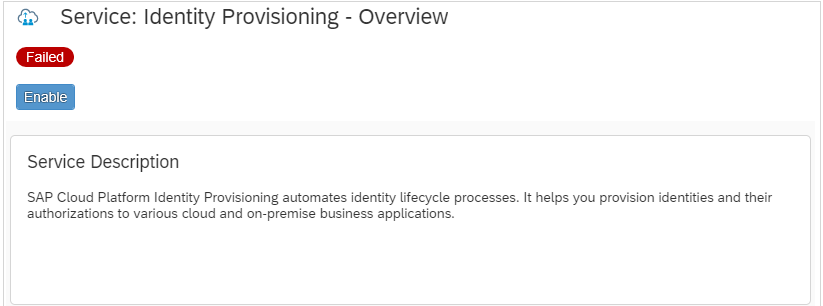
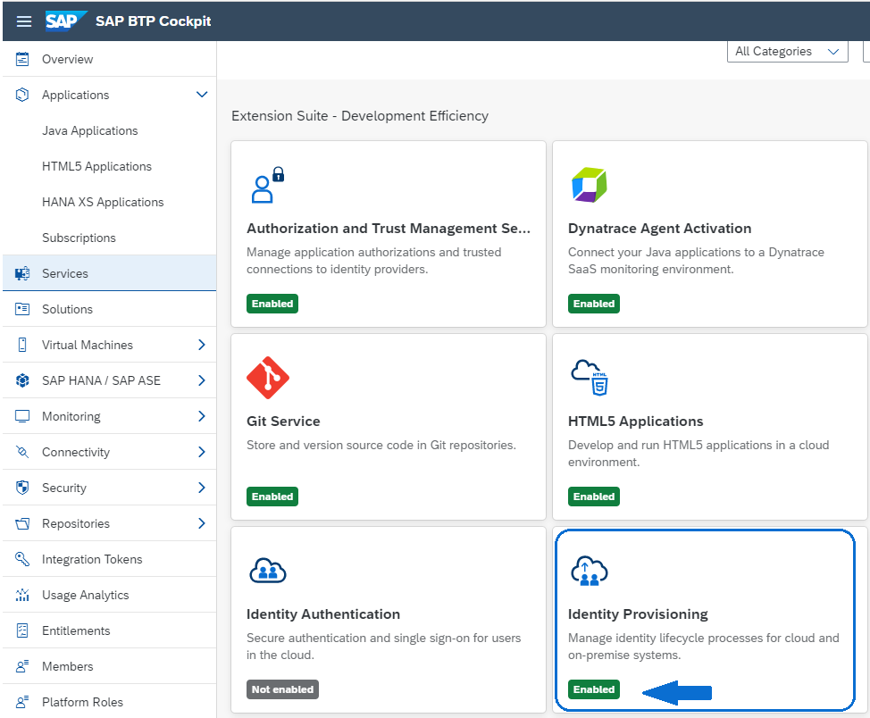
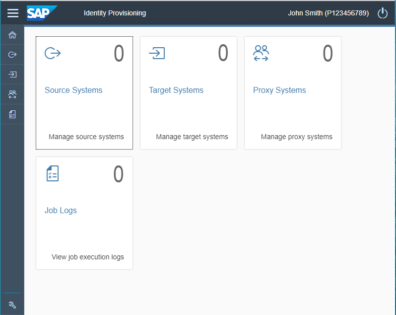

<!-- loio90ce2d5d3dbc42978b0ce28452496660 -->

# Administration Issues

<a name="loio90ce2d5d3dbc42978b0ce28452496660__section_gpd_jgj_kbc"/>

## Can't Enable a Disabled System

**Problem:**

-   A previously enabled system \(source, target or proxy\) is now disabled.

-   You choose the  icon to edit the system status.

-   The *Enable* button is inactive \(grayed out\).

Find the root cause for your problem in the cases below:

### A Feature Was Explicitly but Only Temporarily Enabled

*Problem:* 

\(Bundle, Standalone\) A particular system is disabled because it uses a feature that was only temporarily enabled.

*Solution:* 

If you still need this feature, you can request it again by contacting the Support team. Create an incident for component *BC-IAM-IPS*. In the incident, specify also:

-   The IDs of your global account and subaccount, or your bundle tenant.

-   To which region your account/tenant belongs. You can find it in this list:[\(Discovery Center\) Identity Provisioning](https://discovery-center.cloud.sap/index.html#/serviceCatalog/identity-provisioning) -\> *Service Plan*

### One of Your Bundles Has Expired

*Problem:* 

\(Bundle\) You use the Identity Provisioning service as part of an SAP cloud solution. The systems belonging to the relevant bundle are disabled, indicating that the license for the relevant product has expired.

*Solution:* 

To enable your inactive systems and continue using them, extend your bundle license.

### Beta Features Are Disabled

*Problem:* 

\(Standalone\) A particular system is disabled because it's available only when Beta features are enabled.

*Solution:* 

Beta features might be disabled for your subaccount. To verify this, follow the steps below:

1.  In the SAP BTP cockpit, navigate to your global account.

2.  On your subaccount tile and choose *Edit*.
3.  For *Beta Features*, select the *Enable* checkbox.
4.  Refresh your *Identity Provisioning* admin consoleadministration console for SAP Cloud Identity Services to see if the disabled system is now available.

**System Is Still Disabled**

Your problem requires deeper analysis by SAP. Please create an incident for component **BC-IAM-IPS**.

In the incident, specify also:

-   The IDs of your global account and subaccount, or your bundle tenant.

-   To which region your account/tenant belongs. You can find it in this list:[\(Discovery Center\) Identity Provisioning-\> Service Plan](https://discovery-center.cloud.sap/#/serviceCatalog/identity-provisioning).

Before you open an incident, read:

[2654164](https://launchpad.support.sap.com/#/notes/2654164) - What to consider before opening a Support Ticket for SAP Cloud Platform

For contract-related questions, read:

[1660069](https://launchpad.support.sap.com/#/notes/1660069) - How to contact SAP Contracts Department for questions or issues

<a name="loio90ce2d5d3dbc42978b0ce28452496660__section_gqc_l2t_lbc"/>

## Can't Create Another System

### Problem:

1.  You have added a certain number of source or target systems in the *Identity Provisioning* admin consoleadministration console for SAP Cloud Identity Services.

2.  You choose *Add* to create a new one.

3.  A warning message appears, saying that you have reached the maximum number of source or target systems allowed for your subaccount.

### Reason

By default, you are allowed to create up to **20** source and **50** target systems for your subaccount.

### Solution:

1.  Check if there is a system that is no longer relevant to your business scenario.

2.  If you think you might still need it in future, export it first as a JSON or a CSV file.

3.  Delete that system from the UI.

4.  Add a new source/target system.

If your business case requires more productive source systems, create an incident for component **BC-IAM-IPS** to request the number of additional systems. In the incident, specify also:

-   The IDs of your global account and subaccount, or your bundle tenant.

-   To which region your account/tenant belongs. You can find it in this list:[\(Discovery Center\) Identity Provisioning](https://discovery-center.cloud.sap/#/serviceCatalog/identity-provisioning) -\> *Service Plan*.

<a name="loio90ce2d5d3dbc42978b0ce28452496660__section_fbr_nft_lbc"/>

## Can't Get or Grant Admin Permissions for a Bundle

You use the Identity Provisioning service as integrated in an SAP cloud product. To learn more, see: [Obtain a Bundle Tenant](https://help.sap.com/viewer/f48e822d6d484fa5ade7dda78b64d9f5/Cloud/en-US/4bba2666cd8244de99bce69054c5e6a5.html "When an SAP cloud solution bundles with SAP Cloud Identity Services, you are entitled to receive Identity Authentication and Identity Provisioning tenants without additional costs on the purchase of the corresponding SAP cloud solution's license. These Identity Authentication and Identity Provisioning tenants come preconfigured with the SAP cloud solution.") :arrow_upper_right:[Get Your Tenant](../get-your-tenant-460766b.md)

You don't know who is the administrator of your bundle tenant, or how to grant other users *Administrator* permissions.

Depending on your case, you can find more information below:

### You Don't Know Who Is Administrator

*Problem:* 

You need admin rights for your Identity Provisioning bundle tenant. You have to ask the initial \(or a secondary\) administrator for your bundle tenant but you don't know who they are.

*Solution:*

You can view all your SAP Cloud Identity Services tenants by using the *SAP Cloud Identity Services - Tenants* application. You can access it at the following URL[: https://iamtenants.accounts.cloud.sap/Information](http://help.sap.com/disclaimer?site=https://iamtenants.accounts.cloud.sap/). This tool displays the tenant administrators, the type of your tenant \(test or productive\), the date it was created, and the region where it is available.

If you still struggle and can't find any administrator yourself, create an incident for component **BC-IAM-IPS** and request the contacts of the initial tenant administrator.

### You Are Administrator

*Problem:* 

You are either the initial administrator of your Identity Provisioning bundle tenant, or another admin user has granted you such permissions. Now, other users ask you to grant them admin permissions too, but you don't know how to do it, or what tool to use.

*Solution:*

Open the *Identity Provisioning* admin consoleadministration console for SAP Cloud Identity Services and choose the *Authorizations* tile. It allows you to grant admin rights to as many additional users as you want.

To learn how, see: [Manage Authorizations](https://help.sap.com/viewer/f48e822d6d484fa5ade7dda78b64d9f5/Cloud/en-US/544de9b504214372b4479dc1f6b08cca.html "Manage the authorizations of Identity Provisioning administrators, when your bundle or standalone tenant is running on SAP BTP, Neo environment.") :arrow_upper_right:[Manage Administrators](../manage-administrators-3bddea4.md).

<a name="loio90ce2d5d3dbc42978b0ce28452496660__section_fl4_jkc_wbc"/>

## \(Standalone\) Enabling the Identity Provisioning Service Fails

*Problem:* 

1.  You have a global account in the SAP BTP cockpit.

2.  In one of your subaccounts, you open the *Identity Provisioning* tile.

3.  You choose *Enable* but the operation fails.

4.  Even if you try several times, you cannot enable the service.

### Reason and Solution

There might be different reasons for failed enabling. The most common ones are:

<table>
<tr>
<th valign="top">

Reason

</th>
<th valign="top">

Solution

</th>
</tr>
<tr>
<td valign="top">

The Identity Provisioning service is currently down.

</td>
<td valign="top">

Create an incident for component *BC-IAM-IPS* and we'll investigate the issue.

</td>
</tr>
<tr>
<td valign="top">

In your global account, you have enabled the Identity Provisioning for two subaccounts, and you're trying to enable it for a third one.

You are not allowed to do this because, by default, you can enable the service only for *two* subaccounts per global account.

</td>
<td valign="top">

If you have already enabled the service for two subaccounts, and want to raise the quota for your global account to three or more subaccounts, create an incident for component *BC-IAM-IPS*. Request the number of additional subaccounts.

</td>
</tr>
</table>

In the created incident, specify also:

-   The IDs of your global account and subaccount.

-   To which region your account belongs. You can find it in this list:[\(Discovery Center\) Identity Provisioning](https://discovery-center.cloud.sap/#/serviceCatalog/identity-provisioning)-\> *Service Plan*

## Identity Provisioning Tile Is Missing In the SAP BTP Cockpit

Your access to the *Identity Provisioning* tile in SAP BTP cockpit depends mostly on the type of product you have purchased. You have one of the following:

-   *Identity Provisioning service integrated \(bundled\) in an SAP cloud product*

    *Problem:*

    1.  You already have a production global account and use at least one subaccount for non-identity provisioning purposes \(that is, other services and cloud tasks\).

    2.  After purchasing an SAP cloud product \([see the list of available bundle options](https://help.sap.com/viewer/f48e822d6d484fa5ade7dda78b64d9f5/Cloud/en-US/4bba2666cd8244de99bce69054c5e6a5.html)\), you request and receive access to the Identity Provisioning service. You can open the *Identity Provisioning* admin consoleadministration console for SAP Cloud Identity Services by using two URLs related to two subaccounts \(one for testing purposes and one for productive use\). These subaccounts are new, and not to be confused with any you already have.

    3.  You try to access the *Identity Provisioning* tile via the SAP BTP cockpit, using your "previous" subaccount:

        -   In the cockpit, you choose the previous subaccount.

        -   From the left-side navigation, you choose *Services*.

        -   You don't see a *Provisioning Service* tile.

    *Reason & Solution:*

    Even though you have obtained the Identity Provisioning service as part of a bundle product, it's not bound to your previous subaccount. The service is bound only to the subaccounts you’ve received from SAP, which have been specifically created for your Identity Provisioning scenarios.

    Also, you won't be able to select the *Provisioning Service* tile from either of these two subaccounts. That's because you're not intended to control the service from the cockpit.

-   *Identity Provisioning service as a standalone product*

    Make sure you use the correct \(sub\)account that is bound to your Identity Provisioning license. Then:

    1.  Log on to the SAP BTP cockpit:[https://<region\>.hana.ondemand.com](https://account.hanatrial.ondemand.com/).

    2.  Go to your global account and choose your subaccount.

    3.  From the navigation area, choose Your problem requires deeper analysis by SAP. Please create an incident for component *Services*.

    4.  Browse through this page and find the *Extension Suite – Development Efficiency* section.

    5.  You should see an*Identity Provisioning* tile.

    6.  The default status of the service is *Not enabled*. Choose *Enable*.

    Your *Services* screen should look like this:

    

### Still Cannot See the Identity Provisioning Tile

If your problem requires deeper analysis by SAP, please create an incident for component *BC-IAM-IPS*.

In the incident, specify also:

-   The IDs of your global account and subaccount, or your bundle tenant.

-   To which region your account/tenant belongs. You can find it in this list:[\(Discovery Center\) Identity Provisioning](https://discovery-center.cloud.sap/#/serviceCatalog/identity-provisioning)-\> *Service Plan*.

Before you open an incident, read:

-   [2654164](https://launchpad.support.sap.com/#/notes/2654164) - What to consider before opening a Support Ticket for SAP BTP

For contract-related questions, read:

-   [1660069](https://launchpad.support.sap.com/#/notes/1660069) - How to contact SAP Contracts Department for questions or issues

<a name="loio90ce2d5d3dbc42978b0ce28452496660__section_xv5_lpz_lbc"/>

## Proxy Systems Tab is Missing

### Problem

1.  You access the *Identity Provisioning* admin consoleadministration console for SAP Cloud Identity Services.

2.  In the user interface, you see *Source Systems* and *Target Systems* tiles.

3.  You also expect to see *Proxy Systems* but such a tile is missing.

### Solution

The *Proxy Systems* tile is not displayed by default in the user interface. If you need to perform hybrid scenarios, create an incident to component *BC-IAM-IPS* to request this tile.

In the incident, specify also:

-   The IDs of your global account and subaccount, or your bundle tenant.

-   To which region your account/tenant belongs. You can find it in this list:[\(Discovery Center\) Identity Provisioning](https://discovery-center.cloud.sap/#/serviceCatalog/identity-provisioning?service_plan=sap-cloud-to-sap-cloud&region=all&tab=service_plan).

Once the feature has been activated, the Home page of your Identity Provisioning admin console should look similar to this one:

**Related Information**  

[Job and Transformation Issues](job-and-transformation-issues-dbe3c08.md "")

[Error Messages](error-messages-ad525a4.md "")

[Entity Deletion Issues](entity-deletion-issues-d6acc19.md "Learn how to troubleshoot the most frequent reasons for deletion of users or groups from a target system by the Identity Provisioning.")

[Additional Information](additional-information-7463572.md "")

[Handling Specific Attributes](handling-specific-attributes-e957782.md "")

