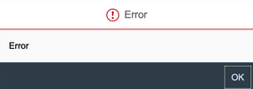

<!-- loio7bde0d5a298b44f7923dece9f0d93278 -->

# Emails

Problems with emails sent for the different application processes.

Check the following entries for issues with emails sent for the different application processes:

<a name="loio7bde0d5a298b44f7923dece9f0d93278__section_bkq_2ls_32c"/>

## E-Mail Activation

In your mail box you have received an email from **notification@sapnetworkmail.com**.

-   If you have already activated your account - You see the following error "E-Mail Already Activated" after you’ve clicked the activation email link." E-Mail Already Activated. This message means that the Cloud Identity Services has already been activated. Use the "Forgot Password" option to gain access to your tenant.
-   If you haven't activated your account or didn't receive an email - Open your mail box and search for an e-mail from **notification@sapnetworkmail.com**.The email contains a link to activate your account. The following is possible:
    -   The link has expired - The system sends you a new activation e-mail. Follow the procedure to activate your account.
    -   The link is invalid or already used or you haven't received an e-mail:
        -   Check your spam folder
        -   Contact an existing tenant administrator for the tenant to ask the following.

            -   Whether an activation e-mail was sent \(or if only an initial password was set, since this case no e-mail is sent\).
            -   To resend the activation e-mail.

            > ### Note:  
            > [Who is my tenant administrator?](https://help.sap.com/docs/cloud-identity-services/cloud-identity-services/accessing-administration-console-61879409f6024c5cad78d5e36ce3657c?state=DRAFT&version=Dev#i-don't-know-who-the-tenant-administrator-is-)

See also: **KBA 2517844** - [How to get the activation e-mail of an Identity Authentication tenant](https://launchpad.support.sap.com/#/notes/2517844)

<a name="loio7bde0d5a298b44f7923dece9f0d93278__section_h25_bps_32c"/>

## Check if emails are sent

**Symptom:**

End-users state that they don't receive emails from Identity Authentication for various application processes such as account activation, password reset, etc.

**Solution:** 

There is a need to troubleshoot if the e-mails are actually sent from IAS to determine if the issue is with IAS or the e-mail server.

See **KBA 2978346** - [How to check if e-mails are sent and the sender from Identity Authentication Service](https://launchpad.support.sap.com/#/notes/2978346).

<a name="loio7bde0d5a298b44f7923dece9f0d93278__section_uwv_hps_32c"/>

## Error: "Internal error; contact system administrator" in Identity Authentication

**Symptom:**

An e-mail template in the Default template of an application is uploaded. During the attempt to manually send it, the following pop-up warning is shown:

"Internal error; contact system administrator"

In the browser logs, the below error is visible:

"500 Internal Server Error"

**Solution:**

See **KBA 2573314** - [E-mail template error: Internal error; contact system administrator in Identity Authentication \(IAS\)](https://launchpad.support.sap.com/#/notes/2573314) 

<a name="loio7bde0d5a298b44f7923dece9f0d93278__section_e2c_mrs_32c"/>

## E-mails are in English language, which is not desired one

**Symptom:**

"Activate Your Account" or "Password Reset" e-mail is in English, which is not the desired language.

**Solution:**

See **KBA****3023020** - ["Password Reset" e-mail is in English](https://launchpad.support.sap.com/#/notes/3023020)

<a name="loio7bde0d5a298b44f7923dece9f0d93278__section_fh3_srs_32c"/>

## User receives error: "Your e-mail activation link is invalid or already used"

**Symptom:**

Account activation of the Identity Authentication service is not possible. The following error is displayed:

"ERROR: Your e-mail activation link is invalid or already used."

**Solution:**

See **KBA****2637748** - [Identity Authentication - Your email activation link is invalid or already used](https://launchpad.support.sap.com/#/notes/2637748)

<a name="loio7bde0d5a298b44f7923dece9f0d93278__section_mqf_yrs_32c"/>

## Identity Authentication didn't send Forgot Password e-mail

Symptom:

After requesting a new password with the Forgot password functionality, the e-mail is not received.

The Troubleshooting log \(see **KBA 2942816** - [How to export and self-analyze Troubleshooting logs from Identity Authentication Service](https://launchpad.support.sap.com/#/notes/2942816)\) is showing the below error message:

"No Forgot password message sent to <e-mail address\>. Limit exceeded!"

**Solution:**

Solution KBA 2981630 - [No Forgot password message sent from Identity Authentication](https://launchpad.support.sap.com/#/notes/2981630)

<a name="loio7bde0d5a298b44f7923dece9f0d93278__section_zrf_m5s_32c"/>

## Emails sent still contain the SAP logo

**Symptom:**

After you have configured the e-mail templates in the administration console for Identity Authentication, the e-mails sent still contain the SAP logo.

**Solution:**

See **KBA****2854429** - [How to Set Custom Company Logo for IAS Template E-mails](https://launchpad.support.sap.com/#/notes/2854429)

<a name="loio7bde0d5a298b44f7923dece9f0d93278__section_z4l_55s_32c"/>

## Email template set in Identity Authentication tenant is not working

**Symptom:**

An e-mail template set within the Identity Authentication tenant has been configured but the templates are not applied when testing them.

**Solution:**

See **KBA****2675079** - [E-mail template set in Identity Authentication tenant not working](https://gad5158842f.us2.hana.ondemand.com/dtp/editor/services/launchpad.support.sap.com)

<a name="loio7bde0d5a298b44f7923dece9f0d93278__section_xnf_x5s_32c"/>

## Error when uploading custom e-mail template sets in Identity Authentication

**Symptom:**

The following error popup is received when uploading custom e-mail template sets in the administration console for Identity Authentication:

**Solution**:

See **KBA****2716042** - [Error when uploading custom E-Mail Template Sets in Identity Authentication](https://launchpad.support.sap.com/#/notes/2716042)

<a name="loio7bde0d5a298b44f7923dece9f0d93278__section_rcz_pvs_32c"/>

## Changing the e-mail notification@sapnetworkmail.com in Identity Authentication

**Symptom:**

When a user requests to reset their password in an Identity Authentication tenant, they receive an e-mail from "notification@sapnetworkmail.com" \(as of Sep 29, 2021 - ias@notifications.sap.com\). There is a need to change this e-mail to another sender/server. Identity Authentication provides also the possibility to configure custom mail server for the application processes e-mails.

**Solution:**

See **KBA**- [Changing the e-mail ias@notifications.sap.com \(notification@sapnetworkmail.com\) in Identity Authentication](https://launchpad.support.sap.com/#/notes/2620650).

**Related Information**  

[Accessing the Administration Console](accessing-the-administration-console-6187940.md "Problems with the signing in to the administration console for SAP Cloud Identity Services.")

[User Import](user-import-6a46913.md "Problems with the user import in the administration console for SAP Cloud Identity Services.")

[Authentication](authentication-84f28fb.md "Problems with the authentication of the end user and administrator.")

[Application Integration](application-integration-8acf508.md "Problems that different applications integrated with Cloud Identity Services might face.")

[Request, Create and Delete Identity Authentication Tenant](request-create-and-delete-identity-authentication-tenant-b442658.md "Problems related to requesting, creating or deleting a tenant.")

[End user screens](end-user-screens-a3864b5.md "Problems that you might face when working with the end user screen.")

[APIs](apis-29ffc6b.md "Problems that you might face when using the REST APIs of Cloud Identity Services.")

[Corporate Identity Providers](corporate-identity-providers-16ab7db.md "")

[Corporate User Store](corporate-user-store-3ade241.md "")

[Kerberos Authentication](kerberos-authentication-4bb4b24.md "")

[Risk-Based Authentication](risk-based-authentication-bc7de4d.md "")

[Custom Domains](custom-domains-7cb2ea5.md "")

