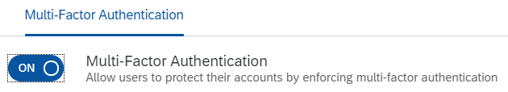

<!-- loiod9cbb6d2fdf44819bc57e16f337b501b -->

# Allow Users to Protect Accounts with Second Factor for Authentication

Tenant administrator can allow users to decide whether to protect their own accounts with second factor for authentication or not.

<a name="loiod9cbb6d2fdf44819bc57e16f337b501b__prereq_v3j_xzf_ppb"/>

## Prerequisites

You are assigned the *Manage Tenant Configuration* role. For more information about how to assign administrator roles, see [Edit Administrator Authorizations](edit-administrator-authorizations-86ee374.md).

## Context

If applications don't require second factor for authentication, or the applications have configured risk-based authentication rules requiring second factor, but the users don't fall into these rules that require second factor for authentication, the users can enhance their security by switching on the *Multi-Factor Authentication* option on the profile page.

This option is visible on the profile page, only if the administrator has allowed it via the administration console.

When the *Multi-Factor Authentication* option in the administration console is switched on, the users can choose to always provide second factor when authenticating.

If users chose the *Trust this browser* checkbox, the second factor is required only with the first logon. The validity of *Trust this browser* depends on the configuration in the administration console. It can be set between 1 and 14 days. If the additional option for trust this browser is set at *Disabled* the validity of *Trust this browser* is 3 months. But if the administrator sets a validity from 1 to 14 days, the 3-month validity is overridden with the validity set by the tenant administrator.

To enable or disable the*Multi-Factor Authentication* option in the administration console, follow the procedure below:

## Procedure

1.  Sign in to the administration console for SAP Cloud Identity Services.

2.  Under *Applications and Resources*, choose the *Tenant Settings* tile.

    At the top of the page you can view the administrative and license relevant information of the tenant.

3.  Choose the *Multi-Factor Authentication* list item.

4.  Enable or disable the *Multi-Factor Authentication* option.

    If the operation is successful, the system displays the message ***Multi-Factor authentication updated***.

<a name="loiod9cbb6d2fdf44819bc57e16f337b501b__result_mqz_lwh_h3b"/>

## Results

Users can choose from the *Multi-Factor Authentication* section on their profile page to protect their accounts with additional forms of authentication.

**Related Information**  

[Deactivate Two-Factor Authentication](deactivate-two-factor-authentication-15db825.md "You can deactivate the second factor (passcode or security key) if the user has activated it via the profile page.")

[Deactivate User Devices for TOTP Two-Factor Authentication](deactivate-user-devices-for-totp-two-factor-authentication-87324d5.md "This document shows you how to deactivate the mobile devices used by a user to generate passcodes for access to applications requiring time-based one-time (TOTP) as two-factor authentication. You deactivate the user mobile devices from the administration console for SAP Cloud Identity Services.")

[Unlock User TOTP Passcode](unlock-user-totp-passcode-cb6615d.md "You can unlock a user passcode when the user must log on to the application before the automatic unlock time of 60 minutes has passed.")

[Remove User Device for Web Two-Factor Authentication](remove-user-device-for-web-two-factor-authentication-9529d97.md "This document shows you how to remove the registered devices used by a user for access to applications requiring web two-factor authentication (FIDO2 standard).")

[Unlock User SMS Code](unlock-user-sms-code-6120cc2.md "You can unlock a user SMS code when the user must log on to the application before the automatic unlock time of 60 minutes has passed.")

[Allow Users To Skip Two-Factor Authentication Setup](allow-users-to-skip-two-factor-authentication-setup-dfb08b3.md "You can set the number of days for which the users can postpone the enabling of second factor for authentication.")

[Configure Risk-Based Authentication for an Application](configure-risk-based-authentication-for-an-application-bc52fbf.md#loiobc52fbf3d59447bbb6aa22f80d8b6056 "You can define rules for authentication according to different risk factors and apply actions like Allow, Deny, and Two-Factor Authentication.")

[Configure Default Risk-Based Authentication for All Applications in the Tenant](configure-default-risk-based-authentication-for-all-applications-in-the-tenant-1aab51a.md#loio1aab51ae62b94f79b4c6dac7a00857c2 "You can define rules for authentication according to different risk factors and apply actions like Allow, Deny, and Two-Factor Authentication for all applications in a tenant.")

