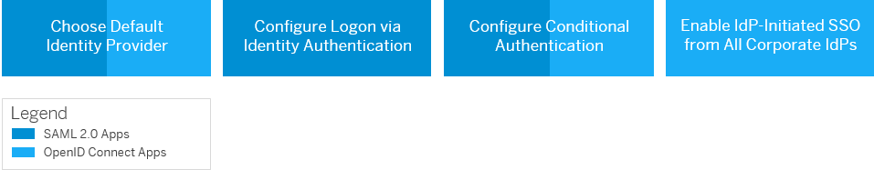

<!-- loiob3aae1278bfe4daba007f1c2ade6d5bf -->

# Authenticating Identity Provider for an Application

This document shows you how to choose an authenticating identity provider for an application.

## Context

You have the following options for an authenticating identity provider in the administration console for SAP Cloud Identity Services for both bundled and charged applications, and for system applications \(`Administration Console`, and `User Profile`\):

-   Local Identity Provider

    Identity Authentication is set as the default local identity provider for bundled, charged, and system applications.

    The local identity provider gives you access to all application settings in the administration console for SAP Cloud Identity Services.

    > ### Note:  
    > When Identity Authentication is set as the default authenticating provider, and the service provider \(SP\) is configured to send a `login_hint` parameter, the user identifier is prefilled on the login screen.
    > 
    > The `login_hint` is sent according to the configuration done on tenant level. For more information, see [Configure Login Hint Parameter](configure-login-hint-parameter-c6dd6a5.md).
    > 
    > The `login_hint` parameter helps the user when he or she is known to the service provider \(SP\). Thus it prevents the user from re-typing the user identifier on the logon or conditional screen.

-   Corporate Identity Provider

    Identity Authentication can act as a proxy to delegate authentication to the external corporate identity provider for both bundled and charged applications, and for system applications.

    > ### Note:  
    > When Identity Authentication is set as proxy, and the service provider \(SP\) is configured to send a `login_hint` parameter, the `login_hint` coming from the SP will be sent to the corporate IdP in the authentication request.
    > 
    > The `login_hint` parameter helps the user when he or she is known to the service provider \(SP\). Thus it prevents the user from re-typing the user identifier on the logon or conditional screen.

    > ### Remember:  
    > If you want to use a corporate identity provider for a system application, the `name ID` attribute sent in the assertion by that corporate identity provider must match the *Email*, *Login Name* or *User ID* attribute of the user in the user store of Identity Authentication.
    > 
    > You should also configure the following options for that corporate provider in the administration console for SAP Cloud Identity Services:
    > 
    > 1.  Enable *Use Identity Authentication user store*.
    > 2.  \(Optional\) Enable *Apply Application Configurations*. This is needed if you want to apply the custom application configurations for authentication and access policies.
    > 
    > For more information about how to enable these options, see [Configure Identity Federation](configure-identity-federation-c029bbb.md)

Based on your scenario you can:

**Related Information**  

[Corporate Identity Providers](corporate-identity-providers-19f3eca.md "Initially, Identity Authentication is set as the default identity provider for the applications. This section describes the scenarios in which Identity Authentication acts as a proxy to delegate the authentication to a corporate identity provider.")

[Configure Trust with SAML 2.0 Corporate Identity Provider](configure-trust-with-saml-2-0-corporate-identity-provider-33832e5.md "This document is intended to help you configure trust with a SAML 2.0 corporate identity provider. In this scenario Identity Authentication acts as a proxy to delegate the authentication to the SAML 2.0 corporate identity provider.")

[Edit Administrator Authorizations](edit-administrator-authorizations-86ee374.md "As a tenant administrator, you can edit both your own authorizations and other administrators' authorizations in the administration console for SAP Cloud Identity Services. By editing the administrator authorizations you can also delete an administrator.")

