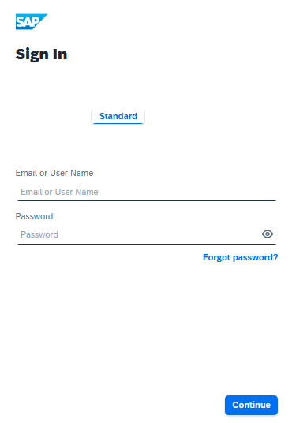
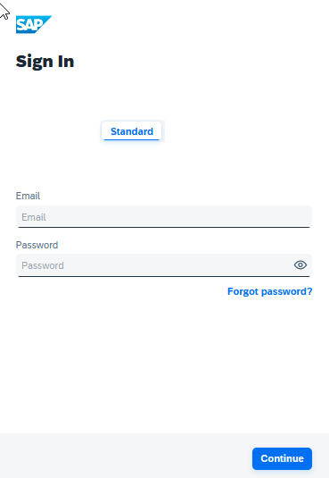

<!-- loioc24b1d03911a4ee08e17300e89b5da52 -->

# Change Tenant Texts Via Administration Console

The change tenant texts option can be used to change the predefined texts and messages for end-user screens available per tenant in Identity Authentication via the administration console.

<a name="loioc24b1d03911a4ee08e17300e89b5da52__prereq_c4b_hvf_ppb"/>

## Prerequisites

You are assigned the *Manage Tenant Configuration* role. For more information about how to assign administrator roles, see [Edit Administrator Authorizations](edit-administrator-authorizations-86ee374.md).

## Context

The predefined tenant texts are listed in the administration console for SAP Cloud Identity Services. The texts are classified by category, key, and default value. Each key stores the name of a parameter, and the corresponding value is the text that can be changed and updated as custom value. The keys are self-explanatory and indicate the category and where the texts are used. For example, the `logon.ui.label.user=Email or User Name` key value pair is for the type of information that the user must provide to sign in to the application. On the *Sign In* screen you see:

If you want to change the user identifier text, you have to update the key value pair `logon.ui.label.user=Email or User Name` to `logon.ui.label.user=Email` to receive:

You can browse for specific tenant texts and update only them.

You can also update the tenant texts that you want via a CSV file import for a specific language. The CSV file must contain the following colunms: *category*,*key*,*defaultValue*,*customValue*.

You can use again the default tenant texts by simply resetting the custom texts. The *Reset to Default* operation resets all customized tenant texts to the default values.

> ### Remember:  
> It takes 2 minutes for the configuration changes to take place.

To change the tenant texts via the administration console, proceed as follows:

## Procedure

1.  Sign in to the administration console for SAP Cloud Identity Services.

2.  Under *Applications and Resources*, choose the *Tenant Texts* tile.

3.  Choose the language from the drop-down list.

    The default setting is English \(United States\).

4.  Find the text that you want to change.

    You can use the search field, or the filtering and sorting option, or you can expand the page for more results.

5.  Add the new text in the *Custom Value* field next to the text that you want to change.

    > ### Note:  
    > Repeat the step for all the texts that you want to change.

6.  Save your changes.

    If the operation is successful, you receive the `Tenant Texts updated` message.

<a name="loioc24b1d03911a4ee08e17300e89b5da52__result_obp_vmj_znb"/>

## Results

The default tenant texts are changed with the custom ones. It may take up to 2 minutes for the changes to be applied.

**Related Information**  

[Tenant SAML 2.0 Configuration](tenant-saml-2-0-configuration-e81a19b.md "You as a tenant administrator can view and download the tenant SAML 2.0 metadata. You can also change the name format and update your certificate used by the identity provider to digitally sign the messages for the applications.")

[Tenant OpenID Connect Configurations](tenant-openid-connect-configurations-3d6abcc.md "You as a tenant administrator can view and configure the tenant OpenID Connect configurations.")

[Configure Master Data Texts Via Administration Console](configure-master-data-texts-via-administration-console-c068ac9.md "The master data texts option can be used to configure the predefined master data for each resource in Identity Authentication via the administration console.")

[Configure Links Section on Sign-In Screen](configure-links-section-on-sign-in-screen-060c032.md "You can configure links to appear on the sign-in screen of your applications.")

[Add Instructions Section on Sign-In Screen](add-instructions-section-on-sign-in-screen-c9e717e.md "You can customize the sign-in screen of the Horizon theme with instructions for the user.")

[Configure X.509 Client Certificates for User Authentication](configure-x-509-client-certificates-for-user-authentication-52c7dcb.md "Tenant administrators can configure X.509 client certificates for user authentication as an alternative to authenticating with a user name and a password.")

[Configure Tenant Images](configure-tenant-images-8742046.md "You can configure a custom global logo and, or a background image on the forms for sign-in in, registration, upgrade, password update, and account activation for all applications in a tenant. You can also set a favicon for tenant.")

[Configure Allowed Logon Identifiers](configure-allowed-logon-identifiers-3adf1ff.md "Tenant administrators can choose the allowed logon identifiers for the users.")

[Configure User Identifier Attributes](configure-user-identifier-attributes-8b9fa88.md "Tenant administrators can configure user identifier attributes as required and unique for the tenant.")

[Configure Trust this browser Option](configure-trust-this-browser-option-5b8377e.md "Tenant administrator can set the number of days for which the users won't get prompted for second-factor authentication, if they sign in from the same browser.")

[Enable Back-Up Channels to Send Passcode for Deactivation of TOTP Two-Factor Authentication Devices](enable-back-up-channels-to-send-passcode-for-deactivation-of-totp-two-factor-authenticati-782935e.md "Tenant administrator can configure back-up channels to send TOTP deactivation passcodes to the user.")

[Enable Users to Recover Password with Security Questions](enable-users-to-recover-password-with-security-questions-d9ae898.md "Users can choose to answer security questions to reset their password.")

[Enable Users to Recover Password with PIN Code](enable-users-to-recover-password-with-pin-code-046a235.md "Users can choose to provide PIN code to reset their password.")

[Configure Initial Password and Email Link Validity](configure-initial-password-and-email-link-validity-f8093f4.md "As a tenant administrator, you can configure the validity of the initial password and link sent to a user in the various application processes.")

[Configure Session Timeout](configure-session-timeout-5ca23e4.md "As a tenant administrator, you can configure when the session, created at the Identity Authentication tenant, expires.")

[Configure Trusted Domains](configure-trusted-domains-08fa1fe.md "Service providers that delegate authentication to Identity Authentication can protect their applications when using embedded frames, also called overlays, or when allowing user self-registration.")

[Use Custom Domain in Identity Authentication](use-custom-domain-in-identity-authentication-c4db840.md "Identity Authentication allows you to use a custom domain that is different from the default one (<tenant ID>.accounts.ondemand.com) - for example www.mytenant.com.")

[Change a Tenant's Display Name](change-a-tenant-s-display-name-a513c91.md "You can configure the tenant's name from the administration console for SAP Cloud Identity Services.")

[Configure Default Risk-Based Authentication for All Applications in the Tenant](configure-default-risk-based-authentication-for-all-applications-in-the-tenant-1aab51a.md#loio1aab51ae62b94f79b4c6dac7a00857c2 "You can define rules for authentication according to different risk factors and apply actions like Allow, Deny, and Two-Factor Authentication for all applications in a tenant.")

[Configure Sinch Service in Administration Console](configure-sinch-service-in-administration-console-3fdc9e1.md "Configure Sinch Service to enable Phone Verification via SMS or SMS Two-Factor Authentication in the administration console.")

[Configure RADIUS Server Settings \(Beta\)](configure-radius-server-settings-beta-03043ae.md "Configure Remote Authentication Dial-In User Service (RADIUS) server settings in the administration console for SAP Cloud Identity Services.")

[Configure Mail Server for Application Processes](configure-mail-server-for-application-processes-ccc7ba1.md "Configure mail server for the emails sent to the end users in the different application processes.")

[Configure IdP-Initiated SSO](configure-idp-initiated-sso-5d59caa.md)

[Send Security Alert Emails](send-security-alert-emails-c977464.md "Send security alert emails to end-users or administrators when changes in their accounts are made.")

[Send System Notifications via Emails](send-system-notifications-via-emails-aa04a8b.md "You can configure the administration console to send emails with information about expiring certificates, system notifications and new administrators to specific email addresses or to the emails of all administrators.")

[Configure Default Language for End User Screens](configure-default-language-for-end-user-screens-2cb73c3.md "Select the language that the end user screen uses if the language of the browser isn’t in the list of supported languages.")

[Configure P-User Next Index](configure-p-user-next-index-045bb1c.md "Set the value for the P-user next index.")

[Reuse SAP Cloud Identity Services Tenants for Different Customer IDs](reuse-sap-cloud-identity-services-tenants-for-different-customer-ids-ebd0258.md "You as a tenant administrator can reuse an existing tenant for configurations and automated subscriptions.")

