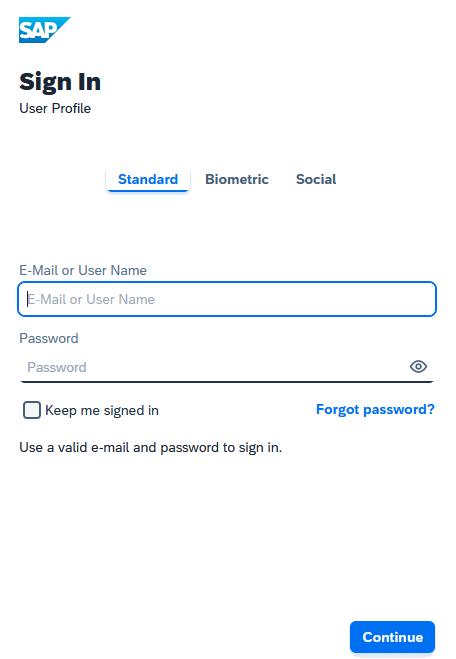
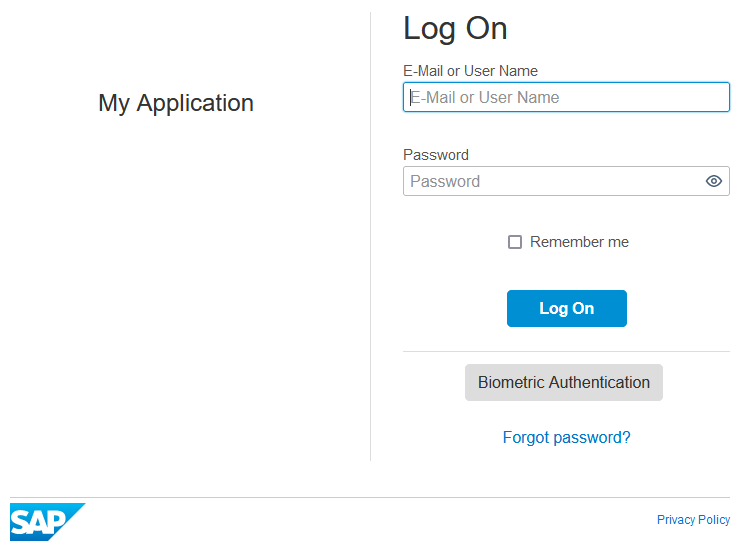

<!-- loio32f8d337f0894d269f5f89956803efac -->

# Choose and Configure a Branding Style for an Application

For the configuration of the branding style, you can choose a style for the end-user screens, such as sign-in, registration, upgrade. You can also customize the buttons on these screens.

## Context

You can use one of the following themes and customize them:

-   *Horizon*:
    -   Standard - This predefined theme is an evolution of the SAP Fiori design system. It uses the Horizon theme for the end-user screens. To learn more about the theme, see [SAP’s UI Technologies supporting the new Horizon visual theme of SAP Fiori](https://blogs.sap.com/2021/11/17/saps-ui-technologies-supporting-the-new-Horizon-visual-theme-of-SAP-Fiori/).

        You can customize the *Horizon* theme with instructions that appear on the sign in screen.

        > ### Example:  
        > 

        > ### Note:  
        > This is the default setting for all new tenants, and for all new applications \(service providers\) created after Oct 26, 2022 via the administration console, SCIM REST API, or by the Identity Authentication operators.

    -   Custom Advanced - You can do advanced customization of the end-user screens, by uploading a CSS file and assign that file to an application. The CSS file overrides the default CSS file of the Horizon theme.

-   *Quartz*
    -   Standard - This predefined theme includes white and brand blue coloring based on SAP Fiori’s color palette.

        > ### Note:  
        > This is the default setting for all tenants and applications created before Oct 26, 2022.

        > ### Example:  
        > 

    -   Custom Basic

        The custom basic theme allows you to configure a custom branding style for the buttons and information messages. It uses the Quartz theme for all other elements on the screens and error pages. For this configuration, you can customize:

        -   the top and bottom background color of the button
        -   the background color of the information message in the forms
        -   the button's and information message's border line color
        -   and the color of the button's text

    -   Custom Advanced

        You can do advanced customization of the end-user screens, by uploading a CSS file and assign that file to an application. The CSS file overrides the default CSS file for the Quartz theme.

<a name="loio32f8d337f0894d269f5f89956803efac__steps_hdd_ggr_kdc"/>

## Procedure

1.  Sign in to the administration console for SAP Cloud Identity Services.

2.  Under *Applications and Resources*, choose the *Applications* tile.

3.  Choose the application that you want to edit.

    > ### Note:  
    > Type the name of the application in the search field to filter the list items, or choose the application from the list on the left.
    > 
    > If you don’t have a created application in your list, you can create one. For more information, see [Create a New Application](create-a-new-application-0d4b255.md).

4.  Choose the *Branding and Layout* tab.

5.  Under *Branding*, choose the *Branding Style* list item.

6.  Choose your preferred theme and select one of the available options for it:

    <table>
    <tr>
    <th valign="top">

    Theme
    
    </th>
    <th valign="top">

    Customization
    
    </th>
    </tr>
    <tr>
    <td valign="top">
    
    **Horizon Theme**
    
    </td>
    <td valign="top">
    
    -   *Standard*

        For more information about how to customize the theme with instructions that appear on the sign-in screen, see [Add Instructions Section on Sign-In Screen](add-instructions-section-on-sign-in-screen-c9e717e.md).

    -   *Custom Advanced*. For more information, see [Use a Custom CSS](use-a-custom-css-faa2a33.md#loiofaa2a33ff973409dafe136e4f748abda).

    
    </td>
    </tr>
    <tr>
    <td valign="top">
    
    **Quartz Theme**
    
    </td>
    <td valign="top">
    
    -   *Standard*
    -   *Custom Basic* - For more information, see [Use a Custom Basic Quartz Theme](use-a-custom-basic-quartz-theme-342ae24.md).
    -   *Custom Advanced*. For more information, see [Use a Custom CSS](use-a-custom-css-faa2a33.md#loiofaa2a33ff973409dafe136e4f748abda).

    
    </td>
    </tr>
    <tr>
    <td valign="top">
    
    ** **
    
    </td>
    <td valign="top">
    
     
    
    </td>
    </tr>
    </table>
    
7.  Save your configuration.

    > ### Tip:  
    > Skip this step if you already saved your configuration in **Step 6**.

    Once the application has been changed, the system displays the message ***Theme changed to <name of theme\>***.

