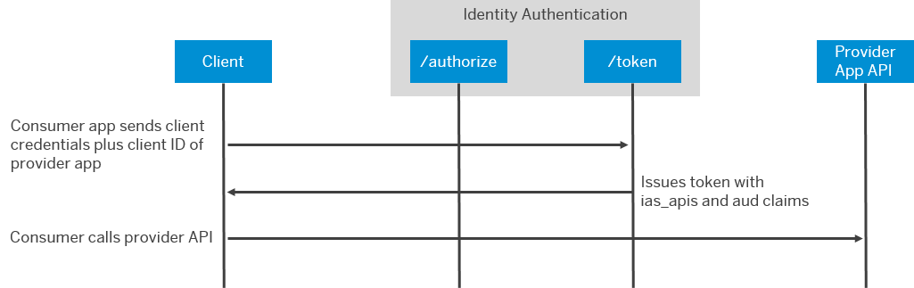

<!-- loio9ad7e8052d054e83adf10aff1bdae1bf -->

# Communicate Between Applications

Applications sometimes need to propagate principals or have technical communication arrangements between OpenID Connect \(OIDC\) applications. To enable one application to consume the APIs of another application, configure an application to include the audience of the other application in tokens issued by Identity Authentication.


<a name="loio9ad7e8052d054e83adf10aff1bdae1bf__prereq_ygs_hc3_pwb"/>

## Prerequisites

-   The provider and consumer applications are configured as OIDC applications.

    > ### Note:  
    > Type the name of the application in the search field to filter the list items, or choose the application from the list on the left.
    > 
    > If you don’t have a created application in your list, you can create one. For more information, see [Create a New Application](create-a-new-application-0d4b255.md).

-   You know the name of the API needed by the consumer application.

    The applications must define this name automatically during deployment, in the documentation of the applications, or from the developers directly for custom developments.


## Context

In this scenario, you've one application that provides an API and another application that consumes the API. At runtime, the consuming application gets a token according to the appropriate flow. The service returns a token, which includes the audience \(`aud`\) claim of the provider application and a string used by the consumer application for access control under the `ias_api` claim. The consumer application uses this token with to call the API endpoint of the provider application. The following figure illustrates this scenario for a technical communication between systems.

   
  
**Technical Communication Sequence Between Applications**

  

The administrator must ensure that the two applications can share the APIs between each other, if the applications weren't deployed with this configuration.


## Procedure

1.  In the administration console for SAP Cloud Identity Services, choose *Applications and Resources* \> *Applications*

2.  Choose the provider application.

3.  Choose the *Trust* tab.

4.  Under *Application APIs*, choose *Provided APIs*.

5.  Check that the API is listed or enter the required data.

    For more information, see [Reference Information for the Identity Service of SAP BTP](../Integrating-the-Service/reference-information-for-the-identity-service-of-sap-btp-9379444.md).

    > ### Caution:  
    > The API name must match exactly what is expected by any consumer applications. These applications use this name to determine if their application has the rights to access the provider application.
    > 
    > The name can be any unique string of 32 characters. You can define a maximum of 20 APIs.

    The provider application can also specify the APIs with the Identity service of SAP BTP.

    For more information, see [Reference Information for the Identity Service of SAP BTP](../Integrating-the-Service/reference-information-for-the-identity-service-of-sap-btp-9379444.md).

6.  Choose the consumer application.

7.  Choose the *Trust* tab.

8.  Under *Application APIs*, choose *Dependencies*.

9.  Enter the required data.

    Choose the provider application and the API the consumer application consumes.


<a name="loio9ad7e8052d054e83adf10aff1bdae1bf__result_g5m_ms3_pwb"/>

## Results

The consumer application can consume the specified API from the provider application,. The following is an example of a token with the relevant claims.

```
Header
--------
{
    "kid": "Aa1aAAaDyqK5xzowUHkvCAKw7nA",
    "alg": "RS256"
}
Payload
--------
{
    "ias_apis": [
        "myApi"
    ],   
    "sub": "P123456",
    "mail": "donna.moore@example.com",
    "iss": "https://mytenant.accounts.ondemand.com",
    "last_name": "Moore",
    "aud": "1ab2cd3e-c573-4ad5-9007-28aa4e587a19", 
    "scim_id": "1a2345bc-4f6b-456b-9bfb-5d58beb97fb7",
    "user_uuid": "1a2345bc-4f6b-456b-9bfb-5d58beb97fb7",
    "azp": "e7c7e327-86c0-48a6-af57-a1234b567869",
    "exp": 1676989626,
    "iat": 1676986026,
    "first_name": "Donna",
    "jti": "123a45b6-a99e-47e0-b03d-b8c1304e8b42"
}
Expires at: Tue Feb 21 2023 15:27:06 GMT+0100 (Central European Standard Time)
```


<a name="loio9ad7e8052d054e83adf10aff1bdae1bf__postreq_i2q_bsj_pwb"/>

## Next Steps

If the consumer application isn't already designed to check the `ias_api` claim, the developer of the consumer application must update their application.

