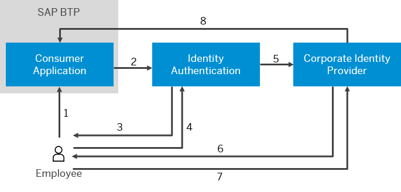
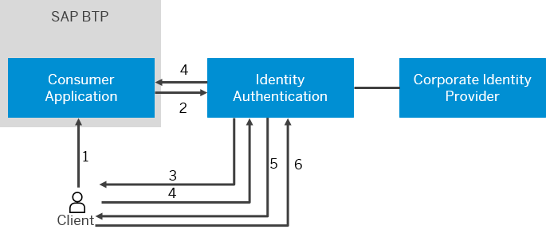

<!-- loio0143dce88a604533ab5ab17e639fec09 -->

# Configure Conditional Authentication for an Application

Tenant administrator can define rules for authenticating identity provider according to e-mail domain, user type, user group, and IP range \(specified in CIDR notation\).

<a name="loio0143dce88a604533ab5ab17e639fec09__prereq_ghc_x5v_vcb"/>

## Prerequisites

You are assigned the *Manage Applications* and *Manage Groups* roles. For more information about how to assign administrator roles, see [Edit Administrator Authorizations](edit-administrator-authorizations-86ee374.md).

<a name="loio0143dce88a604533ab5ab17e639fec09__context_tsh_3np_4cb"/>

## Context

Tenant administrator can control the access to an application by defining different rules for the authenticating identity provider. Based on these rules users are authenticated either via a corporate identity provider or via Identity Authentication.

**Rules**

The added rules are displayed sorted by priority.

If a rule contains only *IP Range*, and it is first in list or only one, Identity Authentication does not request the user to provide user identifier in the logon screen. The system evaluates whether that user meets all the criteria of the rule. The evaluation starts with the rule with the highest priority, until the criteria of a rule are met. If the criteria of a rule are met, the rest of the conditions are not evaluated

If apart from *IP Range* the rule contains other conditions, or it is not the first in the list, Identity Authentication requests the user to provide user identifier in the logon screen. When a user types the user identifier in the log on page, the system evaluates whether that user meets all the criteria of the rule. The evaluation starts with the rule with the highest priority, until the criteria of a rule are met. If the criteria of a rule are met, the rest of the conditions are not evaluated.

> ### Remember:  
> Rules can be defined only if the default identity provider is Identity Authentication.
> 
> If you have already defined rules, they won't be considered if you change the default identity provider from Identity Authentication to a corporate identity provider.

If the user is already existing in Identity Authentication, authentication requests via SPNEGO, existing session, remember me, and token will be processed by Identity Authentication in case of successful authentication no matter of the conditional authentication rules.

**Default Identity Provider**

If non-prompt based authentication \(SPNEGO, existing session, remember me, and token\) is successful, the user is authenticated without checking the rules via Identity Authentication. Otherwise, the user will be asked to provide identifier to evaluate the conditional authentication rules.

If none of the rules meets the criteria, Identity Authentication is chosen for authentication.

### Conditional Authentication Flow

The tenant administrator has configured Conditional Authentication in the administration console for Identity Authentication. In this setup, the employee should be authenticated via the corporate identity provider, while the customers via Identity Authentication.

 **Authentication via Corporate Identity Provider** 

1.  The user tries to access the application.
2.  The application redirects the request to Identity Authentication to check the rules.
3.  Identity Authentication requests the user to provide user identifier in the logon screen.

    > ### Remember:  
    > If the rule contains only *IP Range* Identity Authentication does not request the user to provide user identifier in the logon screen. This step is skipped for this scenario.
    > 
    > If apart from *IP Range* the rule contains other conditions, this step is executed.

4.  The user provides user identifier. Identity Authentication stores the user identifier in a persistent cookie in the browser. The persistent cookie expires in 36 months.

    > ### Remember:  
    > If the rule contains only *IP Range* Identity Authentication does not request the user to provide user identifier in the logon screen. This step is skipped for this scenario.
    > 
    > If apart from *IP Range* the rule contains other conditions, this step is executed.

5.  According to the rules, the user should be authenticated via the corporate identity provider. Identity Authentication sends the user identifier as `login_hint` parameter to the corporate identity provider in the authentication request, according to the *Login Hint Configuration* configuration in the administration console.

    > ### Note:  
    > The `login_hint` parameter facilitates the user when he or she is known to the service provider \(SP\). Thus it prevents the user from re-typing the user identifier on the logon or conditional screen.

    > ### Remember:  
    > The user identifier from step 3 is required at the first logon. After that, based on the persistent cookie, the user is redirected directly to the logon screen of the corporate identity provider.
    > 
    > If the user wants to log on with another identifier, he or she must delete the browser cookies.
    > 
    > When the persistent cookie expires, the user is again requested to provide user identifier in the logon screen.

6.  If the corporate identity provider supports the `login_hint` parameter, then it requests only the user password. If the corporate identity provider does not support the `login_hint` parameter, it requires both the user identifier and password.
7.  Depending on the support of the `login_hint`, user provides only password, or both user identifier and password.

    > ### Note:  
    > The user can change the prefilled value. The new value is sent to the corporate IdP. If there is an existing conditional authentication cookie, the user identifier stored in that cookie is prefilled on the conditional screen and the `login_hint` is not taken into account.

8.  The corporate identity provider grants access to the user.

**Result** 

The user logs on to the application.

 **Authentication via Identity Authentication** 

1.  The user tries to access the application.
2.  The application redirects the request to Identity Authentication to check the rules.
3.  Identity Authentication request the user to provide user identifier in the log on screen.

    > ### Remember:  
    > If the rule contains only *IP Range* Identity Authentication does not request the user to provide user identifier in the logon screen. This step is skipped for this scenario.
    > 
    > If apart from *IP Range* the rule contains other conditions, this step is executed.

4.  The user provides user identifier.

    > ### Remember:  
    > If the rule contains only *IP Range* Identity Authentication does not request the user to provide user identifier in the logon screen. This step is skipped for this scenario.
    > 
    > If apart from *IP Range* the rule contains other conditions, this step is executed.

5.  According to the rules, the user should be authenticated via Identity Authentication. The user is prompted to provide password. The user identifier is prefilled in the logon screen.
6.  User provides password.
7.  Identity Authentication grants access to the user.

**Result** 

The user logs on to the application

> ### Note:  
> Social sign-on and account linking is supported only when the user does not meet the configured rules for conditional authentication.

<a name="loio0143dce88a604533ab5ab17e639fec09__steps_yk5_2hs_25"/>

## Procedure

1.  Access the tenant's administration console for Identity Authentication by using the console's URL.

    > ### Note:  
    > The URL has the following pattern:
    > 
    > `https://<tenant ID>.accounts.ondemand.com/admin`
    > 
    > *Tenant ID* is an automatically generated ID by the system. The first administrator created for the tenant receives an activation e-mail with a URL in it. This URL contains the *tenant ID*. For more information about your tenants, see [Viewing Assigned Tenants and Administrators](../viewing-assigned-tenants-and-administrators-f56e6f2.md).
    > 
    > If you have a configured custom domain, the URL has the following pattern: `<your custom domain>/admin`.

2.  Under *Applications and Resources*, choose the *Applications* tile.

3.  Choose the application that you want to edit.

    > ### Note:  
    > Type the name of the application in the search field to filter the list items, or choose the application from the list on the left.
    > 
    > If you don’t have a created application in your list, you can create one. For more information, see [Create a New Application](create-a-new-application-0d4b255.md).

4.  Choose the *Trust* tab.

5.  Under *Conditional Authentication*, choose *Conditional Authenticating Identity Providers*.

6.  Configure the rules. To configure the rules, choose one of the following options:

    <table>
    <tr>
    <th valign="top">

    Option

    
    </th>
    <th valign="top">

    Description

    
    </th>
    </tr>
    <tr>
    <td valign="top">

    Add a new rule

    
    </td>
    <td valign="top">

    See [Add a New Authentication Rule](add-a-new-authentication-rule-ad7f993.md).

    
    </td>
    </tr>
    <tr>
    <td valign="top">

    Edit an existing rule

    
    </td>
    <td valign="top">

    Choose the  icon next to the rule you want to edit.

    
    </td>
    </tr>
    <tr>
    <td valign="top">

    Delete an existing rule

    
    </td>
    <td valign="top">

    Choose the delete icon next to the rule you want to delete.

    
    </td>
    </tr>
    <tr>
    <td valign="top">

    Reprioritize rules

    
    </td>
    <td valign="top">

    Use the arrows to reprioritize the rules.

    
    </td>
    </tr>
    </table>
    
7.  Choose the default identity provider.

    > ### Restriction:  
    > Rules can be defined only if the default identity provider is Identity Authentication.

8.  Save your changes.

    Once the application has been updated, the system displays the message ***Conditional Authentication updated***.

## Setting Conditional Authentication

Donna Moore is an administrator of Company A. She wants to configure Identity Authentication so that the employees who log on with their corporate e-mails to be authenticated via the company's corporate identity provider. The clients and partners of Company A should be authenticated via Identity Authentication. For this purpose, Donna creates the following authentication rule:

**Authentication Rule**

<table>
<tr>
<th valign="top">

Identity Provider

</th>
<th valign="top">

E-Mail Domain

</th>
<th valign="top">

User Type

</th>
<th valign="top">

User Groups

</th>
</tr>
<tr>
<td valign="top">

Company A Corporate IdP

</td>
<td valign="top">

companya.com

</td>
<td valign="top">

</td>
<td valign="top">

</td>
</tr>
</table>

**Default Identity Provider**: Identity Authentication

Michael Adams is an employee of Company A and as such he wants to create a leave request. He chooses the logon link on the application and is prompted to provide his e-mail. After that he chooses *Continue* and is redirected to the logon screen of Company A. There he has to provide his user identifier and password. After providing the correct credentials he logs on to the application.

Julie Armstrong is a customer of Company A. She accesses the company's application and chooses the logon link on the application and is prompted to provide her e-mail. After that she chooses *Continue* and is redirected to the log on screen of Identity Authentication where she is prompted to provide her password. Her e-mail is prefilled by the system. After providing the correct password she logs on to the application.

**Related Information**  

[Choose Default Identity Provider for an Application](choose-default-identity-provider-for-an-application-e9d8274.md "You choose between a local identity provider and a corporate identity provider to be the default identity provider for your application.")

[Configure Logon via Identity Authentication when a Corporate IdP is Chosen as Default](configure-logon-via-identity-authentication-when-a-corporate-idp-is-chosen-as-default-3a3bf9b.md "You can allow users to log on via Identity Authentication when a corporate identity provider (IdP) is chosen as default.")

[Enable IdP-Initiated SSO from All Corporate Identity Providers](enable-idp-initiated-sso-from-all-corporate-identity-providers-f7ec8d2.md "(For SAML 2.0 applications) Tenant administrators can enable IdP-initiated single sign-on (SSO) from all configured corporate identity providers (IdPs).")

[Configure Login Hint Parameter](configure-login-hint-parameter-c6dd6a5.md "Tenant administrator can configure the login hint parameter via the administration console for Identity Authentication.")

