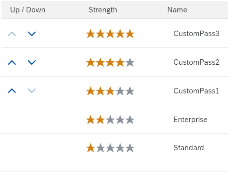

<!-- loio67bece21d0fb4e66b3341e9093c64f58 -->

# Configure Custom Password Policy

Tenant administrators can create and configure a custom password policy for scenarios where Identity Authentication is the authenticating authority.

## Context

Identity Authentication provides you with two predefined password policies, in addition to which you can create and configure up to three custom ones.

The custom password policy by default must be stronger than the enterprise policy, which in turn is stronger than the standard policy. It's the responsibility of the tenant administrator to configure the custom password policy stronger than the standard and enterprise ones. Each password policy has a strength assigned to it, which is visualized by stars in the administration console for SAP Cloud Identity Services. The strength specifies the priority of the password policy. It will define which policy will be enforced for password checks.

It is not possible to have password policies with one and the same strength. Once created and saved, the tenant administrator can reorder the custom password policies in the administration console, thus changing the strength assigned to the custom password policies.

> ### Remember:  
> To change the configuration of the custom password policies or to create a new password policy when you have already reached the limit of three custom password policy in the tenant, delete an existing custom policy first, then create the new one. For more information, see [Delete Custom Password Policy](delete-custom-password-policy-697fd2b.md).

> ### Example:  
> Donna Moore is an administrator of company A. She has set a *Standard* password policy for the *Leave Request* application.
> 
> Dona Moore wants a stronger password policy for the administration console, and she configured a custom password policy with a minimum password length of 15 characters, and maximum password lifetime of three months. The number of allowed logon attempts is 3. Dona has set a strength of three stars for this password policy.
> 
> Dona has set the new custom password policy for the administration console. At his first logon after the setting of the new password policy, Michael Adams, who is also an administrator at Company A, is required to update his password according to the new policy. Thus when he accesses the *Leave Request* application he uses the stronger password. John Miller who is an employee at company A, but not an admin, logs on to the *Leave Request* with a password that is compliant to the *Standard* password policy.

To create and configure a new custom password policy, follow the procedure:

## Procedure

1.  Sign in to the administration console for SAP Cloud Identity Services.

2.  Choose the *Password Policies* tile.

3.  Under *Password Policies*, choose the *\+ Create* button.

    > ### Restriction:  
    > You can create only one custom password policy. If you already have a custom password policy in your tenant, the *\+ Create* button is grayed out.

4.  Fill in the required information in the fields.

    <table>
    <tr>
    <th valign="top">

    Configuration Options
    
    </th>
    <th valign="top">

    Information
    
    </th>
    </tr>
    <tr>
    <td valign="top">
    
    *Policy Name*
    
    </td>
    <td valign="top">
    
    The name of the password policy that appears in the administration console.
    
    </td>
    </tr>
    <tr>
    <td valign="top">
    
    *Policy Strength*
    
    </td>
    <td valign="top">
    
    This strength specifies the priority of the password policy. It will define which policy will be enforced for password checks. It's the responsibility of the tenant administrator to configure the custom password policy stronger than the standard and enterprise ones.
    
    </td>
    </tr>
    <tr>
    <td valign="top">
    
    *Password Length*
    
    </td>
    <td valign="top">
    
    The length can be between 8 and 255 characters. The default value is 8 characters.
    
    </td>
    </tr>
    <tr>
    <td valign="top">
    
    *Password Lifetime*
    
    </td>
    <td valign="top">
    
    The minimum password lifetime can be between 1 hour and 48 hours. The default value is 24 hours. Possible values are 1 hour, 2 hours, …, 48 hours.

    The maximum password lifetime can be between 1 month and unlimited. The default value is 6 months. Possible values are: 1 month, 2 months, … 6 months; 1 year, 2 years, 3 years; unlimited.

    > ### Note:  
    > The *Password Lifetime* configuration for a user starts after the following is done:
    > 
    > 1.  Create a custom password policy with *Password Lifetime* lifetime configured.
    > 
    > 2.  Assign the password policy to an application.
    > 3.  Authenticate to the application so the policy is assigned.

    
    </td>
    </tr>
    <tr>
    <td valign="top">
    
    *User Inactivity*
    
    </td>
    <td valign="top">
    
    The maximum duration of user inactivity can be between 1 and 6 months. The default value is 6 months.

    > ### Note:  
    > If a user didn’t use the password during the set user inactivity period, the system will force either a password reset or change at the first logon. The reset or change depends on the setting for *Password Behavior*.

    
    </td>
    </tr>
    <tr>
    <td valign="top">
    
    *Password History*
    
    </td>
    <td valign="top">
    
    The minimum requirement is the last 5 passwords to be retained. The value can’t be more than 20.
    
    </td>
    </tr>
    <tr>
    <td valign="top">
    
    *Failed Sign In Attempts*
    
    </td>
    <td valign="top">
    
    The number of allowed failed sign in attempts can be between 1 and 6. The default value is 5.
    
    </td>
    </tr>
    <tr>
    <td valign="top">
    
    *Password Locked Period*
    
    </td>
    <td valign="top">
    
    The period can be between 1 hour and unlimited.

    > ### Tip:  
    > When *Unlimited* is selected, we recommend you to mark this password policy the strongest.

    
    </td>
    </tr>
    <tr>
    <td valign="top">
    
    *Required Character Groups*
    
    </td>
    <td valign="top">
    
    Specifies the number of required character groups for the password. The value can be between 1 and 4. Based on the value, the users are required to include 1, 2, 3 or 4 of the following in their passwords:

    -   Uppercase letters
    -   Lowercase letters
    -   Numbers
    -   Symbols

    
    </td>
    </tr>
    <tr>
    <td valign="top">
    
    *Password Behavior*
    
    </td>
    <td valign="top">
    
    -   *Reset password* - At logon, the user is forced to reset password, if the current password is not compliant with the new password policy. This is the default choice.
    -   *Change password* - At logon, the user is redirected to the change password page if the current password is not compliant with the new password policy.

    
    </td>
    </tr>
    </table>
    
5.  Choose *\+ Create* to save your changes.

    Once the password policy has been created and configured, the system displays the message ***Password policies configuration updated***.

    The new custom password policy appears in the list of the password policies that you can use for the applications.

## Next Steps

To use the custom password policy for your application or applications, you should set it as a password policy for that application or applications. For more information, see [Set a Password Policy for an Application](set-a-password-policy-for-an-application-04a6e45.md).

**Related Information**  

[Set a Password Policy for an Application](set-a-password-policy-for-an-application-04a6e45.md "As a tenant administrator, you can set a password policy that matches your application logon requirements.")

[Delete Custom Password Policy](delete-custom-password-policy-697fd2b.md "As a tenant administrator, you can delete the custom password policy that you have created.")

[Configure Password Exclude List](configure-password-exclude-list-159c09d.md "As a tenant administrator, you can create a password exclude list to restrict their usage.")

