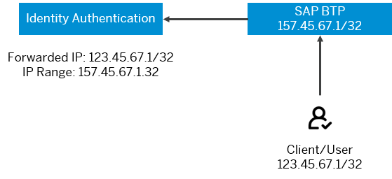

<!-- loio1aab51ae62b94f79b4c6dac7a00857c2 -->

# Configure Default Risk-Based Authentication for All Applications in the Tenant

You can define rules for authentication according to different risk factors and apply actions like *Allow*, *Deny*, and *Two-Factor Authentication* for all applications in a tenant.

<a name="loio1aab51ae62b94f79b4c6dac7a00857c2__prereq_lx3_qzw_hhb"/>

## Prerequisites

-   You are assigned the *Manage Tenant Configuration* role. For more information about how to assign administrator roles, see [Edit Administrator Authorizations](edit-administrator-authorizations-86ee374.md).

-   \(For *RADIUS Server Two-Factor Authentication*\) You have requested this feature. For more information how to request and configure RADIUS server in Identity Authentication, see [Configure RADIUS Server Settings \(Beta\)](configure-radius-server-settings-beta-03043ae.md).
-   \(For *SMS Two-Factor Authentication*\) You have an account in Sinch. You have configured Sinch Verification in the administration console for Identity Authentication. For more information, see [Configure Sinch Service in Administration Console](configure-sinch-service-in-administration-console-f4a04ed.md).

    > ### Note:  
    > Sinch Verification account is purchased separately. It is not part of the Identity Authentication contract.

-   \(For *Email OTP Code*\) An Email OTP Code template for the respective languages must exist in the tenant to apply the email OTP code method. If the template does not exist, the user will see the option but when choosing it, the following message will appear: "Sorry, but you are currently not authorized for access".

    For more information how to add email templates, see [Edit or Add an Email Template Set](edit-or-add-an-email-template-set-3c4f397.md).

<a name="loio1aab51ae62b94f79b4c6dac7a00857c2__context_czm_fws_ylb"/>

## Context

Be careful when you set rules for authentication for the tenant. The rules apply to all applications in the tenant, including the `Administration Console`, if those applications have default risk-based authentication \(no rules created; default action - Allow\). The changes apply immediately when saved, and you may not be able to log in the `Administration Console` again if you don't meet the rules.

On the other hand, if a specific application has risk-based authentication different from the default one \(no rules created; default action - Allow\), and you apply default risk-based authentication for the tenant, the rules for the tenant won't apply to that specific application.

For more information, how to apply risk-based authentication for a specific application, see [Configure Risk-Based Authentication for an Application](configure-risk-based-authentication-for-an-application-bc52fbf.md#loiobc52fbf3d59447bbb6aa22f80d8b6056).

The configured rules manage authentication according to IP range \(specified in CIDR notation\), group membership, authentication method, and type of the authenticating user.

**Authentication Rules**

The created rules are displayed sorted by priority. When a user tries to access the application, the rules evaluate if the user meets the criteria of the rule. The evaluation starts with the rule with the highest priority, until the criteria of a rule are met. If the criteria of a rule are met, the rest of the rules are not evaluated.

**Default Authentication Rule**

If none of the authentication rules meets the criteria, the default authentication rule is applied, For the default authentication rule, you can only configure *Default Action*, which can be *Allow*, *Deny*, or *Two-Factor Authentication*.

> ### Note:  
> If *Two-Factor Authentication* is selected, additionally, you must specify the two-factor method or methods for the user.

The rule is valid for any *IP range*, *Forwarded IP Range*, *Group*, *Authentication Method*, or *User Type*.

> ### Remember:  
> It takes 2 minutes for the configuration changes to take place.

<a name="loio1aab51ae62b94f79b4c6dac7a00857c2__steps_yk5_2hs_25"/>

## Procedure

1.  Sign in to the administration console for SAP Cloud Identity Services.

2.  Under *Applications and Resources*, choose the *Tenant Settings* tile.

    At the top of the page, you can view the administrative and license relevant information of the tenant.

3.  Under *Authentication*, choose *Risk-Based Authentication*.

4.  **Optional:** Configure the authentication rules. Choose one of the following \(optional\):

    <table>
    <tr>
    <th valign="top">

    Option

    
    </th>
    <th valign="top">

    Description

    
    </th>
    </tr>
    <tr>
    <td valign="top">
    
    Create a new rule

    
    </td>
    <td valign="top">
    
    See [Create a New Rule for Risk-Based Authentication on Tenant Level](configure-default-risk-based-authentication-for-all-applications-in-the-tenant-1aab51a.md#loio2ef53523c5fc47049f6ae0056252be4a).

    
    </td>
    </tr>
    <tr>
    <td valign="top">
    
    Edit an existing rule

    
    </td>
    <td valign="top">
    
    Choose the  icon next to the rule you want to edit.

    
    </td>
    </tr>
    <tr>
    <td valign="top">
    
    Delete an existing rule

    
    </td>
    <td valign="top">
    
    Choose the delete  icon next to the rule you want to delete.

    
    </td>
    </tr>
    <tr>
    <td valign="top">
    
    Reprioritize rules

    
    </td>
    <td valign="top">
    
    Use the arrows to reprioritize the rules.

    
    </td>
    </tr>
    </table>
    
    > ### Note:  
    > By default any user can log on from any IP.

5.  **Optional:** Configure the *Default Action*:

    -   *Allow* - Any user can log on from any IP. This is te default choice.
    -   *Deny* - Nobody can log on.
    -   *Two-Factor Authentication* - A drop-down appears when this choice is selected. You must specify the two-factor authentication method or methods for the end user.

6.  Save your changes.

    Once the tenant has been updated, the system displays the message ***Authentication rules updated***.

**Related Information**  

[Tenant SAML 2.0 Configuration](tenant-saml-2-0-configuration-e81a19b.md "You as a tenant administrator can view and download the tenant SAML 2.0 metadata. You can also change the name format and update your certificate used by the identity provider to digitally sign the messages for the applications.")

[Tenant OpenID Connect Configurations](tenant-openid-connect-configurations-3d6abcc.md "You as a tenant administrator can view and configure the tenant OpenID Connect configurations.")

[Change Tenant Texts Via Administration Console](change-tenant-texts-via-administration-console-c24b1d0.md "The change tenant texts option can be used to change the predefined texts and messages for end-user screens available per tenant in Identity Authentication via the administration console.")

[Configure Master Data Texts Via Administration Console](configure-master-data-texts-via-administration-console-c068ac9.md "The master data texts option can be used to configure the predefined master data for each resource in Identity Authentication via the administration console.")

[Configure Links Section on Sign-In Screen](configure-links-section-on-sign-in-screen-060c032.md "You can configure links to appear on the sign-in screen of your applications.")

[Add Instructions Section on Sign-In Screen](add-instructions-section-on-sign-in-screen-c9e717e.md "You can customize the sign-in screen of the Horizon theme with instructions for the user.")

[Configure X.509 Client Certificates for User Authentication](configure-x-509-client-certificates-for-user-authentication-52c7dcb.md "Tenant administrators can configure X.509 client certificates for user authentication as an alternative to authenticating with a user name and a password.")

[Configure Tenant Images](configure-tenant-images-8742046.md "You can configure a custom global logo and, or a background image on the forms for sign-in in, registration, upgrade, password update, and account activation for all applications in a tenant. You can also set a favicon for tenant.")

[Configure Allowed Logon Identifiers](configure-allowed-logon-identifiers-3adf1ff.md "Tenant administrators can choose the allowed logon identifiers for the users.")

[Configure User Identifier Attributes](configure-user-identifier-attributes-8b9fa88.md "Tenant administrators can configure user identifier attributes as required and unique for the tenant.")

[Configure Trust this browser Option](configure-trust-this-browser-option-5b8377e.md "Tenant administrator can set the number of days for which the users won't get prompted for second-factor authentication, if they sign in from the same browser.")

[Enable Back-Up Channels to Send Passcode for Deactivation of TOTP Two-Factor Authentication Devices](enable-back-up-channels-to-send-passcode-for-deactivation-of-totp-two-factor-authenticati-782935e.md "Tenant administrator can configure back-up channels to send TOTP deactivation passcodes to the user.")

[Enable Users to Recover Password with Security Questions](enable-users-to-recover-password-with-security-questions-d9ae898.md "Users can choose to answer security questions to reset their password.")

[Enable Users to Recover Password with PIN Code](enable-users-to-recover-password-with-pin-code-046a235.md "Users can choose to provide PIN code to reset their password.")

[Configure Initial Password and Email Link Validity](configure-initial-password-and-email-link-validity-f8093f4.md "As a tenant administrator, you can configure the validity of the initial password and link sent to a user in the various application processes.")

[Configure Session Timeout](configure-session-timeout-5ca23e4.md "As a tenant administrator, you can configure when the session, created at the Identity Authentication tenant, expires.")

[Configure Trusted Domains](configure-trusted-domains-08fa1fe.md "Service providers that delegate authentication to Identity Authentication can protect their applications when using embedded frames, also called overlays, or when allowing user self-registration.")

[Use Custom Domain in Identity Authentication](use-custom-domain-in-identity-authentication-c4db840.md "Identity Authentication allows you to use a custom domain that is different from the default one (<tenant ID>.accounts.ondemand.com) - for example www.mytenant.com.")

[Change a Tenant's Display Name](change-a-tenant-s-display-name-a513c91.md "You can configure the tenant's name from the administration console for SAP Cloud Identity Services.")

[Configure Sinch Service in Administration Console](configure-sinch-service-in-administration-console-3fdc9e1.md "Configure Sinch Service to enable Phone Verification via SMS or SMS Two-Factor Authentication in the administration console.")

[Configure RADIUS Server Settings \(Beta\)](configure-radius-server-settings-beta-03043ae.md "Configure Remote Authentication Dial-In User Service (RADIUS) server settings in the administration console for SAP Cloud Identity Services.")

[Configure Mail Server for Application Processes](configure-mail-server-for-application-processes-ccc7ba1.md "Configure mail server for the emails sent to the end users in the different application processes.")

[Configure IdP-Initiated SSO](configure-idp-initiated-sso-5d59caa.md)

[Send Security Alert Emails](send-security-alert-emails-c977464.md "Send security alert emails to end-users or administrators when changes in their accounts are made.")

[Send System Notifications via Emails](send-system-notifications-via-emails-aa04a8b.md "You can configure the administration console to send emails with information about expiring certificates, system notifications and new administrators to specific email addresses or to the emails of all administrators.")

[Configure Customer-Controlled Encryption Keys in Administration Console \(Early Adoption\)](configure-customer-controlled-encryption-keys-in-administration-console-early-adoption-fe6e30c.md "")

[Configure Default Language for End User Screens](configure-default-language-for-end-user-screens-2cb73c3.md "Select the language that the end user screen uses if the language of the browser isn’t in the list of supported languages.")

[Configure P-User Next Index](configure-p-user-next-index-045bb1c.md "Set the value for the P-user next index.")

[Reuse SAP Cloud Identity Services Tenants for Different Customer IDs](reuse-sap-cloud-identity-services-tenants-for-different-customer-ids-ebd0258.md "You as a tenant administrator can reuse an existing tenant for configurations and automated subscriptions.")

<a name="loio2ef53523c5fc47049f6ae0056252be4a"/>

<!-- loio2ef53523c5fc47049f6ae0056252be4a -->

## Create a New Rule for Risk-Based Authentication on Tenant Level

You can create rules for authentication according to different risk factors.

## Context

> ### Caution:  
> The rules apply on all applications in the tenant, including the `Administration Console` application. If you enable risk-based authentication for the tenant, make sure that you, as a tenant administrator, meet the authentication rules and the default authentication rule. The changes apply immediately when saved, and you may not be able to log in it again if you don't meet the rules.

Each rule contains the following information:

-   **Action**

    This action is performed if the rule conditions meet the defined criteria.

    You can choose one of the following actions:

    -   *Allow*

        Identity Authentication allows the authentication of the user in accordance with the rule conditions.

    -   *Deny*

        Identity Authentication denies the authentication of the user in accordance with the rule conditions. You can set this action for a test application for example, or before an application goes live.

        As long as this rule is valid, when users try to log on to the application, they get the following message: *Sorry, but you are currently not authorized for access*.

    -   *Two-Factor Authentication*

        > ### Note:  
        > If *Two-Factor Authentication* is selected, additionally, you must specify the two-factor method or methods for the user:
        > 
        > -   *TOTP Two-Factor Authentication*
        > 
        >     Identity Authentication asks two factors to authenticate the user.
        > 
        >     If you set TOTP two-factor authentication, users are required to provide a time-based one-time password \(TOTP\) called a passcode in addition to their primary credentials. Users also has to install an authenticator application on their mobile devices to generate TOTP passcodes.
        > 
        >     TOTP passcodes are time-based and valid for one logon attempt only.
        > 
        > -   *SMS Two-Factor Authentication*
        > 
        >     Identity Authentication asks two factors to authenticate the user.
        > 
        >     If you set SMS two-factor authentication, users are required to provide an SMS code sent to their mobile devices in addition to their primary credentials.
        > 
        >     > ### Remember:  
        >     > To use *SMS Two-Factor Authentication*, you must have configured Sinch Verification in the administration console for SAP Cloud Identity Services. For more information, see [Configure Sinch Service in Administration Console](configure-sinch-service-in-administration-console-f4a04ed.md).
        >     > 
        >     > Users must have their mobile phone numbers verified. The tenant administrator can verify phone numbers manually in the administration console or via the SCIM API. For more information, see [List and Edit User Details](list-and-edit-user-details-045cb01.md) and [Update User Resource \(Deprecated\)](../Development/update-user-resource-deprecated-9e36479.md).
        >     > 
        >     > If the user does not have a verified phone number, the number is verified during the first log on when SMS code is required. After the user provides user name and credentials, he or she should provide the phone number in the field and request a code. Then provide the received code in the respective field and choose *Continue*. If the submitted code is correct, the user is allowed access, and the telephone number is verified.
        > 
        > -   *Web Two-Factor Authentication*
        > 
        >     Identity Authentication asks two factors to authenticate the user.
        > 
        >     If you set web two-factor authentication, users are required to authenticate with a device such as the built in biometric scanners or USB, Bluetooth or Near-Field Communication \(NFC\) devices in addition to their primary credentials.
        > 
        > -   *Email OTP Code*
        > 
        >     For security reasons, the Email OTP code is not a recommended two-factor authentication method. You may consider using some of the other methods instead.
        > 
        >     Identity Authentication asks two factors to authenticate the user.
        > 
        >     If you set *Email OTP Code*, users are required to provide the code sent to their email in addition to their primary credentials.
        > 
        >     > ### Remember:  
        >     > An Email OTP Code template for the respective languages must exist in the tenant to apply the email OTP code method. If the template does not exist, the user will see the option but when choosing it, the following message will appear: "Sorry, but you are currently not authorized for access".
        >     > 
        >     > For more information how to add email templates, see [Edit or Add an Email Template Set](edit-or-add-an-email-template-set-3c4f397.md).
        > 
        > -   *RADIUS Server Two Factor Authentication*
        > 
        >     If you set *RADIUS Server Two Factor Authentication*, users are required to provide a RADIUS passcode in addition to their primary credentials. Users must have a RADIUS token \(hard or soft\) configured for them to generate passcodes. For more information about how to configure RADIUS server in Identity Authentication, see [Configure RADIUS Server Settings \(Beta\)](configure-radius-server-settings-beta-03043ae.md).

    The *Action* filed is mandatory.

-   *IP Range*

    Define the range of allowed IP addresses or proxies that the user logs on from. The value has to be specified in Classless Inter-Domain Routing \(CIDR\) notation.

    > ### Note:  
    > By default the field is empty, meaning that any IP is allowed.

    > ### Example:  
    > Enter 123.45.67.1/24 to allow users to log on from any IP starting with 123.45.67.

    If no IP range is defined, the rule is valid for all IP ranges.

-   *Forwarded IP Range*

    Define the range of allowed IP addresses or proxies for the original IP addresses that the user logs on from. The value has to be specified in Classless Inter-Domain Routing \(CIDR\) notation.

    > ### Example:  
    > 

    > ### Remember:  
    > To specify the *Forwarded IP Range*, the *IP Range* must be defined first.

-   *Group*

    Specify a cloud or on-premise group, which the authenticating user has to be a member of. If no group is selected, the rule is valid for all users.

    If the rule is valid for an on-premise group, type in the name of the corporate user store group, for which this rule should be valid.

    The cloud groups have to be configured in the administration console for Identity Authentication. For more information, see [Groups](groups-ddd067c.md).

-   *Authentication Method*

    Specify the authenticating method, which the authenticating user has to use. If no method is selected, the rule is valid for any of the methods.

-   *User Type*

    Specify the type, which the authenticating user must have. If no user type is selected, the rule is valid for any of the types.

-   *Corporate Attribute*

    Specify an attribute from the corporate identity provider \(IdP\) assertion, based on which the rule action will be applied.

    The rule must include the attribute name and value. It is valid only when the specified name and value are found in the assertion from the corporate IdP.

    > ### Note:  
    > For this rule, the *Apply Application Configurations* option of *Identity Federation* must be enabled. For more information, see [Configure Identity Federation](configure-identity-federation-c029bbb.md).

The fields *IP Range*, *Group*, *Authentication Method*, and *User Type* are not mandatory, but at least one of them has to be specified.

<a name="loio2ef53523c5fc47049f6ae0056252be4a__steps_jtp_sqg_t5"/>

## Procedure

1.  Sign in to the administration console for SAP Cloud Identity Services.

2.  Under *Applications and Resources*, choose the *Tenant Settings* tile.

    At the top of the page, you can view the administrative and license relevant information of the tenant.

3.  Under *Customization*, choose *Risk-Based Authentication*.

4.  Choose *Create Rule*.

5.  Fill in the fields on the *New Risk-Based Authentication Rule* window.

6.  Choose *Create*.

7.  Save your changes.

