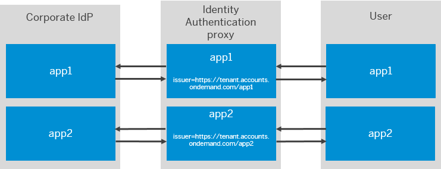

<!-- loioba2faa9e93ef4fc2aff9ead9e73e19bd -->

# Configure Different Trust Configurations for the Same Identity Authentication

Tenant administrator can configure the issuer name in the request sent to the corporate identity providers when Identity Authentication acts as a proxy identity provider.

## Context

> ### Note:  
> To configure Identity Authentication to use a different issuer name when communicating with Microsoft Entra ID \(formerly known as Microsoft Azure Active Directory or Azure AD\), see [\(Optional\) Configure Different Trust Configurations for the Same Identity Authentication Tenant \(Microsoft Entra ID Apps\)](../Integrating-the-Service/optional-configure-different-trust-configurations-for-the-same-identity-authentication-te-f661eec.md).

When Identity Authentication acts as a proxy identity provider you can have different trust configurations for the different applications at the corporate identity provider side. To do this you should configure Identity Authentication to use a different issuer name when communicating with the corporate identity provider, depending on the application for which the authentication is done.

When Identity Authentication issues a SAML2.0 authentication request, logout request or response to the corporate identity provider, then it uses the configured issuer name for the corresponding application.

When Identity Authentication verifies the SAML2.0 message coming from the corporate identity provider, then the verification is done against the configured issuer for the corresponding application.

> ### Example:  
> 
> 
> Identity Authentication acts as identity provider proxy and there are two configured applications app1 and app2. App1 is configured with `issuer=https://tenant.accounts.ondemand.com/app1`. App2 is configured with `issuer=https://tenant.accounts.ondemand.com/app2`. Both applications use one and the same corporate identity provider for authentication.
> 
> When App1 issues an authentication request to Identity Authentication, then Identity Authentication sends authentication request to the corporate identity provider, using `issuer=https://tenant.accounts.ondemand.com/app1`. The corporate identity provider authenticates the user and sends authentication response with `audience=https://tenant.accounts.ondemand.com/app1`. Then Identity Authentication sends authentication response to app1.
> 
> After that, the same user tries to authenticate to app2 from the same browser session. App2 issues an authentication request to Identity Authentication. Then Identity Authentication again sends authentication request to the corporate identity provider, but this time with `issuer=https://tenant.accounts.ondemand.com/app2`. Thus, the corporate identity provider can apply the specific authentication mechanisms, configured for `issuer=https://tenant.accounts.ondemand.com/app2`. After the authentication, the corporate identity provider issues an authentication response with `audience=https://tenant.accounts.ondemand.com/app2`. Then Identity Authentication sends authentication response to app2.

<a name="loioba2faa9e93ef4fc2aff9ead9e73e19bd__steps_exl_bpk_f4b"/>

## Procedure

1.  Sign in to the administration console for SAP Cloud Identity Services.

2.  Under *Applications and Resources*, choose the *Applications* tile.

3.  Choose the application that you want to edit.

    > ### Note:  
    > Type the name of the application in the search field to filter the list items, or choose the application from the list on the left.
    > 
    > If you don’t have a created application in your list, you can create one. For more information, see [Create a New Application](create-a-new-application-0d4b255.md).

4.  Choose the *Trust* tab.

5.  Under *Conditional Authentication*, choose *Configure SAML 2.0 Requests to Corporate Identity Providers*.

6.  Under *Configure Issuer Name*, type the issuer suffix, which you want to add to the Identity Authentication default issuer name.

    > ### Note:  
    > The suffix can contain only Latin letters \(A-Z and a-z\) and numbers. It must be up to 32 characters.

    The issuer name, which will be used when sending SAML2.0 requests to the corporate identity provider appears under the input field. It is in the format `<Identity_Authentication_default_issuer_name>/<issuer_name_suffix_typed_in_the_input_field>`. For example, `https://my-tenant.accounts.ondemand.com/suffix/>`.

7.  Save your changes.

**Related Information**  

[Configure Authentication Context](configure-authentication-context-028cee2.md "Tenant administrator can configure the authentication context in the request sent to the corporate identity providers when Identity Authentication acts as a proxy identity provider.")

[\(Optional\) Configure Different Trust Configurations for the Same Identity Authentication Tenant \(Microsoft Entra ID Apps\)](../Integrating-the-Service/optional-configure-different-trust-configurations-for-the-same-identity-authentication-te-f661eec.md "Configure issuer name on Identity Authentication and update the name and certificate on Microsoft Entra ID side.")

