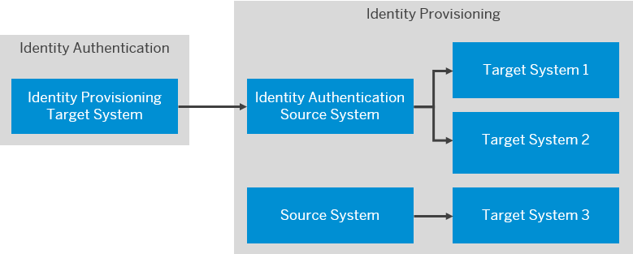

<!-- loio334964514e8b48cb88c8ed07f5ee6a14 -->

# Configure Identity Authentication for Real-Time Provisioning

Enable real-time provisioning in Identity Authentication to trigger immediate synchronization of user changes to target systems configured in Identity Provisioning.

<a name="loio334964514e8b48cb88c8ed07f5ee6a14__prereq_f1p_whv_cbc"/>

## Prerequisites

-   You have created a technical user for accessing the real-time provisioning API and assigned it the *Access Real-Time Provisioning API* permission. This user must be an administrator of type *System*. You have also configured *Secret* for the technical user.

    For more information, see [Add System as Administrator](add-administrators-bbbdbdd.md#loiocefb742a36754b18bbe5c3503ac6d87c).

    For OAuth authentication scenario for tenants running on Neo environment, you've made the required configurations in the SAP BTP cockpit. For more information, see [Create OAuth Client Credentials in SAP BTP Cockpit](https://help.sap.com/docs/identity-provisioning/identity-provisioning/real-time-provisioning-in-neo-environment?version=Cloud#i.-create-oauth-client-credentials-in-sap-btp-cockpit).

-   You have created Identity Authentication source system in Identity Provisioning and connected it to target systems of your choice.

    For more information, see [Identity Authentication](../identity-authentication-e4e25f1.md) and [Target Systems](../target-systems-ab3f641.md).

## Context

In this scenario you configure Identity Provisioning as a target system in Identity Authentication real-time configuration, and Identity Authentication as a source system in Identity Provisioning. As a result, when users are created, updated or deleted in Identity Authentication, the changes will be immediately provisioned to the target systems configured in Identity Provisioning.

Real-time provisioning is applicable for users that have been manually created or updated in Identity Authentication, using SCIM API \(version 1 or 2\), or via CSV file upload. It is not applicable for users updated by a provisioning job.

> ### Caution:  
> Users coming from a source \(system A\) which are created or updated in Identity Authentication target \(system B\) using a provisioning job, **cannot** be later synchronized from Identity Authentication to another target \(system C\) using real-time provisioning. This is a precaution behavior, preventing any data collisions if you later decide to run a provisioning job for the same systems: Identity Authentication source \(system B\) and target \(system C\). See the example below.

> ### Example:  
> 1.  You enable real-time provisioning for Identity Authentication and configure it as a source system that points to SAP Marketing Cloud target system.
> 
>     As a result, Identity Authentication users are immediately provisioned to SAP Marketing Cloud.
> 
> 2.  You configure Microsoft Active Directory as a source system that points to Identity Authentication target system and run a provisioning job.
> 
>     As a result, Microsoft Active Directory users are provisioned to Identity Authentication. Even though new users are created in Identity Authentication, they are not provisioned further to SAP Marketing Cloud by real-time provisioning.

> ### Tip:  
> If you want to provision groups in real time, you need to use a REST client for initiating POST and DELETE requests to the Real-time provisioning API: <code>https://<i class="varname">&lt;tenantId&gt;</i>.<i class="varname">&lt;host&gt;</i>/ipsproxy/service/api/v1/systems/<i class="varname">&lt;system-id&gt;</i>/entities/group</code>.

To configure real-time provisioning in Identity Authentication to trigger immediate synchronization of user changes to target systems configured in Identity Provisioning follow the procedure below:

<a name="loio334964514e8b48cb88c8ed07f5ee6a14__steps_esh_zdb_vhb"/>

## Procedure

1.  Sign in to the administration console for SAP Cloud Identity Services.

2.  Under *Users & Authorizations*, choose the *Real-Time Provisioning* tile.

    This operation opens a list of the target systems.

3.  Choose the *\+Add* button to add a new target system and provide the following information:

    <table>
    <tr>
    <th valign="top">

    New System
    
    </th>
    <th valign="top">

    Field
    
    </th>
    <th valign="top">

    Value
    
    </th>
    </tr>
    <tr>
    <td valign="top" rowspan="4">
    
    *Target Configurations* 
    
    </td>
    <td valign="top">
    
    *Display Name* 
    
    </td>
    <td valign="top">
    
    Provide a name for the target system. It can be identical with the source system you have created in Identity Provisioning.
    
    </td>
    </tr>
    <tr>
    <td valign="top">
    
    *Type* 
    
    </td>
    <td valign="top">
    
    From the dropdown, select *Identity Provisioning*.
    
    </td>
    </tr>
    <tr>
    <td valign="top">
    
    *SCIM URL* 
    
    </td>
    <td valign="top">
    
    Provide the SCIM URL in the following pattern:

    <code>https://<i class="varname">&lt;ias-tenant-host&gt;</i>/ipsproxy/service/api/v1/systems/<i class="varname">&lt;system-id&gt;</i>/entities/user</code>

    The *<system-id\>* is the ID of the *Identity Authentication* source system you have added in Identity Provisioning. It is displayed at the end of the system URL.
    
    </td>
    </tr>
    <tr>
    <td valign="top">
    
    *Version*

    -   *1*

    -   *2*

    
    </td>
    <td valign="top">
    
    Defines the version of Identity Authentication SCIM API.

    *1* - the Identity Authentication SCIM API \(in short, SCIM API version 1\) is used.

    *2* - the Identity Directory SCIM API \(in short, SCIM API version 2\) is used.

    > ### Note:  
    > The version that you specify here must be the same as the version of the `ias.api.version` property in Identity Authentication source system.

    
    </td>
    </tr>
    <tr>
    <td valign="top" rowspan="3">
    
    *Authentication Mechanism* 
    
    </td>
    <td valign="top">
    
    *OAuth* 
    
    </td>
    <td valign="top">
    
    For tenants running on SAP Cloud Identity infrastructure, use the **user ID** and **password** of the Identity Authentication technical user. Provide an OAuth token URL following the pattern: <code>https://<i class="varname">&lt;ias-tenant-host&gt;</i>/oauth2/token</code> 

    > ### Note:  
    > OAuth authentication is only supported when calling the Real-Time Provisioning API. It cannot be configured in the administration console of SAP Cloud Identity Services.

    For more information for tenants running on Neo environment, see [Create OAuth Client Credentials in SAP BTP Cockpit](https://help.sap.com/docs/identity-provisioning/identity-provisioning/real-time-provisioning-in-neo-environment?version=Cloud#i.-create-oauth-client-credentials-in-sap-btp-cockpit).
    
    </td>
    </tr>
    <tr>
    <td valign="top">
    
    *Basic* 
    
    </td>
    <td valign="top">
    
    If you choose this option, provide the following information:

    In the *Username* field, enter the client ID of the technical user.

    In the *Password* field, enter the client secret of the technical user.

    For more information, see *step 6* in [Add System as Administrator](https://help.sap.com/docs/identity-authentication/identity-authentication/add-administrators?version=Cloud#loiocefb742a36754b18bbe5c3503ac6d87c).
    
    </td>
    </tr>
    <tr>
    <td valign="top">
    
    *Certificate* 
    
    </td>
    <td valign="top">
    
    If you choose this option, proceed as follows:

    1.  Provide a common name and a password.

    2.  Generate and download the certificate.

    3.  Import it in the *Configure System Authentication* screen of the technical user for real-time provisioning, as described in *step 6* in [Add System as Administrator](https://help.sap.com/docs/identity-authentication/identity-authentication/add-administrators?version=Cloud#loiocefb742a36754b18bbe5c3503ac6d87c).

    The maximum length of the CN is 64 characters. Once the certificate is generated, it is saved as a `.crt` file. The common name is in the format *<common name\>*\(*<admin user ID\>*\), where common name is the CN provided by the administrator, and admin user ID is the administrator's user id.

    Identity Authentication supports SAP Passport CA as trusted certificate authority \(CA\).
    
    </td>
    </tr>
    </table>
    
4.  Save your changes.

    If the operation is successful, the system displays the message: ***Target system <name of system\> created***.

5.  **Optional:** Choose *Test Connection* before executing the provisioning.

    If the setup is correct, the following message is displayed: ***Connection to the selected target system was established successfully.***

6.  Choose *Provision*.

<a name="loio334964514e8b48cb88c8ed07f5ee6a14__postreq_nq5_pwf_rpb"/>

## Next Steps

Verify that the changes in Identity Authentication are provisioned to the target systems configured in Identity Provisioning. Each subsequently created or updated users will be provisioned instantly and automatically.

**Related Information**  

[Enable Real-Time Provisioning in Source Applications](enable-real-time-provisioning-in-source-applications-0767587.md "Enable the real-time provisioning configuration in the source applications that trigger immediate sync when changes occur.")

[Configure SAP Jam for Real-Time Provisioning](configure-sap-jam-for-real-time-provisioning-a923427.md "Tenant administrators can configure SAP Jam target systems for real-time provisioning via the administration console for SAP Cloud Identity Services.")

[Provision Users to Target Systems](provision-users-to-target-systems-af6f78b.md "Tenant administrators can provision users of Identity Authentication to SAP Jam and Identity Provisioning target systemstarget system.")

[Delete Target System](delete-target-system-6372e9a.md "As a tenant administrator, you can delete one or more target systems in a tenant of Identity Authentication.")

