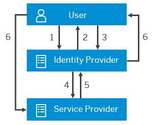
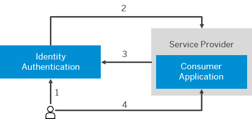

<!-- loio5d59caa4a0124dd88f58d285e25ae84d -->

# Configure IdP-Initiated SSO

**Related Information**  

[Tenant SAML 2.0 Configuration](tenant-saml-2-0-configuration-e81a19b.md "You as a tenant administrator can view and download the tenant SAML 2.0 metadata. You can also change the name format and update your certificate used by the identity provider to digitally sign the messages for the applications.")

[Tenant OpenID Connect Configurations](tenant-openid-connect-configurations-3d6abcc.md "You as a tenant administrator can view and configure the tenant OpenID Connect configurations.")

[Change Tenant Texts Via Administration Console](change-tenant-texts-via-administration-console-c24b1d0.md "The change tenant texts option can be used to change the predefined texts and messages for end-user screens available per tenant in Identity Authentication via the administration console.")

[Configure Master Data Texts Via Administration Console](configure-master-data-texts-via-administration-console-c068ac9.md "The master data texts option can be used to configure the predefined master data for each resource in Identity Authentication via the administration console.")

[Configure Links Section on Sign-In Screen](configure-links-section-on-sign-in-screen-060c032.md "You can configure links to appear on the sign-in screen of your applications.")

[Add Instructions Section on Sign-In Screen](add-instructions-section-on-sign-in-screen-c9e717e.md "You can customize the sign-in screen of the Horizon theme with instructions for the user.")

[Configure X.509 Client Certificates for User Authentication](configure-x-509-client-certificates-for-user-authentication-52c7dcb.md "Tenant administrators can configure X.509 client certificates for user authentication as an alternative to authenticating with a user name and a password.")

[Configure Tenant Images](configure-tenant-images-8742046.md "You can configure a custom global logo and, or a background image on the forms for sign-in in, registration, upgrade, password update, and account activation for all applications in a tenant. You can also set a favicon for tenant.")

[Configure Allowed Logon Identifiers](configure-allowed-logon-identifiers-3adf1ff.md "Tenant administrators can choose the allowed logon identifiers for the users.")

[Configure User Identifier Attributes](configure-user-identifier-attributes-8b9fa88.md "Tenant administrators can configure user identifier attributes as required and unique for the tenant.")

[Configure Trust this browser Option](configure-trust-this-browser-option-5b8377e.md "Tenant administrator can set the number of days for which the users won't get prompted for second-factor authentication, if they sign in from the same browser.")

[Enable Back-Up Channels to Send Passcode for Deactivation of TOTP Two-Factor Authentication Devices](enable-back-up-channels-to-send-passcode-for-deactivation-of-totp-two-factor-authenticati-782935e.md "Tenant administrator can configure back-up channels to send TOTP deactivation passcodes to the user.")

[Enable Users to Recover Password with Security Questions](enable-users-to-recover-password-with-security-questions-d9ae898.md "Users can choose to answer security questions to reset their password.")

[Enable Users to Recover Password with PIN Code](enable-users-to-recover-password-with-pin-code-046a235.md "Users can choose to provide PIN code to reset their password.")

[Configure Initial Password and Email Link Validity](configure-initial-password-and-email-link-validity-f8093f4.md "As a tenant administrator, you can configure the validity of the initial password and link sent to a user in the various application processes.")

[Configure Session Timeout](configure-session-timeout-5ca23e4.md "As a tenant administrator, you can configure when the session, created at the Identity Authentication tenant, expires.")

[Configure Trusted Domains](configure-trusted-domains-08fa1fe.md "Service providers that delegate authentication to Identity Authentication can protect their applications when using embedded frames, also called overlays, or when allowing user self-registration.")

[Use Custom Domain in Identity Authentication](use-custom-domain-in-identity-authentication-c4db840.md "Identity Authentication allows you to use a custom domain that is different from the default one (<tenant ID>.accounts.ondemand.com) - for example www.mytenant.com.")

[Change a Tenant's Display Name](change-a-tenant-s-display-name-a513c91.md "You can configure the tenant's name from the administration console for SAP Cloud Identity Services.")

[Configure Default Risk-Based Authentication for All Applications in the Tenant](configure-default-risk-based-authentication-for-all-applications-in-the-tenant-1aab51a.md#loio1aab51ae62b94f79b4c6dac7a00857c2 "You can define rules for authentication according to different risk factors and apply actions like Allow, Deny, and Two-Factor Authentication for all applications in a tenant.")

[Configure Sinch Service in Administration Console](configure-sinch-service-in-administration-console-3fdc9e1.md "Configure Sinch Service to enable Phone Verification via SMS or SMS Two-Factor Authentication in the administration console.")

[Configure RADIUS Server Settings \(Beta\)](configure-radius-server-settings-beta-03043ae.md "Configure Remote Authentication Dial-In User Service (RADIUS) server settings in the administration console for SAP Cloud Identity Services.")

[Configure Mail Server for Application Processes](configure-mail-server-for-application-processes-ccc7ba1.md "Configure mail server for the emails sent to the end users in the different application processes.")

[Send Security Alert Emails](send-security-alert-emails-c977464.md "Send security alert emails to end-users or administrators when changes in their accounts are made.")

[Send System Notifications via Emails](send-system-notifications-via-emails-aa04a8b.md "You can configure the administration console to send emails with information about expiring certificates, system notifications, new administrators, and new applications to specific email addresses or to the emails of all administrators.")

[Configure Customer-Controlled Encryption Keys in Administration Console \(Restricted Availability\)](configure-customer-controlled-encryption-keys-in-administration-console-restricted-availa-fe6e30c.md "")

[Configure Default Language for End User Screens](configure-default-language-for-end-user-screens-2cb73c3.md "Select the language that the end user screen uses if the language of the browser isn’t in the list of supported languages.")

[Configure P-User Next Index](configure-p-user-next-index-045bb1c.md "Set the value for the P-user next index.")

[Reuse SAP Cloud Identity Services Tenants for Different Customer IDs](reuse-sap-cloud-identity-services-tenants-for-different-customer-ids-ebd0258.md "You as a tenant administrator can reuse an existing tenant for configurations and automated subscriptions.")

[Configure IdP-Initiated SSO with Corporate Identity Providers](configure-idp-initiated-sso-with-corporate-identity-providers-d483a52.md#loiod483a52be22946d5a05951b0fa16221f "This document shows you how to configure identity provider (IdP) initiated single sign-on (SSO) with corporate identity providers.")

<a name="idp_initiated_overview"/>

<!-- idp\_initiated\_overview -->

## Overview

In the IdP-Initiated single sign-on \(SSO\), the authentication starts at the identity provider \(IdP\). The user is first authenticated at the identity provider, and after that he or she is allowed to access the protected resource at the application \(\(service provider \(SP\)\).

1.  The user access the identity provider via a link.
2.  The identity provider requires credentials.
3.  The user provides credentials, and he or she is authenticated.
4.  The identity provider sends assertion about the user to the service provider.
5.  The service provider validates the assertions and gives access rights to the user.
6.  The identity provider redirects the user to the protected resource.

> ### Remember:  
> The service provider \(SP\) metadata that is used to configure the trust must contain the default assertion consumer service \(ACS\) endpoint that can process unsolicited SAML responses.

> ### Note:  
> When SAP BTP acts as a service provider, the ACS endpoint should be the URL of the protected application resource. To point to the application protected URL, change the ACS endpoint on the identity provider side . For more information about how to change the ACS endpoint in Identity Authentication, see [Configure Trust](configure-trust-f96e4c5.md).

The link for IdP-Initiated SSO follows the pattern: `https://<tenant_ID>.accounts.ondemand.com/saml2/idp/sso?sp=<sp_name>[&RelayState=<sp_specific_value>&index=<index_number>]`

> ### Note:  
> The following table lists the URL parameters you can use for IdP-initated SSO.
> 
> **URL Parameters for IdP-Initiated SSO**
> 
> 
> <table>
> <tr>
> <th valign="top">
> 
> Parameter
> 
> </th>
> <th valign="top">
> 
> Mandatory
> 
> </th>
> <th valign="top">
> 
> Description
> 
> </th>
> </tr>
> <tr>
> <td valign="top">
> 
> `sp`
> 
> </td>
> <td valign="top">
> 
> Yes
> 
> </td>
> <td valign="top">
> 
> Name of the SAML 2 service provider for which SSO is performed. The `sp_name` value of the parameter equals to the `Entity ID` of the service provider. This parameter is needed for Identity Authentication to know which service provider to redirect the user to after successful authentication.
> 
> </td>
> </tr>
> <tr>
> <td valign="top">
> 
> `RelayState`
> 
> </td>
> <td valign="top">
> 
> No
> 
> </td>
> <td valign="top">
> 
> Relay state forwarded to the service provider with the SAML response.
> 
> > ### Note:  
> > Not supported for the Cloud Foundry environment.
> 
> 
> 
> </td>
> </tr>
> <tr>
> <td valign="top">
> 
> `index`
> 
> </td>
> <td valign="top">
> 
> > ### Note:  
> > You can choose by the index the correct ACS endpoint for unsolicited SAML response processing. Provide the `index` parameter when the default ACS endpoint which has been configured via the administration console cannot process unsolicited SAML responses.
> 
> 
> 
> </td>
> <td valign="top">
> 
> Enter the index number of the endpoint of the assertion consumer service of the service provider as the target of the SAML response. Otherwise the identity provider uses the default endpoint configured for the trusted service provider.
> 
> A non-digit value or a value for an index entry that is not configured returns an error message.
> 
> </td>
> </tr>
> <tr>
> <td valign="top">
> 
> `login_hint`
> 
> </td>
> <td valign="top">
> 
> No
> 
> </td>
> <td valign="top">
> 
> The `login_hint` parameter helps the user when he or she is known to the service provider \(SP\). Thus it prevents the user from re-typing the user identifier on the logon or conditional screen.
> 
> Supported values are the allowed logon identifiers for the users. The options are *User ID*, *Login Name*, and *Email* \(For SAML 2.0\). For more information, see [Configure Allowed Logon Identifiers](configure-allowed-logon-identifiers-3adf1ff.md) .
> 
> </td>
> </tr>
> <tr>
> <td valign="top">
> 
> `idp`
> 
> </td>
> <td valign="top">
> 
> No
> 
> </td>
> <td valign="top">
> 
> The name of the corporate identity provider as configured in the administration console for SAP Cloud Identity Services.
> 
> When multiple identity providers are allowed for an application via conditional authentication, this parameter enables the client to determine which corporate identity provider to be used. Identity Authentication uses the `idp` to detect the correct corporate identity provider and redirect the request to it. The user authenticates against the corporate identity provider.
> 
> </td>
> </tr>
> </table>

### Example

Richard Wilson, tenant administrator at Company A, would like to set up an IdP-initiated SSO process and has configured the default assertion consumer service \(ACS\) endpoint correctly at the cloud identity provider. Dona Moore, who is an employee at Company A, tries to access the identity provider, but because she does not have a valid session she is prompted to provide credentials. Once Dona has logged in at the IdP, a session is created for her. She is automatically redirected to her application \(the default ACS URL as specified in the service provider \(SP\) metadata\)\).

1.  User provides credentials; logs on.
2.  Identity Authentication sends assertions.
3.  Service provider validates assertions; gives access rights.
4.  User accesses content.

<a name="disable_idp_initiated_sso"/>

<!-- disable\_idp\_initiated\_sso -->

## Enable or Disable IdP-Initiated SSO

## Prerequisites

-   You are assigned the *Manage Tenant Configuration* role. For more information about how to assign administrator roles, see [Edit Administrator Authorizations](edit-administrator-authorizations-86ee374.md).

-   You have specified the default assertion consumer service \(ACS\) endpoint in the configuration of a trusted service provider \(SP\) in the administration console for SAP Cloud Identity Services. For more information, see [Configure Trust](configure-trust-f96e4c5.md).

## Context

By default, IdP-Initiated SSO is enabled in Identity Authentication. The tenant administrator can disable the IdP-Initiated SSO process via the administration console for SAP Cloud Identity Services.

> ### Caution:  
> When IdP-Initiated SSO is disabled, users cannot access their profile page.

> ### Remember:  
> It takes 2 minutes for the configuration changes to take place.

Use this procedure to disable or enable the IdP-Initiated SSO process.

## Procedure

1.  Sign in to the administration console for SAP Cloud Identity Services.

2.  Under *Single Sign-On*, choose the *Tenant Settings* tile.

3.  Use the slider next to *IdP-Initiated SSO* to disable or enable it.

    If the operation is successful, you receive a confirmation message.

