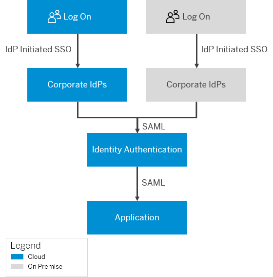

<!-- loiod483a52be22946d5a05951b0fa16221f -->

# Configure IdP-Initiated SSO with Corporate Identity Providers

This document shows you how to configure identity provider \(IdP\) initiated single sign-on \(SSO\) with corporate identity providers.

This use case is suitable for customers and partners who need to provide access to a cloud application for their employees via their corporate identity providers. When Identity Authentication acts as proxy to multiple identity providers you can allow the partner users to login via their corporate identity providers.

In this scenario the authentication starts at the corporate identity provider \(IdP\), with Identity Authentication being in the role of an identity provider proxy. As such, Identity Authentication will act as an SAML 2.0 identity provider to the service provider, and as an SAML 2.0 service provider to the corporate identity provider or providers. Once a user is authenticated at the corporate identity provider, successive authentication requests from the service provider, which use the same corporate identity provider will not be forwarded to it while the session at Identity Authentication is active. Identity Authentication will issue assertions based on the user data received during the first authentication.

This scenario also supports authentication with more than one corporate identity provider.




## Configuration Steps

For this scenario, the configurations are made by users with different roles in different systems.

**Configuration and Roles**


<table>
<tr>
<th valign="top">

Role

</th>
<th valign="top">

System to be configured

</th>
<th valign="top">

What has to be configured

</th>
<th valign="top">

More Information

</th>
</tr>
<tr>
<td valign="top">

Application administrator

</td>
<td valign="top">

Consumer application

</td>
<td valign="top">

Trust

</td>
<td valign="top">

[Configure Identity Authentication as a Trusted Identity Provider for the Application](configure-idp-initiated-sso-with-corporate-identity-providers-d483a52.md#loio2a26d22d959046f3bd148e2b15839d62)

</td>
</tr>
<tr>
<td valign="top">

Tenant administrator

</td>
<td valign="top">

Tenant of Identity Authentication 

</td>
<td valign="top">

-   Authenticating identity providers
-   \(Optional\) Enable the *Trust All Corporate Identity Providers* feature in the administration console.


</td>
<td valign="top">

-   [Configure Identity Authentication To Trust the Corporate Identity Provider](configure-idp-initiated-sso-with-corporate-identity-providers-d483a52.md#loioe845c2fb9bb04bedbec06fa76d1058cd)

-   [Enable IdP-Initiated SSO from All Corporate Identity Providers](enable-idp-initiated-sso-from-all-corporate-identity-providers-f7ec8d2.md)


</td>
</tr>
<tr>
<td valign="top">

Tenant administrator

</td>
<td valign="top">

Tenant of Identity Authentication 

</td>
<td valign="top">

\(Optional\) User attributes and access for users. Enable the *Identity Federation* options in the administration console.

</td>
<td valign="top">

[\(Optional\) Configure Additional Settings in Identity Authentication](configure-idp-initiated-sso-with-corporate-identity-providers-d483a52.md#loioddf22c3599e8464591747e23cc208318)

</td>
</tr>
<tr>
<td valign="top">

Corporate IdP administrator

</td>
<td valign="top">

Corporate IdP

</td>
<td valign="top">

-   Trust

-   Assertion consumer service endpoint


</td>
<td valign="top">

[Configure the Corporate Identity Provider](configure-idp-initiated-sso-with-corporate-identity-providers-d483a52.md#loiobc7870de693c4f06a2f6e6b33adbf330)

</td>
</tr>
</table>

For more information about the configuration steps, follow the links in the table or see the sections below.


## Prerequisites

The IDP-Initiated SSO option in the tenant of Identity Authentication must be enabled.

> ### Note:  
> IDP-Initiated SSO is enabled by default in Identity Authentication. For more information about how the tenant administrator can enable or disable this option, see [Configure IdP-Initiated SSO](configure-idp-initiated-sso-5d59caa.md).

<a name="loio2a26d22d959046f3bd148e2b15839d62"/>

<!-- loio2a26d22d959046f3bd148e2b15839d62 -->

## Configure Identity Authentication as a Trusted Identity Provider for the Application


## Context

The following configuration is made by the administrator of the application.

As an administrator of the application, you have to configure Identity Authentication as a trusted identity provider for the application.

> ### Note:  
> To do this, you will need the SAML 2.0 metadata of Identity Authentication. To receive the metadata, contact the tenant administrator of Identity Authentication.


## Next Steps

Send the metadata of the service provider to the administrator of Identity Authentication. This is required for setting up the trust on the Identity Authentication provider side. For more information about how to set up th etrust, see [Configure SAML 2.0 Service Provider](configure-saml-2-0-service-provider-51f1f75.md).

<a name="loioe845c2fb9bb04bedbec06fa76d1058cd"/>

<!-- loioe845c2fb9bb04bedbec06fa76d1058cd -->

## Configure Identity Authentication To Trust the Corporate Identity Provider


## Context

In the scenario where Identity Authentication acts as an identity provider proxy, it is in the role of an identity provider for the application, and a service provider for the corporate identity provider. You should configure trusts with the service provider and the corporate identity provider.

The following configuration is made by the tenant administrator of Identity Authentication.


<a name="loioe845c2fb9bb04bedbec06fa76d1058cd__steps_vn2_gcb_wv"/>

## Procedure

1.  Configure trust with the service provider via the administration console. For more information, see [Configure SAML 2.0 Service Provider](configure-saml-2-0-service-provider-51f1f75.md).

    For this procedure, you will need the metadata from the service provider. If you do not have this, contact the administrator of the application.

    The service provider metadata that is used to configure the trust must contain the default assertion consumer service \(ACS\) endpoint that can process unsolicited SAML responses. With SAP BTP, the endpoint is the URL of the application's protected page.

    > ### Remember:  
    > If your scenario includes the enabling of the *Trust All Corporate Identity Providers* option in the administration console, the service provider metadata that is used to configure the trust must contain also the assertion consumer \(ACS\) endpoint with the URL of the application's protected page and the index.
    > 
    > > ### Sample Code:  
    > > ```
    > > <ns3:AssertionConsumerService index="1" isDefault="false" Binding="urn:oasis:names:tc:SAML:2.0:bindings:HTTP-POST" Location="https://<application URL>/protected.jsp"
    > > />
    > > ```

2.  Configure a trust with the corporate identity provider. For more information, see [Configure Trust with SAML 2.0 Corporate Identity Provider](configure-trust-with-saml-2-0-corporate-identity-provider-33832e5.md).

    For this procedure, you will need the metadata from the corporate identity provider. If you do not have this, contact the administrator of the corporate identity provider.

3.  Select identity provider. You have the following options:

    -   If your scenario includes more than one corporate identity provider, enable the *Trust All Corporate Identity Providers* feature in the administration console. For more information, see [Enable IdP-Initiated SSO from All Corporate Identity Providers](enable-idp-initiated-sso-from-all-corporate-identity-providers-f7ec8d2.md).
    -   If your scenario includes only one corporate identity provider, set the configured identity provider as the authenticating identity provider for the application. For more information, see [Choose Default Identity Provider for an Application](choose-default-identity-provider-for-an-application-e9d8274.md).


## Next Steps

1.  Send the `Entity ID` of the service provider to the administrator of the corporate identity provider. The administrator needs this information for the consumer assertion endpoint configuration.

    > ### Tip:  
    > The `Entity ID` of the service provider is in the administration console in *Applications* \> *<application\_name\>* \> *Trust* \> *SAML 2.0 Configuration* \> *Name*.

    > ### Remember:  
    > If your scenario includes the enabling of the *Trust All Corporate Identity Providers* option in the administration console, send also the index of the ACS endpoint of the application's protected page. The administrator needs this information for the consumer assertion endpoint configuration.

2.  Send the metadata of the tenant of Identity Authentication to the administrator of the service provider and the administrator of the corporate identity provider. They need the metadata for the trust configurations of the systems. For more information about how to download the tenant metadata, see [Tenant SAML 2.0 Configuration](tenant-saml-2-0-configuration-e81a19b.md).

<a name="copy3d24839b33e04153b91139bb9113b58d"/>

<!-- copy3d24839b33e04153b91139bb9113b58d -->

## Enable IdP-Initiated SSO from All Corporate Identity Providers

\(For SAML 2.0 applications\) Tenant administrators can enable IdP-initiated single sign-on \(SSO\) from all configured corporate identity providers \(IdPs\).


<a name="copy3d24839b33e04153b91139bb9113b58d__prereq_s3p_sq3_3bb"/>

## Prerequisites

-   You are assigned the *Manage Applications* role. For more information about how to assign administrator roles, see [Edit Administrator Authorizations](edit-administrator-authorizations-86ee374.md).

-   You have more than one corporate identity provider, which is configured in the administration console. For more information how to configure a corporate identity provider, see [Configure Trust with SAML 2.0 Corporate Identity Provider](configure-trust-with-saml-2-0-corporate-identity-provider-33832e5.md).

-   \(For SAML 2.0 applications\) You have added the assertion consumer \(ACS\) endpoint with the URL of the application's protected page, and the index, in the metadata of that application. The ACS endpoint that you added should look like the following example:

    > ### Sample Code:  
    > ```
    > <ns3:AssertionConsumerService index="1" isDefault="false" Binding="urn:oasis:names:tc:SAML:2.0:bindings:HTTP-POST" Location="https://<application URL>/protected.jsp"
    > />
    > ```

    For more information how to configure your ACS endpoint in the administration for Identity Authentication, see [Configure SAML 2.0 Service Provider](configure-saml-2-0-service-provider-51f1f75.md).


## Context

Applications can be configured to trust all the corporate identity providers configured in the administration console when identity provider \(IdP\) initiated single sign-on \(SSO\) is used. The user accesses the application via URL provided by the corporate identity provider.

To enable IdP-initiated SSO with all corporate identity providers configured in the administration console for SAP Cloud Identity Services follow the procedure below:


## Procedure

1.  Sign in to the administration console for SAP Cloud Identity Services.

2.  Under *Applications and Resources*, choose the *Applications* tile.

3.  Choose the application that you want to edit.

    > ### Note:  
    > Type the name of the application in the search field to filter the list items, or choose the application from the list on the left.
    > 
    > If you don’t have a created application in your list, you can create one. For more information, see [Create a New Application](create-a-new-application-0d4b255.md).

4.  Choose the *Trust* tab.

5.  Under the *Conditional Authentication* section, enable the *Trust All Corporate Identity Providers* option.

    > ### Note:  
    > By default this option is disabled.

    Once the application has been updated, the system displays the message ***Application <name of application\> updated***.


<a name="copy3d24839b33e04153b91139bb9113b58d__result_fhp_jtn_jbb"/>

## Results

The application trusts all corporate identity providers that are configured in the administration console for SAP Cloud Identity Services.

**Related Information**  


[Configure IdP-Initiated SSO with Corporate Identity Providers](configure-idp-initiated-sso-with-corporate-identity-providers-d483a52.md#loiod483a52be22946d5a05951b0fa16221f "This document shows you how to configure identity provider (IdP) initiated single sign-on (SSO) with corporate identity providers.")

<a name="loioddf22c3599e8464591747e23cc208318"/>

<!-- loioddf22c3599e8464591747e23cc208318 -->

## \(Optional\) Configure Additional Settings in Identity Authentication


## Context

The following configurations are made by the tenant administrator of Identity Authentication.

Follow the procedures in this document if you want to:

-   **Restrict Access to Users in Identity Authentication User Store**

-   **Restrict Access to Users in Certain Groups**

-   **Send Specific Assertion and Name ID Attributes to the Application**

-   **Apply Application Configurations**

<a name="task_wzl_dlf_nhb"/>

<!-- task\_wzl\_dlf\_nhb -->

### Send Specific Assertion and Name ID Attributes to the Application


<a name="task_wzl_dlf_nhb__context_xzl_dlf_nhb"/>

## Context

When the *Use Identity Authentication user store* option is disabled, Identity Authentication sends to the application the same attributes it has received from the corporate identity provider.

When the *Use Identity Authentication user store* is enabled, Identity Authentication checks if a user with the respective unique identifier, written in the NameID attribute in the assertion coming from the corporate identity provider, exists in the user store of Identity Authentication. The following options exist:

-   If the user exists, Identity Authentication issues a new nameID, assertion and default attributes, configured for the application.

-   If the user does not exist in the user store of Identity Authentication, the application receives the nameID from the corporate IdP assertion and the attributes according to the application configuration.

This configuration can be used if you want the application to receive assertions and name ID attributes that are different from those sent by the corporate identity provider.

If you want the application to receive assertions and name ID attributes that are different from those sent by the corporate identity provider, do the following: [User Attributes Sent to the Application](user-attributes-sent-to-the-application-d361407.md) and [Configure the Subject Name Identifier Sent to the Application](configure-the-subject-name-identifier-sent-to-the-application-1d020e3.md).


<a name="task_wzl_dlf_nhb__steps_zzl_dlf_nhb"/>

## Procedure

1.  Switch on the *Use Identity Authentication user store* option in the administration console. For more information, see [Configure Identity Federation](configure-identity-federation-c029bbb.md).

2.  Configure the user attributes and Name ID attribute sent to the application. For more information, see:

    -   [User Attributes Sent to the Application](user-attributes-sent-to-the-application-d361407.md)
    -   [Configure the Subject Name Identifier Sent to the Application](configure-the-subject-name-identifier-sent-to-the-application-1d020e3.md)


<a name="task_wzl_dlf_nhb__result_b1m_dlf_nhb"/>

## Results

The application will receive in the assertion the attributes and name ID attribute that you have configured in Identity Authentication. They will be different from those that the corporate identity provider sent to Identity Authentication.

<a name="task_knr_zhv_yv"/>

<!-- task\_knr\_zhv\_yv -->

### Restrict Access to Users in Identity Authentication User Store


## Context

This configuration allows you to restrict access to the application to users who are in the Identity Authentication user store. Users who are not in the user store of Identity Authentication will not be able to access the application.


<a name="task_knr_zhv_yv__steps_lnr_zhv_yv"/>

## Procedure

1.  Provision, or import the users that you will grant access to the application to via a CSV file import.

    For more information about how to import users in Identity Authentication, see [Import or Update Users for a Specific Application](import-or-update-users-for-a-specific-application-33838e0.md).

2.  Switch on the *Use Identity Authentication user store* and *Allow Identity Authentication users only* options under *Identity Federation* in the administration console. For more information, see [Configure Identity Federation](configure-identity-federation-c029bbb.md).


## Results

Only users that are in the user store of Identity Authentication will be able to access the application. If a user is not part of the user store of Identity Authentication, this user receives the following message: ***Sorry, but you are currently not authorized for access.***

The settings in the application configuration for assertion attributes and name ID attribute will be used for issuing the assertion. For more information, see [User Attributes Sent to the Application](user-attributes-sent-to-the-application-d361407.md)and [Configure the Subject Name Identifier Sent to the Application](configure-the-subject-name-identifier-sent-to-the-application-1d020e3.md).

<a name="task_dbb_13v_yv"/>

<!-- task\_dbb\_13v\_yv -->

### Restrict Access to Users in Certain Groups


## Context

This configuration allows you to restrict the access to the application only to users who belong to certain groups. This option is suitable for scenarios with more than one corporate identity providers. The tenant administrator assigns different groups to different identity providers and users, and can thus specify that certain users come from specific identity providers by assigning the same groups to them. Identity Authentication can thus check if the users are authenticated by the identity provider that they belong to.


<a name="task_dbb_13v_yv__steps_rlh_b3v_yv"/>

## Procedure

1.  Make sure that the required groups are created in the administration console of Identity Authentication. For more information, see [Create a New Group](create-a-new-group-b1b638d.md).

2.  Provision, or import the users that you will grant access to the application via a CSV file import.

    > ### Caution:  
    > The groups in the *Groups* column in your CSV file must match the groups that you created via the administration console.

    For more information about how to import users in Identity Authentication, see [Import or Update Users for a Specific Application](import-or-update-users-for-a-specific-application-33838e0.md).

3.  Switch on the *Use Identity Authentication user store* and *Allow Identity Authentication users only* options under *Identity Federation* in the administration console. For more information, see [Configure Identity Federation](configure-identity-federation-c029bbb.md).

4.  Assign groups to the corporate identity provider. For more information, see [Configure Identity Federation](configure-identity-federation-c029bbb.md).


## Results

Only the members of these groups will be authorized to access applications after successful authentication. If a user is not part of the groups, this user receives the following message: ***Sorry, but you are currently not authorized for access.***

<a name="task_k1c_pnl_nhb"/>

<!-- task\_k1c\_pnl\_nhb -->

### Apply Application Configurations


<a name="task_k1c_pnl_nhb__prereq_ihs_xpl_nhb"/>

## Prerequisites


<a name="task_k1c_pnl_nhb__context_dgs_xpl_nhb"/>

## Context

This configuration allows you to apply the following application configurations, when Identity Authentication is used as a proxy.


<a name="task_k1c_pnl_nhb__steps_i2s_xpl_nhb"/>

## Procedure

1.  Provision, or import the users that you will grant access to the application to via a CSV file import.

    For more information about how to import users in Identity Authentication, see [Import or Update Users for a Specific Application](import-or-update-users-for-a-specific-application-33838e0.md).

2.  Switch on the *Use Identity Authentication user store* and *Allow Identity Authentication users only* options under *Identity Federation* in the administration console. For more information, see [Configure Identity Federation](configure-identity-federation-c029bbb.md).

3.  Switch on the *Apply Application Configurations* option. For more information, see [Configure Identity Federation](configure-identity-federation-c029bbb.md).


<a name="task_k1c_pnl_nhb__result_hmd_pql_nhb"/>

## Results

The application configuration will be taken into consideration, when the users are authenticated by the corporate IdP.

<a name="loiobc7870de693c4f06a2f6e6b33adbf330"/>

<!-- loiobc7870de693c4f06a2f6e6b33adbf330 -->

## Configure the Corporate Identity Provider


## Context

The following configuration is made by the administrator in the corporate identity provider.


<a name="loiobc7870de693c4f06a2f6e6b33adbf330__steps_syc_tnt_vv"/>

## Procedure

1.  Register Identity Authentication as a service provider.

    > ### Note:  
    > To do this, you will need the SAML 2.0 metadata of Identity Authentication. If you do not have this, contact the tenant administrator of Identity Authentication.

    > ### Tip:  
    > For more information about how to register Identity Authentication as a service provider, consult the corporate identity provider documentation. If the corporate identity provider is also a tenant of Identity Authentication, see [Configure Trust](configure-trust-f96e4c5.md).

2.  Add the `sp=<sp_name>` parameter, and the index of the application's assertion consumer service \(ACS\) endpoint URL, if provided. Replace the `sp_name` with the `Entity ID` of the service provider. This parameter is needed for Identity Authentication to know which service provider to redirect the user to after successful authentication.

    > ### Tip:  
    > The ACS endpoint URL should have the following format: <code>https://&lt;the current ACS endpoint URL&gt;?<code>sp=&lt;sp_name&gt;&amp;index=&lt;index_number&gt;</code></code>. Request the `Entity ID` of the service provider, and the index of the application's protected page from the tenant administrator of Identity Authentication.
    > 
    > The index is required.


## Results

Once the trust is configured, the user can access the application via the link sent by the corporate identity provider administrator. For more information about how to configure the link for the IdP-initiated SSO scenario, consult the corporate identity provider documentation.

> ### Tip:  
> If your corporate identity provider is Identity Authentication, the link for IdP-Initiated SSO follows the pattern: https://<tenant\_ID\>.accounts.ondemand.com/saml2/idp/sso?sp=<sp\_name\>\[&RelayState=<sp\_specific\_value\>&index=<index\_number\>\]. In this use case, replace the `sp_name` with the `Entity ID` of the tenant of Identity Authentication acting as the service provider. The `RelayState` is not mandatory and can be skipped. If your scenario includes only one corporate identity provider, the `index` parameter is not mandatory and also can be skipped. If your scenario includes more than one corporate identity provider, and the *Trust All Corporate Identity Providers* feature in the administration console is enabled, the `index` is used to determine the ACS endpoint which could process unsolicited SAML responses. For more information about the configuration, see [Configure IdP-Initiated SSO](configure-idp-initiated-sso-5d59caa.md).


## Next Steps

Send the metadata of the corporate identity provider to the administrator of Identity Authentication. This will be needed for setting up the trust.

