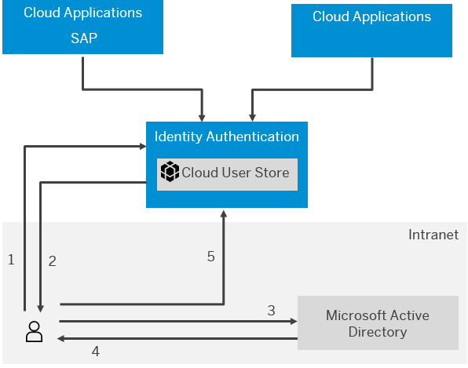

<!-- loiob0301657df074ab081ab7556854aca56 -->

# Configure Kerberos Authentication

## Overview

You configure Kerberos authentication for Identity Authentication to allow users to log on without a username and password when they are in the corporate network. Identity Authentication supports Kerberos with Simple and Protected GSS-API Negotiation Mechanism \(SPNEGO\).

Kerberos authentication with Identity Authentication requires the following systems:

-   Web client

    The web client requests a protected resource of an application configured to use Identity Authentication as an identity provider. It authenticates against the Key Distribution Center \(KDC\). For example, users can use the web browser to access cloud applications using Identity Authentication.

-   Key Distribution Center \(KDC\)

    It authenticates the user and grants a ticket that is used for the communication between the web client and Identity Authentication.

-   Identity Authentication

    Identity Authentication accepts the ticket issued by the KDC and checks the authenticating user in its cloud user store.

The communication flow is as follows:

1.  A user accesses a cloud application on his or her web browser \(web client\) in the corporate network, and the web client sends a request to Identity Authentication.
2.  Identity Authentication returns a response with status code *401 Unauthorized* .

    The response contains a *WWW-Authenticate: Negotiate* header.

3.  The Web client requests a Kerberos ticket from the Microsoft Active Directory \(KDC\).
4.  The Microsoft Active Directory \(KDC\) responds with the ticket.
5.  The Web client sends the ticket to Identity Authentication.
6.  Identity Authentication validates the ticket, checks that the user exists in its cloud user store by the user's logon name, and authenticates the user.

**Related Information**  

[Kerberos: The Network Authentication Protocol](http://web.mit.edu/kerberos/)

<a name="loio398f5f6289364798807ad38762b8877b"/>

<!-- loio398f5f6289364798807ad38762b8877b -->

## Prerequisites

-   You have configured the web browser \(web client\) to use Kerberos authentication.

    For more information about this procedure, see the corresponding browser \(client\) documentation.

    > ### Tip:  
    > This setting is usually found under the *Local Intranet* tab or the *Trusted Sites* list in the browser. Search on the Internet or in your browser documentation for information about how Kerberos authentication is enabled.

-   You have a tenant for Identity Authentication.
-   The trust with the service provider of Identity Authentication is configured.

    For more information, see [Integrating the Service](../Integrating-the-Service/integrating-the-service-1b607aa.md).

-   The users logging on with Kerberos authentication exist in the cloud user store with the required details.

    Each user has to have a logon name as a user attribute. This is specified under the *loginName* column in the imported CSV file. For details, see Related Information.

**Related Information**  

[Import or Update Users for a Specific Application](import-or-update-users-for-a-specific-application-33838e0.md "As a tenant administrator, you can import new users or update existing ones for a specific application with a CSV file. You can also send activation emails to the users that have not received activation emails for that application so far.")

<a name="loio0c8cc7089af9420daabd038c523e5ef5"/>

<!-- loio0c8cc7089af9420daabd038c523e5ef5 -->

## Configure Key Distribution Center \(KDC\)

## Context

This procedure is performed by the domain administrator. If you are not a domain administrator, skip to the next section.

<a name="loio0c8cc7089af9420daabd038c523e5ef5__steps_tjk_v2q_nt"/>

## Procedure

1.  Create a service user in KDC \(in Microsoft Active Directory for example\).

    > ### Note:  
    > A service user is associated with one tenant only.

2.  Generate a keytab file and provide it to the tenant administrator.

    When you create the keytab file, the password you specify for the service user is used to generate a key. A setting on the service user also allows you to configure a key type to be derived and used for the encryption of the Kerberos ticket. You have to provide this keytab file as well as the key type to the tenant administrator so that he or she can configure Identity Authentication.

    The key type has to match the encryption type of the corresponding service user that contains the tenant as a service principal name.

    <table>
    <tr>
    <th valign="top">

    Key Type
    
    </th>
    <th valign="top">

    Supported by Identity Authentication
    
    </th>
    </tr>
    <tr>
    <td valign="top">
    
    RC4\_HMAC
    
    </td>
    <td valign="top">
    
    Yes
    
    </td>
    </tr>
    <tr>
    <td valign="top">
    
    AES128\_CTS\_HMAC\_SHA1\_96
    
    </td>
    <td valign="top">
    
    Yes
    
    </td>
    </tr>
    <tr>
    <td valign="top">
    
    AES256\_CTS\_HMAC\_SHA1\_96
    
    </td>
    <td valign="top">
    
    Yes
    
    </td>
    </tr>
    <tr>
    <td valign="top">
    
    NTLMSSP
    
    </td>
    <td valign="top">
    
    No
    
    </td>
    </tr>
    <tr>
    <td valign="top">
    
    NEGOEXT
    
    </td>
    <td valign="top">
    
    No
    
    </td>
    </tr>
    </table>
    
    For more information about these key types, see RFC 4757 and RFC 3962.

    > ### Caution:  
    > The realm you specify to generate the keytab file has to be in capital letters.

    > ### Example:  
    > You can derive the key by using your *Java* installation. To derive the key, proceed as follows:
    > 
    > 1.  In the command prompt, run the `ktab -help` command to see the list of available commands.
    > 
    >     > ### Tip:  
    >     > Go to your Java `bin` folder or set the Java path as an environment variable.
    > 
    > 2.  Enter `ktab -a <service user>@<realm> -k <path>\<keytab filename>.ktab` with `<realm>` in capital letters to create a new keytab file .
    > 
    >     You are also prompted to enter the service user password that is used to derive the key.

3.  Register a service principal name \(SPN\) associated with the service user for the host name used to access Identity Authentication. The SPN has to be unique.

    > ### Example:  
    > The command line `setspn -A HTTP/<tenantID>.accounts.ondemand.com <service user>` registers an SPN for the *<tenantID\>.accounts.ondemand.com* host associated with the service user.

    > ### Caution:  
    > If you have one of the following combination of an operating system and web browser:
    > 
    > 
    > <table>
    > <tr>
    > <th valign="top">
    > 
    > Operating System
    > 
    > </th>
    > <th valign="top">
    > 
    > Browser
    > 
    > </th>
    > </tr>
    > <tr>
    > <td valign="top">
    > 
    > Microsoft Windows 10
    > 
    > </td>
    > <td valign="top">
    > 
    > Microsoft Internet Explorer 11
    > 
    > </td>
    > </tr>
    > <tr>
    > <td valign="top">
    > 
    > Microsoft Windows
    > 
    > </td>
    > <td valign="top">
    > 
    > Google Chrome
    > 
    > </td>
    > </tr>
    > <tr>
    > <td valign="top">
    > 
    > Microsoft Windows
    > 
    > </td>
    > <td valign="top">
    > 
    > Mozilla Firefox
    > 
    > </td>
    > </tr>
    > </table>
    > 
    > you must ensure a registration of an SPN for the root host name of Identity Authentication.
    > 
    > Root host names per tenant locations:
    > 
    > **Host Names**
    > 
    > 
    > <table>
    > <tr>
    > <th valign="top">
    > 
    > Country/Region
    > 
    > </th>
    > <th valign="top">
    > 
    > Data Center
    > 
    > </th>
    > <th valign="top">
    > 
    > Infrastructure
    > 
    > </th>
    > <th valign="top">
    > 
    > Host Name
    > 
    > </th>
    > </tr>
    > <tr>
    > <td valign="top">
    > 
    > Australia
    > 
    > </td>
    > <td valign="top">
    > 
    > Australia \(Sydney\)
    > 
    > </td>
    > <td valign="top">
    > 
    > SAP / Azure
    > 
    > </td>
    > <td valign="top">
    > 
    > `ap.accounts.ondemand.com.cloud.sap.akadns.net`
    > 
    > </td>
    > </tr>
    > <tr>
    > <td valign="top">
    > 
    > Brazil
    > 
    > </td>
    > <td valign="top">
    > 
    > Brazil \(São Paulo\)
    > 
    > </td>
    > <td valign="top">
    > 
    > AWS
    > 
    > </td>
    > <td valign="top">
    > 
    > `br.accounts.ondemand.com.cloud.sap.akadns.net`
    > 
    > </td>
    > </tr>
    > <tr>
    > <td valign="top">
    > 
    > China
    > 
    > </td>
    > <td valign="top">
    > 
    > China
    > 
    > \(Shanghai\)
    > 
    > </td>
    > <td valign="top">
    > 
    > SAP
    > 
    > </td>
    > <td valign="top">
    > 
    > `accounts.sapcloud.cn.cloud.sap.akadns.net`
    > 
    > </td>
    > </tr>
    > <tr>
    > <td valign="top">
    > 
    > Europe
    > 
    > </td>
    > <td valign="top">
    > 
    > Germany \(Frankfurt\)
    > 
    > </td>
    > <td valign="top">
    > 
    > AWS
    > 
    > </td>
    > <td valign="top">
    > 
    > `aws-eu-de.accounts.ondemand.com.cloud.sap.akadns.net`
    > 
    > </td>
    > </tr>
    > <tr>
    > <td valign="top">
    > 
    > Europe
    > 
    > </td>
    > <td valign="top">
    > 
    > Netherlands \(Amsterdam\) / Germany \(Frankfurt\)
    > 
    > </td>
    > <td valign="top">
    > 
    > SAP
    > 
    > </td>
    > <td valign="top">
    > 
    > `accounts.ondemand.com.cloud.sap.akadns.net`
    > 
    > </td>
    > </tr>
    > <tr>
    > <td valign="top">
    > 
    > India
    > 
    > </td>
    > <td valign="top">
    > 
    > India \(Mumbai\)
    > 
    > </td>
    > <td valign="top">
    > 
    > AWS
    > 
    > </td>
    > <td valign="top">
    > 
    > `aws-ap-in.accounts.ondemand.com.cloud.sap.akadns.net`
    > 
    > </td>
    > </tr>
    > <tr>
    > <td valign="top">
    > 
    > Japan
    > 
    > </td>
    > <td valign="top">
    > 
    > Japan \(Tokyo\) / Japan \(Osaka\)
    > 
    > </td>
    > <td valign="top">
    > 
    > SAP
    > 
    > </td>
    > <td valign="top">
    > 
    > `jp.accounts.ondemand.com.cloud.sap.akadns.net`
    > 
    > </td>
    > </tr>
    > <tr>
    > <td valign="top">
    > 
    > North America \(Canada Central\)
    > 
    > </td>
    > <td valign="top">
    > 
    > Canada \(Toronto\)
    > 
    > </td>
    > <td valign="top">
    > 
    > Azure
    > 
    > </td>
    > <td valign="top">
    > 
    > `azr-na-ca.accounts.ondemand.com.cloud.sap.akadns.net`
    > 
    > </td>
    > </tr>
    > <tr>
    > <td valign="top">
    > 
    > Saudi Arabia
    > 
    > </td>
    > <td valign="top">
    > 
    > Saudi Arabia \(Riyadh, Dammam\)
    > 
    > </td>
    > <td valign="top">
    > 
    > SAP
    > 
    > </td>
    > <td valign="top">
    > 
    > `sa.accounts.ondemand.com.cloud.sap.akadns.net`
    > 
    > </td>
    > </tr>
    > <tr>
    > <td valign="top">
    > 
    > Singapore
    > 
    > </td>
    > <td valign="top">
    > 
    > Singapore
    > 
    > </td>
    > <td valign="top">
    > 
    > AWS
    > 
    > </td>
    > <td valign="top">
    > 
    > `aws-ap-se-1.accounts.ondemand.com.cloud.sap.akadns.net`
    > 
    > </td>
    > </tr>
    > <tr>
    > <td valign="top">
    > 
    > South Korea
    > 
    > </td>
    > <td valign="top">
    > 
    > Seoul \(South Korea\)
    > 
    > </td>
    > <td valign="top">
    > 
    > AWS
    > 
    > </td>
    > <td valign="top">
    > 
    > `aws-ap-kr.accounts.ondemand.com.cloud.sap.akadns.net`
    > 
    > </td>
    > </tr>
    > <tr>
    > <td valign="top">
    > 
    > Switzerland
    > 
    > </td>
    > <td valign="top">
    > 
    > Switzerland \(Zürich\)
    > 
    > </td>
    > <td valign="top">
    > 
    > Azure
    > 
    > </td>
    > <td valign="top">
    > 
    > `azr-eu-ch.accounts.ondemand.com.cloud.sap.akadns.net`
    > 
    > </td>
    > </tr>
    > <tr>
    > <td valign="top">
    > 
    > United Arab Emirates
    > 
    > </td>
    > <td valign="top">
    > 
    > UAE North \(Dubai\)
    > 
    > </td>
    > <td valign="top">
    > 
    > SAP
    > 
    > </td>
    > <td valign="top">
    > 
    > `azr-ap-ae.accounts.ondemand.com.cloud.sap.akadns.net`
    > 
    > </td>
    > </tr>
    > <tr>
    > <td valign="top">
    > 
    > US \(North America East\)
    > 
    > </td>
    > <td valign="top">
    > 
    > United States \(Sterling\) / United States \(Colorado\)
    > 
    > </td>
    > <td valign="top">
    > 
    > SAP
    > 
    > </td>
    > <td valign="top">
    > 
    > `us-east.accounts.ondemand.com.cloud.sap.akadns.net`
    > 
    > </td>
    > </tr>
    > <tr>
    > <td valign="top">
    > 
    > US East
    > 
    > > ### Note:  
    > > Trial environment.
    > 
    > 
    > 
    > </td>
    > <td valign="top">
    > 
    > East US
    > 
    > </td>
    > <td valign="top">
    > 
    > Azure
    > 
    > </td>
    > <td valign="top">
    > 
    > `trial-accounts.ondemand.com.cloud.sap.akadns.net`
    > 
    > </td>
    > </tr>
    > <tr>
    > <td valign="top">
    > 
    > US West
    > 
    > </td>
    > <td valign="top">
    > 
    > East US
    > 
    > </td>
    > <td valign="top">
    > 
    > Azure
    > 
    > </td>
    > <td valign="top">
    > 
    > `azr-us-we.accounts.ondemand.com.cloud.sap.akadns.net`
    > 
    > </td>
    > </tr>
    > </table>
    > 
    > > ### Example:  
    > > The command line `setspn -A HTTP/accounts.ondemand.com.cloud.sap.akadns.net <service user>` registers an SPN for the root host *accounts.ondemand.com.cloud.sap.akadns.net* associated with the service user.

<a name="loio125390fe02114354b6263154636e1c13"/>

<!-- loio125390fe02114354b6263154636e1c13 -->

## Configure Identity Authentication

<a name="loio125390fe02114354b6263154636e1c13__prereq_xmd_glg_ppb"/>

## Prerequisites

You are assigned the *Manage Tenant Configuration* role. For more information about how to assign administrator roles, see [Edit Administrator Authorizations](edit-administrator-authorizations-86ee374.md).

## Context

This procedure is performed by the tenant administrator.

<a name="loio125390fe02114354b6263154636e1c13__steps_ivj_thw_nt"/>

## Procedure

1.  Extract the key from the keytab file provided by the domain administrator.

    > ### Example:  
    > You can extract the key by using your *Java* installation.
    > 
    > 1.  In the command prompt, run the `ktab -help` command to see the list of available commands.
    > 
    >     > ### Tip:  
    >     > Go to your Java `bin` folder or set the Java path as an environment variable.
    > 
    > 2.  Enter `klist -e -f -k -K <path>\<keytab filename>.ktab` to list the derived keys corresponding to the key types.
    > 3.  Copy the key according to the number of the provided key type: *23* corresponds to *RC4*, *17* corresponds to *AES128*, and *18* corresponds to *AES256*.

2.  Access the tenant's administration console for SAP Cloud Identity Services by using the console's URL.

    > ### Note:  
    > The URL has the `https://<tenant ID>.accounts.ondemand.com/admin` pattern.

3.  Under *Applications and Resources*, choose the *Tenant Settings* tile.

    At the top of the page, you can view the administrative and license relevant information of the tenant.

4.  Choose the *SPNEGO* list item.

5.  Choose *\+Add* and enter the following information:

    -   Realm

        The Kerberos realm \(domain\) which the SPN and service user reside in.

        > ### Note:  
        > The realm \(domain\) has to be in capital letters.

    -   Key type

        The key type has to match the encryption type of the corresponding service user that contains the tenant as a service principal name.

        <table>
        <tr>
        <th valign="top">

        Key Type
        
        </th>
        <th valign="top">

        Supported by Identity Authentication
        
        </th>
        </tr>
        <tr>
        <td valign="top">
        
        RC4\_HMAC
        
        </td>
        <td valign="top">
        
        Yes
        
        </td>
        </tr>
        <tr>
        <td valign="top">
        
        AES128\_CTS\_HMAC\_SHA1\_96
        
        </td>
        <td valign="top">
        
        Yes
        
        </td>
        </tr>
        <tr>
        <td valign="top">
        
        AES256\_CTS\_HMAC\_SHA1\_96
        
        </td>
        <td valign="top">
        
        Yes
        
        </td>
        </tr>
        <tr>
        <td valign="top">
        
        NTLMSSP
        
        </td>
        <td valign="top">
        
        No
        
        </td>
        </tr>
        <tr>
        <td valign="top">
        
        NEGOEXT
        
        </td>
        <td valign="top">
        
        No
        
        </td>
        </tr>
        </table>
        
        For more information about these key types, see RFC 4757 and RFC 3962.

    -   Key

        The key derived with the password of the service user in the KDC.

    -   IP white list

        A comma-separated list of ranges of the web client's IPs or proxies allowed for the Kerberos authentication. The IP white list has to contain ranges in Classless Inter-Domain Routing \(CIDR\) notation.

        > ### Note:  
        > By default the field is empty, which means any client IP is allowed.

        > ### Example:  
        > Enter *123.45.67.1/24, 189.101.112.1/16* to allow the web client to use any client IP starting with 123.45.67 or with 189.101.

6.  Choose *\+Add*.

    If the operation is successful, you receive the message ***SPNEGO settings saved***.

    > ### Tip:  
    > To update the saved settings, choose *Edit* and save your changes.

## Next Steps

Enable Kerberos authentication for specific applications. For more information, see [Enable or Disable Kerberos Authentication for an Application](enable-or-disable-kerberos-authentication-for-an-application-11121c9.md).

