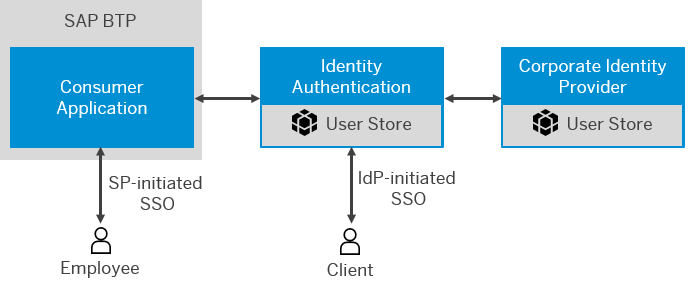

<!-- loio3a3bf9bcbee748dc88ca122469193b54 -->

# Configure Logon via Identity Authentication when a Corporate IdP is Chosen as Default

You can allow users to log on via Identity Authentication when a corporate identity provider \(IdP\) is chosen as default.

## Context

When a corporate identity provider is chosen as default, Identity Authentication acts as a proxy to delegate authentication to that external corporate identity provider. In this scenario, Identity Authentication acts as an SAML 2.0 identity provider to the service provider \(application\), and as a service provider to the corporate identity provider. When a user, for example an employee who exists in the user store of the corporate identity provider tries to access protected resource in the application, he or she is redirected by Identity Authentication to the corporate identity provider. The user is logged on, after providing the correct corporate credentials.

You can extend this scenario, allowing users that are stored in Identity Authentication to log on with their cloud credentials. These cloud users access the application, and are authenticated via Identity Authentication. Thus, in the extended scenario, the employees, log on to the application with their corporate credentials, while the external users, such as clients, or partners are authenticated via Identity Authentication. The IdP-initiated logon link that the external users should use to access the application is provided in the administration console of the Identity Authentication tenant.

> ### Note:  
> If you have configured a connection to a corporate user store, users with user records in Identity Authentication also can log on when the **Allow Identity Authentication Users Log On** option is enabled.

To configure the logon via Identity Authentication when a corporate identity provider is chosen as default, follow the procedures below:

> ### Note:  
> If you have already configured a corporate identity provider as default identity provider, skip [Choose a Corporate Identity Provider as Default](choose-a-corporate-identity-provider-as-default-44dd636.md) and proceed with [Use the Allow Identity Authentication Users Log On Option](use-the-allow-identity-authentication-users-log-on-option-2ec9a7f.md).

**Related Information**  

[Choose Default Identity Provider for an Application](choose-default-identity-provider-for-an-application-e9d8274.md "You choose between a local identity provider and a corporate identity provider to be the default identity provider for your application.")

[Configure Conditional Authentication for an Application](configure-conditional-authentication-for-an-application-0143dce.md "Tenant administrator can define rules for authenticating identity provider according to email domain, user type, user group, and IP range (specified in CIDR notation).")

[Configure Identity Federation for Applications](configure-identity-federation-for-applications-1e8e34e.md "Tenant administrator can enable identity federation for an application to override the identity federation settings on the configured corporate identity provider for the application.")

[Enable SSO with All Corporate Identity Providers](enable-sso-with-all-corporate-identity-providers-f7ec8d2.md "Tenant administrators can enable IdP-initiated Single Sign-On (SSO) from all configured corporate identity providers (IdPs).")

[Corporate User Store \(Neo Environment\)](corporate-user-store-neo-environment-461d71c.md#loio461d71c148594608b9c8b6d016e0a0c5 "Configure corporate user store for applications in the Neo environment to allow users to users to authenticate with their corporate credentials, without the need to use another set of credentials for their cloud access.")

