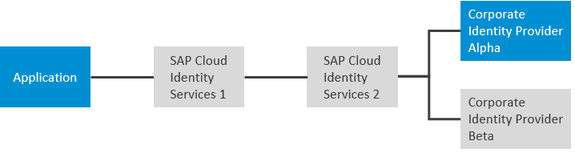
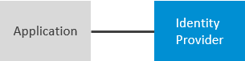

<!-- loio3a3bf9bcbee748dc88ca122469193b54 -->

# Configure Logon via Identity Authentication when a Corporate IdP is Chosen as Default

You can enable users to log on via Identity Authentication when a corporate identity provider \(IdP\) is chosen as default.

Sometimes you have multiple identity providers in your landscape, whether they are corporate identity providers or your SAP Cloud Identity Services - Identity Authentication tenant. By providing your users with preconfigured URLs, you can direct them to authenticate with specific identity providers for specific applications.

How you prepare these URLs depends on whether the user starts at the identity provider or at the application. It's further modified by your use case. Some typical use cases are described as follows.

<a name="loio3a3bf9bcbee748dc88ca122469193b54__d50e27"/>

## Opting for the Local Identity Provider

You can enable users that are stored in SAP Cloud Identity Services to log on with their Identity Authentication credentials. Thus, the employees log on to the application with their corporate credentials, while the external users, such as clients, partners, or SAP support users are authenticated by the local Identity Authentication tenant. Another example is if you're developing an application and you want to use a test user in the local identity provider instead of creating a test user in the corporate identity provider. The following figure illustrates this architecture.

  
  
**Sign On With the Local Identity Provider and not the Corporate Identity Provider**

> ### Example:  
> Example approuter link:
> 
> `https://approuter-myapplication.cfapps.eu20-001.hana.ondemand.com?sap_idp=https://my_sci_tenant.accounts.ondemand.com`
> 
> Example link:
> 
> `https://myapplication.cfapps.eu20-001.hana.ondemand.com?idp=https://my_sci_tenant.accounts.ondemand.com`
> 
> Example with local value:
> 
> `https://myapplication.cfapps.eu20-001.hana.ondemand.com?idp=local`

<a name="loio3a3bf9bcbee748dc88ca122469193b54__d50e75"/>

## Multiple Corporate Identity Providers

If your application doesn't define rules to determine which identity provider a user authenticates with, SAP Cloud Identity Services offers the choice to your users. To avoid users choosing the wrong identity provider, you can limit their choices. The following figure illustrates this architecture.

  
  
**Help Direct Users to the Correct Identity Provider**

> ### Example:  
> Example approuter link:
> 
> `https://approuter-myapplication.cfapps.eu20-001.hana.ondemand.com?sap_idp=https://corp_idp_2.mydomain.com`
> 
> Example link:
> 
> `https://myapplication.cfapps.eu20-001.hana.ondemand.com?idp=https://corp_idp_2.mydomain.com`

<a name="loio3a3bf9bcbee748dc88ca122469193b54__d50e111"/>

## Deep Hierarchy of Identity Providers

Your landscape has multiple levels of identity providers, perhaps through subsidiaries and conglomerate organizations. You want to direct your users to a specific identity provider, but this identity provider isn't directly known by your SAP Cloud Identity Services tenant. In such cases, provide the chain of identity providers to which the user must be redirected to reach the authenticating identity provider. The following figure illustrates this architecture.

  
  
**Deep Structure of Identity Providers**

> ### Example:  
> Example approuter link:
> 
> `https://approuter-myapplication.cfapps.eu20-001.hana.ondemand.com?sap_idp=https://scis_2.mydomain.com,corp_idp_alpha.mydomain.com`
> 
> Example link:
> 
> `https://myapplication.cfapps.eu20-001.hana.ondemand.com?idp=https://scis_2.mydomain.com,corp_idp_alpha.mydomain.com`

<a name="loio3a3bf9bcbee748dc88ca122469193b54__d50e148"/>

## Identity-Provider-Initiated Single Sign-On

> ### Restriction:  
> This option is only supported by SAML.

Identity-provider-initiated single sign-on \(IdP-initiated SSO\) is used for central portals in an enterprise from which users access applications. Users log on to the central portal first. You need to identify the identity provider the user must log on with. You also need to identify the service provider that the user is forwarded to after authenticating. The identity provider can be SAP Cloud Identity Services or a corporate identity provider or a hierarchy of corporate identity providers. Another unique aspect of IdP-initiated SSO is that the URL pattern you use is determined by SAP Cloud Identity Services. Otherwise, the URL is defined by the application. The following figure illustrates this architecture.

  
  
**Identity-Provider-Initiated Single Sign-On**

> ### Example:  
> Example SAML URL:
> 
> `https://my_sci_tenant.accounts.ondemand.com/saml2/idp/sso?sp=https://myapplication.cfapps.eu20-001.hana.ondemand.com&idp=https://corp_idp_1.mydomain.com`

**Related Information**  

[Choose Default Identity Provider for an Application](choose-default-identity-provider-for-an-application-e9d8274.md "You choose between a local identity provider and a corporate identity provider to be the default identity provider for your application.")

[Configure Conditional Authentication for an Application](configure-conditional-authentication-for-an-application-0143dce.md "Tenant administrator can define rules for authenticating identity provider according to email domain, user type, user group, and IP range (specified in CIDR notation).")

[Configure Identity Federation for Applications](configure-identity-federation-for-applications-1e8e34e.md "Tenant administrator can enable identity federation for an application to override the identity federation settings on the configured corporate identity provider for the application.")

[Enable SSO with All Corporate Identity Providers](enable-sso-with-all-corporate-identity-providers-f7ec8d2.md "Tenant administrators can enable IdP-initiated Single Sign-On (SSO) from all configured corporate identity providers (IdPs).")

[Corporate User Store \(Neo Environment\)](corporate-user-store-neo-environment-461d71c.md#loio461d71c148594608b9c8b6d016e0a0c5 "Configure corporate user store for applications in the Neo environment to allow users to users to authenticate with their corporate credentials, without the need to use another set of credentials for their cloud access.")

