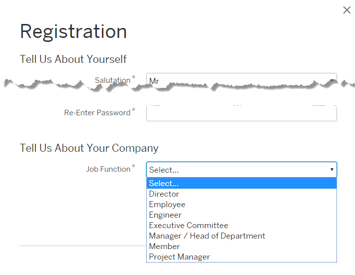

<!-- loioc068ac9258cc47f494dfd85025e8b6b8 -->

# Configure Master Data Texts Via Administration Console

The master data texts option can be used to configure the predefined master data for each resource in Identity Authentication via the administration console.


<a name="loioc068ac9258cc47f494dfd85025e8b6b8__prereq_c4b_hvf_ppb"/>

## Prerequisites

You are assigned the *Manage Tenant Configuration* role. For more information about how to assign administrator roles, see [Edit Administrator Authorizations](edit-administrator-authorizations-86ee374.md).


## Context

The predefined master data represents records in Identity Authentication that contain all relevant system data about a resource \(Salutations, Functions, Departments, Company Relationships, Industries, Languages, Countries\). That data can be used by the system for different classifications in the organization, for example, job titles, departments, or countries. The predefined master data texts are stored in `properties` documents, which can be accessed from the links in the table below.

**Predefined Master Data Texts**


<table>
<tr>
<th valign="top">

Resource

</th>
<th valign="top">

Link

</th>
<th valign="top">

Notes

</th>
</tr>
<tr>
<td valign="top">

Salutations

</td>
<td valign="top">

[Salutations.properties](../Development/change-master-data-texts-rest-api-b10fc6a.md#loiod4512bcbe9c8439896e06425f247c7af) 

</td>
<td valign="top">

Key value pairs with a predefined set of honorifics.

</td>
</tr>
<tr>
<td valign="top">

Functions

</td>
<td valign="top">

[Functions.properties](../Development/change-master-data-texts-rest-api-b10fc6a.md#loio78cb6d43814c4b179eda8282c28e8d2f) 

</td>
<td valign="top">

Key value pairs with a predefined set of job titles.

</td>
</tr>
<tr>
<td valign="top">

Departments

</td>
<td valign="top">

[Departments.properties](../Development/change-master-data-texts-rest-api-b10fc6a.md#loiod13c638f0d5d4a8889debf278fcb0275) 

</td>
<td valign="top">

Key value pairs with a predefined set of departments.

</td>
</tr>
<tr>
<td valign="top">

Company Relationships

</td>
<td valign="top">

[Relationships.properties](../Development/change-master-data-texts-rest-api-b10fc6a.md#loiof7eb5b72aed440fdb75657379bd368d1) 

</td>
<td valign="top">

Key value pairs with a predefined set of business entities, such as customer, partner, employee.

</td>
</tr>
<tr>
<td valign="top">

Industries

</td>
<td valign="top">

[Industries.properties](../Development/change-master-data-texts-rest-api-b10fc6a.md#loioe62f9b8fde264f3ab644bdaa5a7876e2) 

</td>
<td valign="top">

Key value pairs with a predefined set of industries.

</td>
</tr>
<tr>
<td valign="top">

Languages

</td>
<td valign="top">

[Languages.properties](../Development/change-master-data-texts-rest-api-b10fc6a.md#loio3be819bd3a3a498fa287542346a7add0) 

</td>
<td valign="top">

Key value pairs with a predefined set of languages.

</td>
</tr>
<tr>
<td valign="top">

Countries

</td>
<td valign="top">

[Countries.properties](../Development/change-master-data-texts-rest-api-b10fc6a.md#loioe4e7e4c52cf04295bf94465eba7ceaaa) 

</td>
<td valign="top">

Key value pairs with a predefined set of countries.

</td>
</tr>
</table>

The files contain configurable parameters stored as key value pairs of strings. Each key stores the unified key of the resource, and the corresponding value is the unified value of the resource that can be changed and updated.

The key value pairs are also visible in the administration console under the corresponding tabs.

The example below shows the customized values of the *Functions* file. The dropdown list in the *Job Function* field on the *Registration* form shows the new values that have overwritten the predefined texts in the file.



Depending on your requirements, you can review the texts that you have already overwritten in the predefined master data texts, change or delete existing key value pairs, add new key value pairs, or reset the texts to the default key value pairs.

> ### Caution:  
> Be careful if you change the keys when overwriting data texts, because this can result in invalid values. If a user has a certain value assigned, and the key value pair is overwritten with a different key, then the value for that property of the user will be no longer valid and visualized. For example, if you have set "Mr." to a user, and the key-value pair is "01=Mr.". If you overwrite the key value pair with "03=Mr.", "Mr." will not be visualized for that user.
> 
> When overwriting data texts, the keys for the different languages must be one and the same. For example, the master data texts for the German locale are overwritten, and the tenant administrator wants to overwrite the texts for the French locale. The keys for the German locale must be used as keys for the French locale.

The master data is sent in the SAML 2.0 assertion or OpenID Connect token with its key. For example:

```

<Attribute Name="salutation">
			<AttributeValue xmlns:xs="http://www.w3.org/2001/XMLSchema" xmlns:xsi="http://www.w3.org/2001/XMLSchema-instance" xsi:type="xs:string">0002</AttributeValue>
</Attribute>
```

> ### Remember:  
> It takes 2 minutes for the configuration changes to take place.

To change the master data texts via the administration console, proceed as follows:


## Procedure

1.  Sign in to the administration console for SAP Cloud Identity Services.

2.  Under *Applications and Resources*, choose the *Master Data* tile.

3.  Choose the language from the drop-down list.

    The default setting is English \(United States\).

4.  Choose the tab with the resource that you want.

5.  Find the text that you want to change.

    You can use the search field, or the sorting option, or you can expand the page for more results.

6.  You have the following options:

    -   Change existing texts - Choose the *Edit* button, find the text that you want to change, and replace it in the *Value* field with the new text. You can use the search field, or the sorting option, or you can expand the page for more results.
    -   Reset to default values- Choose the *Reset to Default* button. This action resets all master data texts from the chosen resource to their key value pairs.
    -   Add a new key value pair - Choose the *Add* button and provide key and value.

        > ### Note:  
        > You can't enter duplicate keys.

    -   Delete key value pairs - Find the key value pair that you want to delete, select the checkbox next to it and choose the *Delete* button.

7.  Save your changes.


**Related Information**  


[Tenant SAML 2.0 Configurations](tenant-saml-2-0-configurations-e81a19b.md "You as a tenant administrator can view and download the tenant SAML 2.0 metadata. You can also change the name format and update your certificate used by the identity provider to digitally sign the messages for the applications.")

[Get SAML 2.0 IdP Metadata via Parameter](get-saml-2-0-idp-metadata-via-parameter-2c76690.md "Tenant administrator can get the SAML 2.0 metadata via specific parameters.")

[Rotate Signing Certificates](rotate-signing-certificates-6621ad5.md "Tenant administrators must replace existing signing certificates with new ones before they expire. This ensures uninterrupted and secure communication between SAML 2.0 applications (referred to as service providers) and Identity Authentication as the identity provider.")

[Tenant OpenID Connect Configurations](tenant-openid-connect-configurations-3d6abcc.md "You as a tenant administrator can view and configure the tenant OpenID Connect configurations.")

[Change Tenant Texts Via Administration Console](change-tenant-texts-via-administration-console-c24b1d0.md "The change tenant texts option can be used to change the predefined texts and messages for end-user screens available per tenant in Identity Authentication via the administration console.")

[Configure Links Section on Sign-In Screen](configure-links-section-on-sign-in-screen-060c032.md "You can configure links to appear on the sign-in screen of your applications.")

[Add Instructions Section on Sign-In Screen](add-instructions-section-on-sign-in-screen-c9e717e.md "You can customize the sign-in screen of the Horizon theme with instructions for the user.")

[Configure X.509 Client Certificates for User Authentication](configure-x-509-client-certificates-for-user-authentication-52c7dcb.md "Tenant administrators can configure X.509 client certificates for user authentication as an alternative to authenticating with a user name and a password.")

[Enable Users to Generate and Authenticate with Certificates](enable-users-to-generate-and-authenticate-with-certificates-4cf818a.md "Allow users to generate and authenticate with certificates.")

[Configure Tenant Images](configure-tenant-images-8742046.md "You can configure a custom global logo and, or a background image on the forms for sign-in in, registration, upgrade, password update, and account activation for all applications in a tenant. You can also set a favicon for tenant.")

[Configure Allowed Logon Identifiers](configure-allowed-logon-identifiers-3adf1ff.md "Tenant administrators can choose the allowed logon identifiers for the users.")

[Configure User Identifier Attributes](configure-user-identifier-attributes-8b9fa88.md "Tenant administrators can configure user identifier attributes as required and unique for the tenant.")

[Configure Trust this browser Option](configure-trust-this-browser-option-5b8377e.md "Tenant administrator can set the number of days for which the users won't get prompted for second-factor authentication, if they sign in from the same browser.")

[Enable Back-Up Channels to Send Passcode for Deactivation of TOTP Two-Factor Authentication Devices](enable-back-up-channels-to-send-passcode-for-deactivation-of-totp-two-factor-authenticati-782935e.md "Tenant administrator can configure back-up channels to send TOTP deactivation passcodes to the user.")

[Password Recovery Options](password-recovery-options-777cee1.md "Enable users to reset their password via security questions, PIN code, or email link.")

[Configure Initial Password and Email Link Validity](configure-initial-password-and-email-link-validity-f8093f4.md "As a tenant administrator, you can configure the validity of the initial password and link sent to a user in the various application processes.")

[Configure Session Timeout](configure-session-timeout-5ca23e4.md "As a tenant administrator, you can configure when the session, created at the Identity Authentication tenant, expires.")

[Configure Trusted Domains](configure-trusted-domains-08fa1fe.md "Service providers that delegate authentication to Identity Authentication can protect their applications when using embedded frames, also called overlays, or when allowing user self-registration.")

[Use Custom Domain in Identity Authentication](use-custom-domain-in-identity-authentication-c4db840.md "Identity Authentication allows you to use a custom domain that is different from the default ones (<tenant ID>.accounts.ondemand.com or <tenant ID>.accounts.cloud.sap) - for example www.mytenant.com.")

[Change a Tenant's Display Name](change-a-tenant-s-display-name-a513c91.md "You can configure the tenant's name from the administration console for SAP Cloud Identity Services.")

[Configure Default Risk-Based Authentication for All Applications in the Tenant](configure-default-risk-based-authentication-for-all-applications-in-the-tenant-1aab51a.md#loio1aab51ae62b94f79b4c6dac7a00857c2 "You can define rules for authentication according to different risk factors and apply actions like Allow, Deny, and Two-Factor Authentication for all applications in a tenant.")

[Configure Sinch Service in Administration Console](configure-sinch-service-in-administration-console-3fdc9e1.md "Configure Sinch Service to enable Phone Verification via SMS or SMS Two-Factor Authentication in the administration console.")

[Configure RADIUS Server Settings \(Beta\)](configure-radius-server-settings-beta-03043ae.md "Configure Remote Authentication Dial-In User Service (RADIUS) server settings in the administration console for SAP Cloud Identity Services.")

[Configure Mail Server for Application Processes](configure-mail-server-for-application-processes-ccc7ba1.md "Configure mail server for the emails sent to the end users in the different application processes.")

[Configure IdP-Initiated SSO](configure-idp-initiated-sso-5d59caa.md "Enable or disable IdP-Initiated SSO via the administration console for SAP Cloud Identity Services.")

[Send Security Alert Emails](send-security-alert-emails-c977464.md "Send security alert emails to end-users or administrators when changes in their accounts are made.")

[Send System Notifications via Emails](send-system-notifications-via-emails-aa04a8b.md "You can configure the administration console to send emails with information about expiring certificates, system notifications, new administrators, and new applications to specific email addresses or to the emails of all administrators.")

[Configure Customer Managed Keys in Administration Console \(Restricted Availability\)](configure-customer-managed-keys-in-administration-console-restricted-availability-fe6e30c.md "")

[Configure Default Language for End User Screens](configure-default-language-for-end-user-screens-2cb73c3.md "Select the language that the end user screen uses if the language of the browser isn’t in the list of supported languages.")

[Configure P-User Next Index](configure-p-user-next-index-045bb1c.md "Set the value for the P-user next index.")

[Reuse SAP Cloud Identity Services Tenants for Different Customer IDs](reuse-sap-cloud-identity-services-tenants-for-different-customer-ids-ebd0258.md "You as a tenant administrator can reuse an existing tenant for configurations and automated subscriptions.")

