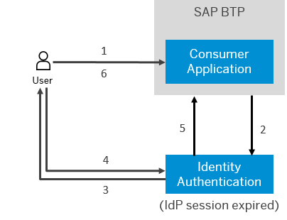

<!-- loio5ca23e44ec384760a3f68fceb93c6ecc -->

# Configure Session Timeout

As a tenant administrator, you can configure when the session, created at the Identity Authentication tenant, expires.

<a name="loio5ca23e44ec384760a3f68fceb93c6ecc__prereq_nyw_5cg_ppb"/>

## Prerequisites

You are assigned the *Manage Tenant Configuration* role. For more information about how to assign administrator roles, see [Edit Administrator Authorizations](edit-administrator-authorizations-86ee374.md).

## Context

The session timeout feature enables closing of the session at the IdP when the configured period has passed. Thе configuration determines how long the IdP keeps the session alive.

By default, the timeout session for Identity Authentication is 12 hours.

When the IdP session has expired, and the application session has also expired, or the user tries to access a second application, Identity Authentication forces the user to provide his or her credentials.

1.  Tries to access protected resource.
2.  Sends request to check if the user has rights to access.
3.  Opens Log On screen; forces user to provide credentials.
4.  Provides credentials.
5.  Grants access.
6.  User accesses content.

> ### Remember:  
> It takes 2 minutes for the configuration changes to take place.

To configure the session timeout period via the administration console for SAP Cloud Identity Services follow the procedure below:

<a name="loio5ca23e44ec384760a3f68fceb93c6ecc__steps_dnm_2hz_zz"/>

## Procedure

1.  Sign in to the administration console for SAP Cloud Identity Services.

2.  Under *Applications and Resources*, choose the *Tenant Settings* tile.

    At the top of the page, you can view the administrative and license relevant information of the tenant.

3.  Choose the *Session Timeout* list item.

4.  Set the session timeout period.

    1.  From the dropdown list on the right, select either *Minutes* or *Hours*.

    2.  From the dropdown list on the left, select a number for your choice.

    > ### Note:  
    > You can choose a value between *5* and *59* for *Minutes*, and *1* and *12* for *Hours*.
    > 
    > The default value is *12* hours.

5.  Save your changes.

    If the operation is successful, the system displays the message ***Session timeout updated***.

**Related Information**  

[Tenant SAML 2.0 Configuration](tenant-saml-2-0-configuration-e81a19b.md "You as a tenant administrator can view and download the tenant SAML 2.0 metadata. You can also change the name format and update your certificate used by the identity provider to digitally sign the messages for the applications.")

[Tenant OpenID Connect Configurations](tenant-openid-connect-configurations-3d6abcc.md "You as a tenant administrator can view and configure the tenant OpenID Connect configurations.")

[Change Tenant Texts Via Administration Console](change-tenant-texts-via-administration-console-c24b1d0.md "The change tenant texts option can be used to change the predefined texts and messages for end-user screens available per tenant in Identity Authentication via the administration console.")

[Configure Master Data Texts Via Administration Console](configure-master-data-texts-via-administration-console-c068ac9.md "The master data texts option can be used to configure the predefined master data for each resource in Identity Authentication via the administration console.")

[Configure Links Section on Sign-In Screen](configure-links-section-on-sign-in-screen-060c032.md "You can configure links to appear on the sign-in screen of your applications.")

[Add Instructions Section on Sign-In Screen](add-instructions-section-on-sign-in-screen-c9e717e.md "You can customize the sign-in sscreen of the Horizon theme with instructions for the user.")

[Configure X.509 Client Certificates for User Authentication](configure-x-509-client-certificates-for-user-authentication-52c7dcb.md "Tenant administrators can configure X.509 client certificates for user authentication as an alternative to authenticating with a user name and a password.")

[Configure Tenant Images](configure-tenant-images-8742046.md "You can configure a custom global logo and, or a background image on the forms for sign-in in, registration, upgrade, password update, and account activation for all applications in a tenant. You can also set a favicon for tenant.")

[Configure Allowed Logon Identifiers](configure-allowed-logon-identifiers-3adf1ff.md "Tenant administrators can choose the allowed logon identifiers for the users.")

[Configure User Identifier Attributes](configure-user-identifier-attributes-8b9fa88.md "Tenant administrators can configure user identifier attributes as required and unique for the tenant.")

[Configure Trust this browser Option](configure-trust-this-browser-option-5b8377e.md "Tenant administrator can set the number of days for which the users won't get prompted for second-factor authentication, if they sign in from the same browser.")

[Enable Back-Up Channels to Send Passcode for Deactivation of TOTP Two-Factor Authentication Devices](enable-back-up-channels-to-send-passcode-for-deactivation-of-totp-two-factor-authenticati-782935e.md "Tenant administrator can configure back-up channels to send TOTP deactivation passcodes to the user.")

[Enable Users to Recover Password with Security Questions](enable-users-to-recover-password-with-security-questions-d9ae898.md "Users can choose to answer security questions to reset their password.")

[Enable Users to Recover Password with PIN Code](enable-users-to-recover-password-with-pin-code-046a235.md "Users can choose to provide PIN code to reset their password.")

[Configure Initial Password and E-Mail Link Validity](configure-initial-password-and-e-mail-link-validity-f8093f4.md "As a tenant administrator, you can configure the validity of the initial password and link sent to a user in the various application processes.")

[Configure Trusted Domains](configure-trusted-domains-08fa1fe.md "Service providers that delegate authentication to Identity Authentication can protect their applications when using embedded frames, also called overlays, or when allowing user self-registration.")

[Use Custom Domain in Identity Authentication](use-custom-domain-in-identity-authentication-c4db840.md "Identity Authentication allows you to use a custom domain that is different from the default one (<tenant ID>.accounts.ondemand.com) - for example www.mytenant.com.")

[Change a Tenant's Display Name](change-a-tenant-s-display-name-a513c91.md "You can configure the tenant's name from the administration console for SAP Cloud Identity Services.")

[Configure Default Risk-Based Authentication for All Applications in the Tenant](configure-default-risk-based-authentication-for-all-applications-in-the-tenant-1aab51a.md#loio1aab51ae62b94f79b4c6dac7a00857c2 "You can define rules for authentication according to different risk factors and apply actions like Allow, Deny, and Two-Factor Authentication for all applications in a tenant.")

[Configure Sinch Service in Administration Console](configure-sinch-service-in-administration-console-3fdc9e1.md "Configure Sinch Service to enable Phone Verification via SMS or SMS Two-Factor Authentication in the administration console.")

[Configure RADIUS Server Settings \(Beta\)](configure-radius-server-settings-beta-03043ae.md "Configure Remote Authentication Dial-In User Service (RADIUS) server settings in the administration console for SAP Cloud Identity Services.")

[Configure Mail Server for Application Processes](configure-mail-server-for-application-processes-ccc7ba1.md "Configure mail server for the e-mails sent to the end users in the different application processes.")

[Configure IdP-Initiated SSO](configure-idp-initiated-sso-5d59caa.md)

[Send Security Alert E-Mails](send-security-alert-e-mails-c977464.md "Send security alert e-mails to end-users or administrators when changes in their accounts are made.")

[Send System Notifications via E-Mails](send-system-notifications-via-e-mails-aa04a8b.md "You can configure the administration console to send e-mails with information about expiring certificates, system notifications and new administrators to specific e-mail addresses or to the e-mails of all administrators.")

[Configure Default Language for End User Screens](configure-default-language-for-end-user-screens-2cb73c3.md "Select the language that the end user screen uses if the language of the browser isn’t in the list of supported languages.")

[Configure P-User Next Index](configure-p-user-next-index-045bb1c.md "Set the value for the P-user next index.")

[Reuse SAP Cloud Identity Services Tenants for Different Customer IDs](reuse-sap-cloud-identity-services-tenants-for-different-customer-ids-ebd0258.md "You as a tenant administrator can reuse an existing tenant for configurations and automated subscriptions.")

