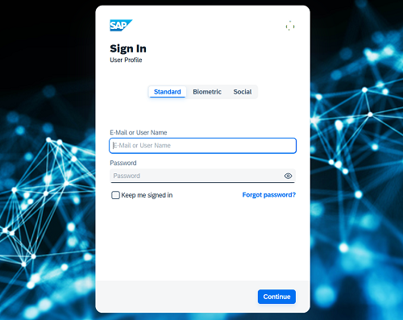

<!-- loio8742046ee4604bb6b3907beb5c6d9254 -->

# Configure Tenant Images

You can configure a custom global logo and, or a background image on the forms for sign-in in, registration, upgrade, password update, and account activation for all applications in a tenant. You can also set a favicon for tenant.

<a name="loio8742046ee4604bb6b3907beb5c6d9254__prereq_mxs_lzf_ppb"/>

## Prerequisites

-   You are assigned the *Manage Tenant Configuration* role. For more information about how to assign administrator roles, see [Edit Administrator Authorizations](edit-administrator-authorizations-86ee374.md).

-   \(for the background image only\) - You use the *Horizon* theme for your application. For more information, see [Configure a Branding Style for an Application](configure-a-branding-style-for-an-application-32f8d33.md).

<a name="loio8742046ee4604bb6b3907beb5c6d9254__context_w4c_nzf_ppb"/>

## Context

### Logo

The logo is displayed in the footer or header of the form that your users access to sign in or to register to an application. If you don't specify a company-specific tenant logo, the forms display the default SAP logo. SAP has configured the following default tenant logo.

You can use an image with a maximum height of 36 pixels.

> ### Note:  
> If the height of the image is larger than 36 pixels, the user forms show the logo proportionally resized to a height of 36 pixels. Thus, the quality will be preserved.
> 
> If the height of the image is lower than 36 pixels, the user forms resize the image. Otherwise, the quality is deteriorated.

The image file must have one of the following extensions: `.png`, `.gif`, `.jpeg`, or `svg`.

> ### Caution:  
> If the image is of format <svg\>, please make sure that the attribute `viewBox = "min-x min-y width height"` is present. For proper rendering the width and height values must be 100. For example, `viewBox="0 0 100 100"`

### Background Image

> ### Note:  
> The background image is applied only to applications that use the *Horizon* theme. For more information about the *Horizon* theme, see [Configure a Branding Style for an Application](configure-a-branding-style-for-an-application-32f8d33.md).

The background image is displayed behind the form that your users access to sign in or to register to an application.

If you do not specify a background image, the forms won't display anything.

The image file must have one of the following extensions: `.png`, or `.jpg`.

You can use an image with a maximum size of 600 KB \(1920x1080 pixels\)

> ### Remember:  
> The background image option is limited to mobile devices with minimum height of 599 pixels.

Identity Authentication doesn't store old versions the image. Once you upload a new image, the previous image is deleted.

### Favicon

Favicon is a shortcut icon in a browser's address bar, for browsers that support them. Browsers that provide favicon support typically display the favicon for a page in the browser's address bar and next to the page title on the tab. Browsers that support a tabbed document interface typically show a favicon for a page next to the page title on the tab. You can upload a file for a custom favicon of Identity Authentication.

The image file must have one of the following extensions: `.png`, or `.jpg` with a maximum size of 100 KB \(max 100x100 pixels\).

To configure a custom tenant logo a background image, and or a favicon, follow procedure below. It takes up to 2 minutes for the configuration changes to take place.

<a name="loio8742046ee4604bb6b3907beb5c6d9254__steps_dp2_hfl_vp"/>

## Procedure

1.  Sign in to the administration console for SAP Cloud Identity Services.

2.  Under *Applications and Resources*, choose the *Tenant Settings* tile.

    At the top of the page, you can view the administrative and license relevant information of the tenant.

3.  Under *Custonization*, choose the *Logo, Background Image and Favicon* list item.

4.  **Optional:** Choose the *Logo* tab, upload an image, and save your configuration.

    If the operation is successful, you receive the following message: ***Tenant logo updated***.

    > ### Tip:  
    > To restore the default logo, choose *Restore Default*.
    > 
    > If this operation is successful, you receive the following message: ***Default logo restored***.

5.  **Optional:** Choose the *Background Image* tab, upload an image, and save your configuration.

    If the operation is successful, you can see the image applied together with the following message: ***Tenant Background Image updated***.

    > ### Tip:  
    > To delete the background image, choose the *Delete* button.
    > 
    > If this operation is successful, you receive the following message: ***Background image deleted***.

6.  **Optional:** Choose the *Favicon* tab, upload an image, and save your configuration.

    If the operation is successful, you can see the image applied together with the following message: Tenant Favicon updated.

**Related Information**  

[Tenant SAML 2.0 Configuration](tenant-saml-2-0-configuration-e81a19b.md "You as a tenant administrator can view and download the tenant SAML 2.0 metadata. You can also change the name format and update your certificate used by the identity provider to digitally sign the messages for the applications.")

[Tenant OpenID Connect Configurations](tenant-openid-connect-configurations-3d6abcc.md "You as a tenant administrator can view and configure the tenant OpenID Connect configurations.")

[Change Tenant Texts Via Administration Console](change-tenant-texts-via-administration-console-c24b1d0.md "The change tenant texts option can be used to change the predefined texts and messages for end-user screens available per tenant in Identity Authentication via the administration console.")

[Configure Master Data Texts Via Administration Console](configure-master-data-texts-via-administration-console-c068ac9.md "The master data texts option can be used to configure the predefined master data for each resource in Identity Authentication via the administration console.")

[Configure Links Section on Sign-In Screen](configure-links-section-on-sign-in-screen-060c032.md "You can configure links to appear on the sign-in screen of your applications.")

[Add Instructions Section on Sign-In Screen](add-instructions-section-on-sign-in-screen-c9e717e.md "You can customize the sign-in screen of the Horizon theme with instructions for the user.")

[Configure X.509 Client Certificates for User Authentication](configure-x-509-client-certificates-for-user-authentication-52c7dcb.md "Tenant administrators can configure X.509 client certificates for user authentication as an alternative to authenticating with a user name and a password.")

[Configure Allowed Logon Identifiers](configure-allowed-logon-identifiers-3adf1ff.md "Tenant administrators can choose the allowed logon identifiers for the users.")

[Configure User Identifier Attributes](configure-user-identifier-attributes-8b9fa88.md "Tenant administrators can configure user identifier attributes as required and unique for the tenant.")

[Configure Trust this browser Option](configure-trust-this-browser-option-5b8377e.md "Tenant administrator can set the number of days for which the users won't get prompted for second-factor authentication, if they sign in from the same browser.")

[Enable Back-Up Channels to Send Passcode for Deactivation of TOTP Two-Factor Authentication Devices](enable-back-up-channels-to-send-passcode-for-deactivation-of-totp-two-factor-authenticati-782935e.md "Tenant administrator can configure back-up channels to send TOTP deactivation passcodes to the user.")

[Enable Users to Recover Password with Security Questions](enable-users-to-recover-password-with-security-questions-d9ae898.md "Users can choose to answer security questions to reset their password.")

[Enable Users to Recover Password with PIN Code](enable-users-to-recover-password-with-pin-code-046a235.md "Users can choose to provide PIN code to reset their password.")

[Configure Initial Password and Email Link Validity](configure-initial-password-and-email-link-validity-f8093f4.md "As a tenant administrator, you can configure the validity of the initial password and link sent to a user in the various application processes.")

[Configure Session Timeout](configure-session-timeout-5ca23e4.md "As a tenant administrator, you can configure when the session, created at the Identity Authentication tenant, expires.")

[Configure Trusted Domains](configure-trusted-domains-08fa1fe.md "Service providers that delegate authentication to Identity Authentication can protect their applications when using embedded frames, also called overlays, or when allowing user self-registration.")

[Use Custom Domain in Identity Authentication](use-custom-domain-in-identity-authentication-c4db840.md "Identity Authentication allows you to use a custom domain that is different from the default one (<tenant ID>.accounts.ondemand.com) - for example www.mytenant.com.")

[Change a Tenant's Display Name](change-a-tenant-s-display-name-a513c91.md "You can configure the tenant's name from the administration console for SAP Cloud Identity Services.")

[Configure Default Risk-Based Authentication for All Applications in the Tenant](configure-default-risk-based-authentication-for-all-applications-in-the-tenant-1aab51a.md#loio1aab51ae62b94f79b4c6dac7a00857c2 "You can define rules for authentication according to different risk factors and apply actions like Allow, Deny, and Two-Factor Authentication for all applications in a tenant.")

[Configure Sinch Service in Administration Console](configure-sinch-service-in-administration-console-3fdc9e1.md "Configure Sinch Service to enable Phone Verification via SMS or SMS Two-Factor Authentication in the administration console.")

[Configure RADIUS Server Settings \(Beta\)](configure-radius-server-settings-beta-03043ae.md "Configure Remote Authentication Dial-In User Service (RADIUS) server settings in the administration console for SAP Cloud Identity Services.")

[Configure Mail Server for Application Processes](configure-mail-server-for-application-processes-ccc7ba1.md "Configure mail server for the emails sent to the end users in the different application processes.")

[Configure IdP-Initiated SSO](configure-idp-initiated-sso-5d59caa.md)

[Send Security Alert Emails](send-security-alert-emails-c977464.md "Send security alert emails to end-users or administrators when changes in their accounts are made.")

[Send System Notifications via Emails](send-system-notifications-via-emails-aa04a8b.md "You can configure the administration console to send emails with information about expiring certificates, system notifications, new administrators, and new applications to specific email addresses or to the emails of all administrators.")

[Configure Customer-Controlled Encryption Keys in Administration Console \(Restricted Availability\)](configure-customer-controlled-encryption-keys-in-administration-console-restricted-availa-fe6e30c.md "")

[Configure Default Language for End User Screens](configure-default-language-for-end-user-screens-2cb73c3.md "Select the language that the end user screen uses if the language of the browser isn’t in the list of supported languages.")

[Configure P-User Next Index](configure-p-user-next-index-045bb1c.md "Set the value for the P-user next index.")

[Reuse SAP Cloud Identity Services Tenants for Different Customer IDs](reuse-sap-cloud-identity-services-tenants-for-different-customer-ids-ebd0258.md "You as a tenant administrator can reuse an existing tenant for configurations and automated subscriptions.")

