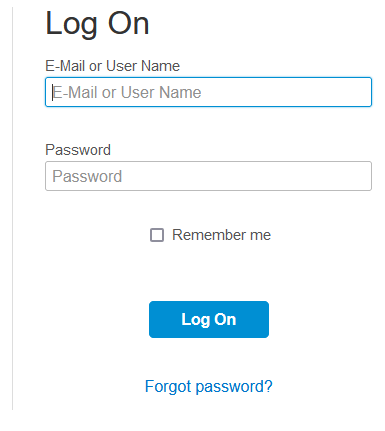

<!-- loio08d41f41ec0040a79c448b59987b12ac -->

# Configure the Remember Me Option

Tenant administrators can configure the *Remember me* option as visible or hidden, and checked or unchecked.

## Context

With the remember me option, a cookie is sent to the browser so the users can log on to an application without the need to provide their credentials every time they access it. The default configuration for the remember me option is: visible and unchecked. The default validity for remember me is 3 months. If the default configuration is preferred, users see the remember me option on the logon screen:

You can change the default configuration for the remember me option via the administration console for SAP Cloud Identity Services. The following options are available:

****

<table>
<tr>
<th valign="top">

Visible

</th>
<th valign="top">

Checked

</th>
<th valign="top">

Validity

</th>
<th valign="top">

Notes

</th>
</tr>
<tr>
<td valign="top">

Yes

</td>
<td valign="top">

No

</td>
<td valign="top">

-   1 month
-   3 months - the default choice
-   6 months
-   12 months
-   24 months
-   36 months

</td>
<td valign="top">

The default configuration. Users see the option on the logon screen as unchecked. The user is asked every time for credentials by the application. The validity of the cookie is as configured by the administrator. The default validity is 3 months.

</td>
</tr>
<tr>
<td valign="top">

Yes

</td>
<td valign="top">

Yes

</td>
<td valign="top">

-   1 month
-   3 months - the default choice
-   6 months
-   12 months
-   24 months
-   36 months

</td>
<td valign="top">

Users see the option on the logon screen as checked. A cookie is sent to the user's browser at first logon. It automatically logs the user on next time the application is accessed from the same browser on the user's local computer. The validity of the cookie is as configured by the administrator. The default validity is 3 months.

</td>
</tr>
<tr>
<td valign="top">

No

</td>
<td valign="top">

No

</td>
<td valign="top">

 

</td>
<td valign="top">

Users don't see the option on the logon screen.

</td>
</tr>
<tr>
<td valign="top">

No

</td>
<td valign="top">

Yes

</td>
<td valign="top">

-   1 month
-   3 months - the default choice
-   6 months
-   12 months
-   24 months
-   36 months

</td>
<td valign="top">

Users don't see the option on the logon screen, but the option is checked for them. A cookie is sent to the user's browser at first logon. It automatically logs the user on next time the application is accessed from the same browser on the user's local computer. The validity of the cookie is as configured by the administrator. The default validity is 3 months.

</td>
</tr>
</table>

> ### Note:  
> Remember me tokens generated for an application are valid for all applications in the tenant. If the option is enabled, the cookie validity of the first application that is accessed by the user is taken into consideration and all other applications have the same cookie validity despite their configuration in the administration console.

> ### Restriction:  
> The remember me option is supported only when Identity AuthenticationWhen multiple identity providers are allowed for an application via conditional is set as the default local identity provider for the application. When the authentication is done via a corporate identity provider no cookie is sent to the user's browser.

## Procedure

1.  Sign in to the administration console for SAP Cloud Identity Services.

2.  Choose the application that you want to edit.

    > ### Note:  
    > Type the name of the application in the search field to filter the list items, or choose the application from the list on the left.
    > 
    > If you don’t have a created application in your list, you can create one. For more information, see [Create a New Application](create-a-new-application-0d4b255.md).

3.  Choose the *Authentication and Access* tab.

4.  Under *Authentication*, choose *Remember Me Settings* option is and configure the options according to your needs.

5.  Save your changes.

