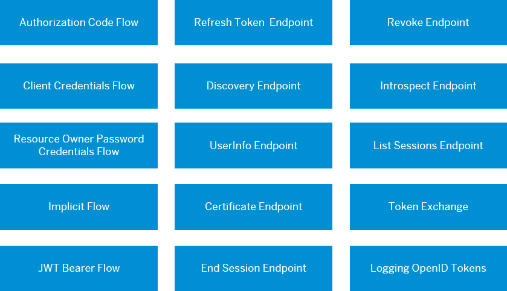

<!-- loioa789c9c8c0f5439da8c30b5d9e43bece -->

# Configuring OpenID Connect

You can use Identity Authentication for authentication in OpenID Connect protected applications.

OpenID Connect is a simple identity layer on top of the OAuth 2.0 protocol. Clients can verify the identity of the end-user based on the authentication performed by an authorization server, as well as to obtain basic profile information about the end-user in an interoperable and REST-like manner. For more information about the OpenID Connect specification, see [OpenID Connect Core 1.0](https://openid.net/specs/openid-connect-core-1_0.html).

The OpenID Connect implementation of Identity Authentication supports all flow from OpenID Connect Core 1.0.

In addition to the core, the service also supports the following:

-   [Discovery](https://openid.net/specs/openid-connect-discovery-1_0.html)

-   [Front-Channel Logout](https://openid.net/specs/openid-connect-frontchannel-1_0.html)

Based on your scenario, choose one of the flows to see how to authorize access to your application:

