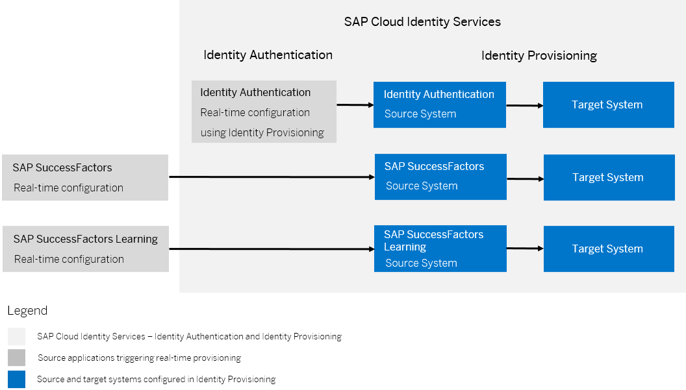

<!-- loio617dd4b247e94ea682d528d61e0cb522 -->

# Configuring Real-Time Provisioning

As a tenant administrator, you can configure real-time provisioning to immediately provision entities from source to target systems.

This feature allows you to synchronize newly created, updated or deleted users and groups without the need to run manual or scheduled jobs in Identity Provisioning. It is useful in scenarios where synchronous provisioning is required, such as: user self-registration that needs immediate system access.

The real-time provisioning process involves the following set-ups. First, you need a source application which triggers the real-time sync when changes occur. Second, you must configure the source application as a source system in the Identity Provisioning. Finally, you need to add one or more target systems in the Identity Provisioning, where the real-time changes will be synchronized and reflected immediately.

The following diagram illustrates the process.

Changes related to users in Identity Authentication can also be provisioned real-time directly to SAP Jam without using Identity Provisioning. For more information, see [Configure SAP Jam for Real-Time Provisioning](configure-sap-jam-for-real-time-provisioning-a923427.md)

<a name="loio617dd4b247e94ea682d528d61e0cb522__section_nkh_qb5_53b"/>

## Standard vs Real-Time

<table>
<tr>
<th valign="top">

Provisioning Mode

</th>
<th valign="top">

Use Case

</th>
<th valign="top">

Key Differences

</th>
<th valign="top">

Source Systems

</th>
</tr>
<tr>
<td valign="top">

*Standard* 

</td>
<td valign="top">

Use it for initial, regular and scheduled *Read* and *Resync* provisioning jobs of users and groups from any supported source system to any target system.

</td>
<td valign="top">

-   Starting a provisioning job in Identity Provisioning is required.

-   Users and groups \(roles\) are provisioned.

-   Filtering properties are considered.

</td>
<td valign="top">

**All source systems**

\(supported by Identity Provisioning\)

</td>
</tr>
<tr>
<td valign="top">

*Real-Time* 

</td>
<td valign="top">

Use it for instant provisioning of a single or a number of users or groups that were newly created or updated in the supported source system to any target system.

</td>
<td valign="top">

-   You don't start a provisioning job. Changes in the user account \(create, update, delete\) trigger real-time sync.

-   Users and groups are provisioned real time.

    > ### Note:  
    > Real-time provisioning of groups can be configured for each source system that supports the execution of requests to the `/Groups` endpoint of the Real-time provisioning API.

-   Filtering properties are not considered.

</td>
<td valign="top">

-   Identity Authentication

-   Local Identity Directory

-   SAP SuccessFactors

-   SAP SuccessFactors Learning

</td>
</tr>
</table>

<a name="loio617dd4b247e94ea682d528d61e0cb522__section_rph_ygw_pxb"/>

## Real-Time Workflow

Configuring real-time provisioning involves the following steps:

1.  Create a technical user for accessing the real-time provisioning API and assign it the *Access Real-Time Provisioning API* permission. This user must be an administrator of type *System*.

    For more information, see [Add System as Administrator](add-administrators-bbbdbdd.md#loiocefb742a36754b18bbe5c3503ac6d87c).

2.  Configure the application which triggers real-time provisioning as a source system in Identity Provisioning, for example SAP SuccessFactors.

    For more information, see [Source Systems](../source-systems-58033be.md).

3.  Connect this source system to one or more target systems, for example Identity Authentication.

    For more information, see [Target Systems](../target-systems-ab3f641.md) and [Provision Users to Target Systems](provision-users-to-target-systems-af6f78b.md).

4.  Enable the real-time provisioning configuration in the source application that triggers it, for example SAP SuccessFactors.

    For more information, see [Enable Real-Time Provisioning in Source Applications](enable-real-time-provisioning-in-source-applications-0767587.md).

5.  Create or update a user in the source application. For example, create a user with *Onboardee* user account type in SAP SuccessFactors.

    As a result, the onboardee user will be immediately provisioned to Identity Authentication.

