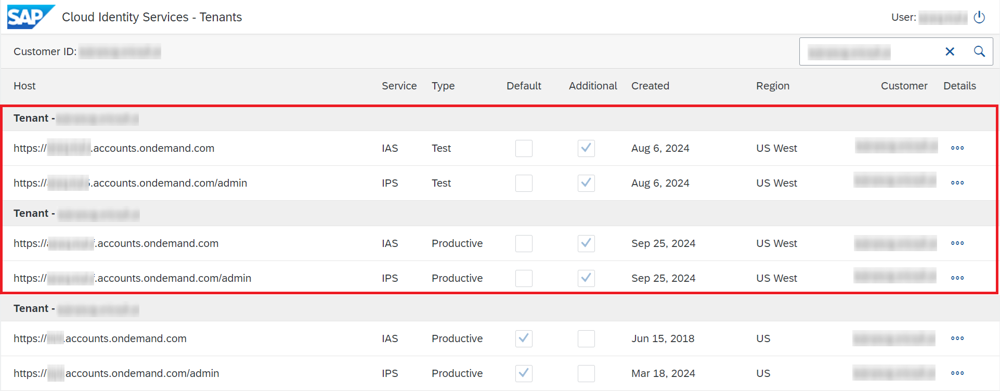

<!-- loio3f1cac2ee01e4f8986047dcde6ad6680 -->

# Connect to On-Premise Systems

Set up the connection to on-premise systems when your Identity Provisioning bundle or standalone tenant is running on the infrastructure of SAP Cloud Identity Services.

<a name="loio3f1cac2ee01e4f8986047dcde6ad6680__prereq_upg_hpg_xlb"/>

## Prerequisites

-   You have installed the Cloud Connector \(for SAP BTP, Cloud Foundry environment\), and have done the initial configuration. For more information, see [Cloud Connector](https://help.sap.com/viewer/cca91383641e40ffbe03bdc78f00f681/Cloud/en-US/e6c7616abb5710148cfcf3e75d96d596.html).

## Context

If your provisioning scenarios involve on-premise systems, this requires a separate configuration in three places:

-   SAP BTP cockpit, where you subscribe to the Cloud Identity Services connectivity plan in your multi-environment subaccount.

-   SAP Cloud Connector, where the connection to your multi-environment subaccount is established, and the backend \(on-premise\) system is defined.

-   The Identity Provisioning section of SAP Cloud Identity Services administration console, where you configure the on-premise provisioning systems.

## Procedure

1.  Before you start actual configuration, access the *SAP Cloud Identity Services - Tenants* application at the following URL: [https://iamtenants.accounts.cloud.sap/](https://iamtenants.accounts.cloud.sap/) to view the region and the type of Identity Authentication and Identity Provisioning tenants assigned to your customer ID. You will need this information later when creating multi-environment subaccount.

    For more information, see [Viewing Assigned Tenants and Administrators](https://help.sap.com/docs/IDENTITY_AUTHENTICATION/6d6d63354d1242d185ab4830fc04feb1/f56e6f24e373404087d6a1a9a13515a2.html?version=Cloud).

    The screenshot below illustrates a customer landscape with Identity Authentication and Identity Provisioning tenants running on their common SAP Cloud Identity Services infrastructure in one region US/Canada \(in the red frame\). The first pair is used for testing purposes and the second one for productive purposes.

    

2.  Log on to SAP BTP cockpit and choose your global account.

    If you have only one global account, you are automatically taken there. If you have multiple ones, select the global account you want to set up connection to on-premise system.

    For more information on how to navigate in the SAP BTP cockpit, refer to [Navigate in the Cockpit](https://help.sap.com/docs/BTP/65de2977205c403bbc107264b8eccf4b/0874895f1f78459f9517da55a11ffebd.html).

3.  Create a multi-environment subaccount in the Cloud Foundry region that maps the region of the Identity Authentication tenant \(where the Identity Provisioning is also running\). See the mapping table below.

    <table>
    <tr>
    <th valign="top">

    Identity Authentication Region
    
    </th>
    <th valign="top">

    Cloud Foundry Region
    
    </th>
    </tr>
    <tr>
    <td valign="top">
    
    Rot \(Germany\) / Amsterdam \(Netherlands\)
    
    </td>
    <td valign="top">
    
    Europe \(Frankfurt\) AWS
    
    </td>
    </tr>
    <tr>
    <td valign="top">
    
    Germany \(Frankfurt\)
    
    </td>
    <td valign="top">
    
    Europe \(Frankfurt\) AWS
    
    </td>
    </tr>
    <tr>
    <td valign="top">
    
    UAE \(Dubai\)
    
    </td>
    <td valign="top">
    
    Europe \(Frankfurt\) AWS
    
    </td>
    </tr>
    <tr>
    <td valign="top">
    
    Saudi Arabia \(Riyadh\)
    
    </td>
    <td valign="top">
    
    Europe \(Frankfurt\) AWS
    
    </td>
    </tr>
    <tr>
    <td valign="top">
    
    Australia \(Sydney\) / Japan \(Tokyo\)
    
    </td>
    <td valign="top">
    
    Australia \(Sydney\) AWS
    
    </td>
    </tr>
    <tr>
    <td valign="top">
    
    China \(Shanghai\)
    
    </td>
    <td valign="top">
    
    Singapore AWS
    
    </td>
    </tr>
    <tr>
    <td valign="top">
    
    Singapore
    
    </td>
    <td valign="top">
    
    Singapore AWS
    
    </td>
    </tr>
    <tr>
    <td valign="top">
    
    South Korea \(Seoul\)
    
    </td>
    <td valign="top">
    
    South Korea \(Seoul\) AWS
    
    </td>
    </tr>
    <tr>
    <td valign="top">
    
    Japan \(Tokyo\) / Japan \(Osaka\)
    
    </td>
    <td valign="top">
    
    Japan \(Tokyo\) AWS
    
    </td>
    </tr>
    <tr>
    <td valign="top">
    
    Brazil \(São Paulo\)
    
    </td>
    <td valign="top">
    
    Brazil \(São Paulo\) AWS
    
    </td>
    </tr>
    <tr>
    <td valign="top">
    
    United States \(Sterling\) / Canada \(Toronto\)
    
    </td>
    <td valign="top">
    
    US East \(VA\) AWS
    
    </td>
    </tr>
    <tr>
    <td valign="top">
    
    Canada \(Toronto\)
    
    </td>
    <td valign="top">
    
    Canada \(Montreal\) AWS
    
    </td>
    </tr>
    <tr>
    <td valign="top">
    
    USA West \(Quincy\)
    
    </td>
    <td valign="top">
    
    US West \(WA\) Azure
    
    </td>
    </tr>
    <tr>
    <td valign="top">
    
    Switzerland \(Zürich\)
    
    </td>
    <td valign="top">
    
    Switzerland Azure
    
    </td>
    </tr>
    <tr>
    <td valign="top">
    
    India \(Mumbai\)
    
    </td>
    <td valign="top">
    
    India AWS
    
    </td>
    </tr>
    </table>
    
    For example, customers with Identity Authentication and Identity Provisioning tenants in US/Canada region must create a Cloud Foundry subaccount in US East \(VA\) AWS region.

    Once you create the subaccount, you must enable Cloud Foundry for this subaccount.

    > ### Note:  
    > If you already have a Cloud Foundry subaccount, you can use it.

4.  Open your subaccount, and from the left-side panel choose *Service Marketplace* \> *Integration Suite* \> *Cloud Identity Services*.

5.  Choose *Create*, select the *connectivity* plan and then *Next*.

    > ### Note:  
    > If the connectivity plan is not present, navigate to *Entitlements* \> *Configure Entitlements* \> *Add Service Plans*. Search for *Cloud Identity Services* \> *connectivity plan*, add it as service plan and save your changes.

    > ### Note:  
    > You can create only one subscription plan per subaccount. This means, you cannot have connectivity along with additional-tenant plan in the same subaccount.

6.  From the *Cloud Service Type* dropdown, choose for what type of tenant \(test or productive\) you want to use the subaccount.

    -   *Test*

    -   *Productive* - default value

7.  Choose *Next* and then *Create*.

    This creates a subscription to Cloud Identity Services connectivity plan and creates a binding to your Identity Authentication tenant and your Identity Provisioning service.

    > ### Note:  
    > You can have two separate Cloud Foundry subaccounts per region: one of them configured for *Productive* connections and the other for *Test* connections. While it is allowed to create multiple Cloud Foundry subaccounts per one region and per one type \(test or productive\), be aware that in this case only the first one where the connectivity plan was enabled will be used by Identity Provisioning.
    > 
    > The service instance types *Test* and *Productive* map to the tenant types displayed in the *SAP Cloud Identity Services - Tenants* application which is accessible at [https://iamtenants.accounts.cloud.sap/](https://iamtenants.accounts.cloud.sap/).

8.  Now, you need to add and connect your subaccounts to the Cloud Connector. Log on to the Cloud Connector administration UI and choose *Add Subaccount*.

    For more information, see [Managing Subaccounts](https://help.sap.com/docs/CP_CONNECTIVITY/cca91383641e40ffbe03bdc78f00f681/f16df12fab9f4fe1b8a4122f0fd54b6e.html).

9.  Verify that the Cloud Connector is connected to your Cloud Foundry subaccount. In SAP BTP cockpit, from the left-side panel, choose *Connectivity* \> *Cloud Connectors* to see your up and running cloud connector tunnels.

10. Return to the Cloud Connector and define the backend \(on-premise\) system.

11. Return to your subaccount in SAP BTP cockpit and navigate to *Connectivity* \> *Destinations* to configure the destination for your on-premise system.

    > ### Note:  
    > This step is mandatory only for SAP Application Server ABAP. For the other on-premise systems, you can use the *Properties* tab.

    For more information, see: [Create RFC Destinations](https://help.sap.com/docs/CP_CONNECTIVITY/cca91383641e40ffbe03bdc78f00f681/9b3cc683cca944bd98346bef3181630e.html) and [SAP Application Server ABAP → step 2](https://help.sap.com/docs/IDENTITY_PROVISIONING/f48e822d6d484fa5ade7dda78b64d9f5/5235087c8a6e4860aac36a8c3675fb9d.html).

12. Sign in to SAP Cloud Identity Services administration console.

    The URL follows the pattern: <code>https://<i class="varname">&lt;tenant_id&gt;</i>.accounts.ondemand.com/admin</code>

13. In the Identity Provisioning section, add an on-premise system \(source, target or proxy\).

14. If you want to create a connection to SAP AS ABAP, from the *Destination Name* combo box, select the destination you have created in the cockpit and save your configurations.

    If you want to create a connection to other on-premise systems, configure the connection details on the *Properties* tab of the given system.

15. \(Optional\) If your Cloud Connector is configured with *Location ID*, this location identifier must also be set for the respective on-premise system. You have the following options:

    -   Connectivity destination - Create it in your subaccount in the SAP BTP cockpit and provide the Location ID there.

        > ### Note:  
        > Using connectivity destination is mandatory only for SAP Application Server ABAP.

    -   `CloudConnectorLocationId` property - Configure the property in the Identity Provisioning section of SAP Cloud Identity Services administration console for all HTTP and LDAP-based systems, SSH Server \(Beta\) and SAP HANA Database \(Beta\) with ProxyType set to `OnPremise`.

        Alternatively, for HTTP-based systems only, you can add the Identity Provisioning `ips.http.header.`*<header\_name\>* property, where the header name is: `SAP-Connectivity-SCC-Location_ID` and the value is the Location ID. For example: `ips.http.header.SAP-Connectivity-SCC-Location_ID=<LocationID>`

16. Add another provisioning system, connect it to your on-premise one, and run a provisioning job.

**Related Information**  

[Add New Systems](add-new-systems-bd214dc.md "You can add source, target, and proxy systems for your provisioning scenarios.")

[Search and Edit Systems](search-and-edit-systems-68a02be.md "You can search and edit source, target, and proxy systems in the Identity Provisioning user interface.")

[Enable and Disable Systems](enable-and-disable-systems-89da372.md "You can enable and disable source and target systems in Identity Provisioning.")

[Export and Import Systems](export-and-import-systems-1de7de0.md "You can export and import source, target and proxy systems in Identity Provisioning.")

[Delete Systems](delete-systems-3a37213.md "You can delete a source, target, or proxy system from Identity Provisioning.")

[Update Connector Version](update-connector-version-8558733.md "Update a connector version to allow your provisioning system to use a new API.")

[Manage Properties](manage-properties-4e2bc9d.md "You can add, delete and modify properties for a system in Identity Provisioning.")

[Manage Transformations](manage-transformations-2d0fbe5.md "You can manage transformations with graphical and JSON text editor. Regardless of which one you choose, the following initial steps are the same.")

[Manage Certificates](manage-certificates-86d06a0.md "Identity Provisioning supports certificate-based authentication for secure communication with the provisioning systems (connectors) provided by the service.")

[Manage Full and Delta Read](manage-full-and-delta-read-b7f817c.md "When you set up your systems and start a scheduled provisioning task, the standard behavior of the process reads all the entities from the source system. This mode prevents data loss and always keeps your target system synchronized with the source. However, it may take a long time for every job to be executed.")

[Manage Deleted Entities](manage-deleted-entities-3d6bdf1.md "Manage deletion of entities (users or groups) in the target system after they have been deleted from the source system.")

[Start and Stop Provisioning Jobs](start-and-stop-provisioning-jobs-531a261.md "You can start and stop a provisioning job from the Identity Provisioning user interface (UI) or from an API client by using the Identity Provisioning tenant admin API.")

[Handle Rate Limits](handle-rate-limits-15f7f23.md "Identity Provisioning APIs implement rate limits to control the number of incoming requests for a given time.")

[Handle Failed Operations](handle-failed-operations-0382a0c.md "In certain cases, you can set a retry for a failed operation due to an occurred exception.")

[Reset Identity Provisioning Tenant](reset-identity-provisioning-tenant-8c7ba9a.md "Resetting your Identity Provisioning tenant deletes all systems you have set up for this tenant (subaccount), along with the relevant job execution logs.")

[Reset Identity Provisioning System](reset-identity-provisioning-system-0bc1e53.md "Resetting an Identity Provisioning system (source or target) deletes all Identity Provisioning operational data.")

[Start and Stop Provisioning Jobs](start-and-stop-provisioning-jobs-531a261.md "You can start and stop a provisioning job from the Identity Provisioning user interface (UI) or from an API client by using the Identity Provisioning tenant admin API.")

