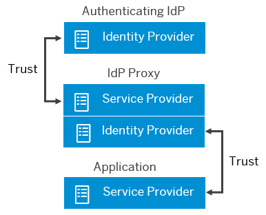

<!-- loio19f3eca47db643b6aad448b5dc1075ad -->

# Corporate Identity Providers

Initially, Identity Authentication is set as the default identity provider for the applications. This section describes the scenarios in which Identity Authentication acts as a proxy to delegate the authentication to a corporate identity provider.

## Identity Provider Proxy Overview

An identity provider can function as a proxy for another identity provider. An identity provider proxy enables you to create structures of trust relationships that ultimately simplify the management of your applications.

A proxy relationship involves the following participants:

-   Corporate Identity Provider

    The identity provider proxy trusts the authenticating identity provider.

-   Identity Provider Proxy

    The identity provider proxy is both an identity provider and a service provider. The service provider of the identity provider proxy trusts the authenticating identity provider.

-   Application

    A service provider hosts a service that users want to access. This service provider trusts the identity provider of the identity provider proxy.

There is no direct trust relationship between the authenticating identity provider and the service provider that the user is trying to access.

Identity Authentication acting as a proxy can use a SAML 2.0 or an OpenID Connect identity provider as an external authenticating authority for the application. The choice of one or the other protocol depends on your scenario and needs.

For example, if you are having a mobile application, the recommended protocol is OpenID Connect. On the other hand, if in your scenario Identity Authentication acts as proxy to multiple identity providers and you allow the partner users to login via their corporate identity providers, the choice is SAML 2.0.

