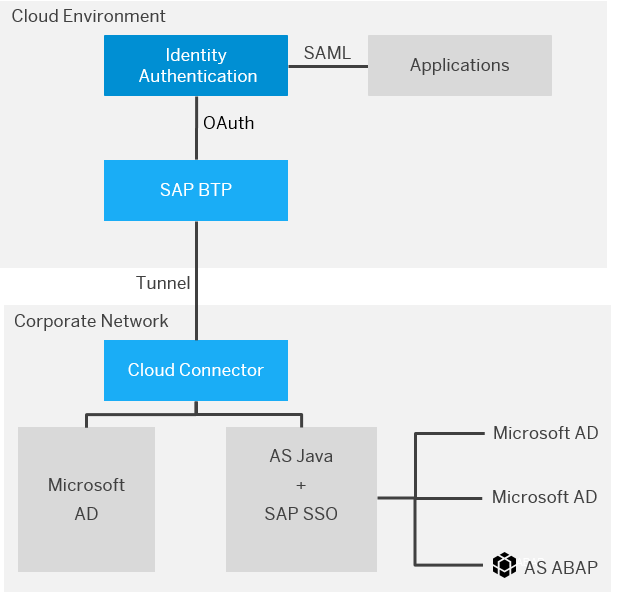
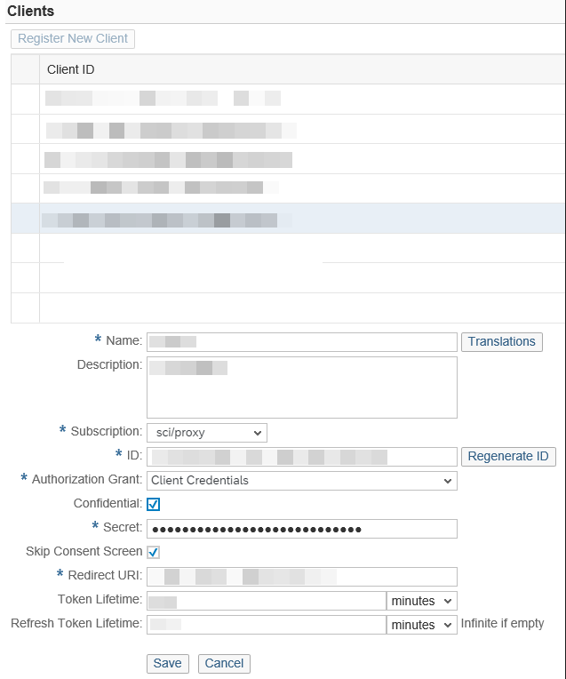
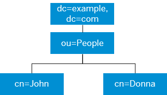

<!-- loio461d71c148594608b9c8b6d016e0a0c5 -->

# Corporate User Store \(Neo Environment\)

Configure corporate user store for applications in the Neo environment to allow users to users to authenticate with their corporate credentials, without the need to use another set of credentials for their cloud access.

> ### Note:  
> The content in this section is only relevant for SAP BTP, Neo environment.

> ### Note:  
> The content in this section is not relevant for China \(Shanghai\) region.


## Overview

Identity Authentication can connect with the following corporate user stores:

-   Microsoft Active Directory
-   SAP NetWeaver AS JAVA, with the following variants:
    -   SAP NetWeaver AS JAVA - UME
    -   Multiple Active Directories connected to SAP NetWeaver AS JAVA - UME
    -   SAP NetWeaver AS ABAP connected to SAP NetWeaver AS JAVA - UME


This scenario works with an SAP BTP application named *proxy* and provided by an SAP BTP subaccount named *sci*. The proxy application on SAP BTP uses the OAuth authentication mechanism when communicating with Identity Authentication.

> ### Restriction:  
> The *sci proxy* application is not supported for China.

The connection between SAP BTP and the corporate user store is carried out with an Cloud Connector.




## Authentication Flow

The *Corporate User Store* option is configured properly. A user tries to access a trusted application for the first time with the on-premise credentials, *Login Name* and *Password* entered correctly. This user is authenticated successfully against the corporate user store. With this initial successful authentication of the user, a partial user record is created in the user store for Identity Authentication. It is created with user details taken from the corporate user store. The cloud user store does not copy the user's credentials. For more details about what data is copied from the corporate user store, see [User Records](corporate-user-store-neo-environment-461d71c.md#loio2243cbca63e5480fb4a6e2bba8049678). With subsequent logins, the user is always authenticated against the corporate user store, and the user record is updated.

For the first logon with on-premise credentials, the user enters his or her *Login Name* and a *Password*. For subsequent logins the user can use either his or her *Login Name*, *E-Mail*, or *User ID*, and the *Password* .

> ### Remember:  
> If the user has enabled the *Remember me* option, the following limitations are observed:
> 
> -   when a user is authenticating with remember me cookie, his or her user record in Identity Authentication is not updated.
> -   if the user changes his or her password in the corporate network, the remember me cookie is not invalidated.
> 
> For more information, see [Use the Remember Me Option](../User-Guide/use-the-remember-me-option-bc7c6c6.md).

> ### Note:  
> The user in the corporate user store must have the `mail` attribute.
> 
> The tenant administrator needs to monitor and prevent the coexistence of a cloud and on-premise user with one and the same e-mail address. The tenant administrator has to instruct the users to logon for the first time with their *Login Name*, not with the *E-Mail*.

If a user with a user record in the cloud user store is deleted in the corporate user store, the user cannot authenticate using Identity Authentication. The user record for this user remains in the cloud user store, and the tenant administrator can delete it via the administration console for SAP Cloud Identity Services. For more information, see [Delete Users](delete-users-bbfaf5f.md).

For all users from the corporate user store, a second factor for authentication can be enabled for some applications, or cloud user groups can be assigned. For more details, see [Configure Risk-Based Authentication for an Application](configure-risk-based-authentication-for-an-application-bc52fbf.md#loiobc52fbf3d59447bbb6aa22f80d8b6056) and [Assign Groups to a User](assign-groups-to-a-user-bfdeb9c.md).


## Control Access to Applications and Resources

In the scope of the *Corporate User Store* scenario, you can manage access to applications and their resources based on the groups available in the corporate user store.

The corporate user groups are sent to an application in the SAML 2.0 assertion. `corporate_groups` is the attribute that contains the groups that the user in the corporate user store is assigned to. For more details about how the groups are sent to the application in the SAML 2.0 assertion, see [Configure the User Attributes Sent to the Application](configure-the-user-attributes-sent-to-the-application-d361407.md).

> ### Note:  
> If your application is deployed on the SAP BTP, the corporate user store groups, relevant for the application, and contained in the `corporate_groups` attribute in the SAML 2.0 assertion, can be mapped to assertion-based groups created in SAP BTP cockpit. For more information, see the *4. \(If Using an Identity Provider\) Define the Group-to-Role Mapping* section in [Managing Roles](https://help.hana.ondemand.com/help/frameset.htm?db8175b9d976101484e6fa303b108acd.html).

You can also restrict access to applications based on membership in a corporate user group by setting different rules via risk-based authentication. For more information, see [Configure Risk-Based Authentication for an Application](configure-risk-based-authentication-for-an-application-bc52fbf.md#loiobc52fbf3d59447bbb6aa22f80d8b6056).

 <a name="loio2243cbca63e5480fb4a6e2bba8049678"/>

<!-- loio2243cbca63e5480fb4a6e2bba8049678 -->

## User Records

When a user has been successfully authenticated for the first time with the credentials from the corporate user store, a record for that user is created in Identity Authentication. That user record is created with details from the corporate user store. In this record, the user is created with a *User Type* `employee`. This *User Type* cannot be changed.

For more information about the attributes taken from the Active Directory and their mapping to the user store of Identity Authentication, see **Configure SAP BTP When Connecting to an LDAP User Store** in [Configure SAP BTP](corporate-user-store-neo-environment-461d71c.md#loiof48d4ea4ec4747ac8425385ded5d1e25).

**Related Information**  


[Security Information](../Security/security-information-6e88d82.md "This document is an overview of security-relevant information that applies to Identity Authentication, and contains recommendations about how administrators should secure it.")

 <a name="loioe5e9662146f948b49c11d01284231d75"/>

<!-- loioe5e9662146f948b49c11d01284231d75 -->

## Configure Connection to a Corporate User Store

To configure connection to a corporate user store, you have to make the following configurations in SAP BTP and in Identity Authentication.

For more details about how to configure these systems, see:

-   [Configure SAP BTP](corporate-user-store-neo-environment-461d71c.md#loiof48d4ea4ec4747ac8425385ded5d1e25)
-   [Configure Identity Authentication](corporate-user-store-neo-environment-461d71c.md#loio2c3ede1d7c454b8a8f820248ee3b705c)

 <a name="loiof48d4ea4ec4747ac8425385ded5d1e25"/>

<!-- loiof48d4ea4ec4747ac8425385ded5d1e25 -->

## Configure SAP BTP


## Context

The configuration of SAP BTP depends on the type of the user store. You have two options: Microsoft Active Directory user store and SAP NetWeaver AS Java user store.

 <a name="task_hlb_hrr_gv"/>

<!-- task\_hlb\_hrr\_gv -->

### Configure SAP BTP When Connecting to a Microsoft Active Directory User Store


<a name="task_hlb_hrr_gv__steps_lsv_gsr_gv"/>

## Procedure

1.  Log on to SAP BTP cockpit with the cockpit administrator role. For more information, see [Subaccounts](https://help.sap.com/viewer/65de2977205c403bbc107264b8eccf4b/Cloud/en-US/8ed4a705efa0431b910056c0acdbf377.html#loio8d6e3a0fa4ab43e4a421d3ed08128afa).

2.  In the SAP BTP cockpit, choose *Services in the navigation area* \> *Identity Authentication Add-On* \> *Enable in the detailed view of the service*.

    This enables the extension service of Identity Authentication named *proxy* and provided by an SAP BTP subaccount named *sci*.

    > ### Caution:  
    > If you don't see the *Identity Authentication Add-On* tile in the cockpit, you need to report an incident with a subject "Enable Corporate User Store Feature" on [SAP Support Portal Home](https://support.sap.com/en/index.html) under the component `BC-IAM-IDS`. You have to provide information about your SAP BTP subaccount name and region.

3.  In your subaccount on SAP BTP, register an OAuth client for the subscribed *proxy* application provided by the *sci* subaccount.

    The procedure is described in the documentation of SAP BTP in the link below.

    > ### Note:  
    > Beware that for each flow the respective grant type must be selected. All other grant types can be deselected if they are not required by the application.

    > ### Note:  
    > Since Identity Authentication will create the subscription to the *proxy* application, the *Prerequisites* section in the respective document is not relevant for the current scenario.
    > 
    > For the *Authorization Grant* field in the SAP BTP cockpit, choose *Client Credentials* from the dropdown, and for the *Subscription* field, choose *sci/proxy*.
    > 
    > 

    For more information about how to register an OAuth client, see [Register an OAuth Client](https://help.sap.com/viewer/65de2977205c403bbc107264b8eccf4b/Cloud/en-US/7e658b3e4cea4a79b035d0f1d2798c1f.html#loio61d8095aa39547c7b30d9aeda771497f).

4.  Install a Cloud Connector in your corporate network.

    For more information, see [Installation](https://help.sap.com/viewer/cca91383641e40ffbe03bdc78f00f681/Cloud/en-US/57ae3d62f63440f7952e57bfcef948d3.html).

5.  Connect the Cloud Connector with your SAP BTP account.

    -   If you haven't used your Cloud Connector before, see [Initial Configuration](https://help.sap.com/viewer/cca91383641e40ffbe03bdc78f00f681/Cloud/en-US/db9170a7d97610148537d5a84bf79ba2.html).

    -   If you have used your Cloud Connector before, you can start the configuration from [Set up Connection Parameters and HTTPS proxy](https://help.sap.com/viewer/cca91383641e40ffbe03bdc78f00f681/Cloud/en-US/db9170a7d97610148537d5a84bf79ba2.html#loiodb9170a7d97610148537d5a84bf79ba2__configure_proxy).


6.  Connect SAP BTP with your corporate user store.

    > ### Note:  
    > You have to specify the SAP BTP settings. The *Prerequisites* section in the document describing the configuration is already configured for the *proxy* application, and you should proceed with the configuration steps. For more information, see [Configure the User Store](https://help.sap.com/viewer/cca91383641e40ffbe03bdc78f00f681/Cloud/en-US/933034aeb00d489eaf21d50bbb12fed5.html).
    > 
    > The *User Name* field must be in the ***<service\_user\_name\>@<domain\>*** format.
    > 
    > For the *User Path* and *Group Path* fields, specify the Microsoft Active Directory tree that contains the users and groups, respectively. For example, if the tree has the following structure:
    > 
    > 
    > 
    > The user and group paths should appear as in the table below:
    > 
    > 
    > <table>
    > <tr>
    > <td valign="top">
    > 
    > User Path
    > 
    > 
    > 
    > </td>
    > <td valign="top">
    > 
    > ou=People,dc=example,dc=com
    > 
    > 
    > 
    > </td>
    > </tr>
    > <tr>
    > <td valign="top">
    > 
    > Group Path
    > 
    > 
    > 
    > </td>
    > <td valign="top">
    > 
    > ou=People,dc=example,dc=com
    > 
    > 
    > 
    > </td>
    > </tr>
    > </table>

7.  **Optional:** Include additional attributes.

    > ### Note:  
    > You can add the `employeeNumber`, `division`, `department`, and `organization` attributes that are defined in the SCIM Enterprise User Schema Extension.
    > 
    >  Cloud Connector uses the SCIM protocol to transfer the data, so the Active Directory attributes are mapped first to the SCIM attributes. When the data is provisioned, the SCIM attributes are mapped to the user store attributes of Identity Authentication.

    1.  In your system go to `/sapcc-<version>/config_master/com.sap.core.connectivity.protocol.scim/`

    2.  On that level, create a new *idstorage.cfg* file based on the *idstorage\_extended\_schema.cfg* file which is given as an example in the folder.

    3.  Edit the newly created file. For more details, see the information below:

        To add new user attributes you have to edit the whole file.

        > ### Caution:  
        > This file overwrites the configurations you made in [Configure the User Store](https://help.sap.com/viewer/cca91383641e40ffbe03bdc78f00f681/Cloud/en-US/933034aeb00d489eaf21d50bbb12fed5.html) Be careful not to change the user attributes taken from Microsoft Active Directory.

        In this section, provide the same information as when you specified the SAP BTP settings in the previous step.

        ```
        
         {
         "LDAPServers": [
            {
              "Host": "<The host name of the LDAP server to be contacted>",
        	  "Port": "<The port where the LDAP service is running. If omitted then the default LDAP port will be used - 389 for plain connections and 636 for SSL connections>"
            }
         ],
        
         "UserPath": "<LDAP subtree containing the users. Example "DC=users,DC=organisation,DC=location">",
         "GroupPath": "<LDAP subtree containing the groups. Example "DC=groups,DC=organisation,DC=location">",
        
         "ServiceUser": {
            "Name": "<The name of the user that will be used to establish communication with the LDAP. In case of Active Directory the user name should contains Domain suffix, e.g. "john@ACME.COM">",
            "Password": "<Password of this user>"
         },
        ```

        If you want to use SSL, we recommend that you configure this section.

        ```
        
         "UseSSL": "<Possible values are "true" or "false". If true then the communication to LDAP will go over SSL>",
         "IdentityKeystorePath": "<File system path to the client identity keystore - must be set if the used LDAP server requires client certificate authentication>",
         "IdentityKeystorePassword": "<The password of the client identity keystore>",
         "TrustKeystorePath": "<File system path to the trusted CAs keystore - must be set if UseSSL is true>",
         "TrustKeystorePassword": "<The password of the trusted CAs keystore>",
        
         "IsActiveDirectory": "<Possible values are "true" (default value if missing) or "false". "true" indicates that the LDAP server is Active Directory>",
         "ExcludeUsersAttribute": {
            "AttributeName": "<Name of user attribute that will be used to exclude some users from the result depending on their type. Attribute is treated as bitwise. Such attribute for Active Directory is "UserAccountControl">",
            "AttributeMask": "<Bitwise mask represented as decimal value. In case any of the high bits of this mask match with the corresponding bit of the value of the above attribute, the user will be excluded from the result. Example mask for Active Directory is "67121154" - it is the sum of the following flags ACCOUNTDISABLE(2), WORKSTATION_TRUST_ACCOUNT(4096), SERVER_TRUST_ACCOUNT(8192) and PARTIAL_SECRETS_ACCOUNT(67108864)>"
         },
        ```

        In this section add the additional attributes `employeeNumber`, `division`, `department`, and `organization`, defined in the SCIM Enterprise User Schema Extension.

        ```
        
         {
          "SingularAttributes": [
              {
                  "SCIMAttribute": "userName",
                  "mappings": [
                      {
                         "LDAPAttribute": {
                             "name": "sAMAccountname"
                         }
                      }
                  ]
               },
                  "SCIMAttribute": "name",
                  "mappings": [
                      {
                         "SCIMSubAttribute": "givenName",
                         "LDAPAttribute": {
                             "name": "givenName"
                         }
                      },
                      {
                         "SCIMSubAttribute": "familyName",
                         "LDAPAttribute": {
                             "name": "sn"
                         }
                      },
                      {
                         "SCIMSubAttribute": "honorificPrefix",
                         "LDAPAttribute": {
                             "name": "personalTitle"
                         }
                      }
                  ]
               },
               {
                  "SCIMAttribute": "displayName",
                  "mappings": [
                      {
                         "LDAPAttribute": {
                             "name": "displayName"
                         }
                      }
                  ]
               },
               {
                  "SCIMAttribute": "locale",
                  "mappings": [
                      {
                         "LDAPAttribute": {
                             "name": "locale"
                         }
                      }
                  ]
               },
               {
                  "SCIMAttribute": "timeZone",
                  "mappings": [
                      {
                         "LDAPAttribute": {
                             "name": "timezone"
                         }
                      }
                  ]
               },
               {
                  "SCIMAttribute": "employeeNumber",
                  "mappings": [
                      {
                         "LDAPAttribute": {
                             "name": "<LDAP property containing the employee number"
                         }
                      }
                  ]
               },
               {
                  "SCIMAttribute": "division",
                  "mappings": [
                      {
                         "LDAPAttribute": {
                             "name": "<LDAP property containing the division>"
                         }
                      }
                  ]
               },
               {
                  "SCIMAttribute": "department",
                  "mappings": [
                      {
                         "LDAPAttribute": {
                             "name": "<LDAP property containing the department>"
                         }
                      }
                  ]
               },
               {
                  "SCIMAttribute": "organization",
                  "mappings": [
                      {
                         "LDAPAttribute": {
                             "name": "company"
                         }
                      }
                  ]
               },
        	  {
                  "SCIMAttribute": "costCenter",
                  "mappings": [
                      {
                         "LDAPAttribute": {
                             "name": "<LDAP property containing the cost center>"
                         }
                      }
                  ]
               }
          ],
          "MultiValuedAttributes": [
              {
                 "SCIMAttribute": "emails",
                 "values": [
                     {
                        "primary": "true",
                        "mappings": [
                            {
                                "SCIMSubAttribute": "value",
                                "LDAPAttribute": {
                                    "name": "mail"
                                }
                            }
                        ]
                     }
                 ]
              },
              {
                 "SCIMAttribute": "phoneNumbers",
                 "values": [
                     {
                         "type": "work",
                         "primary": "true",
                         "mappings": [
                             {
                                 "SCIMSubAttribute": "value",
                                 "LDAPAttribute": {
                                     "name": "telephoneNumber"
                                 }
                             }
                         ]
                     },
                     {
                         "type": "fax",
                         "mappings": [
                             {
                                 "SCIMSubAttribute": "value",
                                 "LDAPAttribute": {
                                     "name": "facsimileTelephoneNumber"
                                 }
                             }
                         ]
                     },
                     {
                         "type": "cell",
                         "mappings": [
                             {
                                 "SCIMSubAttribute": "value",
                                 "LDAPAttribute": {
                                     "name": "mobile"
                                 }
                             }
                         ]
                     }
                 ]
              },
              {
                 "SCIMAttribute": "addresses",
                 "values": [
                     {
                         "primary": "true",
                         "mappings": [
                             {
                                 "SCIMSubAttribute": "streetAddress",
                                 "LDAPAttribute": {
                                     "name": "streetAddress"
                                 }
                             },
                             {
                                 "SCIMSubAttribute": "locality",
                                 "LDAPAttribute": {
                                     "name": "l"
                                 }
                             },
                             {
                                 "SCIMSubAttribute": "region",
                                 "LDAPAttribute": {
                                     "name": "st"
                                 }
                             },
                             {
                                 "SCIMSubAttribute": "postalCode",
                                 "LDAPAttribute": {
                                     "name": "postalCode"
                                 }
                             },
                             {
                                 "SCIMSubAttribute": "country",
                                 "LDAPAttribute": {
                                     "name": "co"
                                 }
                             }
                         ]
                     }
                 ]
              }
          ]
          }
        
        ```

    4.  Save your changes.

    5.  Restart Cloud Connector to apply the new attributes mapping, which comes from *idstorage.cfg*


    This file overwrites the configurations you made in [Configuring the User Store](https://help.sap.com/viewer/cca91383641e40ffbe03bdc78f00f681/Cloud/en-US/933034aeb00d489eaf21d50bbb12fed5.html).


## Next Steps

The following table shows the default mapping between the Active Directory user attributes and the SCIM attributes. It also shows the existing mapping between the SCIM attributes and the attributes in the user store of Identity Authentication.

**Detailed Attribute Mapping Between Active Directory and SCIM, and between SCIM and the User Store of Identity Authentication**


<table>
<tr>
<th valign="top">

Microsoft Active Directory Attributes


</th>
<th valign="top">

SCIM Attributes


</th>
<th valign="top">

 Identity Authentication User Store Attribute


</th>
</tr>
<tr>
<td valign="top">

sAMAccountname


</td>
<td valign="top">

userName


</td>
<td valign="top">

loginName


</td>
</tr>
<tr>
<td valign="top">

givenName


</td>
<td valign="top">

givenName


</td>
<td valign="top">

firstName


</td>
</tr>
<tr>
<td valign="top">

sn


</td>
<td valign="top">

familyName


</td>
<td valign="top">

lastName


</td>
</tr>
<tr>
<td valign="top">

personalTitle


</td>
<td valign="top">

honorificPrefix


</td>
<td valign="top">

title


</td>
</tr>
<tr>
<td valign="top">

displayName


</td>
<td valign="top">

displayName


</td>
<td valign="top">

displayName


</td>
</tr>
<tr>
<td valign="top">

locale


</td>
<td valign="top">

locale


</td>
<td valign="top">

language


</td>
</tr>
<tr>
<td valign="top">

timezone


</td>
<td valign="top">

timeZone


</td>
<td valign="top">

timeZone


</td>
</tr>
<tr>
<td valign="top">

employeeNumber


</td>
<td valign="top">

employeeNumber


</td>
<td valign="top">

personnelNumber


</td>
</tr>
<tr>
<td valign="top">

division


</td>
<td valign="top">

division


</td>
<td valign="top">

division


</td>
</tr>
<tr>
<td valign="top">

department


</td>
<td valign="top">

department


</td>
<td valign="top">

department


</td>
</tr>
<tr>
<td valign="top">

costCenter


</td>
<td valign="top">

costCenter


</td>
<td valign="top">

costCenter


</td>
</tr>
<tr>
<td valign="top">

company


</td>
<td valign="top">

organization


</td>
<td valign="top">

company


</td>
</tr>
<tr>
<td valign="top">

mail


</td>
<td valign="top">

emails.value


</td>
<td valign="top">

mail


</td>
</tr>
<tr>
<td valign="top">

telephoneNumber


</td>
<td valign="top">

phoneNumbers\[work\].value


</td>
<td valign="top">

telephone


</td>
</tr>
<tr>
<td valign="top">

facsimileTelephoneNumber


</td>
<td valign="top">

phoneNumbers\[fax\].value


</td>
<td valign="top">

fax


</td>
</tr>
<tr>
<td valign="top">

mobile


</td>
<td valign="top">

phoneNumbers\[cell\].value


</td>
<td valign="top">

mobile


</td>
</tr>
<tr>
<td valign="top">

streetAddress


</td>
<td valign="top">

addresses. streetAddress


</td>
<td valign="top">

street


</td>
</tr>
<tr>
<td valign="top">

l


</td>
<td valign="top">

Addresses.locality


</td>
<td valign="top">

city


</td>
</tr>
<tr>
<td valign="top">

st


</td>
<td valign="top">

Addresses.region


</td>
<td valign="top">

state


</td>
</tr>
<tr>
<td valign="top">

postalCode


</td>
<td valign="top">

Addresses. postalCode


</td>
<td valign="top">

zip


</td>
</tr>
<tr>
<td valign="top">

co


</td>
<td valign="top">

Addresses.country


</td>
<td valign="top">

country


</td>
</tr>
</table>

> ### Note:  
> The attributes `employeeNumber`, `division`, `department`, `costCenter` in the *Microsoft Active Directory Attributes* column are given as examples. They can differ according to the specific LDAP properties containing these attributes.
> 
> If the attribute `language` or `country` comes from the corporate user store in:
> 
> -   small letters, then the respective keys in the master data service must be updated to small letters to be sent in this way to the service provider.
> 
> -   capital letters, then the respective keys in the master data service must be updated to capital letters to be sent in this way to the service provider. By default, `language` and `country` are in capital letters in the master date service.
> 
> 
> For more information how to update the master data service, see [Change Master Data Texts REST API](../Development/change-master-data-texts-rest-api-b10fc6a.md#loiob10fc6a9a37c488a82ce7489b1fab64c).

[Configure Identity Authentication](corporate-user-store-neo-environment-461d71c.md#loio2c3ede1d7c454b8a8f820248ee3b705c)

 <a name="task_sh5_hrr_gv"/>

<!-- task\_sh5\_hrr\_gv -->

### Configure SAP BTP When Connecting to an SAP NW AS Java User Store


<a name="task_sh5_hrr_gv__prereq_wpv_3fh_h1b"/>

## Prerequisites

-   You have an SAP NetWeaver 7.2 or higher Application Server for the Java system.
-   You have SAP Single Sign-On \(SAP SSO\) 2.0 or higher installed in your system landscape.
-   You have installed and deployed federation software component archive \(SCA\) from SAP Single Sign-On \(SSO\) 2.0. For more information, see [Downloading and Installing the Federation Software](https://help.sap.com/viewer/27aa32ff2f5f4e7ebf59a9560205eca2/2.19/en-US/5790ac05d89d4bc9877a9eeab46b2ded.html).


<a name="task_sh5_hrr_gv__steps_atb_hsr_gv"/>

## Procedure

1.  Log on to SAP BTP cockpit with the cockpit administrator role. For more information, see [Subaccounts](https://help.sap.com/viewer/65de2977205c403bbc107264b8eccf4b/Cloud/en-US/8ed4a705efa0431b910056c0acdbf377.html#loio8d6e3a0fa4ab43e4a421d3ed08128afa).

2.  In the SAP BTP cockpit, choose *Services in the navigation area* \> *Identity Authentication Add-On* \> *Enable in the detailed view of the service*.

    This will enable the extension service of Identity Authentication named *proxy* and provided by an SAP BTP subaccount named *sci*.

    > ### Caution:  
    > If you don't see the *Identity Authentication Add-On* tile in the cockpit, you need to report an incident with a subject "Enable Corporate User Store Feature" on [SAP Support Portal Home](https://support.sap.com/en/index.html) under the component `BC-IAM-IDS`. You have to provide information about your SAP BTP subaccount name and region.

3.  In your subaccount on SAP BTP, register an OAuth client for the subscribed *proxy* application provided by the *sci* subaccount.

    The procedure is described in the documentation of SAP BTP in the link below.

    > ### Note:  
    > Beware that for each flow the respective grant type must be selected. All other grant types can be deselected if they are not required by the application.

    > ### Note:  
    > Since Identity Authentication will create the subscription to the *proxy* application, the *Prerequisites* section in the respective document is not relevant for the current scenario.
    > 
    > For the *Authorization Grant* field in the SAP BTP cockpit, choose *Client Credentials* from the dropdown, and for the *Subscription* field, choose *sci/proxy*.
    > 
    > 

    For more information about how to register an OAuth client, see [Register an OAuth Client](https://help.sap.com/viewer/65de2977205c403bbc107264b8eccf4b/Cloud/en-US/7e658b3e4cea4a79b035d0f1d2798c1f.html#loio61d8095aa39547c7b30d9aeda771497f).

4.  Install a CloudCloud Connector in your corporate network.

    For more information, see [Installation](https://help.sap.com/viewer/cca91383641e40ffbe03bdc78f00f681/Cloud/en-US/57ae3d62f63440f7952e57bfcef948d3.html).

5.  Connect the Cloud Connector with your SAP BTP account.

    -   If you haven't used your Cloud Connector before, see [Initial Configuration](https://help.sap.com/viewer/cca91383641e40ffbe03bdc78f00f681/Cloud/en-US/db9170a7d97610148537d5a84bf79ba2.html).

    -   If you have used your Cloud Connector before, you can start the configuration from [Set up Connection Parameters and HTTPS proxy](https://help.sap.com/viewer/cca91383641e40ffbe03bdc78f00f681/Cloud/en-US/db9170a7d97610148537d5a84bf79ba2.html#loiodb9170a7d97610148537d5a84bf79ba2__configure_proxy).


6.  Connect SAP BTP with your corporate user store.

    1.  In the configuration of Cloud Connector, configure the host mapping to the on-premise system. For more information, see [Configure Access Control \(HTTP\)](https://help.sap.com/viewer/cca91383641e40ffbe03bdc78f00f681/Cloud/en-US/e7d4927dbb571014af7ef6ebd6cc3511.html). For the *Limiting the Accessible Services for HTTP\(S\)* section, be sure that the ***URL Path*** is ***/scim/v1***, and ***Path and all Subpaths*** radio button is chosen for ***Access Policy***.

    2.  Create a destination to the on-premise system. In the SAP BTP cockpit, choose *Services in the navigation area* \> *Identity Authentication Add-On* \> *Configure Identity Authentication Add-On* \> *New Destination*.

        > ### Note:  
        > When configuring the destination to the on-premise system, make sure of the following:
        > 
        > -   The *Name* is ***SAPCloudIdentityUserStore***.
        > -   The *Type* is ***HTTP***.
        > 
        > -   The *URL* of the destination, the host name, and the port should coincide with the virtual host name and virtual port from the setup of the access control in Cloud Connector.
        > 
        >     > ### Remember:  
        >     > The protocol of the *URL* must be ***HTTP***.
        > 
        >     The *URL* of the destination should be in the following pattern: *http:// <Virtual host configured in Cloud Connector\>:<virtual Port\>/scim/v1/*
        > 
        > -   The *Proxy Type* is ***OnPremise***.
        > 
        > -   The *Authentication* is ***BasicAuthentication***.
        > 
        > 
        > For more information, see [Using an SAP System as an On-Premise User Store](https://help.sap.com/viewer/65de2977205c403bbc107264b8eccf4b/Cloud/en-US/71fdf1c0aaf141d18dd5ae2b41c86da3.html). Since Identity Authentication has already deployed the *proxy* application, you should start from the **2. Configure the On-Premise System** section in the documentation.


## Next Steps

[Configure Identity Authentication](corporate-user-store-neo-environment-461d71c.md#loio2c3ede1d7c454b8a8f820248ee3b705c)

 <a name="loio2c3ede1d7c454b8a8f820248ee3b705c"/>

<!-- loio2c3ede1d7c454b8a8f820248ee3b705c -->

## Configure Identity Authentication


<a name="loio2c3ede1d7c454b8a8f820248ee3b705c__context_w4m_f5f_hnb"/>

## Context


<a name="loio2c3ede1d7c454b8a8f820248ee3b705c__steps_ibc_d4t_hs"/>

## Procedure

1.  Sign in to the administration console for SAP Cloud Identity Services.

2.  Under *Identity Providers*, choose the *Source Systems* tile.

3.  Press the *Create* button on the left-hand panel to add a new source system to the list.

4.  Make the corresponding entries in the configuration for the target system you want to add:

    -   *Source System*


        <table>
        <tr>
        <th valign="top">

        Configuration


        
        </th>
        <th valign="top">

        Description


        
        </th>
        </tr>
        <tr>
        <td valign="top">

        *Display Name*


        
        </td>
        <td valign="top">

        \(optional\) The name of the configuration.


        
        </td>
        </tr>
        <tr>
        <td valign="top">

        *Type*


        
        </td>
        <td valign="top">

        Select the *Microsoft Active Directory* type.


        
        </td>
        </tr>
        </table>
        

    -   *Configuration*


        <table>
        <tr>
        <th valign="top">

        Configurations


        
        </th>
        <th valign="top">

        Description


        
        </th>
        </tr>
        <tr>
        <td valign="top">

        *Environment*


        
        </td>
        <td valign="top">

        Neo


        
        </td>
        </tr>
        <tr>
        <td valign="top">

        *Data Center*


        
        </td>
        <td valign="top">

        Select your SAP BTP subaccount's region.


        
        </td>
        </tr>
        <tr>
        <td valign="top">

        *Technical Name*


        
        </td>
        <td valign="top">

        The *Technical Name* must match your SAP BTP subaccount *Technical Name*.


        
        </td>
        </tr>
        <tr>
        <td valign="top">

        *Client ID*


        
        </td>
        <td valign="top">

        The *Client ID* must match the *ID* registered on SAP BTP under the *OAuth Settings* tab for your subaccount.


        
        </td>
        </tr>
        <tr>
        <td valign="top">

        *Client Secret*


        
        </td>
        <td valign="top">

        The *Client Secret* must match the *Secret* registered on SAP BTP under the *OAuth Settings* tab for your subaccount.


        
        </td>
        </tr>
        </table>
        

5.  Save your configuration.

    If the operation is successful, you receive the message ***Source system <System ID name\> created***.


## Results

When the configuration is complete, the user can log in to the application with the on-premise credentials. The first logon requires *Login Name* and password. After successful authentication, a new user record is created in Identity Authentication with type `employee`.

