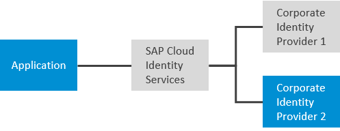
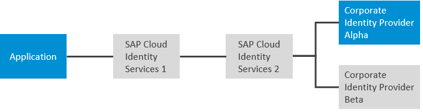

<!-- loio118f5f4203fd42c98255b1ecf6baa484 -->

# Create URLs to Access Applications with Specific Identity Providers

Enhance the user experience by eliminating the need for users to determine which identity provider to use. Users often don’t have the context to choose the correct identity providers.

Sometimes you have multiple identity providers in your landscape, whether they are corporate identity providers or your SAP Cloud Identity Services - Identity Authentication tenant. By providing your users with preconfigured URLs, you can direct them to authenticate with specific identity providers for specific applications.

How you prepare these URLs depends on whether the user starts at the identity provider or at the application. It's further modified by your use case. Some typical use cases are described as follows.

<a name="loio118f5f4203fd42c98255b1ecf6baa484__app_url_reuse_section_1"/>

## Opting for the Local Identity Provider

You can enable users that are stored in SAP Cloud Identity Services to log on with their Identity Authentication credentials. Thus, the employees log on to the application with their corporate credentials, while the external users, such as clients, partners, or SAP support users are authenticated by the local Identity Authentication tenant. Another example is if you're developing an application and you want to use a test user in the local identity provider instead of creating a test user in the corporate identity provider. The following figure illustrates this architecture.

  
  
**Sign On With the Local Identity Provider and not the Corporate Identity Provider**

> ### Example:  
> Example approuter link:
> 
> `https://approuter-myapplication.cfapps.eu20-001.hana.ondemand.com?sap_idp=https://my_sci_tenant.accounts.ondemand.com`
> 
> Example link:
> 
> `https://myapplication.cfapps.eu20-001.hana.ondemand.com?idp=https://my_sci_tenant.accounts.ondemand.com`
> 
> Example with local value:
> 
> `https://myapplication.cfapps.eu20-001.hana.ondemand.com?idp=local`

<a name="loio118f5f4203fd42c98255b1ecf6baa484__app_url_reuse_section_2"/>

## Multiple Corporate Identity Providers

If your application doesn't define rules to determine which identity provider a user authenticates with, SAP Cloud Identity Services offers the choice to your users. To avoid users choosing the wrong identity provider, you can limit their choices. The following figure illustrates this architecture.

  
  
**Help Direct Users to the Correct Identity Provider**

> ### Example:  
> Example approuter link:
> 
> `https://approuter-myapplication.cfapps.eu20-001.hana.ondemand.com?sap_idp=https://corp_idp_2.mydomain.com`
> 
> Example link:
> 
> `https://myapplication.cfapps.eu20-001.hana.ondemand.com?idp=https://corp_idp_2.mydomain.com`

<a name="loio118f5f4203fd42c98255b1ecf6baa484__app_url_reuse_section_3"/>

## Deep Hierarchy of Identity Providers

Your landscape has multiple levels of identity providers, perhaps through subsidiaries and conglomerate organizations. You want to direct your users to a specific identity provider, but this identity provider isn't directly known by your SAP Cloud Identity Services tenant. In such cases, provide the chain of identity providers to which the user must be redirected to reach the authenticating identity provider. The following figure illustrates this architecture.

  
  
**Deep Structure of Identity Providers**

> ### Example:  
> Example approuter link:
> 
> `https://approuter-myapplication.cfapps.eu20-001.hana.ondemand.com?sap_idp=https://scis_2.mydomain.com,corp_idp_alpha.mydomain.com`
> 
> Example link:
> 
> `https://myapplication.cfapps.eu20-001.hana.ondemand.com?idp=https://scis_2.mydomain.com,corp_idp_alpha.mydomain.com`

<a name="loio118f5f4203fd42c98255b1ecf6baa484__app_url_reuse_section_4"/>

## Identity-Provider-Initiated Single Sign-On

> ### Restriction:  
> This option is only supported by SAML.

Identity-provider-initiated single sign-on \(IdP-initiated SSO\) is used for central portals in an enterprise from which users access applications. Users log on to the central portal first. You need to identify the identity provider the user must log on with. You also need to identify the service provider that the user is forwarded to after authenticating. The identity provider can be SAP Cloud Identity Services or a corporate identity provider or a hierarchy of corporate identity providers. Another unique aspect of IdP-initiated SSO is that the URL pattern you use is determined by SAP Cloud Identity Services. Otherwise, the URL is defined by the application. The following figure illustrates this architecture.

  
  
**Identity-Provider-Initiated Single Sign-On**

> ### Example:  
> Example SAML URL:
> 
> `https://my_sci_tenant.accounts.ondemand.com/saml2/idp/sso?sp=https://myapplication.cfapps.eu20-001.hana.ondemand.com&idp=https://corp_idp_1.mydomain.com`

<a name="loioc26fbc69863842578886c58ad7ba2d41"/>

<!-- loioc26fbc69863842578886c58ad7ba2d41 -->

## Creating URLs for Applications to Authenticate with Specific Identity Providers

The URL to access an application is generally determined by the application. When you have multiple identity providers available, you can steer users to the correct identity provider with the `idp` parameter.

<a name="loioc26fbc69863842578886c58ad7ba2d41__prereq_idz_3kf_3gc"/>

## Prerequisites

-   You have set a corporate IdP as the default identity provider in the administration console.

    For more information, see [Choose a Corporate Identity Provider as Default](choose-a-corporate-identity-provider-as-default-44dd636.md).

-   The application supports selection of the corporate IdP with the idp parameter in the application URL. See the documentation of the application.

    > ### Example:  
    > Example: Many BTP applications use the application router, which requires the `sap_idp` query parameter.
    > 
    > For more information, see [@sap/approuter](https://help.sap.com/docs/link-disclaimer?site=https%3A%2F%2Fwww.npmjs.com%2Fpackage%2F%40sap%2Fapprouter) at *npm*.

-   If you have enabled the *Allow Identity Authentication Users Log On* option, you can use the reserved name `local` to authenticate with your Identity Authentication tenant.

    For more information, see [\(Optional\) Use the Allow Identity Authentication Users Log On Option](optional-use-the-allow-identity-authentication-users-log-on-option-2ec9a7f.md).

## Procedure

Use the `idp` parameter in the URL for OIDC or in the URL or body for SAML.

> ### Caution:  
> It depends on the service provider whether the parameter can be passed in body or URL. Identity Authentication doesn't control how the SAML 2.0 request is sent.

**Parameters**

<table>
<tr>
<th valign="top">

Parameter

</th>
<th valign="top">

Description

</th>
</tr>
<tr>
<td valign="top">

`idp`

</td>
<td valign="top">

Name of the identity provider as defined under the *Issuer* in the *Tenant Settings*.

-   For SAML, see [Tenant SAML 2.0 Configurations](tenant-saml-2-0-configurations-e81a19b.md).

-   For OIDC, see [Tenant OpenID Connect Configurations](tenant-openid-connect-configurations-3d6abcc.md).

If you need a chain of identity providers, use a comma without spaces \(,\) to separate them.

Use the value `local` to override the conditional authentication configuration and authenticate with Identity Authentication instead.

</td>
</tr>
</table>

<a name="loio35de8b04e34a45698159ba285c59e44c"/>

<!-- loio35de8b04e34a45698159ba285c59e44c -->

## Creating URLs for IdP-Initiated Single Sign-On

Direct users to a authenticate at an IdP before accessing an application. For IdP-Initiated SSO, the URL syntax is determined by SAP Cloud Identity services.

<a name="loio35de8b04e34a45698159ba285c59e44c__prereq_bmt_jhf_3gc"/>

## Prerequisites

-   You have enabled IdP-initiated Single Sign-On \(SSO\) from all configured corporate IdPs. For more information, see [Enable SSO with All Corporate Identity Providers](enable-sso-with-all-corporate-identity-providers-f7ec8d2.md) .
-   You have configured one of the following options:
-   The application supports IdP-initiated Single Sign-On \(SSO\). For more information, see [Security Assertion Markup Language \(SAML\) V2.0 Technical Overview](http://docs.oasis-open.org/security/saml/Post2.0/sstc-saml-tech-overview-2.0.html).

## Context

This option is available to SAML applications.

## Procedure

Contruct the URL from the following pattern.

<code>https://<i class="varname">&lt;tenant_ID&gt;</i>.accounts.ondemand.com/saml2/idp/sso?sp=<i class="varname">&lt;sp_name&gt;</i>&amp;idp=<i class="varname">&lt;corporateIdP1_name&gt;</i>,<i class="varname">&lt;corporateIdP2_name&gt;</i></code>

**Parameters**

<table>
<tr>
<th valign="top">

Parameter

</th>
<th valign="top">

Description

</th>
</tr>
<tr>
<td valign="top">

`sp`

</td>
<td valign="top">

Redirect target after authentication. The *<sp\_name\>* value equals to the Entity ID of the service provider.

</td>
</tr>
<tr>
<td valign="top">

`idp`

</td>
<td valign="top">

Name of the identity provider as defined under the *Issuer* in the *Tenant Settings*. For more information, see [Tenant SAML 2.0 Configurations](tenant-saml-2-0-configurations-e81a19b.md). If you need a chain of identity providers, use a comma without spaces \(,\) to separate them.

</td>
</tr>
</table>

> ### Remember:  
> If there is more than one corporate IdP in the IdP-initiated link, use *HTTP-Redirect* as default binding in the trust configuration with SAML 2.0 Corporate Identity Provider. For more information, see [Configure Trust on Identity Authentication Side](configure-trust-with-saml-2-0-corporate-identity-provider-33832e5.md#loio33832e58695345eea2cd91a2cc8ab24c__chunked_trust_ias).

