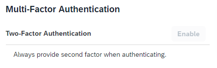

<!-- loio15db825e543941869c9542ff37a235de -->

# Deactivate Two-Factor Authentication

You can deactivate the second factor \(passcode or security key\) if the user has activated it via the profile page.

## Context

When you deactivate the two-factor authentication via the administration console for SAP Cloud Identity Services, the user sees the option disabled on the profile page under the *Multi-Factor Authentication* section:

Once the two factor authentication option is deactivated, the user won't be required to provide a second factor for stronger authentication but the registered devices for access to applications requiring TOTP two-factor or web two-factor authentication \(FIDO2 standard\) will be preserved in the user's account. Thus, if the two-factor authentication is enabled again, the user will be able to use the already registered devices.

To deactivate the *Two-Factor Authentication* option, proceed as follows:

## Procedure

1.  Find and select the user whose device you want to remove.

    For more information about how to find a user in Identity Authentication, see [Search Users](search-users-06078a6.md).

2.  Choose the *Authentication* tab.

3.  Choose *Multi-Factor Authentication*.

4.  Under *Two-Factor Authentication*, use the slider next to *Status* to deactivate the option.

**Related Information**  

[Deactivate User Devices for TOTP Two-Factor Authentication](deactivate-user-devices-for-totp-two-factor-authentication-87324d5.md "This document shows you how to deactivate the mobile devices used by a user to generate passcodes for access to applications requiring time-based one-time (TOTP) as two-factor authentication. You deactivate the user mobile devices from the administration console for SAP Cloud Identity Services.")

[Unlock User TOTP Passcode](unlock-user-totp-passcode-cb6615d.md "You can unlock a user passcode when the user must log on to the application before the automatic unlock time of 60 minutes has passed.")

[Remove User Device for Web Two-Factor Authentication](remove-user-device-for-web-two-factor-authentication-9529d97.md "This document shows you how to remove the registered devices used by a user for access to applications requiring web two-factor authentication (FIDO2 standard).")

[Unlock User SMS Code](unlock-user-sms-code-6120cc2.md "You can unlock a user SMS code when the user must log on to the application before the automatic unlock time of 60 minutes has passed.")

[Allow Users to Protect Accounts with Second Factor for Authentication](allow-users-to-protect-accounts-with-second-factor-for-authentication-d9cbb6d.md "Tenant administrator can allow users to decide whether to protect their own accounts with second factor for authentication or not.")

[Allow Users To Skip Two-Factor Authentication Setup](allow-users-to-skip-two-factor-authentication-setup-dfb08b3.md "You can set the number of days for which the users can postpone the enabling of second factor for authentication.")

