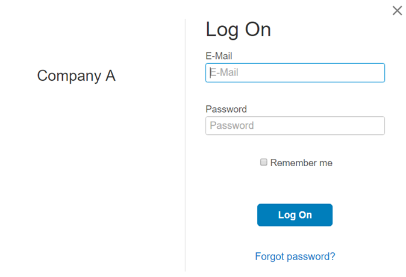

<!-- loioc02798e4e9b14395aba454eb67f9e08c -->

# Display Application Name on Logon Page

This section shows you how to display or hide the name of the application from the logon page.

## Prerequisites

You are assigned the *Manage Applications* role. For more information about how to assign administrator roles, see [Edit Administrator Authorizations](edit-administrator-authorizations-86ee374.md).

## Context

The application's display name appears on the left side of the logon and registration pages of the applications that use Identity Authentication for authentication. You set this name when you first create your application in the administration console for SAP Cloud Identity Services, and you can change it later. For more information, see [Create a New Application](create-a-new-application-0d4b255.md) and [Change an Application's Display Name](change-an-application-s-display-name-83d65d0.md).

By default, the display name of the application is set to appear on the logon page.

> ### Caution:  
> Be careful when you switch off the display of the application name. The users might not be sure which application they are providing their credentials for.

> ### Tip:  
> Instead of leaving the left side of the logon page blank you can add an application's logo. For more information, see [Configure Logo](configure-logo-778f748.md).

To configure the appearance of the application's name on the logon page, proceed as follows:

## Procedure

1.  Sign in to the administration console for SAP Cloud Identity Services.

2.  Under *Applications and Resources*, choose the *Applications* tile.

3.  Choose the application that you want to edit.

    > ### Note:  
    > Type the name of the application in the search field to filter the list items, or choose the application from the list on the left.
    > 
    > If you don’t have a created application in your list, you can create one. For more information, see [Create a New Application](create-a-new-application-0d4b255.md).

4.  Choose the *Branding and Layout* tab.

5.  Under *BRANDING*, enable or disable the appearance of the application name on the logon page.

    Once the application has been updated, the system displays the message ***Application <name of application\> updated***.

## Results

Depending on your choice, the display name of the application is visible or hidden on the logon page.

