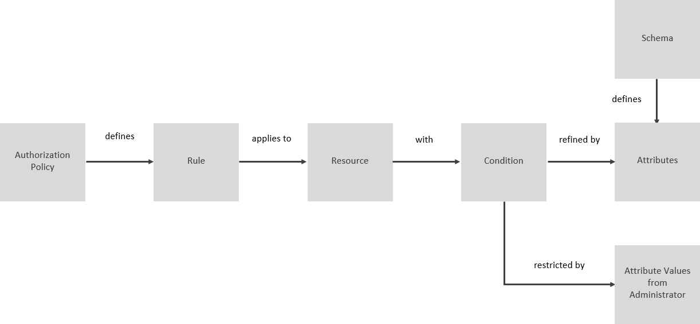

<!-- loioafc915f14bc64807ba6727b91482c699 -->

# Elements and Structure of the Data Control Language \(DCL\)

Use DCL elements to define authorization policies, including rules, resources, conditions, attributes, and a schema. These elements are essential for controlling access to data and resources.


The data control language uses the following elements for the definition of simple and instance-based authorizations.




<a name="loioafc915f14bc64807ba6727b91482c699__section_dnz_3cl_fpb"/>

## Authorization Policy

Collection of rules. When the definition is complete, developers deploy the policies in an application, and administrators assign the policies to users.


<a name="loioafc915f14bc64807ba6727b91482c699__section_zgr_lcl_fpb"/>

## Rule

An element that grants actions such as `read` or `write`. Rules handle actions on resources. A rule can also be restricted in multiple ways.

An action is granted on all resources. Use the following syntax:

```sql
GRANT <action> ON <resource> ;
```

-   > ### Sample Code:  
    > ```sql
    > GRANT read ON * ;
    > ```


<a name="loioafc915f14bc64807ba6727b91482c699__section_xkt_lcl_fpb"/>

## Resource

Entities protected by the rule or authorization policy. The application that comes with the authorization policy defines the resource. A resource can be a data object, an endpoint, or identity provider information. A resource has arbitrary attributes that can be used to refine rules.


<a name="loioafc915f14bc64807ba6727b91482c699__section_cst_lcl_fpb"/>

## Condition

A logical expression based on attributes with a name and a data type. If conditions are fulfilled, actions are granted on the related resource. A condition is a Boolean function over attributes.

```sql
WHERE <attribute_name> = '<attribute_value>' ;
```

-   > ### Sample Code:  
    > `WHERE Country = 'USA' OR Country = 'Germany';`


For more information, see [Condition Operators](condition-operators-867d328.md).


<a name="loioafc915f14bc64807ba6727b91482c699__section_shs_rxb_xpb"/>

## Attribute

You can restrict authorization policies by using a set of conditions with attributes and attribute values. Attributes are defined in a schema or they're provided by an external source, for example an identity provider. When using attributes, you must take care that you declare their data type in a schema. All schema attributes usages are validated to refer to existing names and their usage types.

For more information, see [Attribute Constraints](attribute-constraints-5810179.md).


<a name="loioafc915f14bc64807ba6727b91482c699__section_dh2_3zb_hpb"/>

## Schema

A schema defines names and types of attributes you want to use for the application. Only one schema can be defined for a package folder \(with sub-folders\). Define the schema defined using a file named `schema.dcl` and locate it in the root folder. All schema attributes usages are validated to refer to existing names and their types.

For more information, see [Schema Definition](schema-definition-eee7014.md).


<a name="loioafc915f14bc64807ba6727b91482c699__section_o4q_dmn_kpb"/>

## Package

The name of the root folder where the DCL files are located. The package content comprises all of the DCL files in the folder.

For more information, see [Package Definition](package-definition-c0df43e.md).

**Related Information**  


[Grammar and Syntax Rules](grammar-and-syntax-rules-7b50037.md "DCL has a set of grammar and syntax rules you must observe when you define authorization policies.")

[Advanced Features](advanced-features-779bfd2.md "You find advanced configuration techniques for authorization policies, focusing on reusable functions, annotations, value help services, formatting conventions, and internal functions for enterprise-grade authorization policies.")

