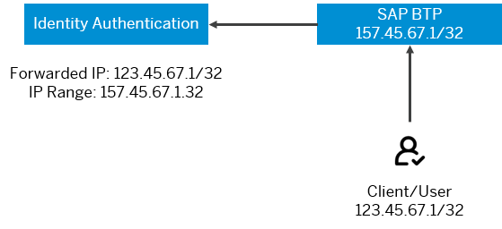

<!-- loiofedc77c708144c54bf78084c604af4b5 -->

# Examples for Risk-Based Authentication Scenarios

Example scenarios for configuring risk-based authentication for an application.

<a name="loiofedc77c708144c54bf78084c604af4b5__section_frx_dmw_tzb"/>

## Example 1 \(Setting TOTP Two-Factor Authentication\)

Donna Moore is an administrator of company A. She wants to configure Identity Authentication to always ask the company employees for a password and a TOTP passcode \(two-factor authentication\) to log on to a *Leave Request* application. For this purpose, Donna sets only a *Default Action*:

**Default Authentication Rule**

Default Action: [Two-Factor Authentication\]

Two-Factor Methods: [TOTP\]

Michael Adams is an employee of company A and as such he wants to create a leave request. To log on to the *Leave Request* application he provides his password. After that he is prompted to activate a mobile device and to provide a second factor for authentication \(a passcode generated by an authenticator app on his mobile device\). Two factors are required regardless of whether Michael is in the corporate network or on a business trip. Michael's manager, Julie Armstrong, receives a notification that Michael has created a leave request. She approves it by logging on to the application with two factors \(password and passcode generated by her mobile device\).

<a name="loiofedc77c708144c54bf78084c604af4b5__section_hly_5ww_hhb"/>

## Example 2 \(Setting SMS Two-Factor Authentication\)

Donna Moore is an administrator of company A. She wants to configure Identity Authentication to always ask the company employees for a password and a SMS code \(two-factor authentication\) to log on to the *Corporate Page*. For this purpose, Donna first configures Sinch Service in the administration console for SAP Cloud Identity Services. Then in the *Risk-Based Authentication* section in the administration console, he sets only a *Default Action*:

**Default Authentication Rule**

Default Action: [Two-Factor Authentication\]

Two-Factor Methods: [SMS\]

John Miller is an employee of company A and as such he wants to access the corporate page of the company. He is prompted to provide two factors \(password and the SMS code sent to his mobile device\) to log on to the corporate page. John Miller has his mobile phone verified, so he can receive SMS codes. Two factors are required regardless of whether Miller is in the corporate network or at home.

<a name="loiofedc77c708144c54bf78084c604af4b5__section_grx_dmw_tzb"/>

## Example 3 \(SPNEGO\)

Donna Moore is an administrator of company A. She wants to configure Identity Authentication to allow employees to access the *Leave Request* application from the corporate network with SPNEGO, and from any other network with passcode. All IPs in the company start with 189.101. She would also like to create a rule for the managers to access the application with two authentication factors. In addition, she wants to restrict the access to all the users with type *Customer*. For this purpose, Donna creates the following rules:

**Authentication Rules**

<table>
<tr>
<th valign="top" align="center">

Action

</th>
<th valign="top" align="center">

IP Range

</th>
<th valign="top" align="center">

Group

</th>
<th valign="top">

Authentication Method

</th>
<th valign="top">

User Type

</th>
</tr>
<tr>
<td valign="top">

Deny

</td>
<td valign="top">

Any

</td>
<td valign="top">

Any

</td>
<td valign="top">

Any

</td>
<td valign="top">

Customer

</td>
</tr>
<tr>
<td valign="top">

Allow

</td>
<td valign="top">

189.101.112.1/16

</td>
<td valign="top">

Employees

</td>
<td valign="top">

SPNEGO

</td>
<td valign="top">

Any

</td>
</tr>
<tr>
<td valign="top">

TOTP Two-Factor Authentication

</td>
<td valign="top">

Any

</td>
<td valign="top">

Employees

</td>
<td valign="top">

Any

</td>
<td valign="top">

Any

</td>
</tr>
<tr>
<td valign="top">

TOTP Two-Factor Authentication

</td>
<td valign="top">

Any

</td>
<td valign="top">

Managers

</td>
<td valign="top">

Any

</td>
<td valign="top">

Any

</td>
</tr>
</table>

**Default Authentication Rule**

Default Action: [Deny\]

Michael Adams, as an employee of company A, accesses the application in his office and logs on with SPNEGO. When he is on a business trip, he can create leave requests by providing two factors. The two factors are SPNEGO and а passcode generated by an authenticator app on his iPhone. Michael's manager, Julie Armstrong, receives a notification that Michael has created a leave request. She approves it by logging on to the application with TOTP Two-Factor Authentication \(a password and a passcode generated by her Android phone\). Donna Moore, a customer of company A, tries to access the corporate portal, and receives a message that she is not authorized for access.

<a name="loiofedc77c708144c54bf78084c604af4b5__section_bp5_w5p_hnb"/>

## Example 4 \(Setting Web Two-Factor Authentication\)

Donna Moore is an administrator of company A. She wants to configure Identity Authentication to always ask the company managers for a password and a web two-factor authentication to log on to an *Leave Request Approval* application. For this purpose, Donna sets only a *Default Action*:

**Default Authentication Rule**

Default Action: [Two-Factor Authentication\]

Two-Factor Methods: [Web Authentication\]

Michael Adams is an employee of company A and he creates a leave request. Michael's manager, Julie Armstrong, receives a notification that Michael has created a leave request. To log on to the *Leave Request Approval* application she provides her password. After that Julie is prompted to activate a security key as a second factor for authentication. Two factors are required regardless of whether Julie is in the corporate network or on a business trip.

Julie he approves the leave request by logging on to the application with two factors \(password and fingerprint\).

<a name="loiofedc77c708144c54bf78084c604af4b5__section_bss_sdh_znb"/>

## Example 5 \(Setting more than one Two-Factor Authentication method\)

Donna Moore is an administrator of company A. She wants to configure Identity Authentication to always ask the company managers for a second factor in addition to their password. She wants to allow the managers to choose between a TOTP and a web two-factor authentication to log on to an *Leave Request Approval* application. For this purpose, Donna sets the *Default Action* to *Two-Factor Authentication* and configures the *Two-Factor Methods*:

**Default Authentication Rule**

Default Action: [Two-Factor Authentication\]

Two-Factor Methods: [TOTP\]; [Web Authentication\]

Michael Adams is an employee of company A and he creates a leave request. Michael's manager, Julie Armstrong, receives a notification that Michael has created a leave request. To log on to the application *Leave Request Approval* she provides her password. After that she is prompted to choose the two-factor authentication method. She chooses a security key as a second factor for authentication.

Julie approves the leave request by logging on to the application with two factors \(password and fingerprint\).

In addition to Julie's approval, the leave request must also be approved by the HR Manager of the company, John Miller. To log on to the *Leave Request Approval* application John provides his password. After that he is also prompted to choose the two-factor authentication method. John chooses TOTP. Now, he is prompted to provide a TOTP code from his device. After providing it, he is granted access to the app and approves the leave request.

Two factors are required regardless of whether Julie and John are in the corporate network or on a business trip.

<a name="loiofedc77c708144c54bf78084c604af4b5__section_as2_mgf_t4b"/>

## Example 6 \(Setting Fowarded IP Range\)

SAP BTP is configured to perform system-to-system calls to Identity Authentication on customer's behalf for authentication and provides the original IP address of the customer with the request. Donna Moore as an administrator of Company A wants to allow certain customer IP addresses from logging in. To achieve this, Donna configures a risk-based authentication rule with an IP range for the customer IPs that should be allowed. To ensure that authentication requests are performed by SAP BTP on customer's behalf, it is mandatory that she configures the IP range for SAP BTP addresses, first.

**Related Information**  

[Configure Risk-Based Authentication for an Application](configure-risk-based-authentication-for-an-application-bc52fbf.md#loiobc52fbf3d59447bbb6aa22f80d8b6056 "You can define rules for authentication according to different risk factors and apply actions like Allow, Deny, and Two-Factor Authentication.")

[Create a New Rule](create-a-new-rule-18d02ab.md "You can create rules for authentication according to different risk factors.")

