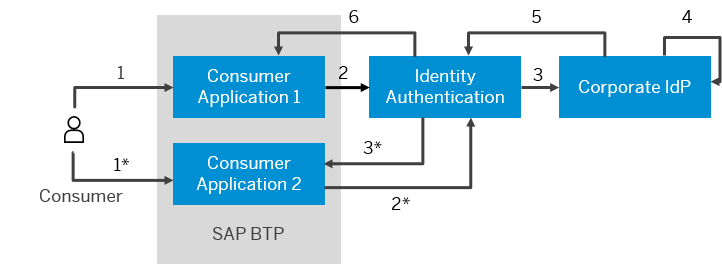
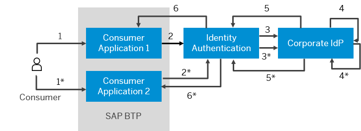

<!-- loio99403403d2dc41eca20a785486909b48 -->

# Forward All SSO Requests to Corporate IdP

Identity Authentication can be configured to forward all single sign-on\(SSO\) requests to the corporate identity provider.

<a name="loio99403403d2dc41eca20a785486909b48__prereq_ezd_ql1_qfb"/>

## Prerequisites

-   You are assigned the *Manage Corporate Identity Providers* role. For more information about how to assign administrator roles, see [Edit Administrator Authorizations](edit-administrator-authorizations-86ee374.md).

-   You have configured Identity Authentication to use a corporate identity provider as an external authenticating authority. For more information, see [Configure Trust with SAML 2.0 Corporate Identity Provider](configure-trust-with-saml-2-0-corporate-identity-provider-33832e5.md) or [Forward All SSO Requests to Corporate IdP](forward-all-sso-requests-to-corporate-idp-9940340.md).

-   You have selected the configured identity provider as the authenticating identity provider for your applications. For more information, see [Choose Default Identity Provider for an Application](choose-default-identity-provider-for-an-application-e9d8274.md).

## Context

The *Forward All SSO Requests to Corporate IdP* option allows the corporate identity provider \(IdP\) to process all single sign-on \(SSO\) requests when Identity Authentication acts as a proxy.

By default, the *Forward All SSO Requests to Corporate IdP* option is disabled. In this case Identity Authentication reuses the active session of the user.

When *Forward All SSO Requests to Corporate IdP* option is enabled, Identity Authentication sends new authentication request for each application.

### Forward All SSO Requests to Corporate IdP Disabled

1. User tries to access *Application 1*.

2. *Application 1* sends authentication request to Identity Authentication.

3. Identity Authentication acts as proxy; forwards the request to corporate IdP.

4. Corporate IdP logs on the user.

5. Corporate IdP returns authentication response to Identity Authentication.

6. Identity Authentication returns authentication response to *Application 1*.

1\*. User tries to access *Application 2*.

2\*. *Application 2* sends authentication request to Identity Authentication.

3\*. The user has an active session. Identity Authentication reuses the session and returns the authentication response to *Application 2*.

### Forward All SSO Requests to Corporate IdP Enabled

1. User tries to access *Application 1*.

2. *Application 1* sends authentication request to Identity Authentication.

3. Identity Authentication acts as proxy; forwards the request to corporate IdP.

4. Corporate IdP logs on the user.

5. Corporate IdP returns authentication response to Identity Authentication.

6. Identity Authentication returns authentication response to *Application 1*.

1\*. User tries to access *Application 2*.

2\*. *Application 2* sends authentication request to Identity Authentication.

3\*. Identity Authentication acts as proxy; it forwards the request to corporate IdP, though the user has an active session..

4\*. Corporate IdP logs on the user.

5\*. Corporate IdP returns new authentication response to Identity Authentication.

6\*. Identity Authentication returns new authentication response to *Application 2*.

To enable the *Forward All SSO Requests to Corporate IdP*, follow the procedure below:

<a name="loio99403403d2dc41eca20a785486909b48__steps_enable_idfederation"/>

## Procedure

1.  Access the tenant's administration console for Identity Authentication by using the console's URL.

    > ### Note:  
    > The URL has the following pattern:
    > 
    > `https://<tenant ID>.accounts.ondemand.com/admin`
    > 
    > *Tenant ID* is an automatically generated ID by the system. The first administrator created for the tenant receives an activation e-mail with a URL in it. This URL contains the *tenant ID*. For more information about your tenants, see [Viewing Assigned Tenants and Administrators](../viewing-assigned-tenants-and-administrators-f56e6f2.md).
    > 
    > If you have a configured custom domain, the URL has the following pattern: `<your custom domain>/admin`.

2.  Under *Identity Providers*, choose the *Corporate Identity Providers* tile.

3.  Select the corporate identity provider that you want to configure for *Forward All SSO Requests to Corporate IdP*.

    -   If you do not have an identity provider in your list, click the *Add* button to create one, and proceed with the configuration.
    -   If you have an identity provider in your list, choose the one that you want to configure.

4.  Use the slider next to *Forward All SSO Requests to Corporate IdP* to enable or disable it.

    If the operation is successful, the system displays the message ***Identity provider <name of identity provider\> updated***.

