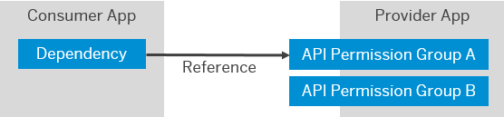

<!-- loio9ea0024383de4726b6a4aae471eb1039 -->

# Integrating Applications

Applications sometimes need to propagate principals or have technical communication arrangements between them. To enable one application to consume the APIs of another application, the developer of the application providing APIs defines one or more API groups, which the consuming application can consume.

Under this model, applications that can be called by other applications define API permission groups. For technical communication, API permission groups are the granularity at which administrators can grant access to the APIs of a provider application. If principal propagation is used, then the user authorizations are checked as well. Such groups cover a set of related APIs. An application can expose a single group when there's no need to restrict consuming applications.

In the application configuration of the consumer application, the tenant admin defines the dependencies. Consumer applications use the dependency name to identify to SAP Cloud Identity Services which application the consumer wants to access including the API permission group to grant. The actual dependency name depends on the consuming application:

-   Typically, an application needs a specific name for integration with a specific provider application. Find the supported dependency names in the provider application or its documentation.

-   When an application generically integrates with many arbitrary applications, the application rather enables you to define custom dependency names and maintain them both in SAP Cloud Identity Services as well as in the consuming application itself. The integration informs the application which dependency to use for which integration scenario.

The following figure shows the relationship between two applications in SAP Cloud Identity Services. The provider application offers two API permission groups. The dependency of the consumer application references one of these groups.

  
  
**App-to-App Integration**

To configure dependencies, see [Configure Integration Between Applications](configure-integration-between-applications-9ad7e80.md).

To configure a dependency with an external application, see [Generate Credentials to Access the APIs of an Application](generate-credentials-to-access-the-apis-of-an-application-e595341.md).

For more information about developing such applications, see [Consuming APIs from Other Applications](../Development/consuming-apis-from-other-applications-29e204d.md).

