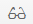

<!-- loio045cb01bd2034b05a69e1a626e46570f -->

# List and Edit User Details

As a tenant administrator, you can view detailed information about the users in the administration console for SAP Cloud Identity Services. Optionally you can edit this information.

<a name="loio045cb01bd2034b05a69e1a626e46570f__context_awh_phy_4mb"/>

## Context

 *User ID* \(P user\) and *Global User ID* \(universally unique identifier \(UUID\) format\) are automatically generated by Identity Authentication at user creation. The `User ID` field is unique and not editable. The *Global User ID*, on the other hand, is unique, but editable. Thus you can use the generated one, or change it with your own one.

By default the *User Type* field is *Employee*. The available user types are: *Customer*, *Employee*, *Partner*, *Public*, *External*, and *Onboardee*.

*Last Name* and *E-Mail* fields are mandatory.

Vaues for *E-Mail*, *First Name* and *Last Name* that are part of the respective exclude list cant' be used. For more information, see [Restrict User Attributes Values via Exclude Lists](restrict-user-attributes-values-via-exclude-lists-cb108c2.md).

*Display Name* can be configured to be mandatory or not. For more information see [Configure User Identifier Attributes](configure-user-identifier-attributes-8b9fa88.md).

*E-Mail* and *Login Name* can be used as unique identifiers. Be sure to enter unique values if you edit these two fields.

Only administrators with *Manage Tenant Configuration* role can edit the *E-Mail* attribute.

*Display Name* can be configured to be unique or not. For more information see [Configure User Identifier Attributes](configure-user-identifier-attributes-8b9fa88.md).

If the check box below the *E-Mail* is selected, the `e-mail` of the user is verified. The tenant administrator can select it manually, to mark the e-mail as verified. For more information about how to require e-mail verification of the user, see, [Enable E-Mail Verification](enable-e-mail-verification-483d26c.md).

If the check box below the *Telephone Verified* is selected, the phone of the user is verified. The tenant administrator can select it manually, to mark the phone as verified.

*User ID*, and *Manager Display Name* fields cannot be edited. They are filled automatically by the system.

The *Valid From* and *Valid To* fields are empty if no validity dates are set for the user.

> ### Remember:  
> When the *Display Name* is set as unique:
> 
> -   If the user is created via the User Registration service of the User Management Rest API, and after successful activation of the user, the display name is generated in the following way: *Display Name* is `first_name` `last_name`.
> 
> -   If there is already another user with the same display name, the *Display Name* is `first_name` `last_name` `user_profile_id`.
> 
> 
> The display name can be changed also by the user via the user profile page.

## Procedure

1.  Find the user whose details you want to view or edit.

    For more information about how to find a user in Identity Authentication, see [Search Users](search-users-06078a6.md).

2.  Click the user to view his or her details.

    This operation opens the *User Details* view.

3.  Choose the *User Details* tab.

    1.  Expand the *Personal Information*, *Employee Information*, *Company Information*, *Custom Attributes* sections if collapsed in the *User Details* tab.

    2.  Press the  icon next to the *Personal Information*, *Employee Information*, *Company Information*, or *Custom Attributes* sections.

        > ### Note:  
        > To exit edit mode, press the  icon.

    1.  Edit the information in the relevant fields and save your changes.

        If the operation is successful, the system displays the message ***User <user ID\> updated***.

4.  Choose the *Applications* tab, to view details specific for the applications that the user has logged on, and the applications that the user was imported to via a CSV file import.

5.  Choose the *Legal* tab to view audit information about the user, such as the policies accepted by him or her, the last log on, and password related information.

    > ### Remember:  
    > The *Last Log On* and *Password Login Time* fields are updated once per 24 hours.

    > ### Note:  
    > The tenant administrators can view a history of the signed **Terms of Use** and **Privacy Policy** documents of the users in the administration console. The information is in the format *<document name\><document version\><time stamp\>*.
    > 
    > The information about when the user has accepted a particular document is available for documents accepted after May 16, 2018.

6.  Choose the *Authentication* tab to manage the two-factor authentication for the user. You have the following options:

    <table>
    <tr>
    <th valign="top">

    Option

    
    </th>
    <th valign="top">

    Additional Information

    
    </th>
    </tr>
    <tr>
    <td valign="top">

    **Password Details**

    
    </td>
    <td valign="top">

    -   Unlock user password. For more information, see [Unlock User Password](unlock-user-password-9172552.md).
    -   Send reset password e-mail. For more information, see [Send Reset Password E-Mail](send-reset-password-e-mail-da55abf.md).
    -   Reset counter for e-mail sending. For more information, see [Reset Counter for E-Mail Sending](reset-counter-for-e-mail-sending-08f634b.md).
    -   Set initial password to the user. For more information, see [Set Initial Password](set-initial-password-16149d5.md).

    > ### Note:  
    > Only administrators with *Manage Tenant Configuration* role can set initial password of other administrators.

    
    </td>
    </tr>
    <tr>
    <td valign="top">

    **Two-Factor Authentication**

    
    </td>
    <td valign="top">

    If the user has enabled two factor authentication, you can do the following:

    -   Deactivate the user devices. For more information, see [Deactivate User Devices for TOTP Two-Factor Authentication](deactivate-user-devices-for-totp-two-factor-authentication-87324d5.md).
    -   [Unlock User TOTP Passcode](unlock-user-totp-passcode-cb6615d.md).

    
    </td>
    </tr>
    </table>
    
7.  Choose the *User Groups* tab to manage the group assignments of the user.

    You can see the user groups assigned to the user. You have two options:

    -   Assign groups. For more information, see [Assign Groups to a User](assign-groups-to-a-user-bfdeb9c.md).
    -   Unassign one or more groups that are assigned to the user [Unassign Groups from a User](unassign-groups-from-a-user-4353735.md).

