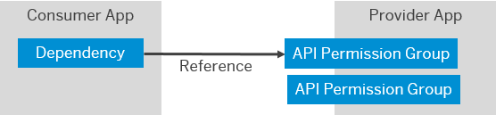
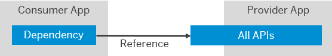

<!-- loio0251c5684cd64968a6f429194a7bab59 -->

# Provided APIs

Applications sometimes need to propagate principals or have technical communication arrangements between them. To enable one application to consume the APIs of another application, the developer of the application providing APIs defines one or more API permission groups, which the consuming application can consume.

Under this model, applications that can be called by other applications define API permission groups. Administrators grant access to these groups to consuming applications. These permission groups cover a set of related APIs. An application can expose all its APIs without an API permission group when there is no need to restrict consuming applications.

You can set up technical communication or principal propagation.

-   With technical communication, you can map authorizations to the communication.
-   With principal propagation, user authorizations apply in the decision whether an API call is allowed or not.

In the configuration of the consumer application, the tenant administrator defines the dependencies. Consumer applications use the dependency name to identify to SAP Cloud Identity Services which application the consumer wants to access, including the API permission group to grant.

-   Typically, an application needs a specific name for integration with a specific provider application. Find the supported dependency names in the provider application or its documentation.

-   When an application generically integrates with many arbitrary applications, the application rather enables you to define custom dependency names and maintain them both in SAP Cloud Identity Services as well as in the consuming application itself. The configuration informs the application which dependency to use for which integration scenario.

The following figure shows the relationship between two applications in SAP Cloud Identity Services. The provider application offers two API permission groups. The consumer app is allowed to consume one of these groups. The applications can use technical communication or principal propagation.

  
  
**App-to-App Integration of API Permission Groups**

In the following figure, the provider application doesn't offer any API permission groups. The consumer application references all the available APIs. The provider application depends on the authorizations of the current user when these APIs are accessed.

  
  
**App-to-App Integration of All APIs**

-   To configure dependencies, see [Configure Integration Between Applications](configure-integration-between-applications-9ad7e80.md).

-   To consume APIs from an application that is not registered in SAP Cloud Identity Services, see [Generate Credentials to Access the APIs of an Application](generate-credentials-to-access-the-apis-of-an-application-e595341.md).

-   For more information about developing such applications, see [Consuming APIs from Other Applications](../Development/consuming-apis-from-other-applications-29e204d.md).

<a name="loio0251c5684cd64968a6f429194a7bab59__configurationPrecedence"/>

## Configuration Precedence

When you configure both the consumer and provider applications, each application contributes specific OIDC and related configurations. The following table shows which application provides each configuration.

**Configuration Source by Application**

<table>
<tr>
<th valign="top">

Configuration

</th>
<th valign="top">

Application

</th>
<th valign="top">

More Information

</th>
</tr>
<tr>
<td valign="top">

Subject name identifier

</td>
<td valign="top">

Provider

</td>
<td valign="top">

[Configure the Subject Name Identifier Sent to the Application](configure-the-subject-name-identifier-sent-to-the-application-1d020e3.md) 

</td>
</tr>
<tr>
<td valign="top">

Token attributes

</td>
<td valign="top">

Provider

</td>
<td valign="top">

[User Attributes](user-attributes-ed2797d.md) 

</td>
</tr>
<tr>
<td valign="top">

Token format

</td>
<td valign="top">

Provider

</td>
<td valign="top">

[Token Policy Configuration for Applications](token-policy-configuration-for-applications-c4ba52e.md) 

</td>
</tr>
<tr>
<td valign="top">

Token grant type

</td>
<td valign="top">

Consumer

</td>
<td valign="top">

[Token Policy Configuration for Applications](token-policy-configuration-for-applications-c4ba52e.md) 

</td>
</tr>
<tr>
<td valign="top">

Token policy

</td>
<td valign="top">

Consumer

</td>
<td valign="top">

[Token Policy Configuration for Applications](token-policy-configuration-for-applications-c4ba52e.md) 

</td>
</tr>
</table>

