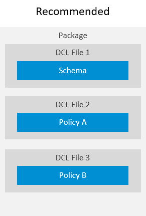

<!-- loioeee7014e3f7741be8f039dd237a105d7 -->

# Schema Definition

You can define only one schema in a package. It defines the schema elements with data types that are valid for all policy definitions in the package.


To describe the names and types of attributes, you define a schema. Only one schema can be defined for a package hierarchy \(folder with sub-folders and DCL documents\). You must define a schema in a file called `schema.dcl`. It must be located in the root folder. In the schema, you can use the grammar elements `WHERE` and `FUNCTION` with attributes. All usages of schema attributes are validated to refer to existing names and that their respective data types.



> ### Recommendation:  
> Create a single DCL file with all of the schema definitions that are used in the package. Place the `schema.dcl` file on root level of your folder hierarchy. It must only have a `schema` section.

Elements in the schema can be used in the `WHERE` and `FUNCTION` grammar elements. The usage of all schema elements are validated to make sure that they refer to existing names and that their usage context complies with their type.

```
SCHEMA {
    <schema_element>: <data_type>
}
```

-   The following schema contains schema elements for a resource of the data type "number" and an attribute name with the data type "string".

    > ### Sample Code:  
    > ```
    > SCHEMA {
    >     salesID: Number,
    >     Country: String
    > }
    > ```

-   If a resource has multiple attributes, the schema must define the data types of the attribute values. In the following example code, `SalesAttrib` is an element that groups the attributes and their data types.

    > ### Sample Code:  
    > ```
    > SCHEMA {
    >      SalesAttrib: {
    >        Country: String,
    >        SalesID: Number}
    >  }
    > ```


Schema elements on the root level can be prefixed with the $ sign. It applies, for example, to attributes from identity providers \(see the related link\). This is currently reserved for internal use only.

There is a predefined default `$user` structure that is populated by the client libraries with OIDC token content in a standard setup.

> ### Sample Code:  
> ```
> SCHEMA {
>     ...
>     $user: { // Default $user definition. This is injected, if no custom $user definition is present
>         user_uuid: String,
>         groups: String[],
>         email: String
>     }
> schema {
> 
> ```

This predefined `$user` definition can be overwritten in the `schema` with its own structure. The only enforced constraint by the compiler is that `$user` is a structure.

**Related Information**  


 <?sap-ot O2O class="- topic/link " href="6652b28c17a04f2e8ac4d412d256d097.xml" text="" desc="" xtrc="link:1" xtrf="file:/home/builder/src/dita-all/wbz1500991557538/loio629f7cb06f6947988dcaf8bedbe45873_en-US/src/content/localization/en-us/eee7014e3f7741be8f039dd237a105d7.xml" output-class="" outputTopicFile="file:/home/builder/tp.net.sf.dita-ot/2.3/plugins/com.elovirta.dita.markdown_1.3.0/xsl/dita2markdownImpl.xsl" ?> 

