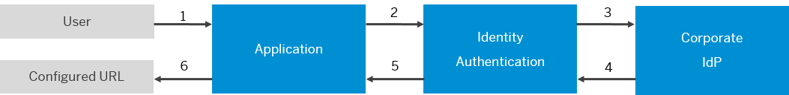

<!-- loio3841580082cb4af6a13289e98a0cce12 -->

# Service Provider-Initiated Logout with Corporate Identity Providers

In this scenario, Identity Authentication is configured as an identity provider proxy and the corporate identity provider acts as an authenticating identity provider to the application. When a user triggers logout at an application, this request is propagated to Identity Authentication and any corporate identity providers, while the response returns by the same route.

The logout procedure is triggered by the user at the service provider and results in a logout request sent to the identity provider proxy. Consequently, the identity provider proxy processes the request and destroys any local session information about the user. The identity provider proxy then checks whether there are other service providers in the single sign-on \(SSO\) session and sends logout requests to all of them. In return, the service providers send logout responses to the identity provider proxy informing it that the logout process is successful. Finally, the identity provider proxy sends a logout response to the original requesting service provider or the service provider of the application.

Depending on the protocol used to trust the corporate identity provider, you have different options for configuring logout redirect URLs. See the following table for details.

**Protocol Differences for Logout Redirect URLs**

<table>
<tr>
<th valign="top">

Protocol of Service Provider

</th>
<th valign="top">

Options for Logout Redirect URL

</th>
</tr>
<tr>
<td valign="top">

SAML

</td>
<td valign="top">

You can configure a URL which is sent in the SAML 2.0 Logout Response as an extension. The URL can be used to redirect the users after logging out of the application. The URL is specific for each corporate identity provider with which Identity Authentication has established trust.

</td>
</tr>
<tr>
<td valign="top">

OIDC

</td>
<td valign="top">

If a client OpenID Connect \(OIDC\) application doesn't specify a post logout redirect URI in its logout request, you can specify a fallback URL. The service redirects the client to this URL after a successful logout.

</td>
</tr>
</table>

<a name="loio3841580082cb4af6a13289e98a0cce12__section_ett_wwg_2fc"/>

## Corporate Identity Provider Logout Flow

When Identity Authentication acts as a proxy to delegate authentication to a corporate identity provider, and the user who is logged on to one or more applications chooses the *Log Out* link in one of the applications, the following flow is in applies:

  
  
**Logout Flow with Corporate Identity Providers**

1.  The user triggers a logout from the application.

2.  Identity Authentication checks if the user is logged on to other applications. If yes, Identity Authentication sends logout requests to the applications, and closes the sessions.

3.  Identity Authentication sends logout requests to the corporate identity provider or corporate identity providers, if there are more than one.

4.  The user is logged out of the corporate identity providers.

5.  The user is logged out of Identity Authentication.

    -   For SAML: If the Redirect URL option is configured in the administration console for SAP Cloud Identity Services, the URL is sent as an extension in the SAML 2.0 Logout Response. This option can be used by the application to redirect the user to the destination from the link configured for the specific corporate identity provider.

        > ### Note:  
        > This step is valid only if the application supports the redirect of the user, such as SAP SuccessFactors HCM Suite.

    -   For OIDC: Applications should provide the `post_logout_redirect_uri` parameter with their logout request. If applications don't provide this parameter, you can configure a fallback URL. Otherwise, this configuration is ignored.

        For more information, see [Call Identity Authentication End Session Endpoint](call-identity-authentication-end-session-endpoint-ec674f4.md).

6.  A logout response is sent to the initiating application.

    The response can differ depending on the protocol.

    -   For SAML: The SAML service provider redirects to the Logout Redirect URL which was sent as an extension.

    -   For OIDC: The application can redirect the user further.

<a name="loio50d8f6b818fc40dba3f693c3f609986f"/>

<!-- loio50d8f6b818fc40dba3f693c3f609986f -->

## Configure the Logout Redirect URL for Corporate Identity Providers

As a tenant administrator, you can configure an optional logout redirect URL to be used when the conditions apply.

<a name="loio50d8f6b818fc40dba3f693c3f609986f__context_sgj_bch_2fc"/>

## Context

For more information about the conditions, see [Service Provider-Initiated Logout with Corporate Identity Providers](service-provider-initiated-logout-with-corporate-identity-providers-3841580.md#loio3841580082cb4af6a13289e98a0cce12).

## Procedure

1.  Sign in to the administration console for SAP Cloud Identity Services.

2.  Under *Identity Providers*, choose the *Corporate Identity Providers* tile.

3.  Select the corporate identity provider that you want to configure.

    > ### Tip:  
    > If you need to change the protocol, see [Choose Identity Provider Type](choose-identity-provider-type-0838379.md).

4.  Choose *Logout Redirect URL*.

5.  Enter the required data.

6.  Save your entries.

<a name="loio50d8f6b818fc40dba3f693c3f609986f__result_a4t_qch_2fc"/>

## Results

Once the user has logged out of the application, Identity Authentication sends:

-   For SAML: The logout redirect URL in the SAML 2.0 Response as an extension to the application. The logout redirect URL can be used by the application to redirect the user to the URL configured for the corporate identity provider.

-   For OIDC: The logout response to the provided `post_logout_redirect_uri` or fallbacks to logout redirect URL configured for the corporate identity provider.

**Related Information**  

[Single Logout Flows](../Development/single-logout-flows-0584b5f.md "It's good practice to encourage users of your applications to log out at the end of their session. If malicious users can access user sessions, either by gaining access to artifacts such as cookies or by finding unattended clients, malicious users can impersonate the rightful owners of the sessions.")

