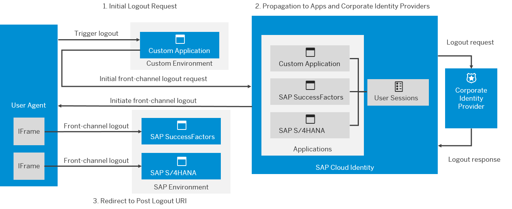

<!-- loio1eecf35eef26410da01d63f923ca90b7 -->

# Single Logout

Propagate a user's logout to other applications and any corporate identity providers used.

<a name="loio1eecf35eef26410da01d63f923ca90b7__section_m3q_bhz_rfb"/>

## Context

The service supports front-channel logout. In a web session, the custom application triggers a logout from your application by sending a logout request to the end session endpoint of SAP Cloud Identity Services. The service also logs the user out of any other applications with which the user shares a session in the same web session.

In addition, the service also notifies any corporate identity providers that are involved in the related user sessions.

  
  
**Front-Channel Logout Flow**

-   [Call Identity Authentication End Session Endpoint](call-identity-authentication-end-session-endpoint-ec674f4.md)
-   [Configure Your Application for Single Logout](configure-your-application-for-single-logout-2ae38a5.md)

